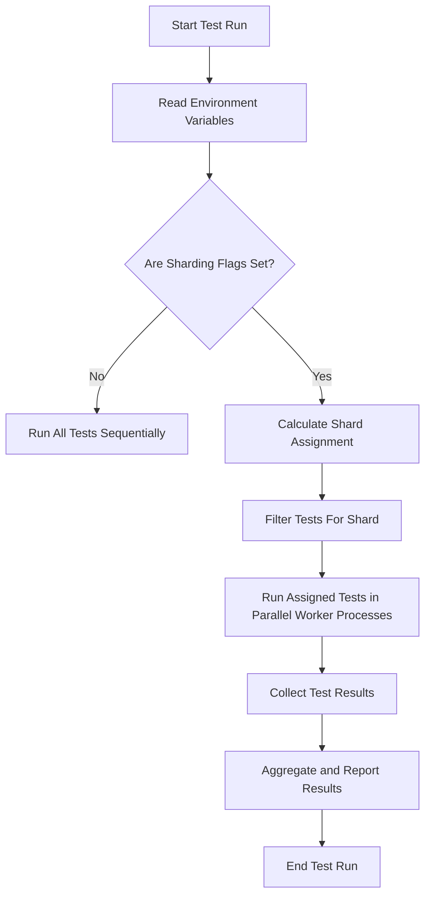

# Scalability and Performance Considerations

GoogleTest and GoogleMock are designed for robustness and maintainability, yet when working with large-scale projects involving huge test suites, performance and scalability become critical. This guide explores how the framework handles large tests, parallel execution, test selection, and techniques to minimize overhead — ensuring efficient and sustainable testing workflows under demanding conditions.

---

## Handling Large Test Suites

As projects grow, the sheer number of tests may strain build and test execution times. GoogleTest addresses this via:

- **Modular Test Suites:** Grouping related tests into suites with fixtures that minimize setup costs.
- **Test Isolation:** Each test runs independently, avoiding state leakage and enabling focused runs.

**Best Practices:**

- Organize tests logically into suites that mirror your code structure. This improves maintainability and potentially allows selective execution.
- Use fixtures (`TEST_F`) judiciously to share expensive setup, but avoid implicit dependencies between tests caused by shared state.

**Tip:** Avoid executing all tests every time during development. Use test filters to quickly run relevant subsets, speeding feedback loops.

## Parallel Test Execution and Sharding

Running tests in parallel is essential to reduce total runtime and leverage multi-core machines or CI infrastructures.

### GoogleTest Parallelism Basics

- GoogleTest itself does not natively parallelize tests, but the design supports sandboxed tests that can be run independently in parallel processes.
- External runners like `gtest-parallel` orchestrate running tests across multiple CPU cores or machines.

### Test Sharding

GoogleTest supports the concept of *sharding*, whereby tests are divided into groups (shards) and executed in parallel environments:

- **How It Works:** Environment variables `GTEST_TOTAL_SHARDS` and `GTEST_SHARD_INDEX` let users specify the number of shards and select which shard to run.
- **Implementation:** The test selection logic ensures that each shard runs a non-overlapping subset of tests.

Example environment setup to run tests in 4 shards and execute shard #1:

```bash
export GTEST_TOTAL_SHARDS=4
export GTEST_SHARD_INDEX=1
./my_tests
```

**Benefits:**
- Dividing the test suite cuts down execution time linearly with the number of shards, assuming tests are evenly distributed.
- Supports distributed testing on CI systems.

### Parallel Test Execution Flags

- `--gtest_shuffle` randomizes test execution order, helping uncover inter-test dependencies that break isolation.
- Combined with sharding, shuffling improves reliability of parallel execution by varying test order within each shard.

**Best Practice:** Use shuffling during development and nightly test runs to proactively detect flaky tests.

## Test Selection Strategies

Running only necessary tests instead of the entire suite can save time dramatically.

- Harness test filtering using `--gtest_filter` to specify tests to run by name patterns.
- Leverage test sharding for selective execution in CI contexts.
- Combine test filters with sharding flags for fine-grained distributed execution.

Example to run all tests whose names contain “Network”:

```bash
./my_tests --gtest_filter=*Network*
```

**Tip:** Adopt incremental testing by running quick unit tests locally and full suites in CI.

## Minimizing Test Overhead

Test overhead comes from several sources: setup/teardown, fixture initialization, test discovery, and test framework runtime.

### Fixture Optimization

- Use `SetUpTestSuite()` and `TearDownTestSuite()` for fixture-wide expensive setup that runs once per suite rather than per test.
- Avoid heavy operations in `SetUp()` / `TearDown()` that run before and after every test.

### Test Discovery Efficiency

GoogleTest automatically discovers all registered tests at startup. In very large suites, the discovery phase might add startup latency.

- Consider selective linking or test registration control if your build system supports it to reduce discovery size.

### Runtime Flags for Performance

GoogleTest provides flags to tune runtime performance:

- `--gtest_repeat=N` to run the tests multiple times without restarting, reducing overhead of startup repeated iterations.
- `--gtest_break_on_failure` to fail fast and avoid running unnecessary tests after the first failure.

**Common Pitfall:** Avoid overly complex setup in tests that can slow down the suite. Keep tests focused and isolated.

## Sustainable Testing at Scale

Long test execution times can hinder development velocity and CI pipelines.

### Strategies for Sustainable Test Execution

- **Shard and parallelize** your tests whenever possible.
- **Group tests by execution time**, placing slow tests separately and scheduling them differently.
- **Pre-compile fixtures or use static initializers** cautiously to amortize setup cost.
- **Cache heavy dependencies** (e.g., mock data, external resources) outside the tests.

### Monitoring and Triage

- Use test runners or CI dashboards that report per-test timings.
- Address flaky or slow tests proactively.

### Integration with Build Systems and CI

- Combine GoogleTest with build tools (CMake, Bazel) for seamless parallel builds and test running.
- Utilize runners like `gtest-parallel` to orchestrate execution.

## Troubleshooting Performance Issues

### Common Problems

- Tests sharing global state causing contention or slowdowns.
- Overuse of expensive fixtures with `SetUp` and `TearDown`.
- Excessive mock or stub setup in GoogleMock causing overhead.

### Tips

- Profile test runtime to identify bottlenecks.
- Simplify mocks and expectations.
- Use lightweight fixtures and prefer `ON_CALL` for default behaviors.

---

## Diagram: High-Level Flow of Parallel Test Execution Using Sharding



## Summary

Leveraging GoogleTest's sharding, parallel execution via external runners, test filtering, and optimized fixture usage empowers teams to effectively manage large test suites with improved performance and reliability. Combined with proactive test monitoring and maintainable test design, these strategies ensure sustainable testing in fast-moving projects.


---

For deeper details on test performance tuning and best practices in GoogleTest, please see the [Performance and Scaling Test Suites guide](/guides/integration-best-practices/performance-optimization). For patterns on integrating GoogleTest with build systems, the [Integration Patterns guide](/concepts-tab/integration-scalability/integration-patterns) also offers valuable insights.

Explore related concepts of test lifecycle and assertion mechanisms in the [Test Discovery & Execution Lifecycle](/concepts-tab/architecture-overview/test-lifecycle) and [Assertion and Failure Handling](/concepts-tab/architecture-overview/assertion-mechanisms) pages.

<Check>
Optimize your test suite with strategic sharding and parallel execution to scale confidently.
</Check>

---

## Additional Resources

- [GoogleTest Primer](docs/primer.md) – foundational concepts and usage
- [Performance Optimization Guide](/guides/integration-best-practices/performance-optimization) – detailed techniques and flags
- [gtest-parallel project](https://github.com/google/gtest-parallel) – external parallel test executor
- [GoogleTest Initialization and Main](api-reference/configuration-runtime/initialization-main.mdx) – handling startup and runtime flags
- [Integration and Ecosystem Tools](/overview/integration-and-ecosystem/integrations-and-tools) – build & test orchestration

---

With these insights, you can confidently architect and run GoogleTest-powered suites in demanding projects without compromising speed or reliability.