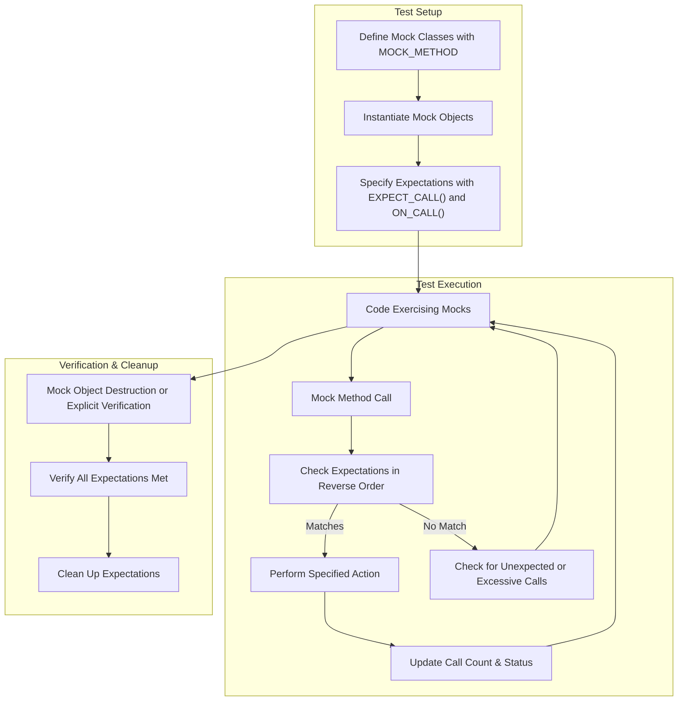

# Mock Object and Expectation Model

GoogleMock (gMock) provides a powerful way to represent and manage mock objects in C++ tests. This page explores how gMock handles mocks, expectations, and call tracking—detailing their responsibilities, encoding of behaviors and call frequencies, and the lifecycle of mock objects in the testing framework.

---

## Overview of Mock Objects

A **mock object** simulates the interface of a real object but lets you specify expectations about how the methods are called during testing. These expectations include *which methods* are called, *in what order*, *how many times*, *with what arguments*, and *what they return*.

### Responsibility

Mock objects in gMock are responsible for:

- Accepting method calls that mirror a real interface.
- Tracking all calls made to them.
- Matching those calls against defined expectations.
- Returning specified values or performing actions.
- Reporting any deviations such as unexpected calls or unmet expectations.

Mocks empower testing of interaction-based behavior by validating how code under test interacts with its dependencies.

<Check>
For a grounding introduction to mocks and their purpose, see our ['gMock for Dummies'](https://google.github.io/googletest/gmock_for_dummies.html).
</Check>

---

## Expectations: Specifying Desired Behavior

**Expectations** define the expected usage pattern of mock methods. They specify:

- The *method* that should be called.
- The *argument values* or *matchers* that constrain which calls match the expectation.
- The *call count* or *cardinality* - how many times calls should occur.
- The *order* in which calls should happen, if important.
- The *behavior* or *actions* the mock method performs when called.

### Encoding Call Frequencies

Expectations encode allowed call frequencies using *cardinalities*, detailed via the `.Times()` clause in `EXPECT_CALL()`. Cardinalities can be:

- Exact: `Times(1)` means exactly one call.
- Range: `Between(2, 5)` means between two and five calls.
- At Least or At Most: `AtLeast(1)`, `AtMost(3)`.
- Unrestricted: `AnyNumber()` allows any number of calls.

If omitted, gMock infers expected call counts based on specified actions (`WillOnce` and `WillRepeatedly`).

### Ordering and Sequences

Expectations can impose call ordering:

- By default, calls can occur in any order.
- Using an `InSequence` block groups expectations to require a strict call order.
- Using `.After()` clauses allows specifying partial order constraints.

This helps test scenarios where the interaction sequence matters to correctness.

<Note>
Strict ordering is useful but can make tests brittle if overused. Prefer ordering only where the interaction contract requires it.
</Note>

---

## Call Tracking Mechanism

When a mock method is invoked, gMock tracks calls via:

- Checking the list of expectations in **reverse order** (newest first) to find the first active expectation that matches the call’s arguments.
- Matching calls against argument *matchers* and optional `.With()` clauses that inspect all arguments as a tuple.
- Verifying that the expectation has not been saturated (exceeded allowed call count).
- Executing the associated action (like returning a value, throwing, or invoking a callback).
- Updating internal counters and retiring expectations when saturated if `.RetiresOnSaturation()` is specified.

If no expectation matches a call:

- If no expectations exist for that method, it is an **uninteresting call**.
  - Dispatches default action if specified.
  - Prints a warning or treats as an error depending on mock strictness (`NiceMock`, `NaggyMock`, or `StrictMock`).
- If expectations exist but none match arguments, it is an **unexpected call**, which triggers a test failure immediately.

<Info>
Uninteresting vs Unexpected calls are distinct: uninteresting means "no expectations" set, unexpected means "some expectations set, but none match the call." See [Understanding Uninteresting vs Unexpected Calls](https://google.github.io/googletest/gmock_cook_book.html#uninteresting-vs-unexpected) for details.
</Info>

---

## Lifecycle of Mock Objects

Mocks go through these stages:

1. **Creation:** Often instantiated via mock classes generated with `MOCK_METHOD` macros.

2. **Setting Expectations:** Using `EXPECT_CALL()`, users specify expected calls and behaviors.

3. **Exercise Code:** Code under test makes calls on mocks.

4. **Call Matching & Tracking:** As described, each call is matched to expectations, actions executed, and violations reported.

5. **Verification:** Upon mock object destruction (or explicit verification via `Mock::VerifyAndClearExpectations()`), gMock confirms that all expectations were met.

6. **Cleanup:** Expectations and resources related to the mock are cleaned up.

<Check>
Ensure that destructors of mocked interfaces are virtual, or memory leaks and undefined behavior will occur during mock lifecycle.
</Check>

---

## Behavior Specification: Actions and Default Behavior

Mock method calls don’t have real implementations, so you must specify what they do upon invocation with *actions*.

- Use `.WillOnce()` to specify an action for a single call.
- Use `.WillRepeatedly()` for actions on subsequent calls after `.WillOnce()` actions are exhausted.
- Omitting action clauses leads to default behavior:
  - For `void` functions: do nothing.
  - For value-returning functions: return 0, false, or default constructed value.

Actions control return values, side effects, callback invocation, and more.

<Note>
The action clauses are evaluated once during expectation setup, so side effects inside `WillOnce(Return(n++))` happen only once, not per call.
</Note>

---

## Mock Strictness: Nice, Naggy, and Strict Mocks

The strictness of a mock determines how uninteresting calls are handled:

- **NaggyMock:** (default) prints warnings on uninteresting calls.
- **NiceMock:** suppresses warnings on uninteresting calls, treating them as allowed.
- **StrictMock:** treats uninteresting calls as errors, failing the test.

Each strictness mode is a template wrapper around a mock class providing these behaviors without otherwise changing functionality.

Use strict mocks when you want maximum assurance that nothing unexpected happens; use nice mocks to keep output clean when irrelevant calls are allowed.

---

## Troubleshooting Common Scenarios

- **Unmatched Calls or Unexpected Calls:** Check that expectations are set **before** calls, with correct argument matchers.
- **Call Count Mismatches:** Review `.Times()` clauses or implicit cardinalities.
- **Uninteresting Call Warnings:** Use nice mocks or add catch-all `EXPECT_CALL(mock, Method(_)).Times(AnyNumber())` to silence.
- **Order Violations:** Ensure sequences or `.After()` clauses correctly represent required call order.
- **Default Action Missing:** If no default actions are specified, unexpected calls return default constructed values; consider using `ON_CALL()` for sensible behavior.

<AccordionGroup title="Troubleshooting Tips">
<Accordion title="Uninteresting Call Warnings">
If warnings annoy, try `NiceMock`. Alternatively, provide a broad `EXPECT_CALL` with `Times(AnyNumber())` for the method.
</Accordion>
<Accordion title="Ordering Failures">
Use `InSequence` or `.After()` clauses precisely to enforce expected call order.
</Accordion>
<Accordion title="Call Frequency Issues">
Remember `.Times()` defaults and interactions with `WillOnce` and `WillRepeatedly`.
</Accordion>
</AccordionGroup>

---

## Diagram: Mock Interaction and Expectation Checking

---

## Best Practices

- Set expectations *before* exercising the mocks.
- Use argument matchers to specify only what matters, avoid over-specifying.
- Prefer `ON_CALL` for defaults and `EXPECT_CALL` only for important expected calls.
- Use `NiceMock` to suppress noisy warnings on uninteresting calls.
- Leverage sequences (`InSequence`) sparingly to reduce test fragility.
- Call `Mock::VerifyAndClearExpectations()` explicitly in cases where your mock object's lifetime is unclear.
- Ensure virtual destructors in interfaces to avoid leaks.

---

## Related Documentation

- [GoogleMock for Dummies](https://google.github.io/googletest/gmock_for_dummies.html) - Beginner-friendly introduction
- [gMock Cookbook](https://google.github.io/googletest/gmock_cook_book.html) - Practical recipes for mocks
- [Mocking Reference](https://google.github.io/googletest/reference/mocking.html) - Detailed API
- [Nice, Naggy, and Strict Mocks](https://google.github.io/googletest/reference/mock-strictness.html) - Modes of mock strictness

---

## Summary

This guide covered the conceptual model behind GoogleMock's mock objects, expectations, and call tracking. It explained how to encode behaviors and invocation cardinalities, manage mock object lifecycle, and handle uninteresting vs unexpected calls. Understanding this model empowers test writers to design precise and maintainable interaction-based tests that enforce correct usage of dependencies.

---

<Tip>
Mastering mocks and expectations will greatly increase your ability to test complex C++ code effectively and reliably. Start with simple mock classes and build up to sequences and custom actions as needed.
</Tip>
