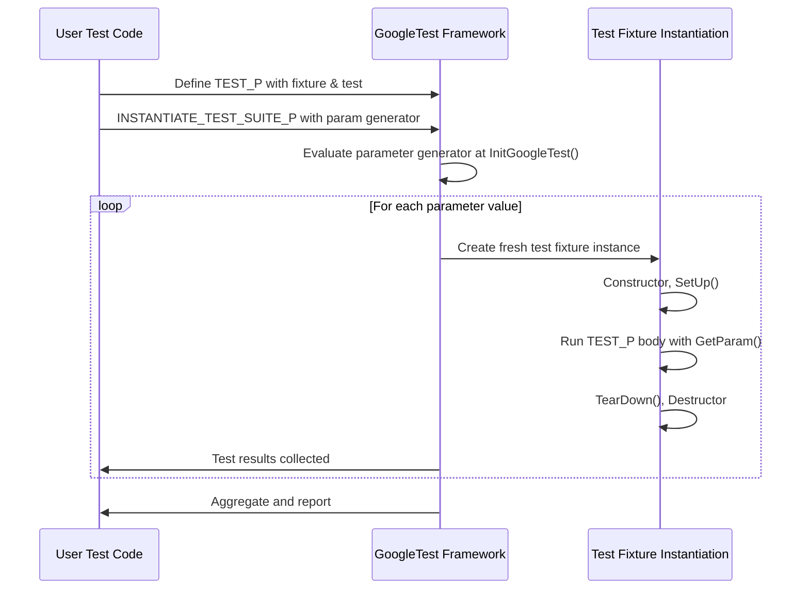

# Parameterized and Typed Test Patterns

Value-parameterized and type-parameterized tests form the backbone of scalable, maintainable, and expressive testing using GoogleTest. This guide unpacks these powerful patterns, showing how they expand simple test logic into comprehensive test coverage with minimal code duplication.

---

## Introduction to Parameterized Testing

Imagine you have a function or class that behaves slightly differently based on input values or types, and you want to verify its correctness across these variations. Writing a separate test for every possible input or type would become tedious, error-prone, and hard to maintain. Parameterized testing in GoogleTest solves this elegantly by allowing you to write a test once, then run it multiple times with different parameters.

---

## Value-Parameterized Tests

Value-parameterized tests enable you to write a test fixture class template parameterized not by a type but by a sequence of values. GoogleTest then runs each test in the suite once for each input value, automating exhaustive testing over the range of parameters.

### When to Use Value-Parameterized Tests

- Testing functionality affected by runtime or configuration parameters.
- Validating algorithm behavior over different sets of inputs (data-driven testing).
- Comparing implementations that can be instantiated with different input values or policies.

### Writing Value-Parameterized Tests: User Workflow

1. **Define a test fixture class** derived from `testing::TestWithParam<T>`, where `T` is the parameter type (e.g., `int`, `std::string`). 

2. **Define tests using the `TEST_P` macro** inside this fixture. Use `GetParam()` to access the current parameter within each test.

3. **Instantiate the test suite** with a set of parameter values using the `INSTANTIATE_TEST_SUITE_P` macro along with a parameter generator.

### Example

```cpp
class FooTest : public testing::TestWithParam<int> {};

TEST_P(FooTest, IsEven) {
  int value = GetParam();
  EXPECT_EQ(value % 2, 0);
}

INSTANTIATE_TEST_SUITE_P(EvenNumbers, FooTest, testing::Values(2, 4, 6, 8));
```

This results in four tests run, each with an even number from the list.

### Parameter Generators

GoogleTest provides convenient functions to generate test parameters:

- `Values(v1, v2, ..., vN)`: Explicitly lists test values.
- `ValuesIn(container)`: Takes a container or array of parameters.
- `Range(begin, end [, step])`: Generates a sequence from `begin` to `end` (exclusive).
- `Bool()`: Produces `{false, true}`.
- `Combine(g1, g2, ..., gN)`: Produces Cartesian product tuples from multiple generators.

You can even convert generated parameters with custom functors using `ConvertGenerator` to create complex or user-defined parameter types.

### Use Case: Testing With Multiple Parameters

Suppose you want to test a function with two parameters combined. You can use `Combine`:

```cpp
INSTANTIATE_TEST_SUITE_P(
  TwoParamTests, MyTest,
  testing::Combine(testing::Values(1, 2), testing::Bool()));
```

This runs the test for each pair `(1, false)`, `(1, true)`, `(2, false)`, `(2, true)`.

### Important Notes

- `TEST_P` requires your fixture to publicly declare `SetUpTestSuite()` and `TearDownTestSuite()` if you use them.
- The parameter generator expression is evaluated when `InitGoogleTest()` runs, not when the macro is invoked.
- Every `TEST_P` must have a corresponding `INSTANTIATE_TEST_SUITE_P`. Otherwise, tests will fail unless tagged with `GTEST_ALLOW_UNINSTANTIATED_PARAMETERIZED_TEST`.

---

## Typed Tests

Typed tests allow you to run the same test logic over a list of types rather than values. This is invaluable when you want to verify that different data types, or template specializations, conform to the same behavior contract.

### When to Use Typed Tests

- Testing type-specific implementations with consistent interfaces.
- Ensuring different type instantiations of templates behave correctly.

### Writing Typed Tests: User Workflow

1. **Define a class template fixture** derived from `testing::Test`.

2. **Define your list of types** using `::testing::Types<T1, T2, ...>`.

3. **Associate the type list with the fixture** using the `TYPED_TEST_SUITE` macro.

4. **Write tests using `TYPED_TEST` to define the test body.** Use the special name `TypeParam` to refer to the current type parameter.

### Example

```cpp
template <typename T>
class NumericTest : public testing::Test {
public:
  T value_;
};

using MyTypes = ::testing::Types<int, float, double>;
TYPED_TEST_SUITE(NumericTest, MyTypes);

TYPED_TEST(NumericTest, IsPositiveInitially) {
  TypeParam val = this->value_;
  EXPECT_GE(val, 0);
}
```

This runs the `IsPositiveInitially` test three times, once for each type.

### Important Notes

- You must define a type list before associating it with your typed test fixture.
- `TYPED_TEST` expansions generate different classes internally, so type-specific failure messages show the failing type.

---

## Type-Parameterized Tests

Type-parameterized tests extend typed tests by allowing you to define the test once without a fixed type list and instantiate the test suite with different types later. This is ideal for testing generalized interfaces or concepts.

### How to Write Type-Parameterized Tests

1. Define a class template fixture derived from `testing::Test`.
2. Declare the fixture as a type-parameterized test suite using `TYPED_TEST_SUITE_P`.
3. Define tests inside `TYPED_TEST_P` using `TypeParam`.
4. Register your test names with `REGISTER_TYPED_TEST_SUITE_P`.
5. Instantiate test suites with `INSTANTIATE_TYPED_TEST_SUITE_P` and a type list.

### Example

```cpp
template <typename T>
class MyContainerTest : public testing::Test {
  // ... shared test logic ...
};

TYPED_TEST_SUITE_P(MyContainerTest);

TYPED_TEST_P(MyContainerTest, CanAddElement) {
  TypeParam container;
  container.Add(1);
  EXPECT_EQ(container.Size(), 1);
}

REGISTER_TYPED_TEST_SUITE_P(MyContainerTest, CanAddElement);

using TestTypes = ::testing::Types<std::vector<int>, std::list<int>>;
INSTANTIATE_TYPED_TEST_SUITE_P(My, MyContainerTest, TestTypes);
```

### Important Points

- `TYPED_TEST_SUITE_P` and registration macros allow splitting definition and instantiation across files.
- Instantiation name prefixes help distinguish multiple instantiations of the same suite.

---

## Distinguishing Parameterized Test Patterns

| Test Pattern              | Fixture Base Class                    | Macro to Define Tests    | Macro to Instantiate       |
| --------------------------|-------------------------------------|-------------------------|----------------------------|
| Simple Test               | `testing::Test`                     | `TEST`                  | N/A                        |
| Test Fixture              | `testing::Test` subclass            | `TEST_F`                 | N/A                        |
| Value-Parameterized Test  | `testing::TestWithParam<T>`         | `TEST_P`                 | `INSTANTIATE_TEST_SUITE_P` |
| Typed Test                | Template of `testing::Test`         | `TYPED_TEST`             | `TYPED_TEST_SUITE`          |
| Type-Parameterized Test   | Template of `testing::Test`         | `TYPED_TEST_P` + `REGISTER_TYPED_TEST_SUITE_P` | `INSTANTIATE_TYPED_TEST_SUITE_P` |

---

## Best Practices & Tips

- Always choose descriptive and valid C++ identifiers for test suite and test names without underscores.
- Use parameterized tests to cover broad permutations effectively, minimizing duplicated code.
- Provide custom parameter name generators in `INSTANTIATE_TEST_SUITE_P` for readable test output, especially when parameters are complex or string-based.
- When multiple parameters combine, use `testing::Combine()` to generate Cartesian products.
- Mark test suites with `GTEST_ALLOW_UNINSTANTIATED_PARAMETERIZED_TEST` if no instantiations are present by design.
- Use `SetUpTestSuite()` and `TearDownTestSuite()` for expensive resources shared across parameterized tests.

---

## Troubleshooting Common Issues

- **Tests not running?** Ensure `INSTANTIATE_TEST_SUITE_P` is used for each `TEST_P`.
- **Parameter names unclear?** Provide a custom name generator lambda or functor to `INSTANTIATE_TEST_SUITE_P`.
- **Compiler errors about constructors?** Check that test fixtures have accessible default constructors.
- **Unexpected duplicate test names?** Avoid underscores in test suite and test names to prevent naming collisions.

---

## Diagram: Parameterized Test Execution Flow



---

## Resources and Next Steps

- **See also:** [GoogleTest Primer](googletest-guides/getting-started/primer.md) for foundational knowledge.
- **Detailed reference:** [Testing Reference - TEST_P and INSTANTIATE_TEST_SUITE_P](docs/reference/testing.md) for API details and parameter generators.
- **Type-parameterized tests:** [Typed Tests](docs/advanced.md#typed-tests) for advanced use cases.
- **Samples:** Review practical examples in the [googletest samples directory](https://github.com/google/googletest/tree/main/googletest/samples).
- **Common pitfalls:** Consult [GoogleTest FAQ](docs/faq.md) section on parameterized tests for trouble-shooting.

Using parameterized and typed test patterns effectively will let you maximize coverage and minimize boilerplate, ensuring robust tests that scale with your codebase.