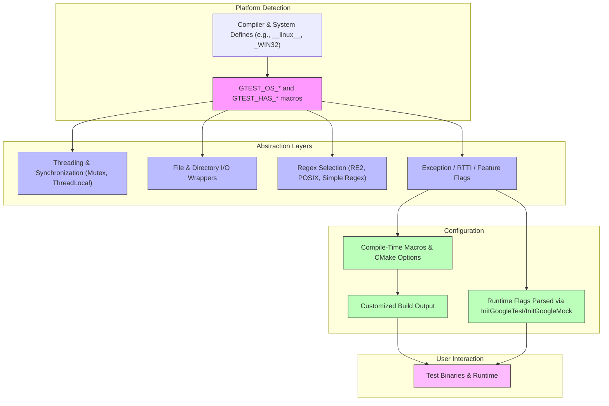

# Portability, Platform Support, and Configuration

GoogleTest and GoogleMock are designed for wide portability across diverse platforms, compilers, and environments. This page explains the cross-platform principles underpinning the framework, the abstraction layers that enable seamless operation on different compilers and systems, and the configuration options that allow you to tailor GoogleTest and GoogleMock for flexible, reliable deployment in almost any environment.

---

## Cross-Platform Design Principles

GoogleTest adheres to a strict foundational C++ support policy that ensures compatibility with modern, actively supported compiler versions and platforms. Following Google's [Foundational C++ Support Policy](https://opensource.google/documentation/policies/cplusplus-support), the framework supports major platforms including Linux, Windows, macOS, embedded systems including ESP32 and NRF52, and various Unix-like operating systems.

The portability is achieved by:

- **Modular Abstraction Layers (Ports)**: Platform-specific code is isolated in well-defined port layers, making it easy to adapt GoogleTest and GoogleMock to new or embedded platforms with minimal changes.
- **Conditional Compilation**: Feature detection macros automatically configure capabilities like threading, exceptions, or file system access.
- **Pragmatic Build Configuration**: CMake scripts and build options allow users to enable or disable features or tailor builds for shared libraries, threading models, or runtime environments.

This modular and configurable design means GoogleTest behaves consistently whether it’s running on a desktop Linux server, a Windows CI pipeline, or a resource-constrained embedded device.

---

## Abstraction Layers for Compilers and Systems

GoogleTest implements a series of internal abstraction points, often called ports, to handle nuances in compilers, OS APIs, threading primitives, synchronization, and file I/O. This design provides a clean separation between platform-dependent code and core testing functionality.

### Platform Detection

GoogleTest detects the target platform at compile time through a set of macros such as `GTEST_OS_WINDOWS`, `GTEST_OS_LINUX`, `GTEST_OS_MAC`, `GTEST_OS_ESP32`, and others. These macros are defined automatically in `gtest-port-arch.h` based on compiler predefined symbols.

This detection enables selective inclusion of platform-specific code with guarantees of correctness and efficiency.

### Example Platform Macros

- `GTEST_OS_WINDOWS` and subvariants like `GTEST_OS_WINDOWS_DESKTOP`
- `GTEST_OS_LINUX` with `GTEST_OS_LINUX_ANDROID` for Android targets
- `GTEST_OS_MAC` with support for iOS via `GTEST_OS_IOS`
- Embedded platforms like `GTEST_OS_ESP32` and `GTEST_OS_NRF52`

### Threading and Synchronization

Based on detected platform and compiler capabilities, GoogleTest uses mutexes, thread-local storage, and condition variables abstracted via the `Mutex`, `MutexLock`, and `ThreadLocal` classes defined in `gtest-port.h`. It uses pthreads where available or Windows critical sections otherwise. In environments where threads are unsupported or disabled, no-op implementations are provided to maintain code consistency.

This portable threading support ensures safe parallel test execution when available.

### File System and I/O

GoogleTest wraps files and directory operations through the internal `posix` namespace in `gtest-port.h`, isolating platform-specific API differences in file descriptors, directory manipulation, and stream redirection.

The framework detects if file systems exist (`GTEST_HAS_FILE_SYSTEM`) and disables related functionality in embedded or minimal environments accordingly.

### Regular Expressions

Depending on platform and build options, GoogleTest switches between three different regex implementations:

- **RE2 library (if Abseil/RE2 is available).**
- **POSIX Extended Regular Expressions on Unix-like platforms.**
- **Internal simple regex fallback otherwise.**

This ensures matchers and assertions using regex works reliably wherever possible.

### Exception, RTTI, and Other Feature Flags

GoogleTest automatically detects compiler support for exceptions (`GTEST_HAS_EXCEPTIONS`), RTTI (`GTEST_HAS_RTTI`), and wide strings (`GTEST_HAS_STD_WSTRING`), enabling or disabling features accordingly for maximum compatibility and performance.

---

## Key Configuration Options

GoogleTest provides several macros and flags to configure its behavior at build or runtime, enabling customization per environment or user needs.

### Build-Time Configuration via Macros

Pass these macros as compiler flags to adapt GoogleTest and GoogleMock to your environment:

- **C++ Standard Version:** GoogleTest requires C++17 or newer. Specify this explicitly in your build setup (e.g., `-std=c++17` or equivalent).

- **`GTEST_HAS_PTHREAD`**: Set to `1` or `0` to force pthread support availability detection. Useful if autodetection fails.

- **`GTEST_CREATE_SHARED_LIBRARY` and `GTEST_LINKED_AS_SHARED_LIBRARY`**: Enable building GoogleTest as a shared library and linking accordingly.

- **`GTEST_DONT_DEFINE_*` Macros**: Disable definition of commonly colliding macros, e.g. `-DGTEST_DONT_DEFINE_TEST=1` to avoid macro name conflicts.

- **Visual Studio Runtime Compatibility:** Use the CMake option `gtest_force_shared_crt` to control linkage of runtimes dynamically versus statically, resolving common linkage errors.

### GoogleMock-Specific Configuration

Similar flag macros and runtime flags exist for GoogleMock, primarily defined and manipulated through `gmock-port.h`, including:

- Flag declaration, definition, getting, and setting macros like `GMOCK_DEFINE_bool_(name, default, doc)` and `GMOCK_FLAG_GET(name)`.

- Runtime flags parsed and handled by `InitGoogleMock()` such as `--gmock_verbose`.

- These flags can either be defined at compile-time or passed via the command line to configure mock behavior.

### Runtime Flag Parsing

GoogleMock and GoogleTest parse command-line flags early during initialization (`InitGoogleMock()` or `InitGoogleTest()`), stripping recognized flags and making flag values accessible programmatically via macros.

Example code snippet for parsing a verbose flag:

```cpp
int argc = ...;
char** argv = ...;
testing::InitGoogleMock(&argc, argv);
std::string verbose = GMOCK_FLAG_GET(verbose);
```

### Customizing Through `custom/` Directory

Advanced users can customize low-level configurations by defining or overriding macros in the `googlemock/include/gmock/internal/custom/gmock-port.h` file, which acts as an injection point for user-defined settings like flags and platform-specific overrides.

---

## Practical Tips and Best Practices

- **Ensure Your Build Environment Meets Minimum Requirements:** GoogleTest requires a C++17 capable compiler and CMake 3.14+ for its official build scripts.

- **Use Provided CMake Integration:** To simplify building and linking GoogleTest or GoogleMock, use the builtin CMake scripts with recommended flags like `gtest_force_shared_crt` on Windows.

- **Explicitly Enable or Disable Threading If Your Platform Requires:** Control pthread detection with `GTEST_HAS_PTHREAD` macros for embedded systems.

- **Leverage Runtime Flags for Flexible Mock Configuration:** Use command-line flags like `--gmock_verbose=info` to adjust logging and debugging without rebuilds.

- **Avoid Macro Name Conflicts in Mixed Codebases:** Use `GTEST_DONT_DEFINE_*` to prevent GoogleTest from defining macros that clash with other libraries.

- **Consult Platform-Specific Guides:** For embedded platforms such as ESP32 or NRF52, initialization entry points and runtime constraints may necessitate platform-specific wiring and careful lifecycle management.

- **Check Platform Support Matrix:** Review the latest support details at [Foundational C++ Support Matrix](https://github.com/google/oss-policies-info/blob/main/foundational-cxx-support-matrix.md).

---

## Troubleshooting Common Portability Challenges

### Issue: Linker Errors on Windows Related to Runtime Library
- **Cause:** Runtime libraries dynamically vs statically linked between GoogleTest and your project.
- **Solution:** Enable `gtest_force_shared_crt` in your CMake build to align runtime linkage.

### Issue: Missing pthread on Embedded or Specialized Platforms
- **Cause:** GoogleTest may fail to detect pthread support.
- **Solution:** Explicitly define `-DGTEST_HAS_PTHREAD=0` or `1` according to your platform capability.

### Issue: Macros Colliding With Other Libraries
- **Cause:** GoogleTest defines common macros like `TEST` or `ASSERT_EQ`.
- **Solution:** Use `GTEST_DONT_DEFINE_TEST=1` and reference macros prefixed with `GTEST_` instead.

### Issue: Runtime Flag Parsing Not Working
- **Cause:** Flags defined incorrectly or initialization function not called.
- **Solution:** Ensure `InitGoogleMock()` or `InitGoogleTest()` is called early with correct argc/argv references.

---

## Summary

This documentation has detailed how GoogleTest and GoogleMock achieve portability through platform detection macros, modular port layers, and configurable compilation flags. By understanding and leveraging these abstractions and configurations, you can confidently build and run tests across desktop, server, and embedded platforms.

For comprehensive integration instructions and troubleshooting, refer to complementary guides in the Getting Started and Integration sections.

---

## References and Further Reading

- [GoogleTest Foundational C++ Support Policy](https://opensource.google/documentation/policies/cplusplus-support)
- [GoogleTest Portability Utilities (`gtest-port.h`)](https://github.com/google/googletest/blob/main/googletest/include/gtest/internal/gtest-port.h)
- [GoogleMock Portability Utilities (`gmock-port.h`)](https://github.com/google/googletest/blob/main/googlemock/include/gmock/internal/gmock-port.h)
- [CMake Build and Integration Guide](./getting-started/setup-installation/configuration-integration.md)
- [Platforms and Build Systems Guide](./googletest-guides/integration-and-troubleshooting/platforms-and-build-systems.md)
- [GoogleMock Customization Points (`custom/gmock-port.h`)](./googlemock/include/gmock/internal/custom/README.md)

---

## Diagram: High-Level Portability and Platform Support Overview


