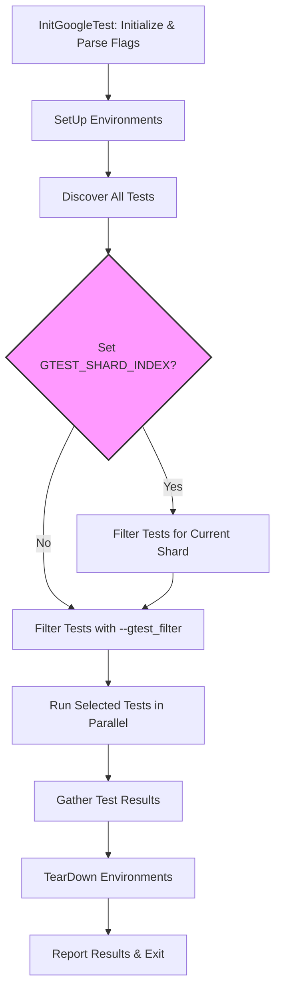

# Scalability & Performance Patterns

Discover how GoogleTest and GoogleMock optimize testing speed and resource usage on large codebases. This guide presents strategies for parallel and distributed test execution, test filtering, reduced startup overhead, and organizing massive test suites. Following these practices ensures your tests are both fast and scalable, enabling continuous integration across extensive projects.

---

## Parallel Test Execution

Running tests in parallel is the most effective way to speed up large test suites. GoogleTest provides built-in support for parallel execution at the granularity of individual tests.

### Enabling Parallel Runs

By leveraging multiple cores, GoogleTest executes multiple tests simultaneously, dramatically reducing the total run time. This is especially effective for tests without shared state or side effects.

Practical tips for parallel execution:
- Design tests to avoid shared global states or race conditions.
- Use `--gtest_jobs=N` or equivalent build system support to specify parallelism.
- Ensure thread safety in tests, especially when using GoogleMock, as strict ordering or side effects can cause issues.

### Test Sharding

Sharding divides tests across multiple machines or processes, each running a subset of tests. This approach is supported natively via environment variables.

Key environment variables:
- `GTEST_TOTAL_SHARDS`: Total number of shards (machines/processes).
- `GTEST_SHARD_INDEX`: Zero-based index identifying the current shard.

GoogleTest automatically selects and runs the subset of tests for each shard, ensuring all tests are covered exactly once when combined.

Use case example:
```bash
# On machine 1
GTEST_TOTAL_SHARDS=3 GTEST_SHARD_INDEX=0 ./my_tests

# On machine 2
GTEST_TOTAL_SHARDS=3 GTEST_SHARD_INDEX=1 ./my_tests

# On machine 3
GTEST_TOTAL_SHARDS=3 GTEST_SHARD_INDEX=2 ./my_tests
```

**Note:** Test filtering and sharding can be combined to efficiently utilize resources.

## Test Filtering and Selection

Reducing test execution time often begins by running only relevant tests.

### Filtering Tests

Use the `--gtest_filter` flag to specify subsets of tests by matching test suite and test names with wildcards.

Example:
```bash
./my_tests --gtest_filter=FooTest.*:-FooTest.Bar
```
Runs all tests in `FooTest` except `FooTest.Bar`.

This reduces test runtime and focuses debugging on specific code changes.

### Disabled Tests

Prefix tests or test suites with `DISABLED_` to exclude them from runs without deleting code.
To run disabled tests, use:
```bash
./my_tests --gtest_also_run_disabled_tests
```
Useful to temporarily deactivate flaky or incomplete tests.

## Reducing Test Startup Overhead

For very large test programs, startup time impacts overall test performance.

### Tips for Optimizing Startup

- Minimize the number of global/static initializations.
- Avoid expensive operations in test fixture constructors or global environments.
- Prefer runtime setup in `SetUp()` over static initialization.
- Use `SetUpTestSuite()` and `TearDownTestSuite()` for expensive shared resources.

This ensures the test runner starts quickly and spends time executing tests rather than setup.

## Managing Large Test Suites

Large projects may have thousands of tests, necessitating good organization for scalability and clarity.

### Organizing Tests

- Group logically related tests into test suites.
- Use test fixtures to share setup code and resources within a suite.
- Leverage typed and parameterized tests to run the same test logic with different data or types, reducing code duplication.

### Per-Test and Per-Suite Setup

- Use `SetUp()` and `TearDown()` for per-test initialization and cleanup.
- Use `SetUpTestSuite()` and `TearDownTestSuite()` to share expensive resources among tests, reducing redundant initialization.

### Parallelization Safety

- Ensure test fixtures and shared resources are thread-safe when running tests in parallel.
- Use locking, synchronization, or immutable state to avoid race conditions.

## Best Practices and Common Pitfalls

- **Parallel execution requires isolation.** Avoid global mutable state without protection.
- **Beware of flaky tests** that pass or fail nondeterministically, which undermine confidence in parallel or repeated runs.
- **Control test order dependencies.** Tests should be independent of one another and runnable in any order.
- **Careful with death tests and threads.** Death tests run in individual processes and should be named with the `*DeathTest` suffix.
- **Use filtering to debug failing tests quickly.** Running smaller subsets accelerates iteration.

## Example Workflow

1. Write independent, well-named tests grouped into suites.
2. Use fixtures and suite-level setup for shared resources.
3. Run `./my_tests --gtest_filter=MyFeature*` to focus on a feature.
4. Enable parallel test execution with environment variable or build system support.
5. Scale to distributed shards using `GTEST_TOTAL_SHARDS` and `GTEST_SHARD_INDEX`.
6. Monitor test flaky reports and isolate failures.

## Troubleshooting Performance

If your tests are slow:
- Profile to find time spent in setup vs testing.
- Check for global or static initializations causing delays.
- Use `--gtest_brief=1` to reduce console output overhead.
- Disable logging or debug output in normal runs.

---

### Diagram: GoogleTest Parallel & Sharded Test Execution Workflow



---

【End of guide】

---