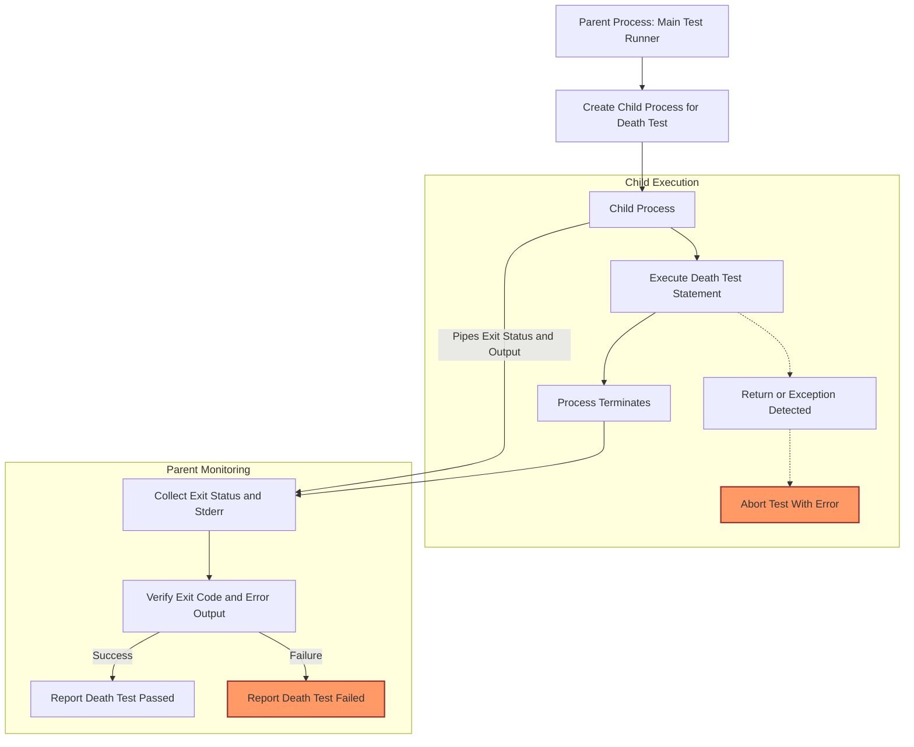

# Death Tests and Safety Mechanisms

## Introduction to Death Tests

In software development, ensuring that your program fails safely and predictably under erroneous conditions is as critical as validating its correct behaviors. **Death tests** play an essential role in verifying that code correctly terminates when it encounters fatal errors, precondition violations, or consistency breaches.

A death test verifies that a specific code fragment causes your program to terminate abnormally — for example, due to a call to `exit()`, an assertion failure that aborts the process, or a fatal signal (like segmentation fault). By isolating and confirming such behaviors, death tests help safeguard defensive programming and ensure robust error handling paths work as intended.

## Purpose and Utility of Death Tests

Death tests are crucial for:

- Testing assertion statements and consistency checks that cause a program to terminate when invalid states occur.
- Validating that error-handling code paths induce termination as expected, avoiding undefined or unsafe behaviors.
- Verifying signal handling and abnormal termination mechanisms in a controlled, repeatable manner.

Unlike regular tests, death tests expect the tested code to cause the process to exit. They capture and analyze both the termination status and any error output generated during execution.

## How Death Tests Work

GoogleTest executes death tests by spawning a separate subprocess dedicated to running the test statement and monitoring its termination. This approach prevents the entire test process from aborting prematurely.

The key workflow is as follows:

1. **Preparation:** When a death test macro like `ASSERT_DEATH(statement, matcher)` or `EXPECT_DEATH(statement, matcher)` is used, GoogleTest sets up the environment for a death test.

2. **Child Process Creation:** The framework creates a child process that will execute the death test code. There are two primary death test styles that govern this:
   
   - **Threadsafe:** The child process restarts the test binary with flags that allow it to run only the specific death test. This style provides safety around multithreaded environments but is slower.
   - **Fast:** The child process runs the death test statement immediately after forking, leading to faster execution but requiring the process to be single-threaded for safety.

3. **Execution:** The child process executes the tested statement. It is expected to terminate during this execution.

4. **Monitoring:** The parent process waits for the child to terminate and collects:
   - **Exit status:** Whether the process exited normally or was terminated by a signal.
   - **Error output:** The stderr output generated by the child, which is used to match against expected messages.

5. **Verification:** The test asserts that:
   - The process terminated as expected (did not live beyond the death test).
   - The exit code (or termination signal) matches user-supplied predicates.
   - The error output matches the provided regular expression or matcher.

6. **Result:** If all conditions are met, the death test passes. Otherwise, it fails.

## Writing Death Tests in GoogleTest

GoogleTest provides a set of macros optimized for writing death tests:

- **`ASSERT_DEATH(statement, matcher)`**: Generates a fatal failure if the statement does not cause the process to die as expected.

- **`EXPECT_DEATH(statement, matcher)`**: Like `ASSERT_DEATH`, but generates a nonfatal failure.

- **`ASSERT_EXIT(statement, predicate, matcher)`** and **`EXPECT_EXIT(statement, predicate, matcher)`**: Allow specifying a predicate that tests the exit code or signal causing termination.

- **`EXPECT_DEBUG_DEATH` / `ASSERT_DEBUG_DEATH`**: These only check for deaths in debug mode (usually when assertions are active), and in optimized builds the statement is executed normally.

- **`EXPECT_DEATH_IF_SUPPORTED` / `ASSERT_DEATH_IF_SUPPORTED`**: These macros compile everywhere but only execute on platforms that support death tests.

### Basic Example

```cpp
TEST(MyDeathTest, Basic) {
  ASSERT_DEATH({
    int* p = nullptr;
    *p = 1;  // Null pointer dereference causes process to die.
  }, "segmentation fault");
}
```

### Using Exit Code Predicates

You can verify exit status precisely by supplying a predicate to `ASSERT_EXIT` or `EXPECT_EXIT`:

```cpp
EXPECT_EXIT(
    exit(42),
    testing::ExitedWithCode(42),
    "Success"
);
```

This confirms the process exited normally with exit code 42 and printed "Success" to stderr.

### Complex Statements

The death test macros accept compound statements:

```cpp
ASSERT_DEATH({
  // Setup code
  Foo foo;
  foo.DoSomething();
}, "expected error message");
```

### Regex Matchers for Error Output

Matcher parameters are interpreted as regex patterns (not literal strings), allowing you to verify specific or partial error output text.

## Death Test Safety and Caveats

### Single-Threaded Execution

Death tests are not thread safe by nature because most processes cannot safely `fork()` in a multithreaded context. GoogleTest warns when multiple threads are detected during a death test, as this can lead to deadlocks or hangs.

### Proper Test Naming

Tests involving death tests should be placed in test suites whose names end with `DeathTest`. GoogleTest uses this convention to run death tests before other tests to mitigate thread interactions.

### Statement Restrictions

- Do not use statements that return from the function or throw exceptions inside death tests. Such behavior causes the death test to fail.
- Avoid multiple death test assertions on the same source line; this leads to compilation errors.
- Side effects in death tests, such as memory allocation or file descriptor management, are not observed by the parent process due to subprocess isolation.

### Heap Checkers and Resource Management

Since the child process terminates during the death test, heap checkers running in the parent process can report leaks if objects are allocated and released only in the death test statement. Workarounds include freeing resources again in the parent or disabling heap checks during these tests.

### Regex Syntax Limitations

On POSIX systems, GoogleTest uses POSIX Extended Regular Expressions, while on other platforms (Windows, Mac) it provides a simpler regex syntax lacking some common features (e.g., grouping, alternation).

### Debug Mode Death Checks

`EXPECT_DEBUG_DEATH` and `ASSERT_DEBUG_DEATH` check that the statement dies in debug builds but allows side effects in optimized builds. This is useful for testing code that conditionally crashes based on debug assertions.

## Mechanisms Behind GoogleTest Death Tests (Internal Overview)

When you write a death test macro in your code, GoogleTest internally:

- Selects an implementation depending on platform and configured death test style (`fast` or `threadsafe`).
- Creates a `DeathTest` object which manages subprocess creation and communication.
  - For `threadsafe` style, it uses a fork-exec approach and runs only the specific death test in the child process.
  - For `fast` style, it forks and immediately runs the death test statement.
- Pipes are used to communicate the exit status and death test outcome from the child to the parent process.
- GoogleTest captures stderr output from the death test to match it against the user-supplied expression.
- It handles special cases such as: catching unexpected exceptions thrown from the death test, detecting illegal return statements within death tests, and ensuring proper isolation.

This intricate orchestration allows death tests to run safely and robustly across platforms.

## Practical Tips for Using Death Tests Successfully

- **Name your death test suites ending with `DeathTest`** to ensure they run early and warn about threading issues.
- **Use simple, focused statements** in your death tests to improve clarity and reduce flakiness.
- **Favor `EXPECT_DEATH` over `ASSERT_DEATH`** when you want the test function to continue after the death check.
- **Match your error messages carefully** with regex to avoid false positives or missed failures.
- **Avoid side effects in death test statements** that you need to observe after the death test finishes.
- **Use `SCOPED_TRACE`** to annotate death tests when performed in loops or complex scenarios for better diagnostics.
- **Set the death test style explicitly** if your environment needs it (`threadsafe` versus `fast`), for example:

```cpp
GTEST_FLAG_SET(death_test_style, "threadsafe");
```

- **Avoid running multiple death assertions on the same source line.**

## Troubleshooting Common Issues

- **Death test hangs or timeouts:** Likely due to multiple threads running in the tested process when forking. Check thread usage and consider `threadsafe` death test style.
- **Unexpected death test failures or mismatched outputs:** Review your regex matcher syntax and ensure it fits the platform’s regex capabilities.
- **Test does not detect death:** Make sure your statement actually causes process termination and not just exceptions.
- **Memory leaks reported during death tests:** Resources allocated in the death test child may appear leaked in the parent. Adjust resource management or disable heap checks.

## Summary

Death tests are a powerful feature in GoogleTest designed to verify that your code terminates under fatal conditions as expected, safeguarding error-handling and consistency checks. Through subprocess isolation, flexible death test styles, and rich predicate and matcher support, GoogleTest provides a robust framework for death testing your C++ code.

---

## Additional References

- [GoogleTest Primer: Death Tests Section](docs/advanced.md#death-tests)
- [Assertions Reference: Death Assertions](docs/reference/assertions.md#death)
- [Advanced Guide: Using Assertions Effectively](guides/core-testing-workflows/using-assertions-effectively)
- [Advanced: Scoped Trace for Better Diagnostics](docs/advanced.md#adding-traces-to-assertions)
- [Architecture Overview](overview/architecture-and-key-concepts/architecture-overview)

---

## Diagram: Death Test Execution Flow


