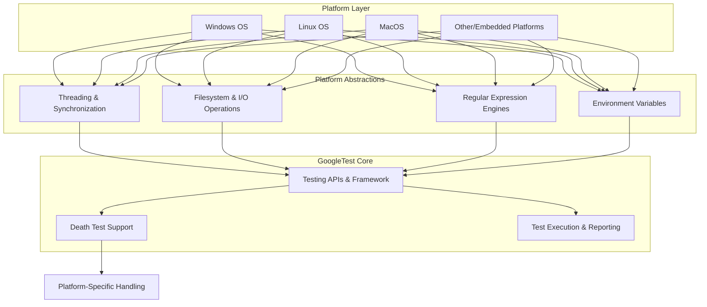

# Portability and Platform Integration

GoogleTest (and by extension, GoogleMock) are designed to be portable and reliable across a broad spectrum of compilers, operating systems, and platforms. This page explains the abstractions, detection mechanisms, and configuration facets that ensure their seamless operation regardless of environment. Understanding these concepts empowers users to integrate, build, and extend GoogleTest effectively in diverse settings.

---

## Platform Detection and Environment Abstraction

GoogleTest automatically detects the target platform during compilation using predefined compiler macros and custom platform headers. This detection enables conditional compilation of platform-specific code and selection of the best available implementations.

### Platform Macros

GoogleTest defines macros such as `GTEST_OS_WINDOWS`, `GTEST_OS_LINUX`, `GTEST_OS_MAC`, `GTEST_OS_FREEBSD`, and others to signify the detected platform. These macros are set to 1 when the platform is active and are otherwise undefined, allowing users and GoogleTest internals to conditionally compile code paths optimized for that system.

### Feature Support Macros

Besides platform identification, GoogleTest defines feature-specific macros to indicate availability of core features like threading, exceptions, regular expressions, or filesystem support. For example:

- `GTEST_HAS_PTHREAD`: Indicates POSIX threads availability.
- `GTEST_HAS_EXCEPTIONS`: Indicates if C++ exceptions are enabled.
- `GTEST_HAS_STREAM_REDIRECTION`: Indicates support for redirecting stdout/stderr, critical for death tests.
- `GTEST_HAS_DEATH_TEST`: Available only if platform and filesystem allow spawning subprocesses.

These macros enable internal modules to adapt behavior to platform capabilities.

---

## Platform-Specific Implementations and Workarounds

Due to divergences across operating systems, GoogleTest defines platform-specific code segments especially relating to:

- **Threading and Synchronization**: Uses Windows critical sections on Windows platforms; POSIX threads elsewhere. It abstracts mutexes, thread-local storage, and thread creation, ensuring thread safety where supported. On platforms lacking threading capabilities, stub implementations preserve API compatibility without real concurrency.

- **Filesystem and I/O**: Uses platform-appropriate system calls for file operations, capturing IO streams, and environment variables. Windows versions use `_wfopen` to handle Unicode paths, while Unix-like systems rely on standard POSIX APIs.

- **Regular Expressions**: Supports multiple regex implementations depending on platform and compiled dependencies:
  - RE2 via Abseil if available.
  - POSIX Extended Regex where supported.
  - A custom simplified regex engine for constrained platforms.

- **Death Tests**: Require spawning subprocesses and capturing outputs. Only enabled on platforms that provide the necessary system calls and filesystem support.

---

## Compiler Compatibility and Build Configuration

GoogleTest requires a C++17 capable compiler to build successfully. It supports:

- GCC (various versions)
- Clang
- MSVC (Visual Studio 2015 and newer)
- Intel LLVM
- SunPro CC, HP aCC, IBM Visual Age, and more

The build can be configured via CMake to select static or shared libraries, enable/disable components (like GoogleMock), and manage compiler/linker flags for runtime library consistency. 

### Handling Runtime Library Mismatches on Windows

By default, Visual Studio projects link the C runtime dynamically, but GoogleTest links it statically. The CMake option `gtest_force_shared_crt` allows aligning the runtime linkage to avoid linker errors related to mismatched runtime libraries.

### Threading Support Detection

GoogleTest uses environment heuristics and build configurations to assert if pthreads or the Windows threading model is present and configures synchronization primitives accordingly. If threading is unavailable, dummy mutex and thread-local implementations are used.

### Macro Name Conflict Mitigation

GoogleTest macro names can conflict with other libraries. Users can define macros such as `-DGTEST_DONT_DEFINE_TEST=1` to rename GoogleTest macros (e.g., from `TEST` to `GTEST_TEST`) to avoid collisions.

---

## Runtime Environment Adaptations

At runtime, GoogleTest adapts behavior based on detected environment capabilities:

- **Stream Capturing**: Uses temporary files for capturing stdout and stderr, with platform-specific temporary directory selection.

- **Thread Counts**: Provides platform-specific implementations to query the number of active threads in the current process, useful for internal thread safety checks.

- **Regular Expression Engines**: Chooses the best regex engine available for your platform, ensuring regex assertions work consistently.

- **Environment Variables**: Abstractions to read environment variables safely across platforms, with special handling for embedded platforms lacking typical environment support.

---

## Best Practices for Users

- **Selecting Build Options**: Use CMake options to tailor GoogleTest for your platform, toggling GoogleMock or shared/static library usage.

- **Addressing Threading Issues**: If running on a platform without threading, be mindful of GoogleTest's limitations in concurrent assertions and tests.

- **Managing Macro Clashes**: Explicitly rename GoogleTest macros if you encounter naming conflicts.

- **Understanding Platform Limitations**: Some features, like Death Tests and stream redirection, require specific platform support and may be disabled on embedded or restricted environments.

- **Consistent Compiler Flags**: Ensure your project and GoogleTest share compatible compiler flags and runtimes, especially in Windows environments.

---

## Diagram: GoogleTest Platform Adaptation Layers



---

## Troubleshooting Common Compatibility Issues

<AccordionGroup title="Troubleshooting Platform and Portability Issues">
<Accordion title="Compiler or C++ Standard Version Errors">
Ensure your compiler supports C++17 or later. Update your compiler or adjust `CMAKE_CXX_STANDARD` accordingly.
</Accordion>
<Accordion title="Runtime Library Linker Conflicts on Windows">
Enable the `gtest_force_shared_crt` CMake option to align runtime library usage.
</Accordion>
<Accordion title="Threading-Related Failures or Assertion Issues">
Check whether your platform supports pthreads or Windows threading primitives. On unsupported platforms, GoogleTest falls back to dummy implementations that do not support concurrent assertions.
</Accordion>
<Accordion title="Macro Collisions with Other Libraries">
Use the macro renaming flags like `-DGTEST_DONT_DEFINE_TEST=1` to avoid clashes.
</Accordion>
<Accordion title="Death Tests Not Running or Failing to Spawn Processes">
Confirm your platform supports filesystem and process spawning. Death tests are disabled in embedded or restricted environments.
</Accordion>
</AccordionGroup>

---

## Additional Resources

- [GoogleTest Architecture Overview](/overview/architecture-and-key-concepts/architecture-overview)
- [System Requirements & Supported Platforms](/getting-started/setup-prerequisites-installation/requirements-supported-platforms)
- [Installation Methods](/getting-started/setup-prerequisites-installation/installation-methods)
- [Continuous Integration Setup Guide](/guides/integration-and-optimization/continuous-integration-setup)

---

## Summary

This page has covered the architecture and mechanisms that empower GoogleTest and GoogleMock to operate reliably across diverse platforms and compilers. From compile-time platform detection and feature macros through to runtime adaptations in threading, filesystem access, and regular expressions, GoogleTest abstracts complexity to deliver a consistent user experience. Users integrating GoogleTest into novel environments should leverage the provided configuration options and review platform capabilities to ensure optimal functionality.

---

## Example: Typical CMake Integration Snippet for Portability

```cmake
include(FetchContent)
FetchContent_Declare(
  googletest
  URL https://github.com/google/googletest/archive/5376968f6948923e2411081fd9372e71a59d8e77.zip
)
# Optional: force shared CRT on Windows
set(gtest_force_shared_crt ON CACHE BOOL "" FORCE)
FetchContent_MakeAvailable(googletest)

add_executable(my_test my_test.cpp)
target_link_libraries(my_test GTest::gtest_main)
add_test(NAME my_test COMMAND my_test)
```

Use this pattern to ensure consistent building and linkage across platforms.

---

## Practical Tips

- Validate your environment macros if extending or troubleshooting platform support.
- When using advanced features like Death Tests or thread-local storage, confirm platform readiness.
- Always build GoogleTest and your project with compatible compiler and runtime flags to avoid subtle bugs.
- Leverage GoogleTest's internal macros for deep customization only if necessary, preferring standard APIs.

---

Thanks to these portability and platform integrations, GoogleTest remains one of the most reliable and widely used C++ testing frameworks worldwide.