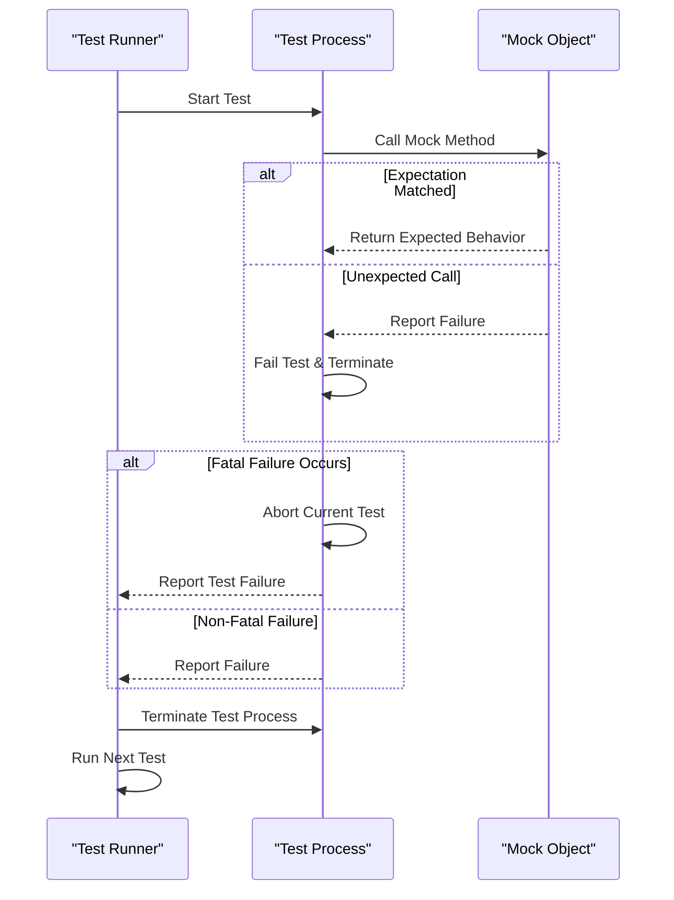

# Security Model & Test Isolation

Ensuring robustness and predictability in your test suite requires a clear understanding of the security guarantees and isolation mechanisms provided by GoogleTest. This guide explains how GoogleTest manages process control, sandboxing, and failure containment to prevent tests from interfering with each other or leaking state across boundaries.

---

## Why Security and Isolation Matter

In test-driven development, flaky or unpredictable tests erode confidence and slow down development. One core cause of flakiness is insufficient isolation between tests, causing state or resource leaks between test runs. GoogleTest enforces strong isolation guarantees to make tests reliable, maintainable, and secure.

Isolation helps ensure:

- Tests cannot inadvertently mutate global or shared state affecting others.
- Fatal test failures in one test do not crash the entire test harness.
- Parallel or repeated test runs behave predictably irrespective of order.

Understanding the underlying security and isolation features empowers you to write tests that respect these boundaries and leverage GoogleTest effectively.

---

## Process Control and Test Sandboxing

Each test case in GoogleTest is executed within a controlled environment to contain its effects and ensure proper cleanup.

### Forking to Isolate Tests

On platforms that support processes, GoogleTest runs tests in separate processes. This sandboxing approach guarantees:

- Any process-level side effects or crashes remain isolated to the test's process.
- File descriptors, memory leaks, and global state do not leak into other tests.
- When a test fails fatally, it terminates only its own process without stopping the overall test runner.

### Windows and Platform Considerations

While native fork semantics are not available everywhere, GoogleTest aims to replicate isolation benefits:

- On Windows, alternative mechanisms control the lifetime and state of tests.
- Thread-based isolation techniques along with in-process recovery mechanisms are used to reduce impacts from failures.

### Test Lifecycle Management

GoogleTest's framework manages the execution order and cleanup of test processes, ensuring:

- Tests run in their own distinct context.
- Tests clean up resources allocated during setup or execution.
- The test runner aggregates results reliably.

<Tip>
Whenever feasible, run tests in parallel or isolated processes to catch dependency issues and enforce state isolation.
</Tip>

---

## Fatal vs. Non-Fatal Failure Containment

Failures are central to testing, but different failure types have varying impacts on test isolation.

### Fatal Failures

- Arise when a test encounters a critical condition (e.g., a failed `ASSERT_*`).
- Immediately halt execution of the current test and mark it as failed.
- Thanks to process isolation, fatal failures do not terminate the entire test binary or affect sibling tests.

### Non-Fatal Failures

- Issued by conditions like `EXPECT_*` failing but allowing the test to continue.
- Report failures but do not abort the current test.
- Allow multiple assertions to be verified in a single run, improving test thoroughness.

### Containment Mechanisms

- GoogleTest confines fatal failure consequences to the test scope using process or internal control flow.
- When a fatal failure occurs, GoogleTest will terminate only the failing test's process or abort the test body, while the harness continues running remaining tests.

<Info>
Managing exceptions or fatal errors gracefully is essential for test robustness and runtime stability.
</Info>

---

## Avoiding Test Pollution and Shared State

Isolation extends beyond failure containment to prevent contamination across test boundaries.

### Best Practices

- Do not rely on or mutate global variables without resetting them.
- Use test fixtures to set up and tear down state explicitly.
- Avoid static or global singletons unless they can be reset between tests.

### GoogleTest Enforcement

- By running tests in separate processes, GoogleTest avoids leakage of heap, file, or socket state.
- The framework supports per-test setups and teardowns to maintain clean state.

---

## Parallel Test Execution & Isolation Guarantees

Modern test execution workflows often run tests in parallel. GoogleTest preserves isolation guarantees even in parallel contexts by:

- Isolating each test in a unique process space.
- Avoiding shared mutable state without explicit synchronization.
- Providing mechanisms to detect flaky or interfering tests via failures or resource conflicts.

---

## Handling Uninteresting, Unexpected, and Excessive Calls in Mocks

When using GoogleMock within tests, understanding the strictness on method calls affects test isolation and accuracy.

- **Uninteresting Calls:** Calls to mock methods without explicit expectations. By default, these trigger warnings but do not fail tests.
- **Unexpected Calls:** Calls not matching any expectation cause immediate test failures.
- **Excessive Calls:** Calls exceeding specified `Times()` counts result in errors.

Mock objects can be configured as **NiceMock**, **NaggyMock**, or **StrictMock** to tune how uninteresting calls are handled, directly affecting test noise and strictness.

For details on this configuration and behavior, see [Mock Object Behaviors: Nice, Naggy, Strict](../api-reference/core-mocking-apis/mock-object-behaviors).

---

## Troubleshooting Common Isolation Issues

Even with strong isolation, some pitfalls can cause tests to interfere:

- **Leaked Mocks:** Ensure mocks are properly destroyed to trigger verification.
- **Resource Starvation:** Avoid exhausting OS resources through parallel executions.
- **Static Initialization Order:** Beware static objects triggering across test boundaries.

Use GoogleTest’s verbose logging and failure diagnostics flags, such as `--gmock_verbose=info`, to gain insight.

---

## Summary

GoogleTest ensures security and strong isolation between tests through process sandboxing, strict failure containment, and mock call management. Understanding these principles lets you write reliable, maintainable tests that behave predictably across environments and test execution modes.

---

## Further Reading & References

- [GoogleMock Cookbook](docs/gmock_cook_book.md) — Practical recipes to master mocking techniques.
- [Mocking Reference](docs/reference/mocking.md) — Full API reference on mocks and expectations.
- [Mock Object Behaviors](api-reference/core-mocking-apis/mock-object-behaviors.mdx) — Controlling mock strictness and call handling.
- [gMock for Dummies](docs/gmock_for_dummies.md) — Friendly introduction to mocking and test isolation concepts.
- [Parallel Execution and Test Sharding](guides/integration-and-optimization/running-tests-faster.mdx) — Best practices for accelerating tests while preserving isolation.

---

## Diagram: Test Isolation and Failure Containment Flow

This diagram illustrates the isolation boundary at the test process level, where failures and unexpected calls are contained before impacting the overall test runner.

---

## Practical Tips

- Always define mock expectations *before* exercising the system under test to avoid undefined behavior.
- Use `NiceMock` to suppress warnings on uninteresting calls when test noise is a concern.
- Prefer `StrictMock` for thorough tests where any unexpected mock call should fail.
- Use test fixtures and `SetUp`/`TearDown` to maintain independent test states.
- Consider enabling process-based isolation on supported platforms to leverage native sandboxing benefits.

<Warning>
Never rely on in-memory shared resources or static globals persisting unmodified between tests.
</Warning>

---

This guide empowers you to write robust tests that make the most of GoogleTest's security model and test isolation capabilities.

<Check>
For an overview of GoogleMock’s mock object strictness modes, see [Mock Object Behaviors](../api-reference/core-mocking-apis/mock-object-behaviors).
</Check>

<Check>
Explore [gMock Cookbook](docs/gmock_cook_book.md) recipes on handling expectations and mock behaviors for deeper mastery.
</Check>