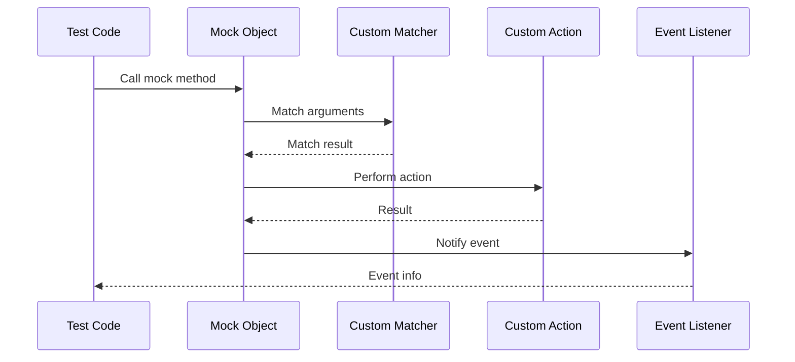

# Customization & Extensibility Patterns

GoogleTest is engineered not only as a powerful C++ testing framework but also as a platform designed for extensibility and customization. This guide helps you understand how to safely introduce your own custom matchers, actions, and test runners by leveraging the public extension points and recommended APIs. Learn how GoogleTest’s architecture facilitates robust extensions without compromising reliability or maintainability.

---

## Why Customize and Extend GoogleTest?

Extensibility allows you to tailor GoogleTest to better fit your project's domain and testing needs. Whether adding new matchers for complex types, crafting specialized actions to simulate behaviors, or integrating bespoke test runners, GoogleTest lets you expand its capabilities seamlessly.

Custom extensions empower you to:

- Write cleaner, more expressive tests reflecting your domain logic.
- Avoid repetition by encapsulating common testing patterns.
- Integrate GoogleTest with specialized build or test environments.

---

## Public Extension Points

GoogleTest exposes several well-defined APIs and interfaces to build on top of its core features. These extension points include:

- **Custom Matchers:** Define your own logic to verify arguments beyond built-in predicates.
- **Custom Actions:** Implement specialized behavior that mock methods can perform when invoked.
- **Test Runner Integration:** Customize how tests are discovered, executed, and reported.

Using these facilities properly ensures your extensions work reliably alongside GoogleTest’s existing functionalities.

---

## Creating Custom Matchers

A matcher in GoogleTest checks whether a given value meets a certain condition. While GoogleTest offers many built-in matchers, your tests often need domain-specific conditions.

### Writing a Basic Custom Matcher

Use the `MATCHER` and `MATCHER_P` macros for quick and expressive matcher definitions:

```cpp
#include <gmock/gmock.h>

MATCHER(IsEven, "Checks if the number is even") {
  return (arg % 2) == 0;
}

MATCHER_P(IsMultipleOf, n, "Checks multiples of n") {
  return (arg % n) == 0;
}

// Usage:
EXPECT_CALL(mock_obj, SomeMethod(IsEven()));
EXPECT_CALL(mock_obj, SomeMethod(IsMultipleOf(5)));
```

### Implementing a Matcher Class Manually

For advanced scenarios, define a class implementing the matcher interface, like so:

```cpp
#include <gmock/gmock-matchers.h>

class GreaterThanMatcher {
 public:
  explicit GreaterThanMatcher(int threshold) : threshold_(threshold) {}

  template <typename T>
  bool MatchAndExplain(T value, std::ostream* os) const {
    if (value > threshold_) {
      return true;
    }
    if (os) *os << "which is not greater than " << threshold_;
    return false;
  }

  void DescribeTo(std::ostream* os) const {
    *os << "is greater than " << threshold_;
  }

  void DescribeNegationTo(std::ostream* os) const {
    *os << "is not greater than " << threshold_;
  }

 private:
  int threshold_;
};

google::testing::Matcher<int> GreaterThan(int threshold) {
  return google::testing::MakeMatcher(new GreaterThanMatcher(threshold));
}
```

This style offers full control over match logic and description.

### Best Practices for Custom Matchers

- Ensure your matcher is *purely functional*: avoid side effects.
- Provide meaningful descriptions for success and negation cases.
- Use `MATCHER` macros for simple predicates, resort to classes when needed.
- Write tests for your custom matchers to verify correct behavior.

---

## Writing Custom Actions for Mocks

Actions define what a mock method does when invoked. Custom actions let you simulate behaviors beyond simple return values or side-effects.

### Defining Simple Action Lambdas

With C++11 or higher, you can use lambdas directly:

```cpp
using ::testing::Invoke;

EXPECT_CALL(mock_obj, Method(_))
    .WillOnce([](int x) {
      // Custom logic here
      return x * 2;
    });
```

### Creating Reusable Action Objects

Define structs or classes with `operator()` overloaded to implement complex actions:

```cpp
struct IncrementAction {
  int operator()(int& value) const {
    return ++value;
  }
};

EXPECT_CALL(mock_obj, Increment(_)).WillOnce(IncrementAction());
```

### Implementing `ActionInterface` for Monomorphic Actions

For finer control and compatibility, implement `::testing::ActionInterface<F>`:

```cpp
#include <gmock/gmock-actions.h>

class LogAction : public ::testing::ActionInterface<void(int)> {
 public:
  void Perform(const std::tuple<int>& args) override {
    int value = std::get<0>(args);
    std::cout << "Value: " << value << std::endl;
  }
};

auto Log() {
  return ::testing::MakeAction(new LogAction());
}

EXPECT_CALL(mock_obj, Method(_)).WillOnce(Log());
```

### Creating Polymorphic Actions

Use `MakePolymorphicAction()` to write flexible actions that adapt to multiple function signatures.

---

## Extending Test Runners and Listeners

GoogleTest allows customization of test execution and reporting via hooks and extensions.

### Writing Custom Test Event Listeners

Implement `::testing::TestEventListener` to customize reporting behaviors:

```cpp
class MyListener : public ::testing::EmptyTestEventListener {
 public:
  void OnTestStart(const ::testing::TestInfo& test_info) override {
    std::cout << "Starting test: " << test_info.name() << std::endl;
  }

  void OnTestPartResult(const ::testing::TestPartResult& result) override {
    if (result.type() == ::testing::TestPartResult::kFailure) {
      std::cout << "Test failure: " << result.summary() << std::endl;
    }
  }
};

int main(int argc, char** argv) {
  ::testing::InitGoogleTest(&argc, argv);
  ::testing::TestEventListeners& listeners = ::testing::UnitTest::GetInstance()->listeners();
  listeners.Append(new MyListener());
  return RUN_ALL_TESTS();
}
```

This offers full flexibility to log, filter, or transform test output.

### Registering and Deregistering Listeners

Manage listeners via `listeners().Append()`, `listeners().Release()`, or `listeners().SetDefaultResultPrinter()`.

### Customizing Test Execution

Extend or hook into other lifecycle points such as environments or test factories.

---

## Architecture Design for Extensibility

GoogleTest’s architecture allows:

- Isolation of subsystems so extensions can override or augment behaviors.
- Safe multi-threading by using fine-grained synchronization.
- Clear separation between mock object internals and user-facing APIs.

This design enables adding your own matchers, actions, or listeners without modifying GoogleTest’s core source.

---

## Practical Tips and Common Pitfalls

- **Don’t modify internal namespaces directly; use public APIs.**
- When writing custom matchers or actions, always keep side effects out and provide meaningful messages.
- For complex actions, test independently to prevent unexpected failures.
- Use `NiceMock` or `StrictMock` wrappers thoughtfully to control mock verbosity.
- When implementing listeners, beware of thread-safety and performance impact.

---

## Resources and Further Reading

- [gMock Cookbook](https://google.github.io/googletest/gmock_cook_book.html) — detailed recipes on matchers, actions, sequences, and mocks.
- [Matchers Reference](https://google.github.io/googletest/reference/matchers.html) — standard and advanced matcher types.
- [Actions Reference](https://google.github.io/googletest/reference/actions.html) — built-in actions and action composition.
- [Test Event Listeners API](https://github.com/google/googletest/blob/main/include/gtest/gtest_prod.h) — guide to customizing test run behavior.

---

## Summary

Extending GoogleTest through custom matchers, actions, and test runners makes your testing both powerful and expressive. Mastering these extensibility patterns accelerates test development and enhances maintainability.

Consider the extension mechanisms as tools to craft expressive specifications that reflect your software’s domain — enabling more precise and meaningful tests that remain robust against implementation changes.

---

## Example: Combining Custom Matcher and Action

```cpp
MATCHER_P(IsCloseTo, target, "Checks value is close to target") {
  return fabs(arg - target) < 0.01;
}

struct MultiplyAction {
  double factor;
  double operator()(double x) const { return x * factor; }
};

EXPECT_CALL(mock, Compute(_))
    .WillOnce([](double x) { return x + 1; })
    .WillRepeatedly(MultiplyAction{2.0});

EXPECT_CALL(mock, Evaluate(IsCloseTo(3.14)))
    .WillOnce(Return(true));
```

This test sets precise argument expectations and custom return behaviors, illustrating extensibility in practice.

---

## Visual Overview of Extension Flow

