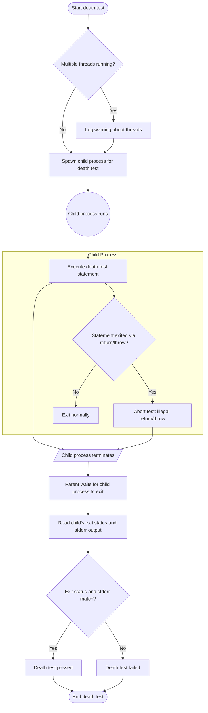

# Death Testing Model

GoogleTest’s death testing model empowers developers to verify that certain code paths lead to process termination as expected. Such tests, known as death tests, are essential for validating error handling, assertion checks, and fatal conditions that are designed to abort program execution.

This guide unpacks the core principles behind death testing in GoogleTest, detailing how the framework securely isolates test code prone to termination, monitors outcomes, and provides users with reliable feedback. Understanding this model helps you write robust tests that catch undesirable or expected program exits effectively.

---

## Introduction to Death Tests

Death tests confirm that the code under test terminates the process intentionally and correctly in error scenarios or on fatal assertions. They are critical in validating that your program fails safely and predictably.

Unlike regular exceptions, death tests validate termination through process exit codes or signals, along with expected diagnostic output via `stderr`.

Death testing macros such as `ASSERT_DEATH()`, `EXPECT_DEATH()`, `ASSERT_EXIT()`, and `EXPECT_EXIT()` facilitate these verifications by running test statements in a separate process and examining their termination.

## How Death Tests Work

Death tests execute your test statement in a child process separate from the main test runner. This means that if the tested statement terminates the process, it does not crash or abort the entire test suite.

The framework follows this overall flow:

1. **Isolation**: A child process is spawned specifically to run the tested statement.
2. **Execution**: The statement is executed within this child process.
3. **Monitoring**: The test runner waits for the child process to terminate.
4. **Validation**: The child's termination status and diagnostic output to `stderr` are checked against the expected exit codes or failure messages.

If the child process does not die, exits normally, or produces unexpected output, the death test fails.

GoogleTest employs internal classes (such as `DeathTest` and its derivatives) to manage this lifecycle with platform-specific implementations using methods like `fork()`, `clone()`, or `CreateProcess()`.

## Death Test Styles

GoogleTest supports two main styles of death tests to balance thread safety and performance:

### Fast Style (default)

- The child process is spawned using `fork()` and immediately runs the death test statement.
- Faster execution but **unsafe if multiple threads** exist in the parent process when the test starts.

### Threadsafe Style

- The child process re-executes the entire test binary but runs only the targeted death test.
- More overhead due to process re-execution, but safe in multi-threaded environments.

You can select the style globally or per test using the `death_test_style` flag:

```cpp
GTEST_FLAG_SET(death_test_style, "threadsafe");
```


## Writing Effective Death Tests

GoogleTest provides macros for death testing:

- `ASSERT_DEATH(statement, matcher)`: Fails fatally if `statement` does not die or produce expected `stderr` output matching `matcher`.
- `EXPECT_DEATH(statement, matcher)`: Non-fatal variant, continues test execution on failure.
- `ASSERT_EXIT(statement, predicate, matcher)`: Expects `statement` to terminate with exit status matching `predicate`.
- `EXPECT_EXIT(statement, predicate, matcher)`: Non-fatal variant of `ASSERT_EXIT`.

### Examples

```cpp
// Confirm that Foo(5) causes termination with error message containing "Invalid input".
ASSERT_DEATH(Foo(5), "Invalid input");

// Verify NormalExit() returns exit code zero and prints "Success".
EXPECT_EXIT(NormalExit(), testing::ExitedWithCode(0), "Success");

// Confirm KillProcess() terminates due to SIGKILL.
EXPECT_EXIT(KillProcess(), testing::KilledBySignal(SIGKILL), "unblockable signal");
```

### Matcher Parameter for `stderr`

The macros accept different types for the `matcher` parameter:

- A string literal or `std::string` is treated as a regular expression matcher matching expected `stderr` output.
- A GoogleMock matcher for `const std::string&` can be used directly for flexible matching.

### Safety and Correctness

- Death test statements **must not return or throw**; doing so results in test failure.
- Avoid using assertions like `ASSERT_*` inside the death test statement that cause returns, as they abort only the current function, not the entire test process.
- Use compound statements `{ ... }` when verifying multiple operations within a death test.

## Death Tests and Multithreading

Because creating child processes with `fork()` in multithreaded programs is problematic due to duplicated threads and potential deadlocks, GoogleTest warns you if multiple threads exist at death test start.

The "threadsafe" death test style alleviates this by re-executing the binary in the child process to run only the single death test, providing safer isolation in multithreaded contexts.

### Best Practices

- Name your test suite with the suffix "DeathTest" to prioritize execution order and help detect threading issues early.
- Write death tests simple enough to run safely in single-threaded mode or opt for the "threadsafe" style for complex environments.

## Common Pitfalls and Limitations

- **Side effects in death tests are confined to child process**: Changes to memory or global state in the death test do not propagate back to the parent process.

- **Mock objects may leak** when used within death tests expecting specific exit codes — use `Mock::AllowLeak` to avoid false positives.

- You **cannot place multiple death tests on the same line**, as it results in compilation errors.

- On some platforms, the regex support for matching `stderr` output is limited to a subset of POSIX extended regular expressions. Complex patterns may fail unexpectedly.

## Testing Throws Within Death Tests

Death tests consider exceptions escaping the death test statement to be failures. GoogleTest catches C++ exceptions thrown inside death tests and reports them as test failures without propagating them.

## Tools and Flags

- The flag `--gtest_death_test_style` controls global death test style.
- The internal flag `--gtest_internal_run_death_test` is used by the framework to re-execute death tests in "threadsafe" mode.
- Flags exist to influence fork/clone behavior (`death_test_use_fork`) and debug message printing.

## Summary of Key Concepts

| Aspect              | Description                                           |
|---------------------|-------------------------------------------------------|
| Death Tests         | Verify process termination with expected exit status and stderr output |
| Execution Style     | "fast" (fork & immediate run) or "threadsafe" (re-exec binary) |
| Isolation           | Child process runs death test separately to avoid killing parent |
| Outcome Checking    | Verifies process exit status and matches stderr output via regex or matchers |
| Multithreading Risks | Forking multi-threaded parents can cause deadlocks; "threadsafe" style mitigates |
| Exception Handling  | Exceptions thrown in death tests cause failure reports but do not propagate |

## Troubleshooting

- If death tests hang or run unpredictably, consider switching to "threadsafe" style to avoid thread-related issues.
- Avoid creating threads before death test execution.
- Confirm regex passed to death tests is supported and correctly matches `stderr` output.
- Make sure test statements do not contain return statements or throw exceptions.

## Related Documentation

- [Death Assertions Reference](reference/assertions.md#death): Macros for death testing.
- [Advanced Guide - Death Tests](docs/advanced.md#death-tests): Best practices and details.
- [Death Test API Reference](api-reference/advanced-testing/death-tests.mdx): Deep dive into death test APIs.

---

## Internal Overview (For Contextual Understanding)

GoogleTest internally uses the `DeathTest` abstract class and multiple platform-specific implementations (e.g., `WindowsDeathTest`, `ExecDeathTest`, `NoExecDeathTest`, `FuchsiaDeathTest`) to manage child process creation and result capture.

Each death test:

- Spawns a child process according to the configured style.
- Captures `stderr` from the child process.
- Reads status codes to determine if the child exited as expected.
- Checks that `stderr` output matches the provided matcher or regex.

If any of these validations fail, the death test framework reports detailed failure messages pointing out whether the statement failed to die, returned illegally, threw, or exited with an unexpected code or output.


---

# Practical Tips & Best Practices

- **Name Suites with `DeathTest`**: Add the suffix `DeathTest` to suites containing death tests for predictable run ordering and thread warnings.
- **Use Compound Statements for Complex Logic**: Wrap multi-statement death tests in braces `{ ... }`.
- **Leverage Matchers and Regex Effectively**: Craft precise `stderr` matchers to validate error output without over-generalizing.
- **Avoid Side-Effects Expectation**: Remember that changes made during death tests are local to the child.
- **Handle Mocks with Care**: Use `Mock::AllowLeak` if mocks are involved in death tests to prevent false leak reports.
- **Switch to "threadsafe" Style** if encountering flaky tests in multithreaded programs.

---

# Summary

Death testing in GoogleTest is a disciplined approach to verifying the robustness and correctness of code paths that must terminate the process under specified failure conditions. The framework ensures test isolation, cross-platform support, and clear diagnostics, enabling reliable verification of fatal error handling in C++ programs.

By using `ASSERT_DEATH`, `EXPECT_DEATH`, `ASSERT_EXIT`, and `EXPECT_EXIT` macros paired with appropriate matchers and predicates, you can confidently test that your code fails as expected, delivering critical protections against unhandled errors in your software.


---

## Learn More

- [Assertions Reference - Death Assertions](../reference/assertions.md#death)
- [Advanced Guide - Death Tests](../docs/advanced.md#death-tests)
- [API Reference - Death Tests and Exception Handling](../api-reference/advanced-testing/death-tests.mdx)
- [FAQ on Death Tests](../docs/faq.md#My-death-test-modifies-some-state-but-the-change-seems-lost-after-the-death-test-finishes-Why)

---

## Diagram: Death Test Execution Flow



---
