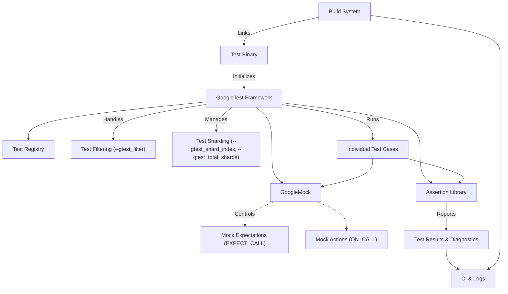

# Integration and Performance Considerations in GoogleTest

Understanding the integration strategies and performance characteristics of GoogleTest is essential to effectively scale your C++ test suites and efficiently embed testing into your build and development workflows. This guide dives into the key aspects of integrating GoogleTest with build systems, managing parallel and selective test execution, and optimizing test performance.

---

## 1. Integration with Build Systems

GoogleTest is designed to seamlessly integrate with popular C++ build environments such as CMake, Bazel, and custom build systems. Proper integration ensures that your tests compile correctly, link against appropriate libraries, and run smoothly within your development or continuous integration pipelines.

### 1.1 Supported Platforms and Toolchains
- **Platforms:** Linux, Windows, Mac OS
- **Compilers:** GCC, Clang, MSVC (with C++17 support)
- **Build Tools:** CMake, Make, Bazel, and custom platforms

### 1.2 Linking GoogleTest and GoogleMock
- Link your test binaries against the provided GoogleTest libraries.
- For tests requiring mocks, link against GoogleMock, which includes GoogleTest.
- Use the libraries' `main()` functions or provide your own entry points if customization is needed.

### 1.3 Integration Tips
- Prefer the [official Bazel integration](https://github.com/google/googletest/blob/main/googletest/Bazel.md) or CMake targets.
- When manually integrating, add the required source files and include directories carefully to avoid symbol conflicts.
- Use test-only libraries or targets to avoid bloating production binaries.

### 1.4 Continuous Integration Usage
- GoogleTest produces rich XML output compatible with most CI systems.
- Use filtering and test sharding (see section 3) to speed up CI test runs.

<Info>
For step-by-step instructions on integrating with build systems, see the [Integrating with Build Systems Guide](https://github.com/google/googletest/tree/main/docs/guides/real-world-integrations/integrating-with-build-systems.md).
</Info>

## 2. Support for Parallel and Selective Test Execution

GoogleTest is designed to handle large suites with hundreds or thousands of tests. Managing test execution efficiently is critical to timely feedback.

### 2.1 Test Filtering
- Use the `--gtest_filter` flag to run only subsets of tests matching specific patterns.
- Supports positive and negative patterns for fine control.

```bash
./my_tests --gtest_filter=MyTestSuite.*
```

### 2.2 Test Sharding
- Tests can be shard-distributed across multiple machines or processes.
- Use `--gtest_shard_index` and `--gtest_total_shards` flags.
- Enables scaling your test execution horizontally.

### 2.3 Parallel Test Execution with Test Fixtures
- Tests themselves execute sequentially but you can run multiple test binaries or shards in parallel.
- GoogleTest does not internally parallelize tests but supports parallelism through test organization.

<Note>
Parallel execution often requires thread-safe or isolated tests to avoid flaky results.
</Note>

## 3. Performance Optimization Concepts

Optimizing test runtime and responsiveness is essential for developer productivity and continuous integration.

### 3.1 Fast Startup
- GoogleTest avoids heavy runtime initialization to minimize test binary startup time.

### 3.2 Efficient Test Discovery
- Automatic registration of tests via static initializers minimizes overhead.
- Tests are indexed for quick discovery before run.

### 3.3 Test Execution Efficiency
- Tests run with minimal overhead, assertions are lightweight when passing.
- Disable verbose logging (`--gtest_verbose=error`) to reduce output overhead.

### 3.4 Mock Performance
- GoogleMock offers efficient mocking with low runtime cost.
- Use strategies detailed in the [gMock Cookbook](docs/gmock_cook_book.md) to optimize mocks, such as avoiding overly strict expectations.

### 3.5 Managing Dependencies
- Minimize expensive resource setup and teardown within tests.
- Use test fixtures wisely to share setup among related tests.

### 3.6 Caching and Reuse
- GoogleTest currently does not provide internal caching but allows user-driven optimization.

<Tip>
To profile tests and discover bottlenecks, use external profiling tools like Valgrind or perf alongside GoogleTest.
</Tip>

## 4. Controlling Output and Diagnostic Verbosity

- Configure logging verbosity with `--gtest_verbose=LEVEL` where LEVEL can be `info`, `warning`, or `error`.
- Control the diagnostic detail shown in case of failures for faster debugging.

## 5. Troubleshooting Common Integration Issues

- Linker errors often arise from missing dependencies; verify that both GoogleTest and GoogleMock libraries are linked if using mocks.
- Multiple definitions can occur if GoogleTest/main.cc is included more than once.
- On Windows, ensure DLLs and symbols are properly linked and exported.

<Warning>
GoogleMock automatically verifies expectations on destruction; leaking mock objects can cause silent test gaps. Use `Mock::AllowLeak()` sparingly.
</Warning>

## 6. Summary Diagram of Integration and Performance Flow


```

---

## Practical Tips and Best Practices

- Always integrate GoogleTest as a test-only dependency distinct from production code.
- Use test filtering to maintain fast feedback loops.
- For large test suites, employ sharding to parallelize tests across multiple agents.
- Prefer `ON_CALL` for default mock behavior and `EXPECT_CALL` only for verifiable interactions.
- Suppress unnecessary warnings using `NiceMock` when appropriate to reduce noise.
- Profile and tune test suites periodically as complexity grows.

---

## Related Documentation

- [Integrating with Build Systems Guide](https://github.com/google/googletest/tree/main/docs/guides/real-world-integrations/integrating-with-build-systems.md)
- [Performance Optimization Guide](https://github.com/google/googletest/tree/main/docs/guides/real-world-integrations/performance-optimization.md)
- [Mocking Reference](https://github.com/google/googletest/tree/main/docs/reference/mocking.md)
- [gMock Cookbook](https://github.com/google/googletest/tree/main/docs/gmock_cook_book.md)
- [Core Concepts & Terminology](https://github.com/google/googletest/tree/main/docs/overview/product-intro-core-concepts/core-concepts-terminology.md)

---

By leveraging GoogleTest’s integration capabilities and performance features, you can build scalable, efficient C++ test suites that fit smoothly into your development and continuous integration workflows, delivering fast, reliable feedback that accelerates development velocity and code quality.
