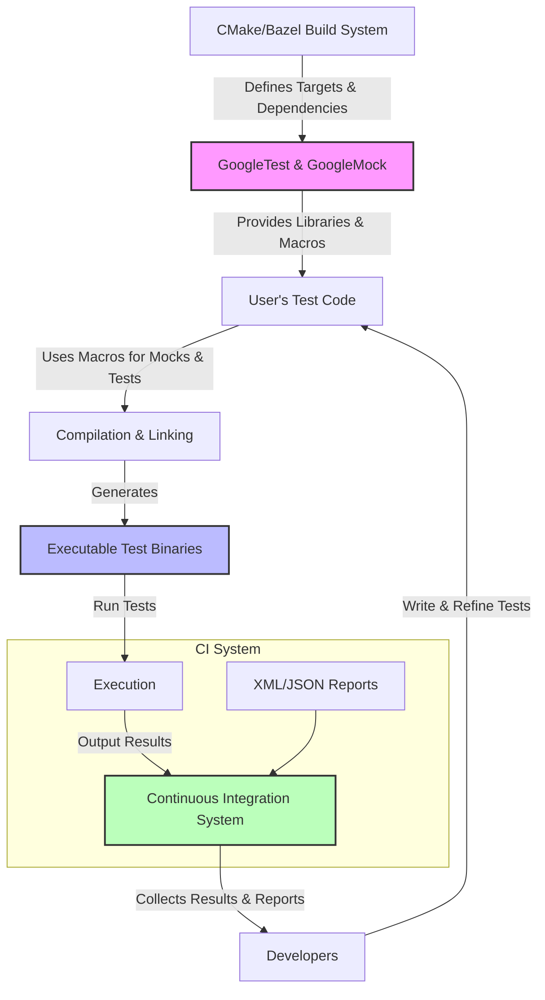

# Integration Patterns

## Overview

Effective integration of GoogleTest and GoogleMock into your build and continuous integration (CI) workflows ensures reliable, maintainable, and scalable testing environments. This guide explores proven patterns for incorporating GoogleTest/GoogleMock into diverse build systems such as CMake and Bazel, managing dependencies, enabling automatic test discovery, and configuring CI reporting.

By following these patterns, you gain seamless workflow integration, cross-platform compatibility, and efficient management of tests and mocks in your development pipeline.

---

## Build System Integration

### CMake Integration

For C++ projects using CMake, integration with GoogleTest and GoogleMock requires configuring your `CMakeLists.txt` appropriately to locate and link the testing libraries.

**Key steps:**

1. **Find or add GoogleTest/**GoogleMock:** 

   Use either the pre-installed packages or add GoogleTest as a subdirectory:

   ```cmake
   # If installed system-wide
   find_package(GTest REQUIRED)

   # Or add googletest source as subdirectory
   add_subdirectory(external/googletest)
   ```

2. **Link your test targets against GoogleTest and GoogleMock:**

   ```cmake
   add_executable(my_test test_main.cc ...)
   target_link_libraries(my_test GTest::gtest GTest::gmock GTest::gtest_main GTest::gmock_main)
   ```

3. **Enable test discovery:**

   Add GoogleTest macros for automatic test discovery and registration:

   ```cmake
   include(GoogleTest)
   gtest_discover_tests(my_test)
   ```

4. **Compile flags and dependencies:**

   Ensure C++17 or newer is enabled (as GoogleTest depends on modern C++ features), and thread dependencies are linked.

##### Practical tips:

- Use `FetchContent` or `add_subdirectory()` for reproducible builds.
- Separate GoogleMock and GoogleTest targets as needed.
- Use imported targets `GTest::gmock` and `GTest::gtest` for clarity.


### Bazel Integration

For Bazel users, GoogleTest and GoogleMock come packaged and ready to use via `@com_google_googletest`:

**Key steps:**

1. **Add googletest as a dependency:**

   In your `WORKSPACE` file:

   ```bazel
   http_archive(
       name = "com_google_googletest",
       url = "https://github.com/google/googletest/archive/release-1.12.1.tar.gz",
       strip_prefix = "googletest-release-1.12.1",
       sha256 = "<sha256sum>",
   )
   ```

2. **Declare test dependencies:**

   In your `BUILD` files:

   ```bazel
   cc_test(
       name = "my_test",
       srcs = ["my_test.cc"],
       deps = ["@com_google_googletest//googletest", "@com_google_googletest//googlemock"],
   )
   ```

3. **Test execution:**

   Bazel automatically discovers and runs `cc_test` targets.

##### Practical tips:

- Use `testonly = True` for mock libraries to avoid polluting production targets.
- Use Bazel query and test filtering for large code base management.

---

## Dependency Management

GoogleMock depends on GoogleTest and requires linking with threading and some platform-specific libraries.

- Use package managers or submodules/subtrees to manage GoogleTest and GoogleMock versioning consistently.
- Always keep GoogleMock and GoogleTest versions in sync to avoid compatibility issues.
- In CMake, prefer the imported targets `GTest::gmock` and `GTest::gtest` for automatic dependency management.
- For Bazel, use the official `com_google_googletest` external repository.

---

## Automatic Test Discovery

GoogleTest offers automatic test registration using macros like `TEST()`, `TEST_F()`, and `TEST_P()`. Combine this with build system support to simplify running tests.

- In CMake, `gtest_discover_tests()` gathers all tests from your executable and registers them to the CTest framework.
- In Bazel, all `cc_test` targets are discoverable and runnable via Bazel test commands.

Automated discovery allows CI systems to dynamically find and report test results without manual updates.

---

## Continuous Integration Best Practices

### XML Test Output

Configure your test binaries to produce XML reports compatible with most CI servers:

- Use `--gtest_output=xml[:path]` to generate detailed test reports.

Example run command:

```bash
test_binary --gtest_output=xml:test_results.xml
```

### Parallel Test Execution

Leverage test sharding and parallelism:

- GoogleTest supports `--gtest_filter` and `--gtest_repeat` to slice tests.
- Bazel and CTest have built-in parallel test runners.

### Test Result Aggregation

Integrate XML reports into CI dashboards:

- Jenkins, GitHub Actions, GitLab CI, and others natively understand GoogleTest XML outputs.

### Environment Isolation

- Use isolated build and test environments.
- Containerize or sandbox your tests to ensure reproducibility.

---

## Troubleshooting Integration

### Common Issues

- **Linker errors:** Missing pthreads or incorrect linking order.
- **Test discovery failures:** Tests not linked or missing registration macros.
- **Version mismatches:** GoogleMock and GoogleTest library versions must be compatible.

### Debugging Tips

- Increase gMock verbosity with `--gmock_verbose=info` to see detailed call information.
- Use CTest and Bazel verbose flags to get detailed build/test logs.
- Validate your mock and test namespaces and include paths.

---

## Summary

Integrating GoogleTest and GoogleMock into your build systems and CI pipelines is straightforward when following established patterns. Utilizing CMake or Bazel correctly manages dependencies and enables automatic test discovery, while CI configurations leveraging XML outputs and parallel executions optimize test feedback loops.

Adhering to these practices makes your tests reliable, maintainable, and scalable across diverse environments.

---

## Additional Resources

- [GoogleTest Installation and Integration](https://github.com/google/googletest/blob/main/docs/getting-started/setup-prerequisites-installation/installation-integration.md)
- [GoogleTest Primer](https://github.com/google/googletest/blob/main/docs/primer.md)
- [gMock Cookbook](https://github.com/google/googletest/blob/main/docs/gmock_cook_book.md)
- [GoogleMock Cheat Sheet](https://github.com/google/googletest/blob/main/docs/gmock_cheat_sheet.md)
- [GoogleMock FAQ](https://github.com/google/googletest/blob/main/docs/gmock_faq.md)
- [GoogleTest Integration Points Overview](https://github.com/google/googletest/blob/main/docs/overview/inside-googletest/integration-points.md)

---

## Mermaid Diagram: Integration Workflow


---

## Practical Tips and Best Practices

- **Synchronize library versions:** Use the same GoogleTest and GoogleMock versions to avoid runtime conflicts.
- **Minimize dependencies in tests:** Mock objects help isolate tests from complex dependencies, improving test speed.
- **Use `ON_CALL` for defaults and `EXPECT_CALL` for verifications:** Avoid over-specifying mock behavior.
- **Leverage build system tooling:** Use CMake's `gtest_discover_tests()` or Bazel's `cc_test` to automate test management.
- **Control verbosity for debugging:** Use gMock `--gmock_verbose` levels strategically during development.
- **Avoid mocking classes you don't own:** Define mocks within the owners’ scope or via adapters.
- **Use `NiceMock` and `StrictMock` selectivity:** Control test noise and failure sensitivity.

---

This completes the guide on integrating GoogleTest and GoogleMock into your build and CI systems, ensuring robust and efficient testing in your C++ projects.
