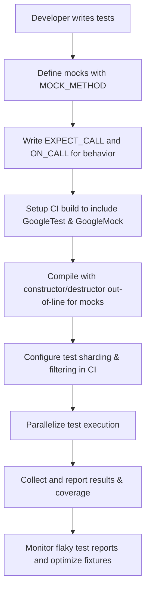

# Integration Patterns and Scalability

This guide reviews recommended approaches for integrating GoogleTest into various build and continuous integration (CI) systems. It emphasizes maximizing performance when running large test suites and effectively scaling testing efforts across teams and codebases. Key topics include common pitfalls, best practices, and strategies to build robust and maintainable test infrastructure.

---

## 1. Integrating GoogleTest with Build Systems

### Supporting Diverse Build Environments

GoogleTest integrates smoothly with widespread build systems including CMake and Bazel. Each offers distinct mechanisms to embed testing into the build lifecycle:

- **CMake**: GoogleTest provides CMake configuration files (`gtest.pc.in` and `gmock.pc.in`) that enable discovery and linkage of libraries through `pkg-config`. To optimize build times, it is recommended to separate mock class constructor and destructor definitions from the class declarations, implementing them in `.cc` files so compilation overhead is minimized especially for large projects.

- **Bazel**: Has native support facilitating test rule declarations and dependency management for GoogleTest and GoogleMock. Bazel's sandboxed builds and caching boost performance but require correct BUILD rule specifications.

### Key Integration Tips

- Declare mock class constructors and destructors out-of-line to speed up compilation:

  ```cpp
  // Header:
  class MockFoo : public Foo {
   public:
    MockFoo();
    ~MockFoo() override;
    MOCK_METHOD(int, DoThis, (), (override));
    //...
  };

  // Source:
  MockFoo::MockFoo() {}
  MockFoo::~MockFoo() {}
  ```

- Use `pkg-config` to obtain proper compiler and linker flags when integrating via command line or external systems.
- Configure your build scripts to link with either `gmock` or `gmock_main` depending on whether you provide your own `main()`.


## 2. Maximizing Test Performance for Large Suites

### Strategies for Speed and Reliability

Testing large codebases with extensive test coverage requires attention to efficiency and maintainability:

- **Selective Test Runs**: Leverage GoogleTest’s filtering options (`--gtest_filter`) to focus CI runs on relevant test subsets.
- **Parallel Execution and Sharding**: GoogleTest supports environment variables (e.g., `GTEST_TOTAL_SHARDS`, `GTEST_SHARD_INDEX`) to shard tests across multiple machines or processes, reducing wall clock time.
- **Test Fixture Optimization**: Use lightweight fixtures and prefer constructor over `SetUp()` methods for expensive setup to reduce redundant overhead.
- **NiceMocks for Uninteresting Calls**: Using `NiceMock<T>` suppresses warnings for calls that are not explicitly expected, reducing test noise and execution slowdowns.

### Avoiding Common Performance Pitfalls

- Excessive logging within tests can slow execution and obfuscate important messages.
- Defining overly strict expectations or sequences in mocks can introduce brittleness and increase test maintenance.
- Using `EXPECT_CALL` sparingly, favor `ON_CALL` for defining default mock behaviors, to reduce constraint overhead.


## 3. Scaling Testing Infrastructure Across Teams

### Managing Large, Distributed Test Environments

- **Domain-Specific Interface Abstraction**: Encourage teams to design code with interfaces instead of concrete classes. This enables mocking and test isolation without tight coupling.

- **Centralized Mock Definitions**: For commonly mocked interfaces, place mock class definitions in shared libraries or packages to avoid duplication and ensure consistency.

- **Test Execution Ordering and Sequencing**: With GoogleMock’s `Sequence` and `InSequence` utilities, teams can specify partial or total orders in test expectations to reliably verify interaction sequences in concurrent or complex workflows.

- **Instrumenting Test Events**: Extend GoogleTest with custom `TestEventListener`s to monitor test execution phases, collect metrics, or trigger additional workflows.

### Best Practices for Test Maintainability

- Avoid brittle mocks: Use `NiceMock` by default, and `StrictMock` only when needed to ensure errors are caught early.
- Regularly refactor and review tests to keep expectations aligned with implementation contracts.
- Write parameterized and typed tests to reduce duplication and ensure broad coverage with less code.
- Use custom matchers and actions to encapsulate complex validation or behavior, improving test readability.


## 4. Common Pitfalls and Troubleshooting

### Expectations and Mock Behavior

- Always set `EXPECT_CALL` expectations before exercising the mock; late expectations lead to undefined behavior.
- Use `RetiresOnSaturation()` when chaining multiple expectations to avoid "sticky" expectations that block others.
- When mocking non-virtual methods, structure your code with templates or interfaces to simulate polymorphism.

### Death Tests and Thread Safety

- Death tests run in subprocesses to isolate crashes and should be designed carefully to avoid shared state pollution.
- Configure death test style (`fast` vs `threadsafe`) according to environment and performance trade-offs.

### Compilation and Linking

- Ensure that all GoogleTest and GoogleMock libraries link versions match to avoid runtime failures.
- Use the provided CMake targets or pkg-config files to correctly incorporate test dependencies.


## 5. Summary Workflow Example

A typical GoogleTest integration and scaling flow in a CI system looks like this:




## 6. Additional Resources

- [GoogleTest System Architecture Overview](https://google.github.io/googletest/overview/foundations-and-architecture/architecture-overview)
- [GoogleMock Cookbook](https://google.github.io/googletest/gmock_cook_book.html) for deep dives into mock patterns
- [Best Practices for Mock Usage](https://google.github.io/googletest/guides/core-scenarios/working-with-mocks)
- [Performance Optimization Guide](https://google.github.io/googletest/guides/advanced-best-practices/performance-optimization)
- [GoogleTest FAQ](https://google.github.io/googletest/faq.html) for common issues

---

<Tip>
Maximize test suite scalability by leveraging GoogleTest's built-in filtering, sharding mechanisms, and by carefully structuring mocks and fixtures. Aim to keep tests robust yet flexible to reduce maintenance overhead.
</Tip>

<Warning>
Never set mock expectations after the mock is exercised; doing so leads to undefined behavior and often silent test failures.
</Warning>

<Info>
Consider using `NiceMock` to suppress warnings on uninteresting calls, improving test output clarity in large test suites.
</Info>

<Note>
Extract out complex mock setup routines into shared test fixtures or utility functions to promote reuse across teams.
</Note>

---

### Appendix: Understanding gMock Integration into Build and CI

- GoogleMock libraries come in two main flavors:
  - `gmock`: basic mocking support
  - `gmock_main`: includes a main() function to run tests

- Use `MOCK_METHOD` macro in mock classes to define mocked methods with proper qualifiers like `override`, `const`, `noexcept`.
- Optimize compilation by moving mock constructors/destructors out-of-line.
- Use `EXPECT_CALL` to set expectations on mocks before use, with cardinalities and actions.
- Use test environment variables to shard test runs and parallelize effectively.

---