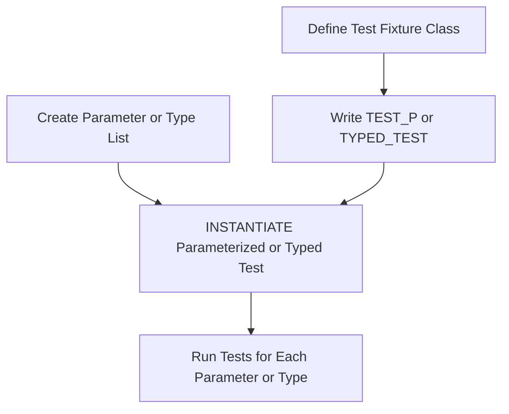

# Parameterized and Typed Testing

GoogleTest empowers you with **parameterized testing** and **type-parameterized testing** mechanisms, enabling you to write a single test logic and run it against a broad range of input values or data types. This approach dramatically increases test coverage while adhering to the DRY (Don't Repeat Yourself) principle.

---

## Why Use Parameterized and Typed Tests?
Imagine you want to verify a function behaves correctly across multiple input values, or you want to ensure your template class works uniformly for various types. Writing separate tests for each case leads to code duplication and maintenance challenges. GoogleTest solves this elegantly with parameterized and typed tests.

Parameterized and typed testing allows you to:

- Run the same test with different values or types without redundant code.
- Generate comprehensive test instances to cover corner cases.
- Clearly identify each test instance with distinct, meaningful names.

---

## Value-Parameterized Tests

### Overview
Value-parameterized tests let you supply a sequence of input values to your tests. Each value in the sequence generates a distinct test instance.

### How It Works: User Workflow

1. **Define a test fixture class**, deriving from `testing::TestWithParam<T>`, where `T` is the parameter type.
2. **Write tests using the `TEST_P` macro**, which gives access to the parameter via `GetParam()`.
3. **Instantiate the test suite using `INSTANTIATE_TEST_SUITE_P`** and a parameter generator, which produces the values to test.

This flow ensures your test logic is written once yet tested against all specified values.

### Example
```cpp
#include <gtest/gtest.h>

class FooTest : public testing::TestWithParam<int> {};

TEST_P(FooTest, CanDouble) {
  int param = GetParam();
  EXPECT_EQ(param * 2, param + param);
}

INSTANTIATE_TEST_SUITE_P(
    MyIntegerTests, FooTest, testing::Values(1, 2, 3));
```

This example runs the same test with parameters 1, 2, and 3.

### Parameter Generators
GoogleTest provides several built-in parameter generators:

| Generator         | Description                                                |
|-------------------|------------------------------------------------------------|
| `Range(begin, end[, step])`  | Generates values from `begin` up to (but not including) `end`, incremented by `step` (default 1). |
| `Values(v1, v2, ..., vN)`    | Generates exactly the listed values.                        |
| `ValuesIn(container)`         | Generates values from the elements of a container or array.|
| `Bool()`                     | Generates `false` and `true` for easy boolean testing.     |
| `Combine(g1, g2, ..., gN)`   | Generates the Cartesian product (all combinations) of values generated by each generator `g1` through `gN`. |

You may combine these to generate complex parameter sets for comprehensive testing.

### Test Name Customization
By default, GoogleTest appends numeric suffixes to instantiate tests. For greater clarity, you can supply a **custom name generator** function or lambda to `INSTANTIATE_TEST_SUITE_P`: it receives metadata about the parameter and returns a descriptive string for the test instance.

### Key Notes
- **Test fixtures with `SetUpTestSuite()` or `TearDownTestSuite()` must have those methods declared `public`** when used with `TEST_P`.
- Instantiations with no parameters produce a skipped synthetic test.
- Omitting instantiation causes failures in a special `GoogleTestVerification` suite unless suppressed via `GTEST_ALLOW_UNINSTANTIATED_PARAMETERIZED_TEST`.

---

## Typed Tests

### Overview
Typed tests repeat the same test logic over a list of **types known at compile-time**. You write a fixture template parameterized on a type and provide a list of types for testing.

This is especially useful to validate template classes or algorithms against different type instantiations.

### User Workflow

1. **Define a class template test fixture** deriving from `testing::Test`.
2. **Associate a list of types** using the `TYPED_TEST_SUITE` macro.
3. **Write tests using `TYPED_TEST` macros**, accessing the current type with `TypeParam`.

This approach generates a dedicated test suite for each type in the list.

### Example
```cpp
#include <gtest/gtest.h>

template <typename T>
class MyTypedTest : public testing::Test {
 public:
  T value_ = 0;
};

using MyTypes = testing::Types<int, double, char>;
TYPED_TEST_SUITE(MyTypedTest, MyTypes);

TYPED_TEST(MyTypedTest, ValueStartsAtZero) {
  TypeParam value = this->value_;
  EXPECT_EQ(value, 0);
}
```

This will run tests for `int`, `double`, and `char`.

### Custom Test Names
You can specify a **name generator class** with a static template method `GetName(int)` to customize type suffixes in test names. This makes output more readable and searchable.

---

## Type-Parameterized Tests

### Overview
Type-parameterized tests refine typed tests by allowing test patterns to be defined **independently of their type list**. You define the pattern once and instantiate it with arbitrary type lists multiple times, possibly across translation units or modules.

This makes it ideal for interfaces or concepts where you want to ensure any implementation conforms to the same test suite.

### User Workflow

1. **Define a class template fixture**.
2. **Declare the test suite with `TYPED_TEST_SUITE_P` macro**.
3. **Use `TYPED_TEST_P` to define test patterns referencing `TypeParam`**.
4. **Register all tests with `REGISTER_TYPED_TEST_SUITE_P`** (listing test names).
5. **Instantiate the test suite using `INSTANTIATE_TYPED_TEST_SUITE_P` with the desired type list.**

### Example
```cpp
#include <gtest/gtest.h>

template <typename T>
class InterfaceTest : public testing::Test {
  // ... test code ...
};

TYPED_TEST_SUITE_P(InterfaceTest);

TYPED_TEST_P(InterfaceTest, DoesSomething) {
  TypeParam obj;
  // Test that obj behaves correctly.
}

REGISTER_TYPED_TEST_SUITE_P(InterfaceTest, DoesSomething);

using MyImplementations = testing::Types<MyImpl1, MyImpl2>;
INSTANTIATE_TYPED_TEST_SUITE_P(MyPrefix, InterfaceTest, MyImplementations);
```

### Custom Names
Just like typed tests, type-parameterized tests support optional name generators via the last argument to instantiate macros.

---

## Summary of Macros

| Macro                         | Purpose                                                         |
|-------------------------------|-----------------------------------------------------------------|
| `TEST_P(TestFixture, TestName)` | Defines a value-parameterized test. Accesses parameter via `GetParam()`. |
| `INSTANTIATE_TEST_SUITE_P(InstName, TestFixture, ParamGen)` | Instantiates value-parameterized tests with parameters from a generator. |
| `TYPED_TEST_SUITE(Fixture, Types)` | Defines a typed test suite with fixed list of types.               |
| `TYPED_TEST(Fixture, TestName)`   | Defines a typed test that runs on each type in the list.            |
| `TYPED_TEST_SUITE_P(Fixture)`     | Declares a type-parameterized test suite (without types yet).        |
| `TYPED_TEST_P(Fixture, TestName)` | Defines a test pattern associated with type-parameterized tests.    |
| `REGISTER_TYPED_TEST_SUITE_P(Fixture, TestNames...)` | Registers test patterns for a type-parameterized suite.          |
| `INSTANTIATE_TYPED_TEST_SUITE_P(InstName, Fixture, Types)` | Instantiates the registered type-parameterized suite with a list of types. |

---

## Best Practices and Tips

- Use **parameterized tests** when you have fixed test logic but want to try multiple values.
- Use **typed tests** when the code under test is templated and you want to test a set of types.
- Use **type-parameterized tests** to create reusable test patterns that can be instantiated with different types in various contexts.
- Provide **custom test names** when default numeric suffixes are unclear or when parameters are complex objects.
- Be mindful that test fixture setup and teardown for parameterized tests must be public.
- Combine generators to cover comprehensive Cartesian product of parameters.
- Ensure parameter names are alphanumeric with underscores only to remain valid.

---

## Troubleshooting

### Common Pitfalls

- **Forgot to instantiate a parameterized test**: Leads to a warning or failure in the `GoogleTestVerification` test suite, unless suppressed.
- **Incorrect test fixture inheritance**: For parameterized tests, the fixture must inherit from `TestWithParam<T>` or `WithParamInterface<T>`.
- **Invalid parameter names**: Custom name functions must return valid strings (alphanumeric + underscore).
- **Accessing test parameters incorrectly**: Use `GetParam()` inside `TEST_P` and `TypeParam` inside `TYPED_TEST`.

### Debugging Suggestions

- Always compile your test in a clean environment.
- Use `--gtest_list_tests` to verify that the expected parameterized and typed tests are registered correctly.
- Consult `sample` test files, e.g., `sample7_unittest.cc` and `sample6_unittest.cc` (GoogleTest repository) for usage examples.

---

## Visualizing the Testing Flow



---

## Useful Links and Resources

- [GoogleTest Primer](../primer.md) — Basics of writing tests
- [Advanced GoogleTest Topics](../advanced.md) — Deep dive including typed and parameterized tests
- [Testing Reference (Parameterization)](reference/testing.md#parameterized-tests) — API details
- [Matchers and Expectations](concepts/core-building-blocks/matchers-and-expectations) — Verifying parameter results
- [Guides on Parameterized and Typed Tests](guides/writing-effective-tests/parameterized-typed-tests) — Step-by-step guide
- [Sample Tests in googletest repository](https://github.com/google/googletest/tree/main/samples)

---