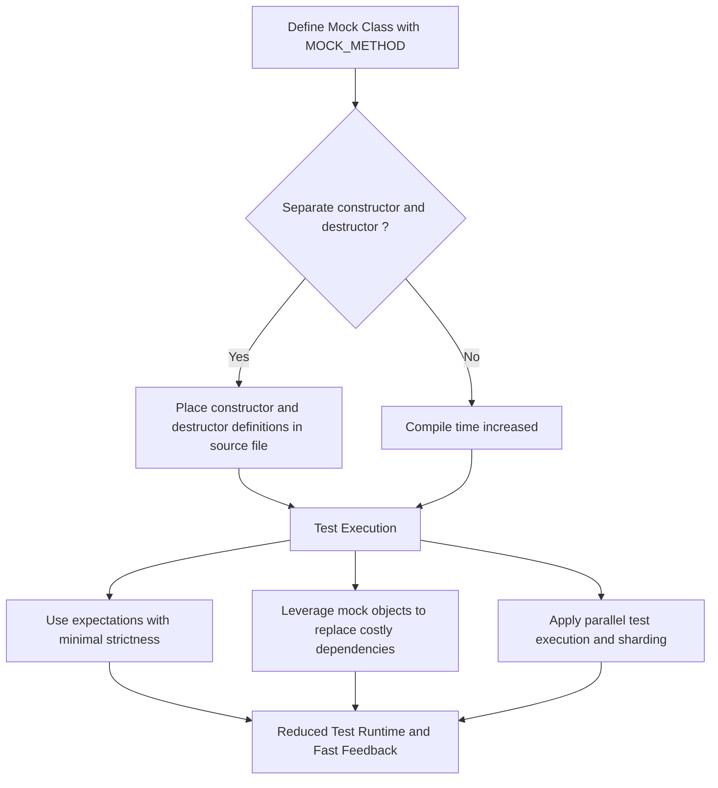

# Scalability & Performance Considerations

GoogleTest is engineered to support efficient testing workflows in projects of all sizes, including large codebases with extensive test suites. This guide highlights the design decisions and strategies that enable GoogleTest to maintain fast builds and swift test executions, focusing on minimizing runtime, managing test data effectively, and steering clear of common performance bottlenecks.

---

## Understanding the Performance Landscape

In large-scale C++ projects, the testing framework plays a critical role in developer productivity. Slow compilation times and lengthy test runs can drastically reduce the feedback loop, making iterative development painful. GoogleTest is designed to optimize for both these metrics by balancing powerful features with lightweight implementation.

Key performance goals include:

- **Fast incremental builds:** Reducing the impact of mock and test code on compile times.
- **Efficient runtime:** Enabling quick execution of tests, even when they involve complex mock interactions.
- **Minimal overhead:** Keeping test scaffolding lean to avoid unnecessary cost.


## Minimizing Compile-Time Overhead with Mock Classes

Mock classes, defined using `MOCK_METHOD` macros, provide powerful means to simulate dependencies. However, naively defined mocks can significantly slow down compilation due to code bloat and template complexity.

### Best Practice: Separate Constructor and Destructor Definitions

Most compilation time in mocks comes from generating constructors and destructors for mock classes because they implement verification and management logic. Moving their definitions from headers to `.cc` (source) files ensures the compiler processes them only once. This optimization can drastically reduce compile times when mocks are included in multiple translation units.

```cpp
// In mock_class.h
class MockFoo : public Foo {
 public:
  MockFoo();
  virtual ~MockFoo();

  MOCK_METHOD(int, DoSomething, (), (override));
  // ... more mock methods ...
};

// In mock_class.cc
#include "mock_class.h"

MockFoo::MockFoo() {}
MockFoo::~MockFoo() {}
```

### Avoid Excessive Mock Methods

Limiting the number of mocked methods in a class helps to keep build times manageable. Mock only what you actually need for a test.

### Use Alias and Parent Classes Carefully

Avoid redundant mocking of inherited methods unless necessary. GoogleTest supports mocking class templates and overloads efficiently, but be mindful of code complexity.


## Managing Test Runtime: Strategies for Efficient Execution

### Use Mock Objects to Reduce External Dependencies

Mocks isolate test subjects from costly dependencies (e.g., databases, files, networks) without sacrificing correctness verification. This reduces I/O and setup time exponentially.

### Control Expectations Wisely

Overly strict or numerous expectations can slow down tests, especially when using ordered sequences or complex matchers. Define expectations only as strictly as necessary to balance test robustness and speed.

### Consider Parallel Test Execution

Refer to related guides on performance and test suite scaling to leverage parallelism across tests. GoogleTest supports parallel test execution paradigms that can cut runtimes significantly in large test suites.


## Avoiding Common Performance Pitfalls

- **Unnecessary Over-Specification of Mocks:** Avoid adding expectations on mocks that do not contribute to verifying critical behavior; this reduces runtime and brittle tests.

- **Excessive Use of InSequence or After Clauses:** Overusing call order constraints may enforce sequential execution that blocks parallelism and adds complexity.

- **Large Test Fixtures with Heavy SetUp/TearDown:** Keep fixture setup lightweight to avoid redundant costs for each test iteration.

- **Mock Method Behavior with Side Effects:** Beware that complex actions inside mocks can add overhead—prefer simple return or side-effect actions.


## Recommendations for Large Projects

- Keep mocks in separate translation units to condense build costs.
- Use `NiceMock` or `NaggyMock` to control verbosity and avoid extraneous warnings that can slow debugging.
- Profile your test suite for bottlenecks and refactor slow tests.
- Apply parallel testing and sharding as projects scale (see Performance and Test Suite Scaling guide).


## Summary Diagram

Below is a high-level flow of test performance optimization considerations within GoogleTest:




## Troubleshooting Performance Issues

<AccordionGroup title="Troubleshooting Performance Issues">
<Accordion title="My mocks increase compile time dramatically. What should I do?">
Move constructor and destructor definitions out of header files into `.cc` files as detailed above. Limit mocks to only necessary methods.
</Accordion>
<Accordion title="Test execution is slow despite using mocks.">
Check for overly strict expectations or complex sequences requiring enforced call order. Profile test setup and teardown for overhead.
</Accordion>
<Accordion title="Tests are hard to maintain due to strict mock behaviors.">
Consider using `NiceMock` to suppress warnings for uninteresting calls. Use `ON_CALL` for default behaviors and limit `EXPECT_CALL` to critical validations.
</Accordion>
</AccordionGroup>


## Additional Resources

- [GoogleTest Feature Overview](/overview/feature-highlights-integration/feature-overview) - Understand the broad capabilities that impact performance.
- [Mocking Best Practices and Common Pitfalls](/guides/mocking-best-practices/mocking-best-practices) - Learn strategies for writing maintainable mocks.
- [Performance and Test Suite Scaling](/guides/advanced-and-integrations/performance-scaling) - Techniques on parallelizing test runs and scaling.
- [Common Setup Issues](/getting-started/setup-troubleshooting/common-setup-issues) - Troubleshoot integration problems that can affect performance.


---

GoogleTest's thoughtful design helps teams maintain rapid feedback loops by minimizing compile and test runtime overhead, critical for large-scale development. Incorporating best practices for mocks and expectations alongside the framework’s support for parallelism keeps your tests fast, reliable, and maintainable.
