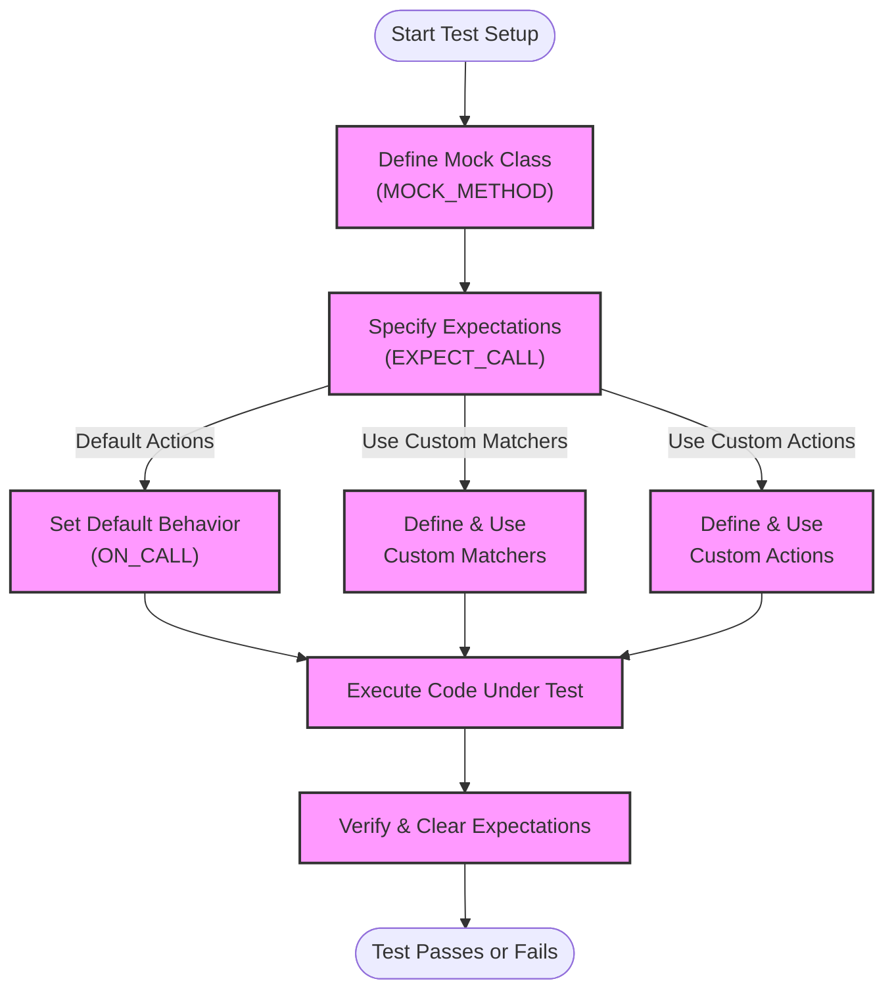

# Extensibility and Customization

Explore how GoogleTest and GoogleMock can be extended via custom assertions, matchers, and actions. This page outlines conceptual strategies and provides insight into how users can tailor the framework for their own needs.

---

## Introduction to Extensibility in GoogleMock

GoogleMock is designed not only to provide powerful mocking capabilities out of the box but also to empower you to extend and customize its behavior to suit the unique needs of your tests. By leveraging custom assertions, matchers, and actions, you can craft highly expressive and maintainable tests that closely reflect your domain logic.

This page provides conceptual guidance on augmenting GoogleTest and GoogleMock via these extension points.

---

## Custom Assertions

GoogleTest assertions form the foundation of verifying test conditions. While GoogleTest offers a broad set of built-in assertions, writing custom assertions enables you to encapsulate domain-specific verification logic with clear, reusable syntax.

### Why Define Custom Assertions?

- **Encapsulation of complex checks:** Reduce duplication and improve readability by bundling multiple checks into one assertion.
- **Improved error messaging:** Provide detailed failure messages tailored to your domain.
- **Better test maintenance:** Isolate changes to verification logic in one place.

### Types of Custom Assertions

You can write custom assertions through:

- **Function-based assertions** following the `ASSERT_*` or `EXPECT_*` convention that return `::testing::AssertionResult`. This pattern allows integrating natural failure or success reporting.
- **Predicate assertions** using `ASSERT_PRED_FORMAT*` macros for functions providing detailed message formatting.

### Example

```cpp
::testing::AssertionResult IsValidUserId(int user_id) {
  if (user_id > 0 && user_id < 10000) {
    return ::testing::AssertionSuccess();
  } else {
    return ::testing::AssertionFailure() << "User ID " << user_id << " is out of valid range.";
  }
}

TEST(UserManagerTest, UserIdValidation) {
  int id = GetUserId();
  EXPECT_TRUE(IsValidUserId(id));
}
```

This approach ensures the test clearly communicates why an assertion fails, enhancing debuggability.

---

## Custom Matchers

### Matcher Concept Recap

Matchers specify expectations on function arguments in mocks, allowing fine-grained validation beyond simple equality.

However, sometimes built-in matchers are not sufficient for expressing your domain's semantics.

### Extending Matchers

GoogleMock allows you to define custom matchers that describe complex matching logic. These can be:

- **Simple matchers** using the `MATCHER` and `MATCHER_P*` macros to quickly define inline predicates.
- **Class-based matchers** for more complex or reusable matching logic offering detailed explanations and negation descriptions.
- **Polymorphic matchers** to match multiple argument types flexibly.

### How It Benefits You

- Capture domain-specific invariants precisely.
- Produce more descriptive failure messages.
- Compose matchers for complex data structures.

### Example: A Polymorphic Matcher Class

```cpp
class EvenNumberMatcher {
 public:
  using is_gtest_matcher = void; // Marker for gMock

  template <typename T>
  bool MatchAndExplain(T n, std::ostream* os) const {
    bool result = (n % 2) == 0;
    if (os && !result) {
      *os << "which is odd";
    }
    return result;
  }

  void DescribeTo(std::ostream* os) const {
    *os << "is an even number";
  }

  void DescribeNegationTo(std::ostream* os) const {
    *os << "is an odd number";
  }
};

::testing::PolymorphicMatcher<EvenNumberMatcher> IsEven() {
  return ::testing::MakePolymorphicMatcher(EvenNumberMatcher());
}

// Usage:
EXPECT_CALL(mock_obj, SomeMethod(IsEven()));
```

This matcher can be applied to any integral type and will describe failures clearly.

### MATCHER Macros for Quick Custom Matchers

Use the macro family `MATCHER`, `MATCHER_P`, `MATCHER_P2`, etc., to write concise matchers quickly.

```cpp
MATCHER(IsDivisibleBy7, "") {
  return (arg % 7) == 0;
}

EXPECT_CALL(mock_obj, Foo(IsDivisibleBy7()));
```

---

## Custom Actions

### What Are Actions?

Actions define what a mock method should do when invoked — such as returning values, modifying output parameters, invoking callbacks, or performing side effects.

While GoogleMock includes many built-in actions, scenarios often arise where custom logic is needed.

### Defining Custom Actions

Custom actions are callable types compatible with the mock method's signature. You can define them via:

- Lambda expressions, the most common and expressive method.
- Structs or classes with call operators, allowing stateful or templated behaviors.
- Legacy `ACTION` and `ACTION_P` macros.

### Example: Stateful Custom Action

```cpp
struct Incrementer {
  int count = 0;
  int operator()() { return ++count; }
};

EXPECT_CALL(mock_obj, GetNextCount())
    .WillRepeatedly(Incrementer());
```

This returns incremented values for successive calls.

### Combining Actions

You can combine multiple actions via `DoAll()` to perform several side effects in one invocation, with only the last action's return value used:

```cpp
EXPECT_CALL(mock_obj, ModifyAndReturn(_))
    .WillOnce(DoAll(SetArgPointee<0>(10), Return(true)));
```

This sets the first argument to 10 and returns true.

---

## Integrating Customizations into Typical Workflows

### Extending Mock Behavior with Custom Matchers and Actions

1. **Define your matcher** to express validation rules specific to your domain.
2. **Apply the matcher** in `EXPECT_CALL` or `ON_CALL` to specify when the expectation or default behavior applies.
3. **Define your action** to specify the behavior when the expectation matches.
4. **Use the action** with `.WillOnce()` or `.WillRepeatedly()`.

Example:

```cpp
MATCHER_P(IsBetween, bounds, "") { return arg >= bounds.first && arg <= bounds.second; }

EXPECT_CALL(mock_obj, ComputeValue(IsBetween(std::make_pair(10, 20))))
    .WillOnce(Return(42));
```

### Delegating Calls for Simpler Mocks

Custom actions allow delegation to other objects or simplified logic encapsulated in lambdas, enabling:

- Using fakes or real objects for default behavior.
- Mocking complex logic in a modular way.
- Avoiding brittle expectations.

### Extending Expectations with Custom Cardinalities

While not covered in detail here, note that you can implement your own cardinalities (times called expectations) for further expressiveness.

---

## Best Practices

- **Start with built-in features:** Explore custom matchers and actions only when necessary.
- **Keep matchers pure:** They should not cause side effects.
- **Write clear failure messages:** Improve debuggability.
- **Retire expectations when appropriate:** Use `.RetiresOnSaturation()` to avoid sticky expectations that cause false failures.
- **Use `NiceMock`, `NaggyMock`, `StrictMock` wisely:** Control how uninteresting calls are treated.
- **Leverage sequences to order calls:** Combine with `InSequence` or `After` for partial order control.

---

## Troubleshooting & Common Pitfalls

- **Matcher evaluation issues:** Ensure custom matchers do not throw exceptions or modify state.
- **Action misuse:** Ensure actions' return types match mock method signatures.
- **Unintended sticky expectations:** Use `.RetiresOnSaturation()` or sequences when expecting ordered calls.
- **Performance:** Overuse of complex custom matchers/actions can slow compile times.

---

## Summary

Extending GoogleTest and GoogleMock via custom assertions, matchers, and actions unlocks powerful ways to tailor your tests for complex behavioral verification. Employ these extensions judiciously to maintain readable, maintainable, and robust tests that precisely express your intent and domain semantics.

---

## Further Reading and References

- [Mocking Reference — Macros and Classes](../docs/reference/mocking.md): Technical details of `MOCK_METHOD`, `EXPECT_CALL`, `ON_CALL`, and mock wrappers.
- [gMock Cookbook](../docs/gmock_cook_book.md#NewMatchers): Recipes for defining custom matchers, actions, and more.
- [Matchers Reference](../api-reference/mocking-framework/matchers.md): Comprehensive list of built-in matchers.
- [Actions Reference](../api-reference/mocking-framework/actions.md): Built-in actions and custom action guidelines.
- [gMock for Dummies](../docs/gmock_for_dummies.md): Introductory concepts on mocks and their uses.

---

## Mermaid Diagram: Extensibility Workflow Overview


