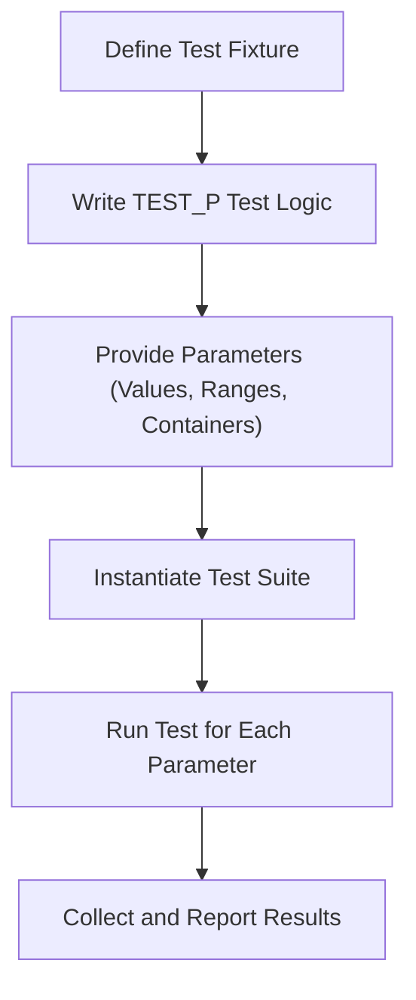

# Test Parameterization and Data Modeling

GoogleTest provides powerful mechanisms for writing tests that can run with different inputs or data types without duplicating code. This allows you to achieve systematic coverage, improve maintainability, and foster code reuse through data-driven testing. This page explains the concepts of value-parameterized and type-parameterized tests, their design patterns, and practical guidance for applying them effectively.

---

## Why Parameterize Tests?

Imagine you want to test a function with multiple variations of input data or types. Writing separate test cases for each combination quickly becomes unmanageable. Parameterized tests allow you to write a generalized test logic once and run it across many sets of inputs or data types, driven by parameters.

### Value-Parameterized Tests

Value-parameterized tests enable running the same test logic with different input values. This is ideal when you want to verify the behavior of your code for various inputs without repeating test code.

### Type-Parameterized Tests

Type-parameterized tests allow testing generic code templates or interface implementations over multiple data types. This helps ensure type safety and consistent behavior regardless of the underlying type.

---

## Core Concepts

### The Test Fixture

A parameterized test defines a fixture class derived from `::testing::Test` (or a base fixture). This fixture declares the parameter type and contains setup, teardown, and helper functions shared by all variations.

### Instantiations

You provide concrete parameter values or types by instantiating the parameterized test suite. GoogleTest then dynamically creates tests for every parameter variation.

### Test Naming and Output

Each instantiation produces distinct test names indicating the parameter used, improving clarity in test reports.

---

## Value-Parameterized Tests

### Defining a Value-Parameterized Test

1. Define a fixture that inherits from `::testing::TestWithParam<T>` where `T` is the parameter type.
2. Write your test logic inside `TEST_P` macros, using `GetParam()` to access the current parameter.
3. Instantiate your test suite with values using `INSTANTIATE_TEST_SUITE_P`.

Example:

```cpp
#include <gtest/gtest.h>

class IsEvenTest : public ::testing::TestWithParam<int> {};

TEST_P(IsEvenTest, ReturnsTrueForEvenNumbers) {
  int n = GetParam();
  EXPECT_EQ(n % 2, 0);
}

INSTANTIATE_TEST_SUITE_P(EvenNumbers, IsEvenTest, ::testing::Values(2, 4, 6, 8));
```

Here, the test `ReturnsTrueForEvenNumbers` runs four times with the values 2, 4, 6, and 8.

### Parameter Sources

GoogleTest provides multiple ways to supply parameters:

- `Values`: Lists individual values.
- `ValuesIn`: Uses container ranges like vectors or arrays.
- `Range`: Defines a numerical range.
- `Bool`: For boolean values.
- `Combine`: Combines multiple parameter sequences to get Cartesian products.

Example combining two parameters:

```cpp
INSTANTIATE_TEST_SUITE_P(
    Combo,
    MyTestFixture,
    ::testing::Combine(::testing::Values(1, 2), ::testing::Bool())
);
```

### Best Practices for Value-Parameterized Tests

- Choose meaningful parameter names and value sets to cover edge cases.
- Avoid overly large parameter sets to keep test execution reasonable.
- Use typed helper functions or classes to prepare complex parameters clearly.

---

## Type-Parameterized Tests

Type-parameterized tests enable you to test generic components with a set of types.

### Defining Type-Parameterized Tests

1. Define a fixture template class derived from `::testing::Test`.
2. Use `TYPED_TEST_SUITE_P` to declare the test suite as type-parameterized.
3. Write test logic using `TYPED_TEST` macros.
4. Register and instantiate the suite with `REGISTER_TYPED_TEST_SUITE_P` and `INSTANTIATE_TYPED_TEST_SUITE_P`.

Example:

```cpp
#include <gtest/gtest.h>

template <typename T>
class MyContainerTest : public ::testing::Test {
 public:
  MyContainerTest() {}  
  // Add setup or utilities here
};

TYPED_TEST_SUITE_P(MyContainerTest);

TYPED_TEST_P(MyContainerTest, IsInitiallyEmpty) {
  TypeParam container;
  EXPECT_TRUE(container.empty());
}

REGISTER_TYPED_TEST_SUITE_P(MyContainerTest, IsInitiallyEmpty);

using MyTypes = ::testing::Types<std::vector<int>, std::list<int>>;
INSTANTIATE_TYPED_TEST_SUITE_P(Sequences, MyContainerTest, MyTypes);
```

### Advantages

- Validates templates and generic code over many types.
- Avoids replicating test logic for each type.
- Supports rich typing scenarios including custom classes.

### Best Practices for Type-Parameterized Tests

- Limit instantiated types to those relevant and supported.
- Create helper type traits or wrappers to abstract any complex setup.
- Name your test types clearly to assist diagnosis.

---

## Data Modeling and Design Patterns

### Using Fixtures Effectively

Fixtures serve as a common base to manage test state and shared initialization across parameterized tests.

### Factory and Builder Patterns

Consider defining factories or builders for complex test input objects, which can then be passed as parameters or constructed inside parameterized fixtures.

### Abstraction Over Concrete Types

Favor defining interfaces and using typed tests to validate polymorphic contracts instead of duplicating test code.

### Combining Value and Type Parameters

While GoogleTest doesn't natively support combined type and value parameterization in a single test suite, you can achieve this by layering or nesting parameterized tests or using helper patterns.

---

## Practical Tips and Common Pitfalls

- Always provide a default constructor for test fixtures.
- Ensure parameters are copyable or moveable to avoid instantiation errors.
- Avoid putting heavy operations in the parameter list to keep test setup quick.
- Use meaningful parameter names in `INSTANTIATE_TEST_SUITE_P` to improve test logs.
- Beware of over-specifying expectations if using mocks inside parameterized tests.

---

## Summary Diagram of Parameterized Test Flow



---

## Further Learning and References

- [GoogleTest Primer on Parameterized Tests](https://github.com/google/googletest/blob/main/docs/primer.md#writing-parameterized-tests)
- [Mock Objects and Parameterization](https://github.com/google/googletest/blob/main/docs/gmock_cook_book.md)
- [Typed Tests Reference](https://github.com/google/googletest/blob/main/docs/reference/typed-tests.md)
- [GoogleTest Core Concepts & Terminology](../overview/product-intro-core-concepts/core-concepts-terminology)
- [Value- and Type-Parameterized Tests in GoogleTest API Reference](../api-reference/core-testing-apis/parameters)

---

By mastering value- and type-parameterized tests, you unlock disciplined, scalable, and expressive test coverage that adapts gracefully as your code evolves.