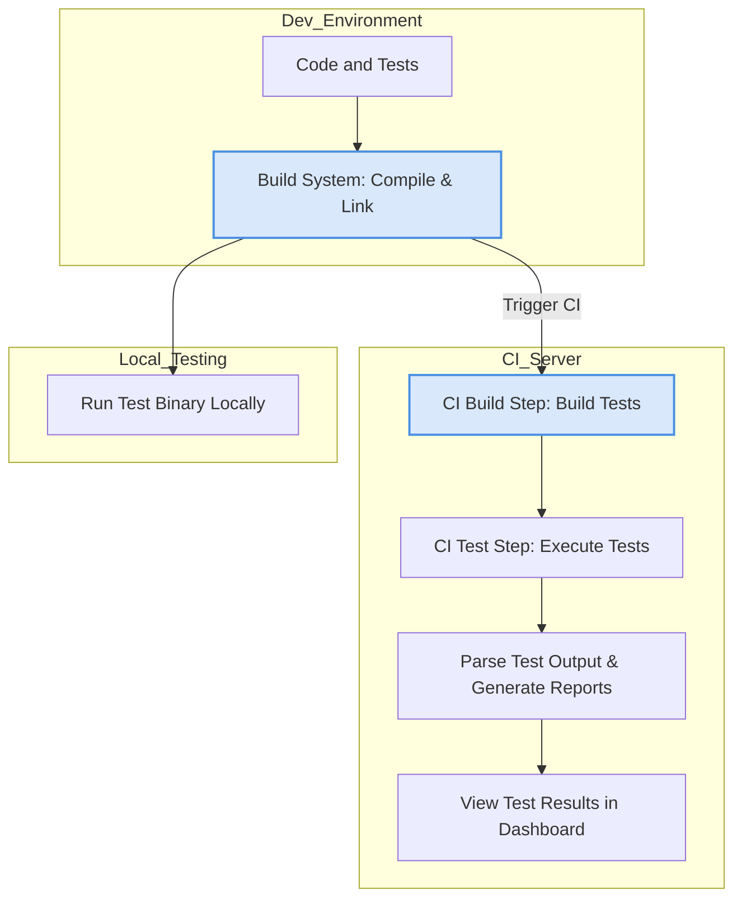

# Integration Patterns with Build and CI Systems

Integrating GoogleTest and GoogleMock into your modern C++ build environments and Continuous Integration (CI) pipelines is essential to maintain robust, automated quality assurance workflows. This guide offers a conceptual overview of how test discovery, configuration, execution, and reporting interplay with popular build systems and CI services, helping you embed testing seamlessly in your development lifecycle.

---

## Why Integrate GoogleTest with Build Systems and CI?

Imagine a software team aiming to catch bugs early and deploy confidently. By integrating GoogleTest into the build and CI pipelines, tests run automatically on every change, providing immediate feedback. This transforms tests from manual chores to integral enablers of code quality.

Without integration, developers run tests manually, risking forgotten or inconsistent test execution—a scenario that leads to costly late-stage failures. With integration, continuous verification is guaranteed, accelerating development velocity.

## Core Concepts of Integration

### 1. Test Discovery Orchestration
GoogleTest automatically discovers tests defined through its macros (`TEST()`, `TEST_F()`, and parameterized tests). Build systems need to compile the comprehensive test binary, after which the GoogleTest framework identifies and registers all tests at runtime. 

CI systems invoke the compiled test executables, relying on this built-in discovery to run the full or filtered sets of tests.

### 2. Configuration and Build Setup
To run tests effectively, the build system must:

- Compile GoogleTest and GoogleMock sources or link pre-built libraries.
- Include test source files.
- Handle dependencies with your application code.
- Support compiler flags required by GoogleTest (e.g., C++17 standard).

Build tools like CMake and Bazel offer idiomatic ways to accomplish these, which the guides `/guides/real_world_patterns_advanced/integration_with_build_systems_ci` and `/getting-started/installation/install-cmake` cover in detail.

### 3. Test Execution Control
GoogleTest supports runtime control via command-line flags, enabling selective test runs, parallel execution, verbosity adjustments, and output format configuration. CI pipelines exploit these features to run targeted or exhaustive tests and generate machine-readable reports.

Examples:

```bash
./my_tests --gtest_filter=MySuite.*  # Run tests matching "MySuite.*"
./my_tests --gtest_output=xml:report.xml  # Generate XML for CI parsing
```

### 4. Reporting and Continuous Feedback
The output formats (XML, JSON) allow CI tools (e.g., Jenkins, GitHub Actions) to ingest and display test status as part of build dashboards. This feedback enables quick detection of regressions and better team insight.

---

## Typical Integration Workflow

<Steps>
<Step title="Setup Build Files">
Configure your build scripts (CMakeLists.txt, Bazel BUILD files) to incorporate the GoogleTest and GoogleMock targets along with your test source files.
</Step>
<Step title="Compile Tests">
Build the test binaries with compiler flags compliant with GoogleTest’s minimum C++17 requirement and platform portability considerations.
</Step>
<Step title="Run Tests Locally">
Execute the compiled test binaries directly, using GoogleTest filters to focus on subsets.
</Step>
<Step title="Configure CI Job">
Create a CI build step that builds the tests and runs them with reporting flags enabled.
</Step>
<Step title="Analyze Test Results">
Use CI dashboards or exported reports to monitor pass/fail status and investigate failures.
</Step>
</Steps>

---

## Best Practices

- **Leverage GoogleTest’s test filtering and listing flags** to browse and selectively run tests during development.
- **Use GoogleMock’s flexible mocking constructs** within your tests to isolate dependencies and speed up execution.
- **Configure your build system to re-run tests automatically on file changes** during local development.
- **Enable detailed test reporting in CI**, including failing tests, stack traces, and verbose logging via `--gmock_verbose=info` if necessary.
- **Manage uninteresting and unexpected calls appropriately** using `NiceMock` or `StrictMock` wrappers to reduce noisy test outputs.

<Tip>
Use the guide on [Integration with Build Systems and CI](/guides/real_world_patterns_advanced/integration_with_build_systems_ci) for concrete examples with CMake and Bazel.
</Tip>

---

## Common Pitfalls and Troubleshooting

- **Build failures due to missing dependencies or compiler version issues:** Ensure your build environment satisfies the prerequisites documented in `/getting-started/setup-requirements/prerequisites`.
- **Tests not discovered or run:** Confirm that test files are compiled and linked into the test binary, and that `RUN_ALL_TESTS()` is called in your test executable’s `main()`.
- **Unexpected mock call warnings:** Use `NiceMock` to suppress warnings for uninteresting calls when appropriate, or add explicit expectations.
- **CI reports missing or malformed:** Verify the test runner executes with `--gtest_output=xml:` or other supported formats and that CI recognizes those reports.

<Warning>
Avoid mixing manual test invocation with automated CI test runs to prevent divergence and flaky failures.
</Warning>

---

## Visualizing the Integration Flow



---

## Additional References

- **Build System Integration:** `/guides/real_world_patterns_advanced/integration_with_build_systems_ci`
- **Setup & Build:** `/guides/getting_started_core_workflows/setup_and_build`
- **Running Tests and Filtering:** `/guides/getting_started_core_workflows/running_tests`
- **Mocking Dependencies:** `/guides/getting_started_core_workflows/mocking_dependencies`
- **Test Discovery & Execution API:** `/api-reference/gtest-core-api/test-discovery-execution`
- **Using Mock Objects & Expectations:** `/api-reference/gmock-mocking-api/mock-object-definition`
- **Nice, Naggy, and Strict Mocks:** `/api-reference/gmock-mocking-api/nice-strict-mocks`

---

Mastering integration unlocks the full power of GoogleTest and GoogleMock, turning your tests into guarded sentinels of quality that continuously watch over your code base reliability.


