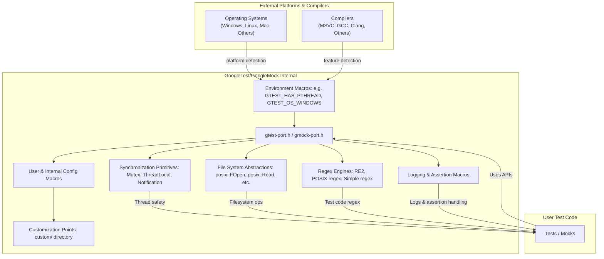

# Portability and Platform Abstractions

GoogleTest and GoogleMock form a powerful yet portable C++ testing framework that operates seamlessly across a wide range of compilers, platforms, and runtime environments—from desktop operating systems to embedded hardware. This portability is achieved through a carefully designed compatibility layer in their internal headers, prominently `gtest-port.h` and `gmock-port.h`, which abstract platform details and enable consistent behavior regardless of environment.

---

## Understanding the Portability Layer

At the heart of GoogleTest's cross-platform support is the portability layer defined primarily within `gtest-port.h`. This header provides low-level types, macros, utility functions, and synchronization primitives tailored for various platforms and compilers.

### Key Characteristics

- **Environment-Describing Macros**: These macros report the environment capabilities, such as availability of threads, exceptions, RTTI, file system, POSIX regex support, and structured exception handling (SEH).
  - Examples include `GTEST_HAS_PTHREAD`, `GTEST_HAS_EXCEPTIONS`, `GTEST_HAS_RTTI`, and `GTEST_HAS_SEH`.
  - These macros are always defined explicitly as either 1 or 0 after inclusion to avoid conditional compilation pitfalls.

- **Platform Indicators**: Automatic detection macros (`GTEST_OS_LINUX`, `GTEST_OS_WINDOWS`, `GTEST_OS_MAC`, etc.) identify the operating system and environment to key off platform-specific implementations.

- **Feature Indicators**: Beyond basic platform capabilities, these macros indicate the availability of advanced features such as death tests (`GTEST_HAS_DEATH_TEST`), typed tests (`GTEST_HAS_TYPED_TEST`), or whether Google Test is thread-safe (`GTEST_IS_THREADSAFE`).

- **Compiler & Language Support Checks**: The portability layer enforces a minimum C++17 standard due to reliance on modern language features and utilizes compiler-specific checks and pragmas to manage warnings and capabilities.

---

## Synchronization Primitives and Thread Safety

Modern testing frameworks require thread safety when running tests in parallel or supporting multi-threaded test scenarios. GoogleTest handles these concerns gracefully within the portability layer.

### Mutex and ThreadLocal Implementation

GoogleTest abstracts synchronization primitives with implementations that switch seamlessly based on platform support:

- **Thread Safety Enabled (`GTEST_IS_THREADSAFE`)**
  - On **Windows**, GoogleTest implements mutexes using native critical sections and provides `Mutex` and `MutexLock` classes to control locking.
  - On **POSIX** platforms supporting pthreads, mutexes wrap `pthread_mutex_t`.
  - For thread-local storage, templated `ThreadLocal<T>` classes provide per-thread data, carefully managing lifetime and destruction semantics to avoid leaks.

- **Thread Safety Disabled**
  - In environments lacking threading support, no-op dummy classes for mutex and thread-local storage ensure code compiles but don't provide synchronization, with a clear warning that multithreaded usage is unsafe there.

### Notifications and Thread Coordination

Where supported, GoogleTest includes a `Notification` primitive allowing threads to signal each other, used internally to coordinate the start of threads during multi-threaded testing, especially in complex death tests or emulated concurrency scenarios.

---

## Platform-Specific IO and Environment Wrappers

GoogleTest shields users from platform differences in file and IO operations:

- Functions like `posix::FOpen()`, `posix::Read()`, `posix::Write()`, and directory operations `posix::RmDir()` provide uniform APIs, resolving discrepancies on Windows, Unix, mobile, or embedded platforms.

- Case-insensitive string comparisons (`posix::StrCaseCmp`) work transparently across operating systems.

- Environment variable retrieval (`posix::GetEnv()`) adapts gracefully to the platform's capabilities, returning `nullptr` on embedded systems without environment variables.

- Platform-specific path separators (`GTEST_PATH_SEP_`) aid in constructing OS-correct file paths.

---

## Regular Expressions Selection

GoogleTest adapts to available regex implementations through macros that select the most appropriate engine:

- Prefer **RE2** when available and compiled with Abseil support (`GTEST_USES_RE2`).
- Use **POSIX regex** on UNIX-like systems (`GTEST_USES_POSIX_RE`).
- Fall back on a simple internal regex if neither RE2 nor POSIX regex is available (`GTEST_USES_SIMPLE_RE`).

This flexibility ensures pattern matching in tests works consistently across diverse build environments.

---

## Logging and Assertions Porting

The portability layer defines logging macros (`GTEST_LOG_`) which handle output uniformly. These ensure:

- Logs are emitted with proper severity.
- Platform-specific facilities like `stderr` redirection are abstracted.
- Fatal assertions terminate execution in a consistent manner.

All are constructed with extensibility points to customize logging behavior or suppress output as needed.

---

## Macro Controls for User and Internal Configuration

GoogleTest exposes numerous preprocessor macros letting users adjust features for their environment:

- Users can define macros such as `GTEST_HAS_PTHREAD`, `GTEST_HAS_EXCEPTIONS`, or `GTEST_HAS_RTTI` to override autodetection.
- Macros to enable shared library builds (`GTEST_CREATE_SHARED_LIBRARY`, `GTEST_LINKED_AS_SHARED_LIBRARY`) facilitate flexible linking.
- Logging and synchronization implementation options can be customized via macros flagged as internal or for advanced users.

Refer to the `custom/` directory headers for points of extension.

---

## Integration with GoogleMock

GoogleMock leverages the same portability infrastructure from GoogleTest:

- Includes `gtest-port.h` internally to unify platform abstractions.
- Provides similar flag and macro definitions, allowing consistent configuration of mocking features across platforms.

This shared foundation simplifies maintenance and guarantees coherent behavior between the test and mock frameworks.

---

## Using the Portability Layer in Your Projects

The portability layer is primarily for internal use, but understanding it helps advanced users:

- You can override environment macros in build configurations if autodetection fails.
- You may define custom synchronization primitives if your platform requires it, supplying the macros as documented.
- Recognize that most users don’t need to touch this layer, as GoogleTest manages it automatically.

---

## Summary Diagram: Portability Layer Interaction

---

## Practical Tips and Best Practices

- **Override thoughtfully:** Most users don’t need to override portability macros, but if your platform is exotic or limited, explicitly defining environment macros in your build system ensures GoogleTest behaves correctly.

- **Thread safety:** Leverage platform support by ensuring `GTEST_HAS_PTHREAD` or Windows threading macros are set correctly to enable thread-safe test execution.

- **Linking considerations:** When building shared libraries, use the provided macros to ensure proper symbol visibility and runtime linkage.

- **Customization:** Apply custom implementations carefully via the writable `custom` headers directory so that you avoid forking large portions of GoogleTest.

- **Stay updated:** The portability layer evolves; keep your GoogleTest version current especially when targeting new platforms or compilers.

---

## Troubleshooting Common Portability Issues

- **Incorrect environment detection:** If GoogleTest misdetects your platform features (e.g., missing thread support), define overrides such as `-DGTEST_HAS_PTHREAD=1` or `=0` as needed.

- **Thread synchronization failures:** Ensure your compiler supports C++17 and that your platform pthread or Windows threading libraries are correctly linked.

- **File system access problems:** Verify `GTEST_HAS_FILE_SYSTEM` is defined properly if file operations fail.

- **Regex matching failing or triggering errors:** Check which regex engine is used and whether Abseil or POSIX regex support is enabled.

- **Compiler warnings or errors related to portability macros:** Review macro definitions and ensure your build system passes compatible flags.

---

## Additional Resources

- [GoogleTest Primer](https://github.com/google/googletest/blob/main/docs/primer.md) — for foundational knowledge
- [Setting Up and Building GoogleTest](https://github.com/google/googletest/blob/main/guides/getting_started_core_workflows/setup_and_build.md) — build configuration
- [Integration with C++ Environments](https://github.com/google/googletest/blob/main/overview/integration-getting-started/integration-with-environments.md) — linking and environment setup
- `gtest-port.h` and `gmock-port.h` (source code) — for advanced customization and troubleshooting
- [GoogleMock Customization Points](https://github.com/google/googletest/tree/main/googlemock/include/gmock/internal/custom)

---

This page clarifies the solid foundation GoogleTest and GoogleMock provide for portable, reliable C++ testing across diverse platforms by isolating platform peculiarities and compiler differences behind a consistent, extensible portability layer.