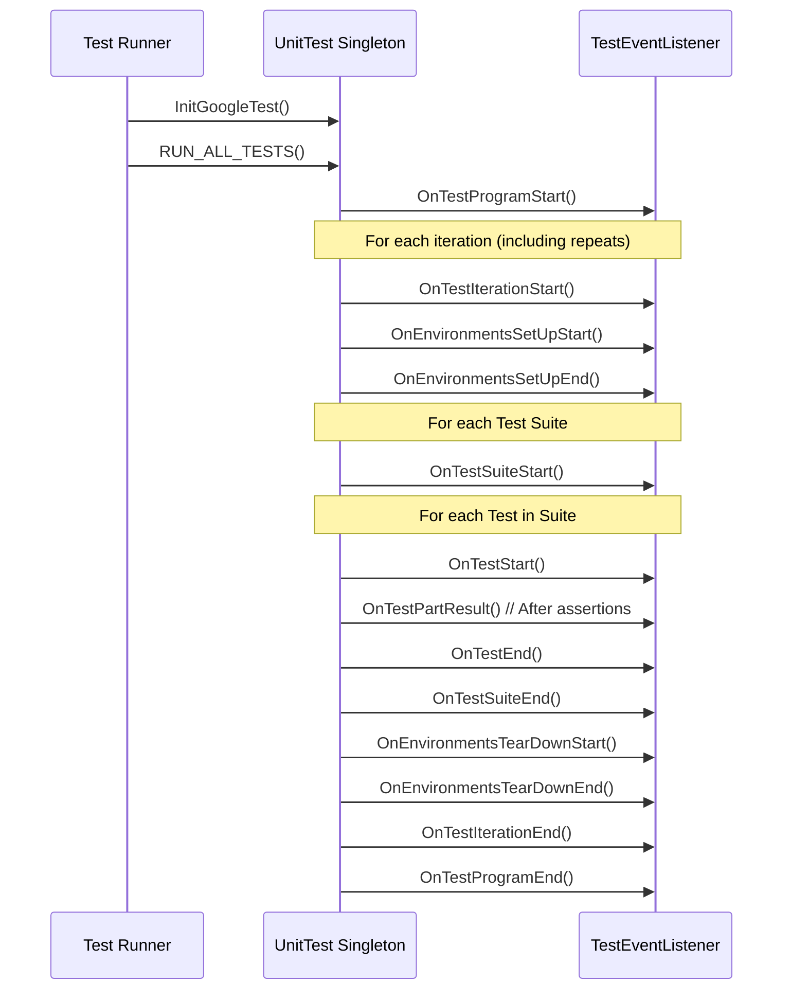

# Integration Patterns and Cross-Tooling

GoogleTest offers robust support for integrating its testing capabilities with a variety of external tools, continuous integration (CI) environments, and custom test runners. This guide explores common integration approaches, extensibility hooks, and reporting options that empower you to embed GoogleTest seamlessly into your development workflow.

---

## Overview

Integration is critical for extending the reach of GoogleTest beyond isolated unit testing. Whether you want to integrate with your CI pipeline, customize output for analytics tools, or create specialized test runners, GoogleTest provides APIs and patterns that meet these needs.

This page focuses specifically on:

- Extensibility via event listeners and hooks
- Cross-tool reporting formats
- Custom test runner adaptation
- Best practices for integrating with CI systems

By understanding these concepts, you will gain control over test execution monitoring, output customization, and test lifecycle management.

---

## Event Listener API: Extensibility at Runtime

At the heart of GoogleTest's extensibility is the **TestEventListener API**. This allows you to hook into detailed test events during execution and augment or replace the standard output and behaviors.

### Core Concepts

- **TestEventListener Interface:** The base interface exposing virtual methods invoked at key points in the test lifecycle (e.g., test start, test end, assertion failure).
- **EmptyTestEventListener:** A convenience base class that provides no-op implementations, letting you override only the events you care about.

### Typical Use Cases

- Implementing custom printers (console output, GUI, or logs).
- Integrating with test analytics or dashboards.
- Adding resource leak detection hooks.
- Transmitting test status to remote monitoring or dashboards.

### Key Events

| Event                          | Description                                            |
|-------------------------------|--------------------------------------------------------|
| `OnTestProgramStart`           | Called once before any tests are run                   |
| `OnTestIterationStart`         | Called before each test iteration (useful in repeats) |
| `OnTestSuiteStart` / `End`     | Signals start/end of a test suite                       |
| `OnTestStart` / `End`          | Signals start/end of an individual test                |
| `OnTestPartResult`             | Called after every assertion, passing result details   |
| `OnTestIterationEnd`           | Called after each iteration                              |
| `OnTestProgramEnd`             | Called once after all tests finish                      |

### Example: Minimal Custom Listener

```cpp
class MinimalistPrinter : public testing::EmptyTestEventListener {
 public:
  void OnTestStart(const testing::TestInfo& test_info) override {
    std::cout << "*** Test " << test_info.test_suite_name() << "."
              << test_info.name() << " starting.\n";
  }

  void OnTestPartResult(const testing::TestPartResult& result) override {
    std::cout << (result.failed() ? "*** Failure" : "Success")
              << " in " << result.file_name() << ":" << result.line_number() << "\n"
              << result.summary() << "\n";
  }

  void OnTestEnd(const testing::TestInfo& test_info) override {
    std::cout << "*** Test " << test_info.test_suite_name() << "."
              << test_info.name() << " ending.\n";
  }
};

int main(int argc, char** argv) {
  testing::InitGoogleTest(&argc, argv);
  auto& listeners = testing::UnitTest::GetInstance()->listeners();

  // Suppress the default printer
  delete listeners.Release(listeners.default_result_printer());

  listeners.Append(new MinimalistPrinter());
  return RUN_ALL_TESTS();
}
```

### Best Practices

- Append custom listeners after removing the default console printer to avoid overlapping outputs.
- Do not generate failures inside `OnTestPartResult` to prevent recursive calls.
- Use the event sequence to derive detailed test progress or metrics.

---

## Reporting Options and Formats

GoogleTest supports multiple reporting formats that facilitate integration with CI tools and test aggregators.

### XML Reporting

- Enable XML output via the `--gtest_output=xml[:path]` flag or corresponding environment variable.
- Generates a JUnit-style XML report compatible with many CI systems.
- Supports test suite, test case metadata, timing, and failure details.

Example:

```bash
./my_test --gtest_output=xml:report.xml
```

### JSON Reporting

- Recently introduced JSON output provides a detailed structured report.
- Enabled with `--gtest_output=json[:path]`.
- Provides similar test metadata as XML but in a format easier to process programmatically.

### Custom Report Integration

- Implement a listener to capture test events and produce proprietary or specialized reports.
- Ideal for integrating with dashboards or specialized analytics.

---

## Integrating with Continuous Integration Systems

CI environments typically require test execution orchestration and log collection. GoogleTest facilitates this through:

### Test Discovery and Filtering

- Tests are automatically registered; no manual listing is needed.
- Use `--gtest_list_tests` to enumerate all tests for selection in CI.
- Filter tests with `--gtest_filter` to run subsets or exclude slow or flaky tests.

### Exit Codes for Status

- The return value of `RUN_ALL_TESTS()` (usually from `main()`) signals overall test success (0) or failure (1).
- CI tools rely on these exit codes to detect build or test failures.

### Parallel and Distributed Testing

- Support test sharding with environment variables `GTEST_TOTAL_SHARDS` and `GTEST_SHARD_INDEX` to split test execution across machines.
- Combine with `--gtest_repeat` and randomization flags for robustness.

### Best Practices for CI Integration

- Use XML or JSON report generation for artifact collection.
- Use filtering to exclude non-critical tests, speeding runs.
- Capture logs generated by custom listeners for detailed failure analysis.

---

## Custom Test Runners and Programmatic Registration

GoogleTest allows dynamic test registration and custom test runners with:

### Programmatic Test Registration

- Use `testing::RegisterTest` to register tests at runtime.
- Enables tests to be created based on configuration, parameterized inputs, or dynamic conditions.

Example:

```cpp
// Custom test with parameter
class MyTest : public testing::Test {
 public:
   explicit MyTest(int data) : data_(data) {}
   void TestBody() override {
     EXPECT_GT(data_, 0);
   }
 private:
   int data_;
};

void RegisterMyTests(const std::vector<int>& values) {
  for (int v : values) {
    testing::RegisterTest("MyFixture",
                          ("Test" + std::to_string(v)).c_str(),
                          nullptr, std::to_string(v).c_str(),
                          __FILE__, __LINE__,
                          [=]() -> MyTest* { return new MyTest(v); });
  }
}
```

### Custom Main Functions

- Build your own `main()` to manage initialization and test registration.
- Use `testing::InitGoogleTest()` to process command-line flags.
- Call `RUN_ALL_TESTS()` to execute.

---

## Summary of Integration Hooks

| Feature                      | Purpose                                      | Usage                                                                |
|------------------------------|----------------------------------------------|----------------------------------------------------------------------|
| Event Listener API            | Runtime event handling                        | Custom output, resource tracking, monitoring                        |
| XML & JSON Reporting          | Standardized reports for CI                   | `--gtest_output=xml` or `--gtest_output=json`                        |
| Test Filtering               | Control tests run in CI                       | `--gtest_filter` flag                                                |
| Test Sharding                | Split tests across machines                   | `GTEST_TOTAL_SHARDS`, `GTEST_SHARD_INDEX` vars                       |
| Programmatic Test Registration | Dynamic test generation                      | Use `RegisterTest()` API                                             |
| Custom Main                  | Control test environment setup                | Override `main()` with `InitGoogleTest()` and `RUN_ALL_TESTS()`      |

---

## Troubleshooting Common Integration Issues

- **Multiple Listeners Conflicting:** Ensure default printers are removed if custom listeners are appended.
- **Report Files Not Generated:** Confirm correct path and permissions specified in `--gtest_output`.
- **Test Filters Exclude All Tests:** Validate filter syntax or use `--gtest_filter=*` to run all.
- **Sharding Issues:** Verify environment variable consistency and that the test runner supports sharding.

---

## Recommended Next Steps

- Review [Advanced GoogleTest Topics](../advanced.md) for deeper understanding of event listeners and test lifecycle.
- Explore [Testing Reference](reference/testing.md) for API details on test registration and execution.
- Consult [Integration & Ecosystem](overview/framework-architecture-concepts/integration-and-dependencies.md) for broader environment integration.
- Visit the [Samples](docs/samples.md) to see integration patterns in practical code.

---

<AccordionGroup title="Event Listener Key Methods">
<Accordion title="OnTestProgramStart & OnTestProgramEnd">
These are called once at the start and end of the entire test program, perfect for initializing and cleaning up global resources.
</Accordion>
<Accordion title="OnTestStart & OnTestEnd">
Called before and after each individual test, useful for detailed per-test tracking or dynamic test alteration.
</Accordion>
<Accordion title="OnTestPartResult">
Triggered after every assertion, advises about successes or failures, critical for capturing granular test outcomes.
</Accordion>
</AccordionGroup>

<AccordionGroup title="Common CLI Flags for Integration">
<Accordion title="--gtest_output">
Controls test result report generation; supports xml and json output formats.
</Accordion>
<Accordion title="--gtest_filter">
Defines which tests run, supporting wildcards and exclusions.
</Accordion>
<Accordion title="--gtest_repeat">
Repeats the entire test run multiple times to detect flaky failures.
</Accordion>
<Accordion title="--gtest_list_tests">
Lists all available tests without running them.
</Accordion>
</AccordionGroup>

<Accordion title="Example: Generating an XML Report in CI">
Run your test with:

```
./my_tests --gtest_output=xml:ci-results/test_results.xml
```

Configure your CI tool to collect and parse the XML report for test visibility.
</Accordion>

---

## Key References

- [TestEventListener API](reference/testing.md#TestEventListener) for defining listeners
- [RUN_ALL_TESTS()](reference/testing.md#RUN_ALL_TESTS) for test execution
- [RegisterTest()](reference/testing.md#RegisterTest) for programmatic test registration
- [GoogleTest Primer](primer.md) for introduction
- [Integration and Ecosystem Overview](overview/framework-architecture-concepts/integration-and-dependencies.md) for context

---

## Diagram: Test Lifecycle with Event Listeners



This sequence illustrates the layered callbacks that listeners receive, enabling detailed observation and customization of the test execution.
