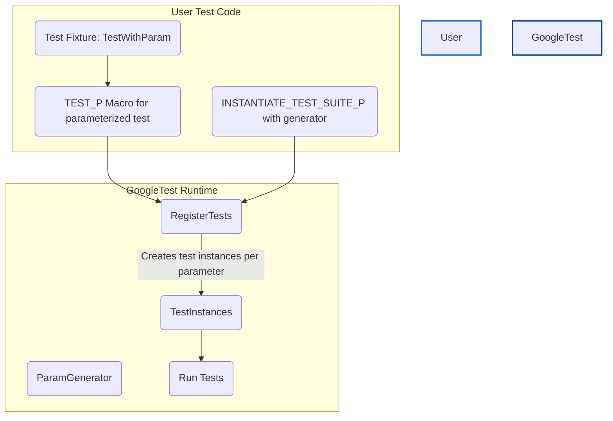

# Parameterized & Typed Tests

GoogleTest empowers you to write flexible and maintainable tests by allowing you to run the same test logic across multiple values or types without duplication. This guide demystifies *value-parameterized* and *type-parameterized* tests, showing how to define, instantiate, and leverage them to cover a broad range of inputs and data types efficiently, enabling scalable and DRY test design.

---

## Value-Parameterized Tests

*Value-parameterized tests* let you define a test once but run it multiple times with different input parameters. This approach is ideal for scenarios where your code's behavior needs verification against various inputs, flags, or implementations.

### The Workflow

1. **Define a Parameterized Test Fixture:**
    - Derive a class from `testing::TestWithParam<T>`, where `T` is the parameter type.
    - This fixture acts like a normal test fixture but provides a `GetParam()` method to access the current parameter.

2. **Define Parameterized Tests Using `TEST_P`:**
    - Write tests that use the parameter via `GetParam()`.
    - Each `TEST_P` defines a test pattern, not a concrete test.

3. **Instantiate the Tests with Parameters Using `INSTANTIATE_TEST_SUITE_P`:**
    - Specify a unique instantiation name.
    - Use a parameter generator to provide test input sequences.
    - Optionally, provide a custom name generator to create readable test names based on parameter values.


### Example: Parameterizing a Simple Test

```cpp
class FooTest : public ::testing::TestWithParam<const char*> {
  // Fixture setup can be added here.
};

TEST_P(FooTest, IsNonEmptyString) {
  const char* param = GetParam();
  EXPECT_NE(param[0], '\0');
}

// Instantiate tests with specific values.
INSTANTIATE_TEST_SUITE_P(Strings,
                         FooTest,
                         testing::Values("meeny", "miny", "moe"));
```

This will run the test `IsNonEmptyString` three times, each with a different string parameter.

### Parameter Generators

GoogleTest provides several useful parameter generators:

| Generator              | Description                                                  |
|------------------------|--------------------------------------------------------------|
| `Range(begin, end)`    | Generates values from `begin` up to but excluding `end`.      |
| `Values(v1, v2, ...)` | Uses explicitly specified discrete values.                   |
| `ValuesIn(cont)`       | Uses values from an array, container, or iterator range.     |
| `Bool()`               | Generates the boolean values `false` and `true`.             |
| `Combine(g1, g2, ...)`| Generates the Cartesian product of multiple generators.      |

#### Using `Combine()` for Multi-Parameter Tests

`Combine` lets you create combinations of parameters for tests that take tuples or multiple argument types.

Example:

```cpp
enum Color { BLACK, WHITE };

class AnimalTest : public testing::TestWithParam<std::tuple<const char*, Color>> {};

TEST_P(AnimalTest, HasCorrectDescription) {
  auto [animal, color] = GetParam();
  // Test logic here
}

INSTANTIATE_TEST_SUITE_P(AnimalVariations, AnimalTest,
                         testing::Combine(
                             testing::Values("cat", "dog"),
                             testing::Values(BLACK, WHITE)));
```

### Customizing Test Names

The default generated test names may not always be clear or human-readable.
You can add a custom name generator function or functor that takes a `TestParamInfo<T>` and returns a string suffix for the test name.

Example:

```cpp
INSTANTIATE_TEST_SUITE_P(
    CustomAnimalNames, AnimalTest,
    testing::Combine(testing::Values("cat", "dog"), testing::Values(BLACK, WHITE)),
    [](const testing::TestParamInfo<AnimalTest::ParamType>& info) {
      const auto& [animal, color] = info.param;
      std::string color_str = (color == BLACK) ? "Black" : "White";
      return std::string(animal) + "_" + color_str;
    });
```

### ConvertGenerator for Explicit Conversions

If parameter types are not implicitly convertible, `ConvertGenerator<T>` lets you convert parameters to your fixture's type by applying a static cast or a conversion function.

Example:

```cpp
struct MyParam {
  MyParam(std::tuple<int, bool> t) : i(std::get<0>(t)), b(std::get<1>(t)) {}
  int i;
  bool b;
};

class MyTest : public testing::TestWithParam<MyParam> {};

INSTANTIATE_TEST_SUITE_P(MyInstantiation, MyTest,
    testing::ConvertGenerator<MyParam::TupleT>(
      testing::Combine(testing::Values(0, 1), testing::Bool())));
```


---

## Typed and Type-Parameterized Tests

Typed tests allow you to run the same test logic for multiple C++ types, helping verify type correctness and enabling interface conformance validation across varied types with minimal code duplication.

### Typed Tests

You must specify the list of types upfront when declaring typed tests.

#### Workflow

1. Define a template fixture class derived from `testing::Test`.
2. Create a type list using `::testing::Types<...>`.
3. Associate the fixture and the type list with `TYPED_TEST_SUITE`.
4. Write tests using `TYPED_TEST` with the test fixture and refer to the type parameter as `TypeParam`.

Example:

```cpp
template <typename T>
class MyTypedTest : public testing::Test {
 public:
  T value_;
};

using MyTypes = testing::Types<int, char, double>;
TYPED_TEST_SUITE(MyTypedTest, MyTypes);

TYPED_TEST(MyTypedTest, IsDefaultConstructible) {
  TypeParam val{};
  (void)val;  // Just ensure this compiles.
}
```

### Type-Parameterized Tests

Provide abstract test patterns that are not bound to type lists at definition time, allowing multiple independent instantiations in different translation units.

#### Workflow

1. Define a template fixture class derived from `testing::Test`.
2. Declare the fixture as a type-parameterized suite with `TYPED_TEST_SUITE_P`.
3. Write tests using `TYPED_TEST_P`.
4. Register the tests with `REGISTER_TYPED_TEST_SUITE_P`.
5. Instantiate with types list via `INSTANTIATE_TYPED_TEST_SUITE_P`.

Example:

```cpp
template <typename T>
class FooTest : public testing::Test {};

TYPED_TEST_SUITE_P(FooTest);

TYPED_TEST_P(FooTest, DoesSomething) {
  TypeParam value = 0;
  // Test logic ...
}

REGISTER_TYPED_TEST_SUITE_P(FooTest, DoesSomething);

using MyTypes = testing::Types<int, float>;
INSTANTIATE_TYPED_TEST_SUITE_P(MyInstantiation, FooTest, MyTypes);
```

---

## Test Registration & Execution

Behind the scenes, GoogleTest registers each instantiation of parameterized and typed tests as standalone test cases with specific names including their parameter or type suffixes. This enables filtering and selective running via flags like `--gtest_filter`.

Each parameterized test is executed in its own test object instance, ensuring isolation and test independence.


---

## Best Practices and Tips

- **Use parameter generators that fit your test scenario:** Prefer `Values` when you have distinct parameters, `Range` for numeric intervals, and `Combine` for cross product combinations.
- **Name your test instantiations uniquely** using meaningful prefixes to differentiate them clearly in reports.
- **Avoid overly complex parameter sets** that can make test outputs hard to navigate.
- **Provide custom name generators** for readability and to avoid invalid or duplicate test names.
- **Ensure parameter types are copyable** and safely managed if pointers.
- **Use `GTEST_ALLOW_UNINSTANTIATED_PARAMETERIZED_TEST`** when you define parameterized tests but cannot or do not want to instantiate them in some build configurations.

---

## Troubleshooting Parameterized & Typed Tests

- **Tests not running as expected:** Ensure that test fixtures inherit correctly from `TestWithParam<T>` and that `INSTANTIATE_TEST_SUITE_P` is correctly placed and called.
- **Compilation errors:** Verify parameter types are copy constructible, and any conversion functions are correct if using `ConvertGenerator`.
- **Duplicate or invalid test names:** Check or customize parameter name generators to output legal, unique ASCII alphanumeric names without spaces or dashes.
- **Test skipping or missing tests:** Confirm that parameter generators produce valid sequences and are invoked *after* `InitGoogleTest()`.

---

## Further Reading

- [GoogleTest Primer](primer.md) for basic testing concepts and writing your first tests.
- [Advanced GoogleTest Topics](advanced.md#value-parameterized-tests) for detailed parameterized and typed test usage.
- [Testing Reference - Parameterized and Typed Tests](reference/testing.md#TEST_P) for API and macro descriptions.
- [Parameter Generators Reference](reference/testing.md#param-generators) for full list of available generators.

---

### Related Diagrams



---

## Source Code Locations

- Fixture declarations and test case definitions reside in test source files like:
  - `googletest/test/googletest-param-test-test.cc`
  - `googletest/test/googletest-param-test-test.h`
- Parameter generator and macro implementations are detailed in header:
  - `googletest/include/gtest/gtest-param-test.h`
  - Internal utilities in `googletest/include/gtest/internal/gtest-param-util.h`

---

For comprehensive examples and additional scenarios, see the `googletest/test/` directory in the official GoogleTest repository.

---