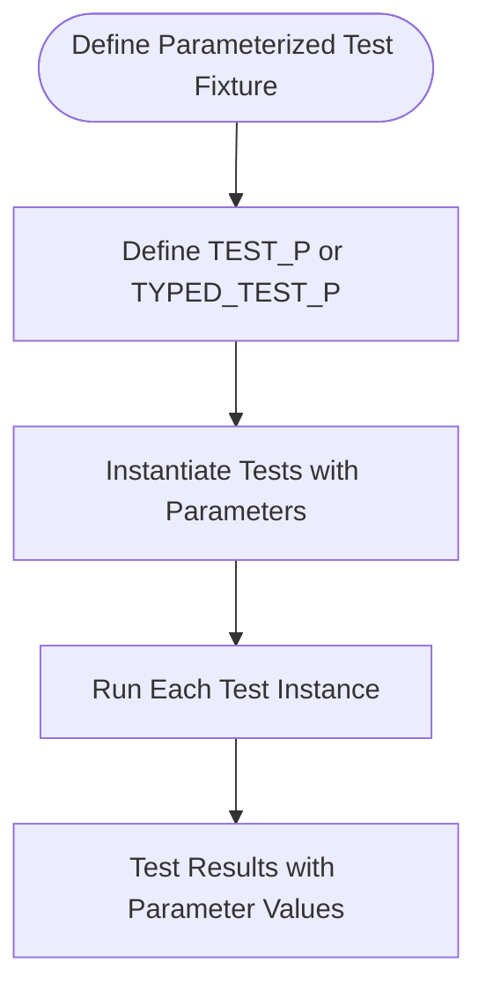

# Value- and Type-Parameterized Tests

GoogleTest empowers you to scale your test coverage and reduce duplication by enabling you to run test suites over multiple input values or types. This approach allows you to exercise your code under diverse scenarios with a single test definition, fostering more robust and maintainable tests.

---

## Understanding Value-Parameterized Tests

Value-parameterized tests let you define a test once and then run it multiple times with different input values. This approach is particularly useful when:

- You want to ensure your code behaves correctly across a range of input data.
- You need to validate behavior for different flag configurations or settings.
- You aim to test multiple implementations of the same interface.

### Creating a Value-Parameterized Test Fixture

Start by defining a test fixture class derived from `testing::TestWithParam<T>`, where `T` is the type of your input parameter. This base class combines `testing::Test` and `WithParamInterface<T>`, providing access to the parameter through the `GetParam()` method.

```cpp
class FooTest : public testing::TestWithParam<int> { 
  // Fixture setup goes here (optional)
};
```

### Defining Parameterized Tests

Use the `TEST_P` macro to define one or more tests using this fixture. Within each test, call `GetParam()` to retrieve the current parameter.

```cpp
TEST_P(FooTest, DoesSomething) {
  int value = GetParam();
  EXPECT_TRUE(SomeFunction(value));
}
```

### Instantiating the Test Suite with Parameters

Finally, instantiate your parameterized test suite using the `INSTANTIATE_TEST_SUITE_P` macro. You supply a name to distinguish this instantiation, the test suite name, and a parameter generator describing the values to test.

```cpp
INSTANTIATE_TEST_SUITE_P(MyInstantiation, FooTest,
                         testing::Values(1, 2, 3));
```

Some common parameter generators include:

| Generator         | Description                                  |
|-------------------|----------------------------------------------|
| `Range(start, end [, step])` | Yields a sequence from `start` to `end - 1` with optional `step` |
| `Values(v1, ..., vN)`          | Yields explicit listed values               |
| `ValuesIn(container or iterators)` | Yields values from a container or iterator range |
| `Bool()`                      | Yields `false` and `true`                    |
| `Combine(g1, ..., gN)`        | Yields Cartesian product of multiple generators |

### Example: Testing a Function with Various Inputs

```cpp
class IsEvenTest : public testing::TestWithParam<int> {};

TEST_P(IsEvenTest, ReturnsTrueForEvenNumbers) {
  int value = GetParam();
  EXPECT_EQ(value % 2, 0);
}

INSTANTIATE_TEST_SUITE_P(EvenNumbers, IsEvenTest, testing::Values(2, 4, 6, 8));
```

When you run this test suite, GoogleTest executes the test body for each value provided.

### Naming Parameterized Tests

By default, tests are named with the instantiation name as prefix, followed by the test suite and test names, and an index identifying the parameter instance:

```
EvenNumbers/IsEvenTest.ReturnsTrueForEvenNumbers/0
EvenNumbers/IsEvenTest.ReturnsTrueForEvenNumbers/1
... etc.
```

You can provide a custom function or functor to generate meaningful names for each test instance by supplying it as the optional fourth argument of `INSTANTIATE_TEST_SUITE_P`:

```cpp
INSTANTIATE_TEST_SUITE_P(
    NamedEvenNumbers, IsEvenTest, testing::Values(2, 4, 6),
    [](const testing::TestParamInfo<int>& info) {
      return "Value_" + std::to_string(info.param);
    });
```

This will generate test instances named:

```
NamedEvenNumbers/IsEvenTest.ReturnsTrueForEvenNumbers/Value_2
NamedEvenNumbers/IsEvenTest.ReturnsTrueForEvenNumbers/Value_4
NamedEvenNumbers/IsEvenTest.ReturnsTrueForEvenNumbers/Value_6
```

### Managing Test Fixture Setup

Remember that each instantiation runs as a separate test, creating a fresh fixture instance. If you need shared expensive setup or teardown for the entire suite, use static `SetUpTestSuite()` and `TearDownTestSuite()` methods declared `public`:

```cpp
class FooTest : public testing::TestWithParam<int> {
 public:
  static void SetUpTestSuite() { /* ... */ }
  static void TearDownTestSuite() { /* ... */ }
};
```


## Typed Tests

Typed tests let you write test logic once and run it with multiple types rather than runtime values. This suits scenarios like verifying multiple template specializations or implementations of the same interface.

### Creating a Typed Test Fixture

Define a fixture class template parameterized by a type `T`, derived from `testing::Test`:

```cpp
template <typename T>
class FooTest : public testing::Test {
 public:
  T value_;
};
```

### Specifying the Types to Test

Create a type list using `::testing::Types<...>` and associate it with your test fixture using the `TYPED_TEST_SUITE` macro:

```cpp
using MyTypes = ::testing::Types<int, double, char>;
TYPED_TEST_SUITE(FooTest, MyTypes);
```

### Defining Typed Tests

Use the `TYPED_TEST` macro to define tests over all types in the list. Inside the test, `TypeParam` refers to the current type.

```cpp
TYPED_TEST(FooTest, DoesSomething) {
  TypeParam x = this->value_;
  // Test logic using x
  EXPECT_TRUE(SomeCheck(x));
}
```

### Example

```cpp
template <typename T>
class NumericTest : public testing::Test {
 public:
  T value_ = T(5);
};

using NumericTypes = ::testing::Types<int, float, double>;
TYPED_TEST_SUITE(NumericTest, NumericTypes);

TYPED_TEST(NumericTest, IsPositive) {
  EXPECT_GT(this->value_, 0);
}
```

When the test suite runs, GoogleTest instantiates the test logic for each type.


## Type-Parameterized Tests

Type-parameterized tests are similar to typed tests but more flexible. They allow defining an abstract test pattern first and instantiating it with various type lists later — none or multiple times, including from different translation units.

This is particularly useful for defining interface or concept compliance test suites.

### Defining Type-Parameterized Tests

Start with a class template fixture derived from `testing::Test`:

```cpp
template <typename T>
class FooTest : public testing::Test {
 protected:
  void DoSomething();
};
```

Declare the test suite with `TYPED_TEST_SUITE_P`:

```cpp
TYPED_TEST_SUITE_P(FooTest);
```

Define tests with `TYPED_TEST_P`:

```cpp
TYPED_TEST_P(FooTest, DoesBlah) {
  TypeParam var{};
  this->DoSomething();
  EXPECT_TRUE(Check(var));
}

TYPED_TEST_P(FooTest, HasPropertyA) {
  EXPECT_TRUE(HasPropertyA<TypeParam>());
}
```

Register all test names:

```cpp
REGISTER_TYPED_TEST_SUITE_P(FooTest, DoesBlah, HasPropertyA);
```

### Instantiating Type-Parameterized Tests

Finally, instantiate with a list of types via `INSTANTIATE_TYPED_TEST_SUITE_P`:

```cpp
using Implementations = ::testing::Types<MyClass1, MyClass2, MyClass3>;
INSTANTIATE_TYPED_TEST_SUITE_P(MyImpls, FooTest, Implementations);
```

This creates named tests combining the prefix `MyImpls` and test suite `FooTest`.

### Example

```cpp
template <typename T>
class StorageTest : public testing::Test {
  void Reset();
};

TYPED_TEST_SUITE_P(StorageTest);

TYPED_TEST_P(StorageTest, IsEmptyInitially) {
  EXPECT_TRUE(this->IsEmpty());
}

REGISTER_TYPED_TEST_SUITE_P(StorageTest, IsEmptyInitially);

using DataTypes = ::testing::Types<int, float, double>;
INSTANTIATE_TYPED_TEST_SUITE_P(MyDataTypes, StorageTest, DataTypes);
```


---

## Best Practices and Tips

- **Use parameterized tests to avoid code duplication.** When similar testing logic applies to multiple inputs or types, parameterized tests reduce maintenance and surface errors efficiently.

- **Choose between value- and type-parameterized testing wisely.** Use value-parameterized tests when varying inputs of the same type; use typed or type-parameterized tests for varying data types or implementations.

- **Provide meaningful test names.** Custom name generators improve test reports and ease debugging.

- **Manage fixture setup carefully.** Shared resources across parameterized tests should be initialized/cleaned at the test suite scope.

- **Keep test parameters simple and copyable.** Complex lifetime management for parameters can lead to flaky or leaking tests.


## Troubleshooting Common Issues

- **Tests running zero times:** If you forget to instantiate a parameterized test suite with `INSTANTIATE_TEST_SUITE_P` or `INSTANTIATE_TYPED_TEST_SUITE_P`, GoogleTest will report zero tests run. Use `GTEST_ALLOW_UNINSTANTIATED_PARAMETERIZED_TEST` to suppress erroneous failures if this is intentional.

- **Invalid test names:** Generated test names must be alphanumeric and unique. Avoid special characters or spaces.

- **Dangling references in lambdas:** When using `ConvertGenerator` with lambdas, ensure the lambda’s parameter types do not cause dangling references, especially with string views.

- **Name collisions:** Instantiations must have unique prefixes to avoid overlapping test names.


## Summary Diagram of Parameterized Test Flow



---

## Further Reading & Related Documentation

- [Value-Parameterized Tests in Advanced Guide](../advanced.md#value-parameterized-tests)
- [Typed and Type-Parameterized Tests](../advanced.md#typed-tests) and [Type-Parameterized Tests](../advanced.md#type-parameterized-tests)
- [`INSTANTIATE_TEST_SUITE_P` Usage](../reference/testing.md#INSTANTIATE_TEST_SUITE_P)
- [`TEST_P` Macro](../reference/testing.md#TEST_P)
- [`TYPED_TEST_SUITE` and `TYPED_TEST` Macros](../reference/testing.md#TYPED_TEST_SUITE)
- [GoogleTest Primer](../primer.md) for foundational concepts

---

This page focuses exclusively on the concepts and user workflows around value- and type-parameterized tests to help you scale your testing efforts without redundant code and to build more comprehensive, maintainable test suites.