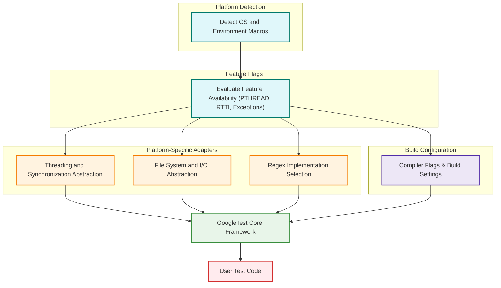

# Platform Abstraction and Portability

GoogleTest embodies a robust platform abstraction architecture that enables it to operate seamlessly across a wide variety of operating systems, compilers, and hardware environments. This design ensures that developers writing C++ tests can rely on consistent behavior regardless of the underlying platform specifics.

---

## Why Platform Portability Matters

In modern software development, projects often span multiple platforms—Linux, Windows, macOS, embedded systems, and more. Writing tests that only work on one platform severely limits the value of those tests and complicates continuous integration workflows. GoogleTest solves this challenge by abstracting low-level platform differences, providing a unified interface for critical operations like threading, synchronization, environment queries, and file system interactions.

Through abstraction, users avoid platform-specific pitfalls and plumbing. Instead, they focus on test logic and correctness, trusting GoogleTest to handle the nuances internally.

---

## Core Architecture of Platform Abstraction

GoogleTest implements portability primarily through its internal `gtest-port.h` and `gtest-port-arch.h` headers, which:

- **Detect Platform and Environment:** Identify the OS, compiler, and architecture at compile-time using macros such as `GTEST_OS_LINUX`, `GTEST_OS_WINDOWS`, `GTEST_OS_MAC`, among many others.

- **Feature Flags:** Define feature availability macros (e.g., `GTEST_HAS_PTHREAD`, `GTEST_HAS_EXCEPTIONS`, `GTEST_HAS_RTTI`) that tailor GoogleTest's functionality to the capabilities of the target platform and toolchain.

- **Abstract System APIs:** Provide wrappers for lower-level system functions like file I/O, thread management, mutexes, and condition variables through platform-specific implementations hidden behind uniform interfaces.

- **Customized Compilation:** Use compile-time checks to enforce minimum compiler versions (e.g., requiring Visual C++ 2015 or later for Windows) and to adapt compiler flags accordingly via build system integration (CMake scripts).

These layers combine to create a consistent runtime environment for testing on disparate platforms.

---

## Environment Detection and Macros

GoogleTest uses a comprehensive macro-based detection mechanism defined in `gtest-port-arch.h`. This component recognizes many operating systems and platform flavors, including less common ones like QNX, Solaris, and mobile operating systems.

Example macros include:

- `GTEST_OS_WINDOWS` with subdivisions like `GTEST_OS_WINDOWS_DESKTOP` and `GTEST_OS_WINDOWS_PHONE`.
- `GTEST_OS_LINUX` and `GTEST_OS_LINUX_ANDROID`.
- `GTEST_OS_MAC` and `GTEST_OS_IOS`.

This information is critical for GoogleTest to enable platform-specific code paths and optimize feature support.

---

## Threading and Synchronization Abstraction

Testing code reliably in multi-threaded scenarios demands robust synchronization primitives. GoogleTest internally abstracts thread primitives, exposing mutexes, locks, and thread-local storage suitable for the platform:

- On **POSIX platforms** with pthreads, GoogleTest wraps `pthread_mutex_t`, `pthread_key_t`, and other pthread primitives.

- On **Windows**, it utilizes native synchronization objects such as `CRITICAL_SECTION` while avoiding including heavy headers like `<windows.h>` where possible.

- On platforms lacking threading support, dummy implementations are provided to maintain API consistency without concurrency guarantees.

Users writing tests will almost never interact with these details, but can rely on thread-safety and mutex support backed by these abstractions.

---

## File System and I/O Portability

GoogleTest detects file system availability through macros like `GTEST_HAS_FILE_SYSTEM` and provides abstractions for filesystem operations such as:

- Opening files with encoding considerations on Windows.
- Directory operations like removing directories.
- File descriptor and handle abstractions to manage platform differences (e.g., `_fileno()` on Windows vs `fileno()` on POSIX).

This portability ensures features like temporary file creation, test result logging, and death-test file operations behave consistently.

---

## Exception and RTTI Support

GoogleTest evaluates compiler support for exceptions and RTTI (Run-Time Type Information) through macros like:

- `GTEST_HAS_EXCEPTIONS` to detect if exception handling is supported/enabled.
- `GTEST_HAS_RTTI` which adapts to MSVC, GCC, Clang, and other toolchains.

This detection affects test frameworks’ use of features like typed tests, dynamic casting, and exception assertions.

---

## Regex and String Handling

GoogleTest employs a flexible regex implementation strategy:

- Uses **Abseil (RE2)** if available, favored for modern C++ platforms.
- Falls back to **POSIX regex** on Unix-like systems.
- Defaults to a simplified regex implementation where others are not available.

This design guarantees that complex test assertions involving regular expressions are portable.

---

## Customization and Extensibility

To cater to unique platform needs, GoogleTest exposes customization points through internal headers (`gtest-port.h`, `gmock-port.h`) and a `custom` directory for overrides:

- Users can supply alternate implementations for logging, threading, and platform features.
- Platform or environment-specific tweaks can be applied without modifying core source code.

---

## CMake Integration for Portability

GoogleTest’s build system, primarily driven by CMake, includes portability-aware configurations:

- Compiler and linker flags are adjusted based on the platform and compiler detected.
- Windows builds modify default runtime linkage to avoid conflicts between dynamic and static CRTs.
- Build targets are set up to link pthread and other system libraries only when available.

This integration streamlines building GoogleTest and GoogleMock in a cross-platform manner.

---

## Practical Tips and Best Practices

- **Check Platform Macro Definitions:** When porting tests or troubleshooting build issues, inspecting macros such as `GTEST_OS_*` and `GTEST_HAS_*` helps identify platform-specific disables or feature gaps.

- **Avoid Direct Use of Internal Macros:** Macros with trailing underscores are for internal use; rely on public APIs to maintain forward compatibility.

- **Use Provided Build Scripts:** Leverage CMake options to automatically configure your build environment for the target platform.

- **Be Mindful of Thread Safety:** Even with threading abstractions, certain platforms or configurations might affect thread safety. Review `GTEST_IS_THREADSAFE` status for your build.

---

## Troubleshooting Portability Issues

**Problem:** Compilation fails due to missing pthreads or unsupported compiler.

- **Solution:** Ensure platform detection macros are correctly set or overridden in your build scripts; configure build options accordingly.

**Problem:** Test output is garbled or logging behaves unexpectedly on Windows.

- **Solution:** Confirm that the build uses the appropriate character encoding and that compiler flags for Unicode are properly set.

**Problem:** Exception or RTTI-based tests don't work as expected.

- **Solution:** Verify that `GTEST_HAS_EXCEPTIONS` and `GTEST_HAS_RTTI` macros accurately reflect your compiler’s capabilities; adjust compiler flags if necessary.

---

## Visual Representation of GoogleTest's Portability Abstraction

---

## Summary

GoogleTest's platform abstraction and portability layer form the backbone that guarantees its consistent operation across diverse environments. By combining rigorous environment detection, adaptive feature management, abstraction of system primitives, and a portable build configuration, GoogleTest delivers a unified testing experience to C++ developers everywhere.

This design not only simplifies cross-platform testing but also empowers users to write robust, maintainable test suites without entangling themselves in platform-specific complexity.

---

For practical guidance on setting up GoogleTest in your environment, refer to the [System Requirements & Supported Platforms](/getting-started/gs-prerequisites-installation/gs-system-requirements) and build integration sections. For a deeper dive into internal workings, explore the detailed source headers: `gtest-port.h`, `gtest-port-arch.h`, and corresponding build scripts.

<Tip>
Use GoogleTest's platform abstraction to confidently write tests that "just work" on Linux, Windows, macOS, and embedded targets without modification.
</Tip>

---

## Additional Resources

- [GoogleTest Primer](docs/primer.md) — Learn core testing concepts.
- [System Requirements & Supported Platforms](getting-started/gs-prerequisites-installation/gs-system-requirements) — Understand supported environments.
- [Integrating GoogleTest/GoogleMock with Your Build System](guides/integration-advanced/integrating-build-systems) — Practical setup for cross-platform testing.
- [Customizing GoogleTest and GoogleMock for Special Platforms](googletest/include/gtest/internal/custom/README.md) — Extend or override default abstractions.

---

## Frequently Asked Questions

<AccordionGroup title="Platform Portability FAQs">
<Accordion title="How does GoogleTest detect the current platform?">
GoogleTest uses a comprehensive set of predefined macros to detect operating systems and platform characteristics during compilation, defined primarily in `gtest-port-arch.h`. This includes OS family macros, versions, and environment features.
</Accordion>
<Accordion title="Can I override platform detection?">
Yes, through custom build configurations or defining preprocessor macros before including GoogleTest headers, users can influence platform detection to support unusual or cross-compilation environments.
</Accordion>
<Accordion title="Is GoogleTest fully thread-safe on all platforms?">
GoogleTest strives to be thread-safe where underlying platform support exists. Thread-safety is generally enabled when pthreads or Windows threading APIs are available and properly configured. Check the `GTEST_IS_THREADSAFE` macro to verify.
</Accordion>
<Accordion title="What happens if my platform lacks certain features?">
GoogleTest gracefully disables or provides fallback implementations for missing features. For example, if exceptions or RTTI are unavailable, related test features adjust accordingly.
</Accordion>
</AccordionGroup>

---

This concludes the detailed concepts guide on GoogleTest's platform abstraction and portability.
