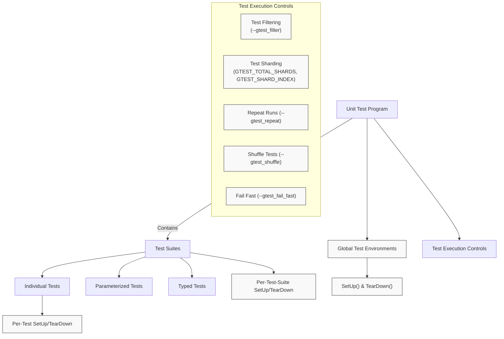

# Scalability and Performance Considerations

GoogleTest and GoogleMock are designed to support projects of all sizes, from small modules to large-scale codebases with thousands of tests. This page highlights key scalability and performance considerations that help you maintain efficient test runs, rapid feedback cycles, and sound software quality practices as your test suite grows.

---

## Understanding Scalability Challenges

As your codebase and test suite grow, tests may become slower, more resource-intensive, or harder to maintain. Performance issues often arise due to:

- **Test setup and teardown overhead**, especially when expensive resources are involved.
- **Inefficient test case execution patterns**, such as duplicate checks or unshared resources.
- **Ineffective test filtering or selection mechanisms**, causing more tests than necessary to run.
- **Suboptimal use of parameterized and typed tests**, leading to overly large or slow test suites.

GoogleTest and GoogleMock provide features and patterns to overcome these challenges, empowering you to build scalable test infrastructures.

---

## Efficient Test Execution Options

GoogleTest offers several execution control features that optimize runtime and deliver fast feedback:

### Selective Test Runs with Filters

Use the `--gtest_filter` flag or the `GTEST_FILTER` environment variable to run only subsets of tests matching specific name patterns. This lets you iterate quickly during development without running the entire suite.

**Example:**

```shell
./my_test_binary --gtest_filter=WidgetTest.*
```

This runs all tests in the `WidgetTest` test suite.

### Test Sharding

For very large suites, distribute tests across multiple machines or processes using sharding via the environment variables:

- `GTEST_TOTAL_SHARDS`: Total number of shards
- `GTEST_SHARD_INDEX`: Index of the current shard (zero-based)

Each shard runs only a portion of the tests, allowing parallel execution and faster aggregate test completion.

### Repeating, Shuffling, and Failing Fast

- **Repeat Tests:** Use `--gtest_repeat=N` to run your tests multiple times, useful for catching flaky failures.
- **Shuffle Tests:** Use `--gtest_shuffle` to randomize test execution order and detect inter-test dependencies.
- **Fail Fast:** Use `--gtest_fail_fast` to stop execution upon the first test failure, speeding feedback during debugging.

### Skipping and Disabling Tests

- Temporarily disable tests by prefixing their names with `DISABLED_` to exclude them from runs.
- Use `GTEST_SKIP()` macro inside tests or fixtures to skip tests at runtime based on dynamic conditions.

---

## Strategies for Faster Set-Up and Tear-Down

### Per-Test vs. Per-Test-Suite Setup

GoogleTest instantiates a fresh test fixture object for each test to ensure isolation. However, if expensive resources are shared without mutation, use **per-test-suite setup and teardown** methods to reuse those resources:

```cpp
class FooTest : public ::testing::Test {
 protected:
  static void SetUpTestSuite() {
    expensive_resource_ptr = new ExpensiveResource(...);
  }

  static void TearDownTestSuite() {
    delete expensive_resource_ptr;
    expensive_resource_ptr = nullptr;
  }

  void SetUp() override {
    // Per-test initialization
  }

  static ExpensiveResource* expensive_resource_ptr;
};

ExpensiveResource* FooTest::expensive_resource_ptr = nullptr;
```

This avoids costly repeated construction for each test.

### Global Environments

Use [`::testing::Environment`](../advanced.md#global-set-up-and-tear-down) classes for resources shared across all test suites. Register them before tests run using `AddGlobalTestEnvironment()`.

---

## Leveraging Parameterized and Typed Tests for Scalability

Parameterized and typed tests enable reuse of test logic over multiple inputs or types without duplication:

- **Value-Parameterized Tests (`TEST_P`):** Run the same test logic for multiple input values.
- **Typed Tests (`TYPED_TEST`):** Run the same logic for different types.
- **Type-Parameterized Tests (`TYPED_TEST_P`):** Define generic tests to be instantiated with type lists later.

Proper use of these features can reduce maintenance burden, increase coverage, and prevent code duplication.

### Best Practices for Parameterized Tests

- Name parameters uniquely using custom name generators to aid test identification.
- Avoid generating overly large test parameter spaces which can slow down runs.
- Combine parameterized with typed tests judiciously for complex scenarios.

---

## Performance Tuning Techniques

### Parallel Test Execution

While GoogleTest does not directly provide parallel execution within a single test binary, you can:

- Split test functions using sharding.
- Use external parallel test runners such as `gtest-parallel`.

### Avoiding Flaky Tests

Flaky tests slow down feedback and erode confidence. Use:

- Repeat runs (`--gtest_repeat`) to detect flakes.
- Isolation strategies like fresh fixtures and avoidance of shared state.

### Monitoring Test Duration

Generate XML or JSON reports with timing information using `--gtest_output=...`. Identify slow tests and optimize or isolate them.

---

## Troubleshooting Common Scalability Issues

- **Tests running too slowly:** Check for expensive setup or large parameter spaces. Use per-test-suite setup and test filters.
- **Flaky tests:** Investigate shared or mutable global state and race conditions.
- **High resource usage:** Consider running subsets with filters and splitting tests using sharding.
- **Tests not running when expected:** Verify your filters and disabled tests, and confirm instantiations of parameterized tests.

For deeper troubleshooting guidance, see the [Troubleshooting Common Issues](../getting-started/troubleshooting/common-issues) page.

---

## Summary

Scalability and performance considerations are essential to maintaining rapid, reliable feedback and manageable test suites as your project grows. Use GoogleTest's selective execution, setup-sharing techniques, and advanced test patterns to build efficient, high-quality C++ testing infrastructures.

---

## References and Further Reading

- [GoogleTest Primer](../overview/introduction-and-value/what-is-googletest) — basics of writing tests
- [Advanced GoogleTest Topics](../docs/advanced.md) — deeper insights into features and patterns
- [Parameterized and Typed Tests](../concepts/advanced-models-and-scalability/parameterized-and-typed-tests) — detailed guide to scalable test models
- [Integrating with Build Tools](../guides/integration-and-best-practices/build-integration) — to incorporate testing into your build and CI pipelines
- [Test Performance and Parallel Runs](../guides/integration-and-best-practices/test-performance) — practical tips for speed and efficiency
- [Troubleshooting Common Issues](../getting-started/troubleshooting/common-issues) — problem diagnostics and fixes

---

### Diagram: How Tests Fit Into Scalability Strategies



---

<Tip>
For maximum scalability, design your test fixtures with clear separation between expensive shared resources and lightweight per-test objects. Use parameterized and typed tests to reduce duplication and enhance coverage.
</Tip>

<Note>
Filter and shard your test executions especially in CI environments to speed up build feedback and resource usage.
</Note>

<Warning>
Be cautious when using death tests in large multi-threaded environments—they can complicate parallel execution and test stability.
</Warning>

---