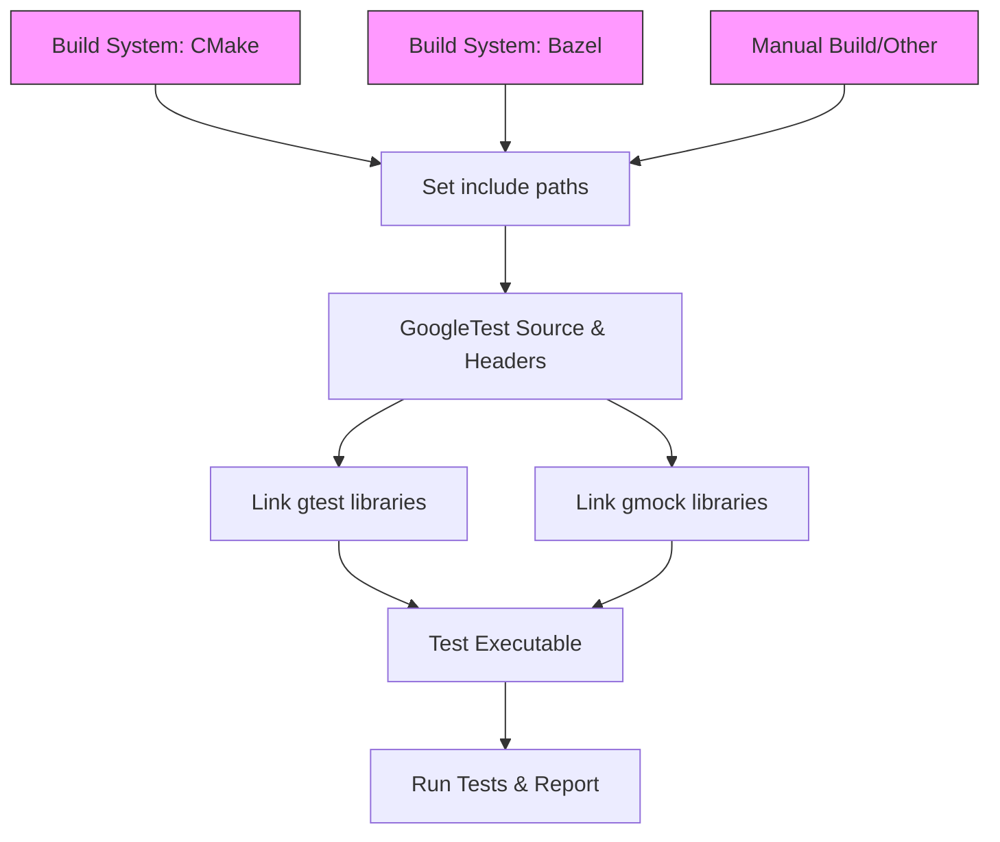

# Integration, Scalability, and Portability

Explore GoogleTest’s integration patterns for different build environments and C++ toolchains, including portability abstractions, dependency management, and scalability considerations for large and diverse codebases.

---

## Introduction

As your C++ projects grow and evolve, efficient integration of GoogleTest into your build environment becomes essential. This page guides you through the integration patterns, portability abstractions, and scalability considerations important for incorporating GoogleTest across various platforms, toolchains, and build systems. Understanding these concepts will help you achieve smooth dependency management and maintain test reliability at scale.

Whether you are building small projects or complex codebases with diverse components, this guide outlines actionable insights to help you successfully embed GoogleTest for robust and portable automated testing.

---

## Integration Patterns for Different Build Environments

GoogleTest is designed to integrate seamlessly into multiple C++ build environments with minimal friction. The framework offers key integration points and patterns tailored for popular build tools:

### CMake Integration

- GoogleTest provides support for easy incorporation via CMake scripts.
- Users can add external projects or fetch GoogleTest as a submodule, then link it as a dependency for test targets.
- The recommended usage involves `FetchContent` or `ExternalProject_Add` followed by linking `gtest` and `gmock` libraries.
- Enables modular builds where test execution binaries are configured with full dependency resolution.

### Bazel Integration

- GoogleTest includes native Bazel rules, simplifying use in Bazel-based projects.
- Provides predefined test targets and seamless dependency graphs.
- Supports distributed and parallelized test executions common in large organizations.

### Manual Build and Linking

- For custom or legacy build environments, GoogleTest allows manual compilation and linking.
- Users must ensure all GoogleTest source files and dependencies are added explicitly.
- This approach requires users to manage compile flags, include paths, and linkage order carefully.
- Manual build is helpful for embedded systems or niche toolchains without automated build support.

### Continuous Integration (CI) Support

- GoogleTest complements automation pipelines and CI/CD workflows.
- Supports XML and JSON output formats for integration with dashboards and reporting tools.
- Supports filtering and sharding test execution to optimize runs in distributed CI environments.

<Check>
For best results, prefer CMake or Bazel integration patterns to leverage GoogleTest’s automated configuration and dependency management features.
</Check>

---

## Portability Abstractions

GoogleTest is tailored for broad platform compatibility through well-designed portability layers:

### Platform Detection and Environment Macros

- GoogleTest internally detects the compilation platform using macros such as `GTEST_OS_LINUX`, `GTEST_OS_WINDOWS`, `GTEST_OS_MAC`, and more.
- These macros enable conditional compilation to accommodate platform-specific features and constraints.

### Compiler Feature Flags and Support

- Detects compiler capabilities such as available C++ features, exception support, thread safety, and RTTI.
- Enables or disables features accordingly to ensure the framework works consistently.

### Threading and Synchronization Primitives

- Abstracts platform-specific mutexes, locks, and thread-local storage,
- Ensures thread-safe test registration and execution across POSIX, Windows, and embedded platforms.

### Filesystem and Regular Expression Utilities

- Provides platform-adapted file system operations for temp directories, file I/O, and path separators.
- Uses either POSIX regex, RE2, or a simple regex engine depending on platform and dependencies.

### Logging and Output Handling

- Abstracts logging facilities compatible with diverse environments.
- Captures and redirects standard output and error for test diagnostics.

---

## Dependency Management Considerations

Managing the dependencies of GoogleTest is crucial for smooth integration:

- GoogleTest depends on C++11 or newer environments.
- It requires minimal external dependencies, but can integrate with Abseil and RE2 if available.
- GoogleTest’s internal modularization allows linking only the necessary parts (e.g., linking `gtest_main` for default `main()` function).
- When using mocks, linking with GoogleMock (`gmock` and `gmock_main`) is required.
- Properly include headers (`<gtest/gtest.h>`, `<gmock/gmock.h>`) and configure include paths.

<Warning>
Incorrectly managing GoogleTest and GoogleMock linkage can lead to unresolved symbols or duplicate symbols errors.
Always ensure your build system links the needed libraries in the right order.
</Warning>

---

## Scalability for Large and Diverse Codebases

Large projects often have complex, multiplatform codebases with numerous dependencies. GoogleTest’s design supports this through:

### Automated Test Discovery

- GoogleTest automatically discovers tests registered with its macros without requiring explicit enumeration.
- This mechanism facilitates scaling test suites as the codebase grows without manual test list maintenance.

### Modular Test Suites

- Organize tests into suites and fixtures reflecting code modules.
- Enables targeted test runs to speed up debugging and development.

### Parallel and Distributed Execution

- Support for running subsets of tests in parallel or sharding tests across machines.
- Allows scaling test execution infrastructure efficiently.

### Configurable Output and Reporting

- XML and JSON formats for CI pipeline integration.
- Filtering by test name and test suite enhances large test management.

### Maintainability

- Use of parameterized and typed tests reduces redundant code.
- Built-in mocking and extensibility reduce the number of handwritten stubs.

---

## Practical Tips and Best Practices

- **Integrate Early:** Set up GoogleTest integration at the project outset.
- **Leverage Existing Build Support:** Use CMake or Bazel integration modules where available for easier maintenance.
- **Use Portability APIs:** When writing custom extensions or extensions, use GoogleTest’s portability layers to maintain cross-platform behavior.
- **Modularize Tests:** Group tests meaningfully to aid scalability and clarity.
- **Use Mocking Judiciously:** Integrate GoogleMock when interaction verification is needed. Follow best practices to avoid brittle tests.
- **Manage Test Output:** Use filtering and output formats for scalable reporting.

---

## Troubleshooting Common Integration Issues

<AccordionGroup title="Common Integration Challenges">
<Accordion title="Linker Errors or Missing Symbols">
Check that your build links against `gtest`, `gtest_main`, `gmock`, or `gmock_main` as needed. Verify include and library paths. Prefer CMake or Bazel where linkage is declarative.
</Accordion>
<Accordion title="Tests Not Discovered or Run">
Ensure tests use the proper `TEST` or `TEST_F` macros and that GoogleTest is initialized correctly by `InitGoogleTest()` or `InitGoogleMock()`.
</Accordion>
<Accordion title="Platform-Specific Build Failures">
If your environment is embedded or nonstandard, verify platform detection macros and override as necessary. Confirm that threading and file system abstractions suit your platform.
</Accordion>
<Accordion title="Inconsistent Test Execution or Output">
Confirm you run tests via `RUN_ALL_TESTS()` and avoid re-invoking initialization functions multiple times.
</Accordion>
</AccordionGroup>

---

## Additional Resources

- Explore the **[Integration and Extensibility](https://github.com/google/googletest/blob/main/docs/overview/architecture-concepts/integration-and-dependencies.md)** page for details on build system integration.
- Consult the **[Supported Platforms](https://github.com/google/googletest/blob/main/docs/overview/feature-highlight/supported-platforms.md)** documentation for platform compatibility.
- Review **Getting Started Installation guides** under CMake and Bazel for practical setup instructions.
- For mocking and interaction testing, see **GoogleMock documentation**.

---

## Summary

Effective integration, scalability, and portability are vital to successfully using GoogleTest in diverse C++ environments. By adopting recommended integration patterns, leveraging portability APIs, and embracing modular test organization, users can maintain robust, maintainable, and efficient testing workflows as projects grow.

---

<Info>
For comprehensive understanding, pairing this concepts guide with practical integration guides and build instructions is strongly recommended.
</Info>

---

### Mermaid Diagram: Simplified Integration Flow

