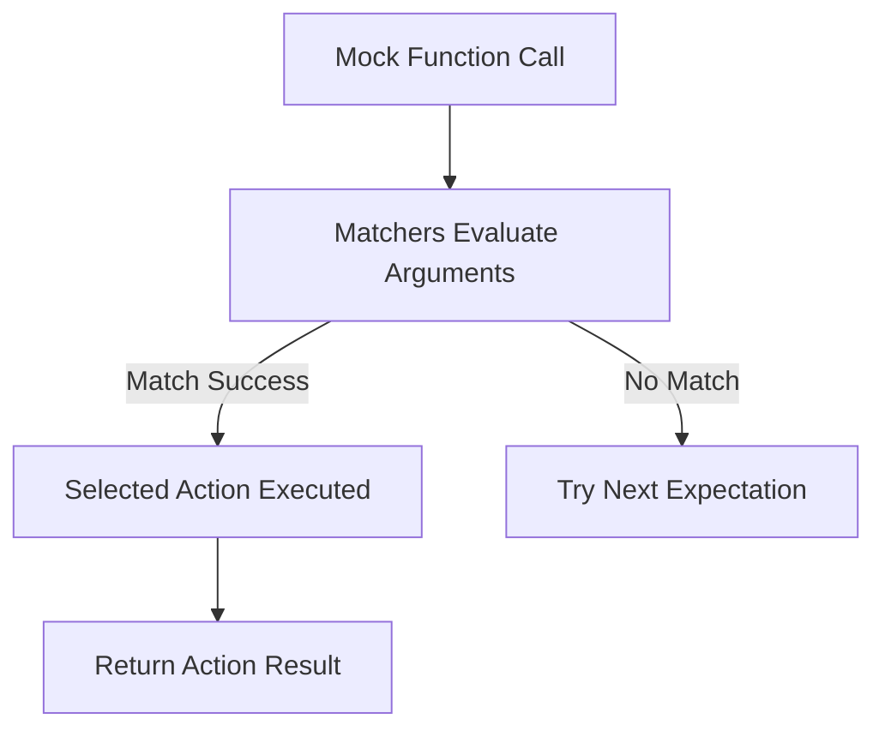

# Matchers and Actions: Composition and Reuse

GoogleTest and GoogleMock empower you with a robust set of matcher and action frameworks that enable expressive, intention-revealing, and reusable test specifications. This guide explains how matchers and actions work as composable building blocks to specify argument validation and mock method behavior precisely. Learn how to combine, customize, and share matchers and actions effectively to write clear and maintainable tests.

---

## Understanding Matchers

Matchers are predicates that test whether a function argument satisfies a condition. They are central to specifying expectations on mock method calls and writing expressive assertions.

### Key Features of Matchers

- **Typed Predicates:** Matchers are statically typed and provide compile-time type safety.
- **Composable:** You can combine simple matchers to form complex conditions using logical operators.
- **Polymorphic:** Polymorphic matchers can be applied to arguments of different compatible types.
- **Pure Functions:** Matchers are pure, side-effect-free predicates, ensuring safe reuse.
- **Explainable Failures:** They provide human-readable descriptions and can explain failures with detailed diagnostics.

### Types of Built-in Matchers

GoogleMock provides many matcher categories including:

- **Generic Matchers:** `_` (wildcard), `Eq()`, `Ne()`, `Lt()`, `Gt()`, `Le()`, `Ge()`
- **Pointer and Reference Matchers:** `NotNull()`, `IsNull()`, `Pointee()`, `Ref()`
- **String Matchers:** `StrEq()`, `StrNe()`, `StartsWith()`, `EndsWith()`, `HasSubstr()`
- **Container Matchers:** `ElementsAre()`, `UnorderedElementsAre()`, `Contains()`, `IsSubsetOf()`, `IsSupersetOf()`, `ContainerEq()`
- **Member and Property Matchers:** `Field()`, `Property()`
- **Exception Matchers:** Used in conjunction with `EXPECT_THROW` or similar

### Composing Matchers

Matchers can be combined to reflect complex expectations:

- **Logical AND:** `AllOf(m1, m2, ..., mn)` succeeds if all sub-matchers succeed.
- **Logical OR:** `AnyOf(m1, m2, ..., mn)` succeeds if any sub-matcher succeeds.
- **Negation:** `Not(m)` succeeds if the sub-matcher `m` fails.

### Using Matchers on Multiple Arguments

Sometimes the relationship between arguments matters. Use the `.With()` clause combined with multi-argument matchers (which operate on a tuple of arguments) to express inter-argument dependencies:

```cpp
using ::testing::_;
using ::testing::Lt;

EXPECT_CALL(mock, Func(_, _))
    .With(Lt());  // Expects first argument < second argument
```

Use `Args<N1, N2, ..., Nk>(matcher)` to apply matchers to selected arguments.

### Custom Matchers

GoogleMock lets you create custom matchers for specialized validation either through:

- **Matcher Macros** (e.g., `MATCHER`, `MATCHER_P`)
- **Matcher Classes** implementing the matcher interface

Custom matchers integrate fully with GoogleMock's explanation and reporting infrastructure.

---

## Understanding Actions

Actions control what a mocked method does when invoked, affecting return values and side effects.

### Core Action Types

GoogleMock supports many built-in actions, including:

- **Return Actions:** `Return(value)`, `ReturnRef(variable)`, `ReturnPointee(pointer)`
- **Side Effect Actions:** `SetArgPointee<N>(value)`, `SetArrayArgument<N>(first, last)`, `Assign(&variable, value)`, `DeleteArg<N>()`
- **Exception Actions:** `Throw(exception)`
- **Invoke Actions:** `Invoke(function)`, `Invoke(object_pointer, &class::method)`, `InvokeWithoutArgs(...)`, `InvokeArgument<N>(args...)`
- **Composite Actions:** `DoAll(a1, ..., an)`, `IgnoreResult(action)`

### Specifying Default and Expected Actions

- Use `ON_CALL()` to specify default behavior for all calls matching given argument matchers.
- Use `EXPECT_CALL()` with `.WillOnce()` and `.WillRepeatedly()` to specify the behavior for expected calls.

### Combining and Transforming Actions

Actions can be combined, adapted, and parameterized:

- Chain multiple actions with `DoAll()`, where only the last action's return value is used.
- Use `WithArg<N>(action)` or `WithArgs<N1, N2>(action)` to pass selected arguments to another action.
- Use `WithoutArgs(action)` to call an action ignoring all arguments.
- Use `IgnoreResult(action)` to convert an action that returns a value into a void-returning action.

### Using Callables as Actions

Functions, functors, lambdas, and `std::function` objects can be used directly as actions via `Invoke()`. This offers expressive ways to customize mock behavior:

```cpp
EXPECT_CALL(mock, Compute(_))
    .WillOnce(Invoke([](int x) { return x * x; }));
```

### Defining Custom Actions

- Use the `ACTION` and `ACTION_P*` macros for quick definitions.
- Implement the `ActionInterface<F>` interface for advanced use cases.
- Use `MakePolymorphicAction()` to create polymorphic actions usable with multiple function signatures.

---

## Composition and Reuse

### Sharing Matchers and Actions

Matchers and actions are typically implemented as reference-counted objects. Copying them is lightweight and safe, promoting reuse across expectations and tests. Define complex predicates and behaviors once and share them conveniently.

### Progressive Disclosure in Tests

Start with simple matchers and actions. When more nuance is needed, refine expectations with composed matchers, predicates, and chained actions.

### Best Practices

- Use expressive matchers to specify exactly what matters; avoid over-specification.
- Prefer `ON_CALL()` for common default behaviors; reserve `EXPECT_CALL()` for calls you want to verify.
- Use sequences (`InSequence`) and partial ordering (`After()`) to express call order where relevant.
- Define custom matchers and actions to capture domain-specific logic clearly.

### Troubleshooting Common Pitfalls

- Be aware matchers are pure — avoid side effects inside them.
- The order of `EXPECT_CALL` statements matters; later expectations override earlier ones.
- When using actions returning references or values that change, prefer `ReturnRef()` or `ReturnPointee()` to ensure updated values are returned.
- Use `.RetiresOnSaturation()` with expectations to avoid sticky expectations causing upper-bound errors.

---

## Practical Example

```cpp
using ::testing::_;  // Matches anything
using ::testing::Return;
using ::testing::Field;
using ::testing::Invoke;

class Foo {
 public:
  virtual ~Foo() {}
  virtual int Bar(const std::string& s) = 0;
  virtual int Baz(int x, int y) = 0;
};

class MockFoo : public Foo {
 public:
  MOCK_METHOD(int, Bar, (const std::string& s), (override));
  MOCK_METHOD(int, Baz, (int x, int y), (override));
};

// Custom matcher for strings starting with "Hello"
MATCHER(StartsWithHello, "String starting with 'Hello'") {
  return arg.find("Hello") == 0;
}

// Action that returns sum of arguments
auto SumAction = [](int x, int y) { return x + y; };

// Test
TEST(FooTest, UsesMatchersAndActions) {
  MockFoo mock;

  ON_CALL(mock, Bar(_))
      .WillByDefault(Return(42));

  EXPECT_CALL(mock, Bar(StartsWithHello()));

  EXPECT_CALL(mock, Baz(_, _))
      .WillOnce(Invoke(SumAction));

  EXPECT_EQ(mock.Bar("Hello World"), 42);
  EXPECT_EQ(mock.Baz(3, 4), 7);
}
```

---

## Visualizing Matcher and Action Flow




---

## Additional Resources

- [Actions Reference](../reference/actions.md): Comprehensive list of built-in actions.
- [Matchers API](../reference/matching.md): Detailed overview of matchers and examples.
- [gMock Cookbook](../gmock_cook_book.md): Practical guides on using matchers and actions.
- [Mocking Reference](../reference/mocking.md): Mocking primitives including expectations, sequences, and more.


---

By mastering the composition and reuse of matchers and actions, GoogleTest users can craft precise, maintainable, and intention-revealing tests that effectively verify complex interactions without sacrificing readability or flexibility.

---

# Glossary

| Term       | Definition |
|------------|------------|
| Matcher    | A predicate that verifies whether a function argument satisfies a condition.
| Action     | A behavior executed when a mock method is called.
| Polymorphic Matcher | A matcher template that works with multiple argument types.
| Composite Action | An action composed of multiple sub-actions, executed in sequence.
| Uninteresting Call | A call to a mock method with no matching EXPECT_CALL.

---

# Troubleshooting

### Common Issues

- **Unmatched Calls:** Add or adjust expectations to cover expected argument values, or broaden matchers.
- **Too Many or Too Few Calls:** Check cardinalities (`Times()`) to ensure expectations match actual call counts.
- **Incorrect Return Values:** Verify you use appropriate actions like `Return()`, `ReturnRef()`, or custom lambdas.
- **Order Violations:** Use `InSequence` or `After` to enforce call order.

### Tips

- Use `--gmock_verbose=info` to see detailed matcher and action processing.
- Use custom matchers for complex argument validation.
- Use `RetiresOnSaturation()` to automatically retire expectations to avoid sticky expectation pitfalls.

---

# Summary
Effective use of matchers and actions drives expressive test verification in GoogleTest and GoogleMock. Composing simple predicates into complex matchers and chaining multiple actions lets you specify detailed, reusable mock behaviors aligned with your test intent. Combining these features with ordering control and custom code unlocks powerful testing patterns for sophisticated C++ software.
