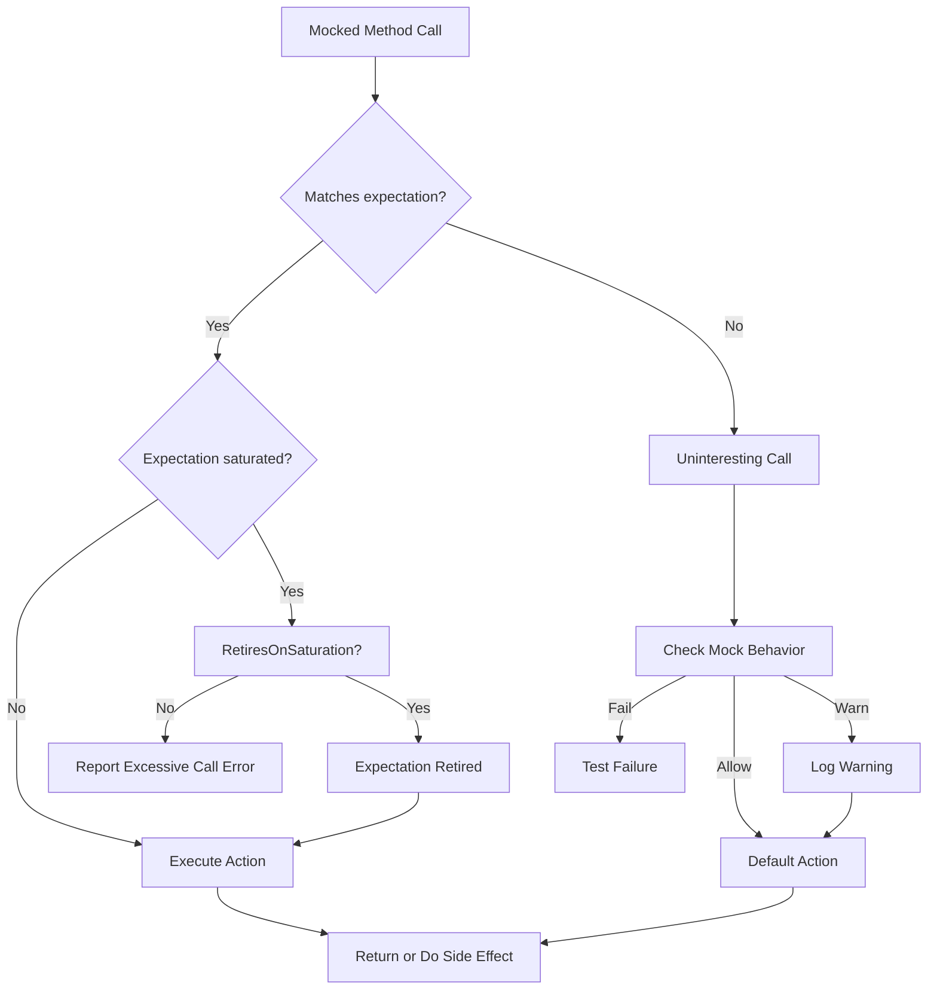

# Matchers, Actions, and Mocking Patterns

Dive deep into the matcher and action mechanisms that form the backbone of flexible and robust mocking. Understand the philosophy and practical use of matchers, custom actions, cardinalities, and mock behaviors to create expressive and reliable tests.

---

## Introduction

GoogleMock’s power and expressiveness spring from its core concepts of matchers and actions, tightly woven with expectation settings and cardinalities. This guide walks you through these vital concepts, enabling you to craft precise, maintainable, and robust mock-based tests.

At its heart:

- **Matchers** define *what* arguments you're interested in.
- **Actions** define *what* your mock method does when called.
- **Expectations** combine matchers and actions with call count and ordering restrictions.
- **Cardinalities** quantify how many times calls are expected or allowed.
- **Mock behaviors** govern the handling of unexpected or uninteresting calls.

By mastering these, you turn simple mocks into sophisticated, insightful test doubles.

---

## Matchers: Describing Expected Arguments

Matchers act as predicates that describe the expected property or value of function call arguments. Rather than hardcoding exact value comparisons, matchers empower you to specify flexible and reusable conditions.

### Using Matchers

- Use literals (e.g., `5`) for exact matches, implicitly converted to `Eq(5)`.
- Use the wildcard matcher `_` when you don’t care about an argument.
- Combine matchers for detailed conditions (e.g., `AllOf(Gt(5), Lt(10))`).

Example:

```cpp
EXPECT_CALL(mock, Compute(Ge(3), _)); // First argument >= 3, second is anything
```

### Multi-Argument Matchers: Matching Arguments as a Tuple

Sometimes, the relationship between arguments matters more than each individually. The `.With()` clause lets you express constraints on the entire argument tuple.

Example:

```cpp
EXPECT_CALL(mock, SetPosition(_, _))
    .With(Lt());  // First argument less than the second
```

This matches calls where the first argument is less than the second argument.

### Custom Matchers

Define your own logical predicates using `MATCHER`, `MATCHER_P` macros, or by implementing matcher classes. Custom matchers allow for highly specific and reusable verification logic.

---

## Actions: Defining Mock Method Behavior

Actions specify what your mock methods do when invoked. Without actions, mock methods return default values, but most real-world testing requires controlling their behavior explicitly.

### Built-in Actions

Some common built-in actions include:

| Action                 | Description                                         |
| ---------------------- | ------------------------------------------------- |
| `Return(value)`        | Return the specified value                         |
| `ReturnRef(variable)`  | Return a reference to a variable                   |
| `ReturnPointee(ptr)`   | Return the value pointed by a pointer              |
| `DoDefault()`          | Perform the default action (from `ON_CALL`)        |
| `Invoke(f)`            | Call a functor, function, lambda, or method        |
| `SetArgPointee<N>(value)` | Set the pointed-to value of the N-th argument       |
| `DoAll(a1, ..., aN)`   | Execute multiple actions sequentially              |

### Using Actions

You can chain `.WillOnce(action)` clauses to specify the behavior for successive calls and one optional `.WillRepeatedly(action)` clause to specify behavior after the `.WillOnce()` list is exhausted.

Example:

```cpp
EXPECT_CALL(mock, GetNumber())
    .WillOnce(Return(10))
    .WillOnce(Return(20))
    .WillRepeatedly(Return(100));

mock.GetNumber();  // returns 10
mock.GetNumber();  // returns 20
mock.GetNumber();  // returns 100
```

### Custom Actions

Write your own actions using lambdas, functors, or by implementing the `ActionInterface` if needed for complex scenarios.

---

## Cardinalities: Controlling Call Counts

Cardinalities describe *how many times* a mock method is expected or allowed to be called.

| Cardinality      | Meaning                                            |
| ---------------- | ------------------------------------------------- |
| `AnyNumber()`    | No restriction, can be called any number of times |
| `AtLeast(n)`     | Called at least n times                            |
| `AtMost(n)`      | Called at most n times                             |
| `Between(m, n)`  | Called between m and n times (inclusive)          |
| `Exactly(n)`     | Called exactly n times                             |

If `Times()` is omitted, GoogleMock infers it from `WillOnce`/`WillRepeatedly` clauses.

Example:

```cpp
EXPECT_CALL(mock, Foo()).Times(Exactly(2));
```

This expects exactly two calls to `Foo()`.

### Sticky Expectations and Retirement

Expectations are "sticky" by default — they remain active even after their call count is saturated. You can make an expectation automatically retire when saturated by appending `.RetiresOnSaturation()`. This prevents later calls from matching the retired expectation.

---

## The Mock Object Behavior Modes: Nice, Naggy, Strict

GoogleMock offers modes to control how uninteresting calls (calls without matching expectations) are handled:

| Mode    | Description                                                             |
| ------- | ----------------------------------------------------------------------- |
| Nice    | Suppresses warnings about uninteresting calls (less noisy)             |
| Naggy   | (Default) Generates warnings about uninteresting calls                 |
| Strict  | Makes uninteresting calls into test failures                           |

Example of creating different mock modes:

```cpp
NiceMock<MockFoo> nice_foo;      // suppresses warnings
NaggyMock<MockFoo> naggy_foo;    // default - warns
StrictMock<MockFoo> strict_foo;  // errors on uninteresting calls
```

### Choosing the Right Mode

- Use **NiceMock** for tests that don't care about calls other than those explicitly expected.
- Use **NaggyMock** if you want to discover unexpected calls but don't want tests to fail.
- Use **StrictMock** to enforce very precise contracts for mocks.

---

## Setting Expectations: The Full Syntax

Expectations are declared using `EXPECT_CALL()` with optional chained clauses:

```cpp
EXPECT_CALL(mock_obj, Method(matchers...))
    .With(multi_arg_matcher)
    .Times(cardinality)
    .InSequence(sequence...)
    .After(expectations...)
    .WillOnce(action)
    .WillRepeatedly(action)
    .RetiresOnSaturation();
```

- `.With()` restricts based on the full argument tuple.
- `.Times()` specifies expected call count.
- `.InSequence()` imposes call order.
- `.After()` specifies that this expectation must come after others.
- `.WillOnce()` and `.WillRepeatedly()` specify the behavior when called.
- `.RetiresOnSaturation()` makes the expectation inactive when saturated.

Ensure clauses are used in the specified order.

### Sequences and Partial Ordering

Use `Sequence` objects and `.InSequence()` to specify strict ordering of expectations. For more flexible partial ordering, use `.After()` clauses.

```cpp
Sequence s1, s2;
EXPECT_CALL(mock, Foo())
    .InSequence(s1, s2);
EXPECT_CALL(mock, Bar())
    .InSequence(s1);
EXPECT_CALL(mock, Baz())
    .InSequence(s2);
```

---

## ON_CALL vs EXPECT_CALL

- **`ON_CALL()`** sets default actions without asserting any expectation on calls.
- **`EXPECT_CALL()`** sets both behavior and expectations on calls.

Use `ON_CALL()` to set up common behavior for mock methods you do not necessarily expect to be called.

```cpp
ON_CALL(mock, GetSize())
    .WillByDefault(Return(5));
```

Combine with `EXPECT_CALL()` for explicit call checks.

---

## Verifying and Resetting Mocks

GoogleMock automatically verifies mock expectations upon object destruction.

You can verify and clear expectations earlier:

```cpp
Mock::VerifyAndClearExpectations(&mock_object);
Mock::VerifyAndClear(&mock_object); // also clears ON_CALL default actions
```

Use `Mock::AllowLeak(&mock_object)` to prevent verification on leaks.

---

## Practical Tips and Common Patterns

- **Avoid over-specifying expectations** — only specify the arguments and call counts that matter.
- **Use wildcard `_` judiciously** to not break tests because of uninteresting details.
- **Leverage custom matchers and actions** to capture meaningful business logic.
- **For ordered calls**, use `InSequence` or `After` for clarity and robustness.
- **Clear expectations and default actions when reusing mocks** within or across tests.

## Troubleshooting

- Unexpected mock calls often mean missing or overly restrictive expectations.
- Use `--gmock_verbose=info` to trace call matching and diagnose.
- Remember expectations must be set before the mock method is invoked.
- Ensure mock classes have virtual destructors to avoid silent leaks.

---

## Summary

Matchers and actions provide unmatched expressiveness to GoogleMock users, enabling precise control over what calls your mocks expect and how they behave. Understanding cardinalities and mock behavior modes refines test flexibility and robustness.

Master these components to write clean and maintainable mock-based tests that precisely document and verify your code's behavior.

---

## References & Further Reading

- [GoogleMock Matchers Reference](../../api-reference/googlemock-apis/googlemock-matchers.md)
- [GoogleMock Actions Reference](../../docs/reference/actions.md)
- [GoogleMock Mock Expectations and Actions](../../api-reference/googlemock-apis/mock-expectations-and-actions.md)
- [gMock Cookbook](../../docs/gmock_cook_book.md)
- [Concepts: Test and Mock Data Models](../architecture-core-models/data-models.md)
- [Usage Guide: Custom Matchers and Actions](../../guides/real-world-mocking/custom-matchers-actions.md)
- [Usage Guide: Strict, Nice, and Naggy Mocks](../../guides/real-world-mocking/strictness-modes.md)

---

## Example: Using Matchers and Actions in a Test

```cpp
using ::testing::Return;
using ::testing::_;
using ::testing::NiceMock;
using ::testing::Sequence;

class MockFoo {
 public:
  MOCK_METHOD(int, GetValue, (int), ());
};

TEST(FooTest, AdvancedMockUsage) {
  NiceMock<MockFoo> mock;
  Sequence s;

  EXPECT_CALL(mock, GetValue(_))
      .InSequence(s)
      .WillOnce(Return(10))
      .WillOnce(Return(20))
      .RetiresOnSaturation();

  EXPECT_CALL(mock, GetValue(42))
      .InSequence(s)
      .Times(2)
      .WillRepeatedly(Return(42));

  EXPECT_EQ(mock.GetValue(5), 10);    // Matches first expectation
  EXPECT_EQ(mock.GetValue(7), 20);    // Matches first expectation, now retired
  EXPECT_EQ(mock.GetValue(42), 42);   // Matches second expectation
  EXPECT_EQ(mock.GetValue(42), 42);   // Matches second expectation
}
```

This example shows sequence ordering, call count control, multiple actions, and retiring expectations once they are saturated.

---

## Diagram: Simplified Mock Interaction Flow



This flow illustrates how GoogleMock handles each mock method call by matching expectations, checking cardinalities, applying actions, and dealing with uninteresting calls according to mock behavior settings.

---