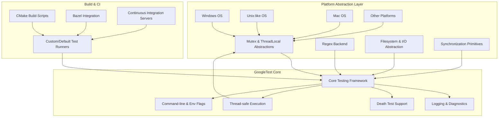

# Portability, Platform Support, and Integrations

GoogleTest achieves broad portability and seamless integration across diverse development environments by carefully abstracting platform and compiler differences, while offering flexible hooks for build systems and external test runners. This page explores how GoogleTest maintains platform independence, supports multi-threading, adapts to different OS capabilities, and fits into a variety of build and CI workflows.

---

## 1. Portability Through Platform Abstraction

GoogleTest is designed to work reliably across multiple operating systems and compiler environments, including Windows, Linux, macOS, BSD variants, Fuchsia, and others. Achieving this level of portability requires abstracting away differences in system-level APIs, compiler features, and threading support.

### Environment-Describing Macros

At the heart of platform abstraction is the use of macros that describe the current environment, such as:

- `GTEST_OS_WINDOWS`, `GTEST_OS_LINUX`, `GTEST_OS_MAC`, and numerous other `GTEST_OS_*` macros indicating specific OS platforms.
- Feature flags like `GTEST_HAS_PTHREAD`, `GTEST_HAS_EXCEPTIONS`, `GTEST_HAS_RTTI` to signal availability of threading, exception handling, and RTTI respectively.

GoogleTest auto-detects most of these features, though users can override defaults when the automatic detection is imperfect.

### Abstraction of System Calls and APIs

GoogleTest wraps platform-specific system calls behind unified interfaces, commonly in the internal `posix` namespace, for operations like file handling, thread management, and synchronization:

- Wrappers for opening files, reading, writing, and closing (e.g., `posix::FOpen`, `posix::Read`, `posix::Write`, etc.) adapt between Windows and POSIX.
- Synchronization primitives (mutexes, condition variables) are implemented differently depending on platform capabilities using `Mutex`, `MutexLock`, and `ThreadLocal` abstractions.

### Threading and Synchronization

Thread safety in GoogleTest is provided on platforms supporting threading libraries:

- If POSIX threads (`pthread`) are available (`GTEST_HAS_PTHREAD`), GoogleTest uses pthreads primitives.
- On Windows, native Windows synchronization objects are used.
- When threading is unavailable, dummy implementations allow single-threaded operation without errors.

This ensures GoogleTest can be safely used in multi-threaded test scenarios or fall back gracefully when threads are unsupported.

### Regular Expression Engines

GoogleTest supports different regex backends tailored to the platform:

- RE2 library usage (`GTEST_HAS_ABSL` and `GTEST_USES_RE2`) for platforms where Abseil is included.
- POSIX Extended Regular Expressions on compatible Unix-like systems (`GTEST_USES_POSIX_RE`).
- A simple internal regex engine as fallback (`GTEST_USES_SIMPLE_RE`).

This multi-backend approach guarantees test features relying on regexes, like death tests, function consistently.

---

## 2. Platform Support Details

GoogleTest officially supports numerous platforms, reflecting Google's foundational C++ support policy:

- Major desktop OSes: Windows (Desktop, MinGW), Linux, and macOS.
- BSD flavors such as FreeBSD, OpenBSD, DragonFly BSD.
- Specialized and embedded platforms like Native Client (NaCl), Fuchsia, AIX, Solaris, Android, and select real-time OSes.

The support covers various compilers—from GCC (7+), Clang (3.4.1+), MSVC (2017 Update 3+), Intel, and others—with enforcement of at least C++17 standard for building and running.

For detailed platform and compiler compatibility, see the [System Requirements](https://google.github.io/googletest/prerequisites-installation/system-requirements.html) and [Supported Platforms](https://google.github.io/googletest/concepts/advanced-principles/portability-and-integration#supported-platforms) documentation.

---

## 3. Integration with Build Systems and Continuous Integration

GoogleTest is crafted to fit effortlessly into existing C++ build and test workflows. Its design accommodates popular build systems and CI platforms with minimal friction.

### CMake Integration

- GoogleTest includes a polished CMake build script, enabling:
  - Building GoogleTest standalone or embedding it into a project.
  - Selecting whether to include GoogleMock with `-DBUILD_GMOCK=ON/OFF`.
  - Handling compiler options, runtime library flags, and threading support transparently.

- Instructions to add GoogleTest as a git submodule, FetchContent, or direct source copy are documented.

- Targets for `gtest` and `gtest_main` allow linking with or without custom main functions.

### Other Build Methods

- Bazel integration is straightforward via workspace and BUILD configurations.

- Manual source integration allows embedding GoogleTest sources directly into a build.

### Customizing Build Flags

GoogleTest lets users tune platform-related macros via compiler flags—for example:

- `-DGTEST_HAS_PTHREAD=1` to force pthread support.
- `-DGTEST_CREATE_SHARED_LIBRARY=1` for building shared libraries.
- Macro renaming features to avoid conflicts in user code (`-DGTEST_DONT_DEFINE_TEST=1`).

### Continuous Integration Support

- GoogleTest can generate XML reports, which many CI servers consume for test visualization.

- The flag system enables configuring test output, death test style, and other CI-friendly options.

- The testing framework’s thread-safe design supports parallelized test runs.

### Main Function and Test Runner

- GoogleTest supplies a default `main()` function via the `gtest_main` library.
- Custom test runners can initialize GoogleTest with `InitGoogleTest()` and then call `RUN_ALL_TESTS()`.

These features simplify automation, integration, and scaling of testing pipelines.

---

## 4. Why Platform Abstraction Matters

GoogleTest's portability and integration capabilities translate into concrete user benefits:

- **Sustainability:** Tests run unaltered across diverse developer environments, avoiding platform-specific bugs.
- **Scalability:** Test suites can grow large and complex without breaking due to subtle OS, compiler, or threading differences.
- **Developer Productivity:** Developers do not expend effort managing environment intricacies and can focus on writing tests.

The portability layer and integration hooks are foundational to GoogleTest’s robust ecosystem fit.

---

## 5. Practical Tips and Best Practices

- When embedding GoogleTest into projects, prefer CMake's FetchContent or submodules for manageable updates and compatibility.
- Override environment-detection macros only if automatic detection fails or you have a targeted environment.
- On Windows, be mindful of runtime linkage flags (`gtest_force_shared_crt`) to avoid linker errors.
- In multi-threaded applications, ensure `GTEST_HAS_PTHREAD` detection aligns with your platform capabilities.
- Use the provided default main function for standard test runners; customize only when necessary.
- Take advantage of GoogleTest’s platform abstractions to write portable tests without platform-specific conditional code.

---

## 6. Further Resources

- [GoogleTest Primer](https://google.github.io/googletest/primer.html) — for starting with writing tests.
- [GoogleTest README](https://github.com/google/googletest/blob/main/googletest/README.md) — detailed build instructions and customization.
- [CMake Build Integration Guide](https://google.github.io/googletest/guides/integration-best-practices/build-system-integration.html) — comprehensive CMake and test automation instructions.
- [GoogleMock README](https://github.com/google/googletest/blob/main/googlemock/README.md) — if mocking is needed alongside testing.
- [Platform Support Details](https://google.github.io/googletest/docs/platforms.html) — for supported OSes and compilers.

---

## Diagram: Overview of Portability and Integration Layers

---

## Troubleshooting Common Portability and Integration Issues

### Issue: Build Errors Related to Threading or Synchronization

- Ensure your build defines `GTEST_HAS_PTHREAD=1` if using `pthread` on Linux/macOS.
- On Windows, verify use of correct runtime libraries (`gtest_force_shared_crt`).
- Review your compiler version and flags to guarantee C++17 standards compliance.

### Issue: Linking Errors with Shared vs Static Libraries

- Confirm that if GoogleTest is built as a shared library, your tests are compiled and linked with `-DGTEST_LINKED_AS_SHARED_LIBRARY=1`.
- If you need static linkage, ensure no conflicting linker flags are present.

### Issue: Regex Failures or Death Test Issues

- Verify that the appropriate regex backend is enabled for your platform.
- On platforms without POSIX regex support, GoogleTest switches to simpler fallback regex.

### Issue: Test Runner Does Not Recognize Tests

- Make sure `InitGoogleTest()` is called before `RUN_ALL_TESTS()`.
- Using `gtest_main` library eliminates the need for your own main function.
- Check for macro conflicts caused by naming clashes; use rename macros if needed.

---

## Summary

This guide explains how GoogleTest abstracts OS and compiler differences to deliver a portable, robust testing framework. It covers platform detection macros, system API abstractions, threading and synchronization adaptations, regex backend options, and detailed integration paths with modern build systems and continuous integration pipelines. These portability and integration capabilities empower developers to focus on crafting tests that are sustainable, scalable, and easy to automate across environments.

---

## Key Links

- [GoogleTest Primer](https://google.github.io/googletest/primer.html)
- [Building and Integration Guides (CMake/Bazel)](https://github.com/google/googletest/blob/main/googletest/README.md)
- [Supported Platforms and System Requirements](https://google.github.io/googletest/prerequisites-installation/system-requirements.html)
- [GoogleMock README](https://github.com/google/googletest/blob/main/googlemock/README.md)
- [CI and Build Integration Guide](https://google.github.io/googletest/guides/integration-best-practices/build-system-integration.html)

---

Please proceed to these linked resources to configure your environment, learn how to build and embed GoogleTest, and master integration with CI and build pipelines for seamless, scalable testing across platforms.