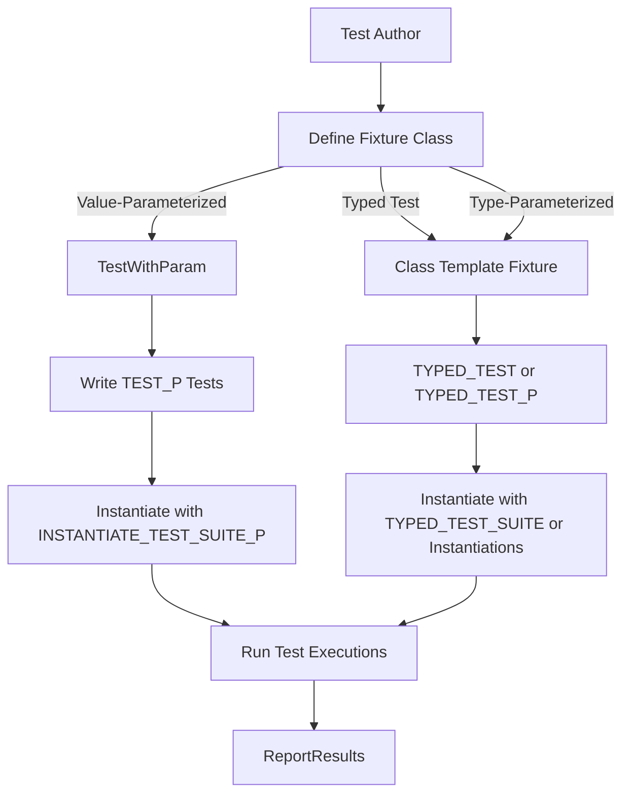

# Parameterized and Typed Test Models

GoogleTest empowers C++ developers to write tests that are reusable, maintainable, and comprehensive by supporting parameterized and typed test models. These models allow you to run the same test logic repeatedly using different input values or data types, enabling exhaustive test coverage for templated code or variants of data sets without duplicating code.

---

## Overview

The core idea behind parameterized and typed tests is to maximize reuse and minimize boilerplate by defining tests once and running them against a range of parameters or for multiple types. 

- **Parameterized Tests** run the same test logic against multiple *values*.
- **Typed Tests** run the same test logic against multiple *types*.

This approach supports the DRY (Don't Repeat Yourself) principle by abstracting variations across values or types.

---

## Value-Parameterized Tests

Value-parameterized tests let you write tests that run repeatedly with different input values supplied at runtime. This is especially useful when you want to validate the behavior of your code against extensive input ranges, combinations, or specific test vectors.

### Writing Value-Parameterized Tests

1. **Define a Test Fixture Class**
   - Derive from `testing::TestWithParam<T>`, where `T` is the type of the parameter.
   - This fixture inherits from `testing::Test` and `testing::WithParamInterface<T>`, providing access to the parameter via `GetParam()`.

2. **Write Tests Using `TEST_P` Macro**
   - Use the `TEST_P(TestFixture, TestName)` macro.
   - Inside, access the current parameter with `GetParam()`.

3. **Instantiate the Tests with Parameter Values**
   - Use `INSTANTIATE_TEST_SUITE_P` with a unique instantiation name.
   - Provide a generator of test parameter values from GoogleTest’s built-in generators, such as:
     - `Values(...)`: Specify explicit parameter values.
     - `ValuesIn(container)`: Use a container or array.
     - `Range(begin, end[, step])`: Automatically generate a range of values.
     - `Bool()`: Run test with both `false` and `true`.
     - `Combine(...)`: Cartesian product for multiple parameters.

### Example: Basic Value-Parameterized Test
```cpp
class MyTest : public ::testing::TestWithParam<int> {};

TEST_P(MyTest, IsEven) {
  int n = GetParam();
  EXPECT_EQ(n % 2, 0);
}

INSTANTIATE_TEST_SUITE_P(EvenNumbers, MyTest, ::testing::Values(2, 4, 6, 8));
```

The above test `IsEven` runs 4 times with parameters 2, 4, 6, and 8.

### Accessing Test Parameters
The test parameter is accessible within the test body through:

```cpp
auto param = GetParam();
```

This enables writing logic that adapts or validates based on the current parameter value.

### Customizing Test Names
By default, GoogleTest constructs test names by appending the index of the parameter. You can supply custom name generators as a lambda or functor in the `INSTANTIATE_TEST_SUITE_P` call for human-readable test names:

```cpp
INSTANTIATE_TEST_SUITE_P(
  MyInstantiation, MyTest,
  ::testing::Values(1, 2, 3),
  [](const ::testing::TestParamInfo<int>& info) {
    return "Param" + std::to_string(info.param);
  });
```

### Combining Parameters
For tests requiring multiple parameters, use `std::tuple` as your parameter type combined with the `Combine()` generator:

```cpp
class MultiParamTest : public ::testing::TestWithParam<std::tuple<int, bool>> {};

TEST_P(MultiParamTest, TestLogic) {
  int i = std::get<0>(GetParam());
  bool b = std::get<1>(GetParam());
  // Test code...
}

INSTANTIATE_TEST_SUITE_P(
    MyInstantiation, MultiParamTest,
    ::testing::Combine(::testing::Values(1, 2), ::testing::Bool()));
```

This runs all combinations of `int` values 1 and 2 with `false` and `true`.

---

## Typed Tests

Typed tests enable running the same test code using different *types* rather than specific values. This is powerful when testing templated code or type-specific behaviors without writing separate tests for each type.

### Writing Typed Tests

1. **Define a Class Template Test Fixture**
   - The test fixture takes a template parameter indicating the type it will test.
   - Derive from `testing::Test`.

2. **Associate a Type List with the Fixture**
   - Use `testing::Types<T1, T2, ...>` to specify types.

3. **Use `TYPED_TEST_SUITE` Macro**
   - Associate the test fixture with the type list.

4. **Write Tests Using `TYPED_TEST` Macro**
   - Inside test bodies use the special identifier `TypeParam` to refer to the current type.

### Example: Basic Typed Test
```cpp
template <typename T>
class MyTypedTest : public ::testing::Test {
 public:
  T value_ = T();
};

using MyTypes = ::testing::Types<int, double, char>;
TYPED_TEST_SUITE(MyTypedTest, MyTypes);

TYPED_TEST(MyTypedTest, IsDefaultConstructible) {
  TypeParam val = this->value_;
  // test specific to the type or generic
  EXPECT_TRUE(true);
}
```

GoogleTest runs `IsDefaultConstructible` three times, for `int`, `double`, and `char`.

### Customizing Test Suite Names
`TYPED_TEST_SUITE` supports an optional third argument: a name generator class template with a templated static function `GetName(int)`. This allows custom naming of test instantiations:

```cpp
class TypeNameGenerator {
 public:
  template<typename T>
  static std::string GetName(int) {
    if constexpr (std::is_same_v<T, int>) return "Int";
    else if constexpr (std::is_same_v<T, double>) return "Double";
    else return "Other";
  }
};

TYPED_TEST_SUITE(MyTypedTest, MyTypes, TypeNameGenerator);
```

### Accessing Typed Test Members
Inside typed tests, use:
- `this->` prefix to access non-static members.
- `TestFixture::` prefix to access static members or typedefs.

---

## Type-Parameterized Tests

Type-Parameterized Tests represent an *abstract* test pattern that can be instantiated with types later, often across translation units.

They differ from typed tests in that the tests are registered and defined independently from the type instantiation, allowing greater flexibility and modularity.

### Core Workflow

1. Define a template test fixture deriving from `testing::Test`.
2. Declare the suite using `TYPED_TEST_SUITE_P(TestFixture)`.
3. Define individual tests using `TYPED_TEST_P(TestFixture, TestName)`.
4. Register tests with `REGISTER_TYPED_TEST_SUITE_P(TestFixture, TestName1, ...)`.
5. Instantiate the test suite for specific types using `INSTANTIATE_TYPED_TEST_SUITE_P(InstantiationName, TestFixture, Types)`.

### When to Use

- You want to define a reusable test pattern in a header or library.
- Different code modules want to instantiate the tests with their own type sets.

### Example
```cpp
template <typename T>
class MyTypeParamTest : public ::testing::Test {};

TYPED_TEST_SUITE_P(MyTypeParamTest);

TYPED_TEST_P(MyTypeParamTest, DoesSomething) {
  TypeParam val = ...;
  EXPECT_TRUE(true);
}

REGISTER_TYPED_TEST_SUITE_P(MyTypeParamTest, DoesSomething);

using MyTypes = ::testing::Types<int, float>;
INSTANTIATE_TYPED_TEST_SUITE_P(MyInstantiation, MyTypeParamTest, MyTypes);
```

GoogleTest runs `DoesSomething` test for `int` and `float`, associated with prefix `MyInstantiation`.

---

## Parameter Generators

GoogleTest provides rich generator utilities to supply parameters for value-parameterized tests:

| Generator       | Description                                                      |
|-----------------|------------------------------------------------------------------|
| `Range(begin, end[, step])` | Generates a sequence of values; excludes `end`. `step` defaults to 1. |
| `Values(...)`   | Generates the specific list of values.                          |
| `ValuesIn(container)` | Generates values from a container or iterator range.           |
| `Bool()`        | Generates `false` and `true`.                                   |
| `Combine(g1, g2, ..., gN)`| Cartesian product of multiple generators, producing tuples.  |
| `ConvertGenerator<T>(g)` or `ConvertGenerator(g, func)` | Converts generated values to desired type `T` or via a conversion function.

This modular design lets you flexibly compose tests covering complex parameter spaces.

---

## Summary of Macros and Methods

| Macro                                 | Purpose                                                      |
|-------------------------------------|--------------------------------------------------------------|
| `TEST_P(TestFixture, TestName)`     | Defines a value-parameterized test.                          |
| `INSTANTIATE_TEST_SUITE_P(Name, TestFixture, Generator)` | Instantiates the test fixture across parameters generated.   |
| `TYPED_TEST_SUITE(TestFixture, Types[, NameGenerator])` | Defines typed tests with a list of types and optional naming. |
| `TYPED_TEST(TestFixture, TestName)` | Defines an individual typed test.                            |
| `TYPED_TEST_SUITE_P(TestFixture)`   | Declares a type-parameterized test suite (pattern).          |
| `TYPED_TEST_P(TestFixture, TestName)`| Defines tests with type-parameterized suites.               |
| `REGISTER_TYPED_TEST_SUITE_P(TestFixture, ...)` | Registers tests in a type-parameterized suite.          |
| `INSTANTIATE_TYPED_TEST_SUITE_P(Prefix, TestFixture, Types)` | Instantiates a type-parameterized test suite.          |

---

## Best Practices and Tips

- Use **parameterized tests** to cover multiple input values without duplicating test code.
- Use **typed tests** to ensure templates behave properly across expected types.
- Prefer **type-parameterized tests** if you want reusable abstract test patterns.
- Customize parameter names for clarity in test output and diagnostics.
- For multiple parameters, combine generators using `Combine()`.
- Use `ConvertGenerator` when parameter types don't directly match the generator output.
- Remember `GetParam()` for accessing test parameters in value-parameterized tests.
- Access current type with `TypeParam` in typed and type-parameterized tests.

---

## Troubleshooting

- Ensure each instantiated test suite has a unique prefix to avoid name collisions.
- Use `GTEST_ALLOW_UNINSTANTIATED_PARAMETERIZED_TEST` if a parameterized test suite isn't instantiated yet.
- Parameters must be copyable types.
- Avoid generating test names with illegal characters (only alphanumeric and underscores are allowed).
- When using lambdas for name generation, be cautious with dangling references (especially with string views).

---

## See Also

- [Writing Parameterized Tests Guide](/guides/parameterized-and-typed-tests/writing-parameterized-tests)
- [Typed Tests Guide](/guides/parameterized-and-typed-tests/typed-tests-and-type-parameterization)
- [Value-Parameterized Tests Reference](/api-reference/core-testing-api/parameterized-tests)
- [Core Testing Concepts](/overview/core_fundamentals/core_concepts)  
- [GoogleTest Primer](/docs/primer.md)

---

## Diagram: Workflow of Parameterized and Typed Tests



---