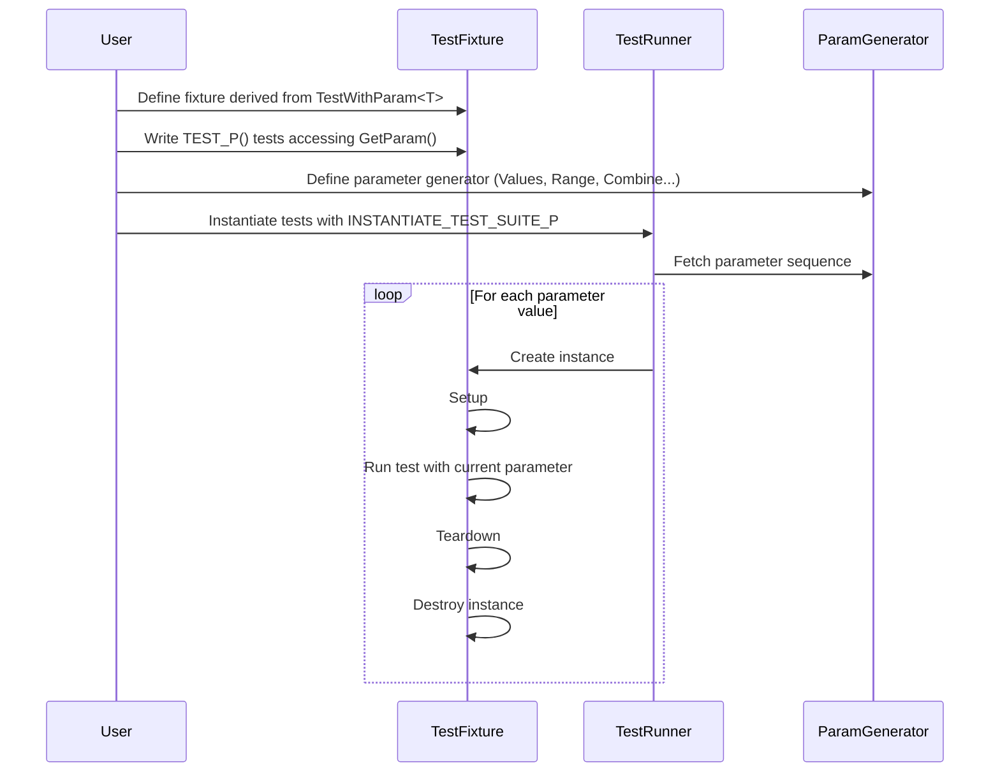

# Parameterized and Typed Tests

GoogleTest empowers developers to write succinct, maintainable, and comprehensive tests by enabling test logic reuse across multiple data values and types. This is accomplished through two powerful models: **value-parameterized tests** and **type-parameterized tests**. Both approaches eliminate duplication and clarify test intent by systematically running the same test code over varied inputs.

---

## Value-Parameterized Tests

Value-parameterized tests allow you to run the same test logic over a set of input values, providing thorough coverage while keeping your test code clean and focused.

### When to Use

Choose value-parameterized tests when your tests need to run multiple times with different input parameters. Examples include checking function behavior across various inputs or validating algorithms under different configurations.

### Creating Value-Parameterized Tests

1. **Define a Test Fixture:**
   Create a fixture derived from `testing::TestWithParam<T>`, where `T` is your parameter type.

    ```cpp
    class FooTest : public ::testing::TestWithParam<const char*> {
      // Fixture setup and helpers
    };
    ```

2. **Write Parameterized Tests:**
   Use the `TEST_P` macro to define tests that access the parameter via `GetParam()`.

    ```cpp
    TEST_P(FooTest, DoesBlah) {
      EXPECT_TRUE(foo.Blah(GetParam()));
    }

    TEST_P(FooTest, HasBlahBlah) {
      // Additional tests
    }
    ```

3. **Instantiate the Test Suite:**
   Use `INSTANTIATE_TEST_SUITE_P` to specify the parameters for which your tests should run.

    ```cpp
    INSTANTIATE_TEST_SUITE_P(
        InstantiationName, FooTest,
        ::testing::Values("meeny", "miny", "moe")
    );
    ```

    You can use various parameter generators like the following:

    | Generator           | Description                                                        |
    |---------------------|--------------------------------------------------------------------|
    | `Range(begin, end[, step])` | Generates sequences incremented by `step` (excluding `end`).      |
    | `Values(v1, v2, ..., vN)`     | Generates the explicitly specified sequence of values.           |
    | `ValuesIn(container)`          | Generates values from a container or iterator range.             |
    | `Bool()`                     | Generates the Boolean sequence `{false, true}`.                   |
    | `Combine(g1, g2, ..., gN)`    | Generates Cartesian product of multiple generators as tuples.    |
    | `ConvertGenerator<T>(g[, func])`| Converts generated parameters to desired type, optionally with a converter function. |


### Working with Parameter Generators

Here is how some common generators enable flexible, composable test parameterization:

- **Range:** Generates arithmetic sequences for numbers or types with increment semantics.

    ```cpp
    INSTANTIATE_TEST_SUITE_P(IntSequence, MyTest, ::testing::Range(1, 5));
    // Generates tests with parameters 1, 2, 3, 4
    ```

- **Values:** Generates explicitly defined parameters.

    ```cpp
    INSTANTIATE_TEST_SUITE_P(FixedValues, MyTest, ::testing::Values(10, 20, 30));
    ```

- **ValuesIn:** Draws parameters from arrays, STL containers, or iterator ranges.

    ```cpp
    std::vector<std::string> fruits = {"apple", "banana", "cherry"};
    INSTANTIATE_TEST_SUITE_P(Fruits, MyTest, ::testing::ValuesIn(fruits));
    ```

- **Bool:** Useful for testing Boolean flags.

    ```cpp
    INSTANTIATE_TEST_SUITE_P(Bools, FlagTest, ::testing::Bool());
    ```

- **Combine:** Creates all combinations from multiple generators, producing tuples.

    ```cpp
    INSTANTIATE_TEST_SUITE_P(Combinations, MyTest,
                             ::testing::Combine(::testing::Values(1,2),
                                                 ::testing::Bool()));
    ```

- **ConvertGenerator:** When the test’s parameter type needs conversion from generator outputs.

    ```cpp
    // Custom conversion
    INSTANTIATE_TEST_SUITE_P(AnimalVariations, AnimalTest,
      ::testing::ConvertGenerator<ParamType::TupleT>(::testing::Combine(...)));
    ```

### Naming Instantiations and Tests

The first argument to `INSTANTIATE_TEST_SUITE_P` is a unique prefix distinguishes the instance:

- Test names will include this prefix to differentiate.
- Within test output, test names appear with the prefix, suite name, test name, and an index (e.g., `InstantiationName/FooTest.DoesBlah/0`).

You can supply a custom name generator to control test name suffixes, which is especially important when your parameters are complex types.

```cpp
INSTANTIATE_TEST_SUITE_P(
    CustomNames, MyTest,
    ::testing::Values(...),
    [](const ::testing::TestParamInfo<MyTest::ParamType>& info) {
      return /* custom string derived from info.param */;
    });
```

### Best Practices & Tips

- Keep parameter types copyable; manage raw pointers’ lifetimes carefully.
- Define meaningful test names for clarity.
- Remember `INSTANTIATE_TEST_SUITE_P` can appear before or after tests.
- Use `GTEST_ALLOW_UNINSTANTIATED_PARAMETERIZED_TEST` if a suite is declared but not instantiated (to avoid failures).
- Combine generators to test comprehensive scenarios without duplicating code.

---

## Typed Tests

Typed tests help you write test patterns that are repeated for different types, ensuring your code is correct across type variations without duplicating test logic.

### When to Use

Use typed tests when you want to verify that a template or class behaves correctly for various types defined upfront.

### Writing Typed Tests

1. **Create a Typed Test Fixture Template:**

    ```cpp
    template <typename T>
    class FooTest : public testing::Test {
    public:
      T value_;
      using List = std::list<T>;
      static T shared_;
    };
    ```

2. **Define the Type List:**

    ```cpp
    using MyTypes = ::testing::Types<char, int, unsigned int>;
    TYPED_TEST_SUITE(FooTest, MyTypes);
    ```

3. **Write Typed Tests:**

    Use `TYPED_TEST` instead of `TEST_F`. Inside, use `TypeParam` to refer to the testing type. Use `TestFixture` to access the fixture class.

    ```cpp
    TYPED_TEST(FooTest, DoesBlah) {
      TypeParam n = this->value_;
      n += TestFixture::shared_;
      typename TestFixture::List values;
      values.push_back(n);
      EXPECT_TRUE(...);
    }

    TYPED_TEST(FooTest, HasPropertyA) {
      // Another test
    }
    ```

4. **Accessing Fixture Members:**

    - Use `this->` to access non-static members inside templates.
    - Use `TestFixture::` to access static members.

### Custom Test Names

You can provide a custom name generator class with a static template method `GetName(int)` that returns a string, which the framework uses to suffix each test suite name:

```cpp
class MyTypeNames {
public:
  template <typename T>
  static std::string GetName(int) {
    if (std::is_same<T, char>()) return "char";
    if (std::is_same<T, int>()) return "int";
    return "unknown";
  }
};

TYPED_TEST_SUITE(FooTest, MyTypes, MyTypeNames);
```

### Notes

- All test names must be unique and non-empty.
- Typed tests are instantiated for each type in the types list.
- Classes must be default constructible if the tests instantiate an object.

---

## Type-Parameterized Tests

Type-parameterized tests extend typed tests by allowing you to define test patterns once and instantiate them with different type lists later, potentially multiple times and in multiple source files.

### When to Use

Opt for type-parameterized tests when:
- You want to define abstract test suites that any type conforming to your interface should pass.
- You don't know all the types upfront and want flexible instantiations.

### Writing Type-Parameterized Tests

1. **Define the Fixture Template:**

    ```cpp
    template <typename T>
    class FooTest : public testing::Test {
      // Fixture implementation
    };
    ```

2. **Declare the Type-Parameterized Test Suite:**

    ```cpp
    TYPED_TEST_SUITE_P(FooTest);
    ```

3. **Define Test Patterns Using `TYPED_TEST_P`:**

    ```cpp
    TYPED_TEST_P(FooTest, DoesBlah) {
      TypeParam n = 0;
      // Use this->... and TypeParam
      ...
    }

    TYPED_TEST_P(FooTest, HasPropertyA) {
      ...
    }
    ```

4. **Register the Test Names:**

    ```cpp
    REGISTER_TYPED_TEST_SUITE_P(FooTest, DoesBlah, HasPropertyA);
    ```

5. **Instantiate with Type Lists:**

    ```cpp
    using MyTypes = ::testing::Types<char, int, unsigned int>;
    INSTANTIATE_TYPED_TEST_SUITE_P(MyInstantiation, FooTest, MyTypes);
    ```

### Key Characteristics

- The test suite definition and instantiation can be across multiple files.
- You can instantiate the same pattern multiple times with different type lists.
- Custom name generators similar to typed tests can be used with an extra argument.

---

## Summary Examples

### Value-Parameterized Test Example

```cpp
class FooTest : public ::testing::TestWithParam<int> {};

TEST_P(FooTest, IsEven) {
  int param = GetParam();
  EXPECT_EQ(param % 2, 0);
}

INSTANTIATE_TEST_SUITE_P(EvenNumbers, FooTest, ::testing::Values(2, 4, 6));
```

### Typed Test Example

```cpp
template <typename T>
class MyTypedTest : public ::testing::Test {
 public:
  T value_{0};
};

using MyTypes = ::testing::Types<int, float>;
TYPED_TEST_SUITE(MyTypedTest, MyTypes);

TYPED_TEST(MyTypedTest, IsInitialized) {
  EXPECT_EQ(this->value_, 0);
}
```

### Type-Parameterized Test Example

```cpp
template <typename T>
class MyTypeParamTest : public ::testing::Test {};

TYPED_TEST_SUITE_P(MyTypeParamTest);

TYPED_TEST_P(MyTypeParamTest, IsDefaultConstructible) {
  TypeParam obj{};
  (void)obj;  // Silence unused variable warning
}

REGISTER_TYPED_TEST_SUITE_P(MyTypeParamTest, IsDefaultConstructible);

using TypesToTest = ::testing::Types<int, double>;
INSTANTIATE_TYPED_TEST_SUITE_P(MyInstance, MyTypeParamTest, TypesToTest);
```

---

## Troubleshooting Parameterized and Typed Tests

- **Tests not running:** Ensure `INSTANTIATE_TEST_SUITE_P` is called for each `TEST_P`.
- **Name conflicts:** Avoid underscores (`_`) in test suite and test names to prevent compilation or runtime errors.
- **Type conversion failures:** Use `ConvertGenerator` when parameter types require explicit conversions.
- **Uninstantiated tests failures:** Use `GTEST_ALLOW_UNINSTANTIATED_PARAMETERIZED_TEST` for tests meant to be instantiated elsewhere.
- **Customizing test names:** Use name generator functions to avoid generic or unreadable test name suffixes.

---

## Visualizing Parameterized Tests Workflow



---

## References and Further Reading

- [Value-Parameterized Tests in Advanced Guide](../advanced.md#value-parameterized-tests)
- [Typed Tests and Type-Parameterized Tests in Advanced Guide](../advanced.md#typed-tests)
- [Testing Reference: `TEST_P`, `INSTANTIATE_TEST_SUITE_P`](docs/reference/testing.md#TEST_P)
- [GoogleTest Primer sections on Test Fixtures and Typed Tests](docs/primer.md)

<Info>
For code examples and real tests, check out GoogleTest’s sample files like `sample7_unittest.cc` and `gtest-typed-test_test.cc` in the open-source repository.
</Info>

---

Continue deepening your test automation skills by exploring [Advanced GoogleTest Topics](../advanced.md) and applying these patterns to reduce duplication while maximizing coverage and clarity in your testing strategy.