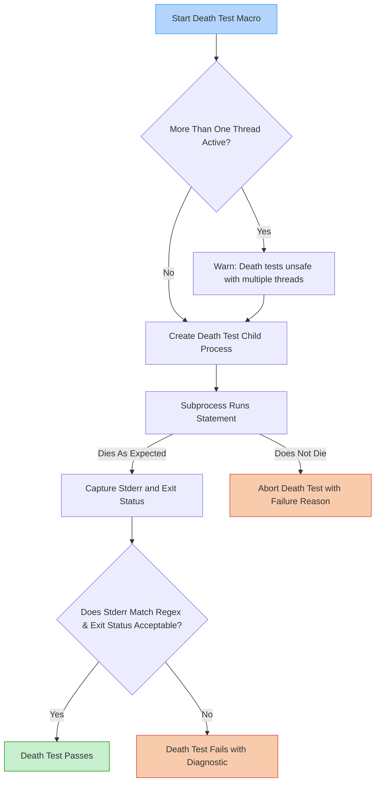

# Death Tests and Error Condition Validation

GoogleTest’s Death Tests provide a powerful mechanism to verify code behavior that should terminate the process or trigger fatal errors. These tests are critical in validating error-handling paths that must cause a program to exit or crash gracefully under defined conditions. This guide explains the philosophy behind death tests, how to write them effectively, common usage patterns, and essential platform considerations to ensure safe and reliable tests.

---

## Understanding Death Tests

Death tests assert that a particular statement or code segment causes the program to terminate unexpectedly. This can be essential for testing assertions, fatal checks, or other error conditions that should halt execution immediately to prevent damage or undefined behavior.

### Why Use Death Tests?
- **Error Condition Verification:** Confirm that code reacts correctly by terminating on invalid inputs or fatal states.
- **Robustness Assurance:** Ensure that failures are caught early and as expected, avoiding silent faults.
- **Behavioral Guarantees:** Validate that fatal errors produce expected error messages and exit codes.

### Typical Use Cases
Consider scenarios such as validating the behavior of input validators, checking for enforcement of invariants, and confirming that unreachable code paths correctly abort execution.

## Writing Death Tests

GoogleTest offers macros to write death tests with assertions about program termination:

- `ASSERT_DEATH(statement, regex)`
- `EXPECT_DEATH(statement, regex)`
- `ASSERT_EXIT(statement, predicate, regex)`
- `EXPECT_EXIT(statement, predicate, regex)`
- `EXPECT_DEBUG_DEATH(statement, regex)` (for debug-only death assertions)

### Core Components
- **statement:** The executable code expected to cause termination.
- **regex:** A pattern to match the stderr output capturing the error message.
- **predicate:** A callable that asserts on the exit code or termination status.

### Basic Example
```cpp
TEST(MyDeathTest, FatalErrorOnNull) {
  ASSERT_DEATH(MyFunction(nullptr), "null pointer passed");
}
```

### Advanced Example with Exit Predicate
```cpp
TEST(MyDeathTest, ExitWithCodeZero) {
  ASSERT_EXIT(ProcessAndExit(), testing::ExitedWithCode(0), "Exiting");
}
```

### Compound Statements
You can use braces `{ ... }` to group multiple statements:

```cpp
ASSERT_DEATH({ Initialize(); CheckFail(); }, "fatal error");
```

### Loop Death Tests
Running a sequence of death tests within a loop is supported:

```cpp
for (int i = 0; i < 5; ++i) {
  EXPECT_DEATH(FunctionThatFails(i), "fail at iteration");
}
```

## Key Characteristics and Behavior

### Execution Model
- **Subprocess Isolation:** Death tests run the tested code in a child process to avoid killing the test runner.
- **Styles:** Two main styles exist:
  - `fast`: Fork and immediately run the test in the child process.
  - `threadsafe`: Re-execute the entire program in the child process, filtered to run just the death test.

### Diagnostic Matching
- The stderr output of the child process is captured and matched against the provided regex or matcher.
- A failure occurs if the process does not die, if it crashes without producing expected output, or if the output does not match.

### Restrictions
- Death tests depend on running with a single thread. Multiple active threads before a death test can cause deadlocks or undefined behavior.
- Statement side effects inside death tests occur only in the child process and do not affect the parent process memory.
  Place any mock expectations inside the death test macro.

### Behavior on Return or Exceptions
- Death tests fail if `return` is executed inside the statement.
- Exit due to uncaught exceptions is treated as failure (with messages including exception details).

## Platform-Specific Notes

### POSIX (Linux, macOS, etc.)
- Death tests typically use `fork()` and sometimes `clone()`.
- Some platforms have quirks around signals and process termination; GoogleTest abstracts most of these complexities.
- The `threadsafe` style executes the test in a fresh subprocess with controlled flags.

### Windows
- Death tests use process spawning and handle duplication due to Windows process model restrictions.
- Both `fast` and `threadsafe` styles are treated as threadsafe internally.
- Special piping and event mechanisms ensure communication between parent and child processes.

### Fuchsia
- Utilizes native process and socket facilities for handling death tests.

## How Death Tests Integrate into GoogleTest

- Tests with suite names ending in `DeathTest` are run before others to prevent interference.
- GoogleTest handles test discovery, subprocess management, communication, and result verification transparently.
- The `--gtest_death_test_style` flag controls the style (`fast` or `threadsafe`).

## Writing Reliable Death Tests: Best Practices

### Tips
- **Test Single-Threaded Code:** Avoid multiple threads active before the death test. Migrate test logic that spawns threads into the death test statement if possible.
- **Use Specific Regexes:** Write regex patterns that precisely match expected error outputs to avoid false positives.
- **Isolate Side Effects:** Since death tests run in subprocesses, any side effects on global state will not persist. Place expectations or checks inside the death test macro.
- **Match Exit Codes:** Use predicates like `ExitedWithCode()` or `KilledBySignal()` with `ASSERT_EXIT` or `EXPECT_EXIT` to verify correct exit conditions explicitly.
- **Avoid Nonvoid Side Effects Outside:** Do not rely on return values or side effects outside the death test, as these are unreliable due to subprocess isolation.
- **Name Suites Properly:** Consider naming your death test suites or splitting test fixtures ending in `DeathTest` for clarity and to ensure proper run ordering.

### Common Pitfalls
- Running death tests in an environment with multiple concurrent threads can cause hangs or crashes.
- Using overly broad regex patterns might hide subtle errors.
- Expecting side effects not visible outside the death test subprocess.
- Forgetting that death tests can’t communicate state back to the parent process directly.

## Debugging Death Tests

- If tests hang, ensure that your process has a single thread before running the death test.
- Use the `--gtest_death_test_style=threadsafe` for safer but potentially slower death tests.
- Print helpful messages inside your death tests to stderr to observe output if the death test fails.
- Confirm subprocess-related flags such as `--gtest_internal_run_death_test` are correctly handled (this is internal).

## Summary

Death tests ensure critical error handling and termination policies are validated with precision. They run tested code in separate processes to safely verify expected crashes, aborts, or exits without destabilizing the test harness.

---

## Advanced Configuration

### Environment Variables and Flags
- `--gtest_death_test_style` sets the mode for running death tests.
- `--gtest_internal_run_death_test` is an internal flag used to track death tests subprocess.

### Predicate Classes
GoogleTest provides helper predicates for exit status:
- `ExitedWithCode(int code)` - Checks that a process exited normally with the given code.
- `KilledBySignal(int signum)` - Validates termination due to a specific signal (POSIX only).

### Macros Behavior
- `ASSERT_DEATH` aborts test on failure.
- `EXPECT_DEATH` records failure but continues execution.
- `EXPECT_DEBUG_DEATH` behaves like `EXPECT_DEATH` but only in debug builds.

## Useful Links & References

- [Assertions Reference](../api-reference/gtest-core-api/assertions-reference.md) — Detailed assertions including death test macros.
- [Running Tests](../getting-started/first-test-and-validation/running-tests.md) — Control test runs, filters, and output.
- [Quickstart](../getting-started/setup-and-installation/installation-guide.md) — Setup instructions.
- [Common Use Cases](../overview/audience-use-cases/use-case-snapshots.md) — Real world testing scenarios including death tests.
- [Death Tests API](../api-reference/gtest-core-api/death-tests-api.md) — Public API and examples.
- [Death Tests and Threads](../guides/real-world-workflows/death-tests.md) — In-depth guide and best practices.
- [FAQ - Death Test Hangs](../faq/getting-started-faq/first-steps-troubleshooting.md) — Troubleshooting hangs and crashes.

---

## Visual Overview



---

This guide empowers you to write precise death tests in GoogleTest that ensure critical failure and termination paths behave as expected, increasing your code’s reliability and robustness in error conditions.

<Tip>
Remember that death tests execute your statement in a child process, so side effects, including mock expectations, must be placed inside the death test scope to be observed.
</Tip>

<Warning>
Avoid having multiple threads active outside the death test statement. If your code or libraries spawn threads at global or static initialization, isolate those parts accordingly to prevent deadlocks.
</Warning>

<Check>
Use the `--gtest_death_test_style=threadsafe` flag if you encounter flaky or hanging death tests, trading some speed for safety.
</Check>
