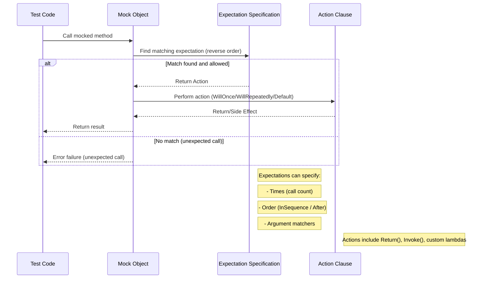

# Mocking, Expectations, and Behavior Verification

GoogleMock (gMock) offers a robust and expressive system for creating mock objects, setting expectations on their methods, configuring their runtime behavior, and verifying interaction correctness. This guide demystifies how GoogleMock helps you define and control mock behavior in C++ tests, focusing specifically on the roles of `MOCK_METHOD`, `EXPECT_CALL`, `ON_CALL`, argument matchers, action clauses, expectation ordering, and mock strictness.

---

## 1. Defining Mock Methods with `MOCK_METHOD`

GoogleMock generates mock implementations for virtual methods using the `MOCK_METHOD` macro inside mock classes. This macro takes the return type, method name, argument list, and optional qualifiers (like `const` or `override`) to produce mocking functionality.

### Key Points:
- `MOCK_METHOD` must be placed in the `public` section of the mock class for the methods to be accessible to `EXPECT_CALL` and `ON_CALL`.
- If a method is `const`, include `(const)` as part of the macro specifier.
- When overriding virtual methods, specify `(override)` to keep compatibility and clarity.
- For methods involving types containing commas (e.g., `std::pair<bool, int>`), you must wrap the type in additional parentheses or define type aliases to avoid parsing errors.

### Example:
```cpp
class MockFoo : public FooInterface {
 public:
  MOCK_METHOD(int, GetSize, (), (const, override));
  MOCK_METHOD(std::string, Describe, (const char* name), (override));
};
```


## 2. Specifying Expected Calls with `EXPECT_CALL`

`EXPECT_CALL` expresses that a mock method is expected to be called with specific arguments and sets up clauses to control how many times, in what order, and what action to perform on invocation.

### Basic Syntax:
```cpp
EXPECT_CALL(mock_object, Method(matchers...))
    .Times(cardinality)
    .WillOnce(action)
    .WillRepeatedly(action);
```

- `mock_object`: your mock instance.
- `Method(matchers...)`: the method and argument matchers to specify which calls are expected.
- Chained clauses to control call count and behavior.

### Important Clauses:

| Clause            | Purpose                                                  |
|-------------------|----------------------------------------------------------|
| `.Times()`        | Specify how many times the call is expected.             |
| `.With()`         | Multi-argument matcher to match the arguments as a tuple.|
| `.InSequence()`   | Require this call to occur in a specified sequence.      |
| `.After()`        | Specify prerequisite expectations that must be satisfied before this call. |
| `.WillOnce()`     | Specify the action executed for one invocation.          |
| `.WillRepeatedly()` | Specify the action for all remaining invocations.       |
| `.RetiresOnSaturation()` | Mark expectation as inactive after saturation.       |


### Usage Notes:
- The call count (`Times`) can be fuzzy: `AtLeast(n)`, `AtMost(n)`, `AnyNumber()`, etc.
- If `.Times()` is omitted, gMock infers it based on the number of `.WillOnce()` and `.WillRepeatedly()` clauses.
- Set expectations **before** exercising the code that invokes mocks.

### Example:
```cpp
EXPECT_CALL(turtle, GetX())
    .Times(5)
    .WillOnce(Return(100))
    .WillOnce(Return(150))
    .WillRepeatedly(Return(200));
```
This means GetX() is expected 5 times. The first call returns 100, second 150, subsequent calls 200.


## 3. Configuring Default Behavior with `ON_CALL`

While `EXPECT_CALL` sets both expectations and behavior, `ON_CALL` defines the *default* behavior of mock methods without setting expectations.

```cpp
ON_CALL(mock_object, Method(matchers...))
    .WillByDefault(action);
```

- Useful for setting default return values or behaviors for methods that may or may not be called in every test.
- `ON_CALL` is complementary to `EXPECT_CALL`. When an `EXPECT_CALL` matches a call, its action takes precedence.


## 4. Argument Matchers: Fine-Grained Control on Calls

Matchers specify expected values or properties for arguments of mocked functions:

- `_` matches any argument (wildcard matcher).
- `Eq(value)`, `Ge(value)`, `Lt(value)` etc., match specific conditions.
- You can combine matchers to specify complex predicates.
- Without specifying matchers, gMock assumes a wildcard for each argument.

### Example:
```cpp
EXPECT_CALL(turtle, GoTo(50, _));  // Expects GoTo called with x=50 and any y
EXPECT_CALL(turtle, Forward(Ge(100)));  // Forward called with >= 100
```

These flexible matchers help avoid over-specifying and fragile tests.

## 5. Times Clause: Specifying Call Cardinalities

- `Times(0)`: the method call should *never* happen with matched arguments.
- `Times(1)`: method expected exactly once.
- `AtLeast(n)`: call expected at least n times.
- `AnyNumber()`: call allowed any number of times.

If omitted, gMock infers from actions:
- No actions → `Times(1)` inferred.
- n `WillOnce()` but no `WillRepeatedly()` → `Times(n)` inferred.
- n `WillOnce()` and one `WillRepeatedly()` → `Times(AtLeast(n))` inferred.

## 6. Actions: Defining What Mock Methods Do

By default, mock methods return default-constructed values or zero values for scalars.

You can specify what a mock method should do using:

- `.WillOnce(action)`: action to perform on one call.
- `.WillRepeatedly(action)`: action to perform on all subsequent calls after `.WillOnce` actions are exhausted.

Actions include:
- `Return(value)`: return a specific value.
- `ReturnRef(variable)`: return a reference.
- Invoking a callback or lambda, setting output parameters, throwing exceptions, etc.

### Practical Tip:
Use lambdas or `Invoke()` for complex behaviors, especially when actions have side effects or when returning move-only types.

### Example:
```cpp
EXPECT_CALL(turtle, GetX())
    .WillOnce(Return(100))
    .WillRepeatedly(Return(200));
```


## 7. Multiple Expectations and Shadowing

When multiple expectations target the same method:

- gMock evaluates expectations **in reverse order** (last set takes precedence).
- The most recent matching (active) expectation is used.
- If a newer expectation's call limit is reached, gMock falls back to older matching expectations.

### Example:
```cpp
EXPECT_CALL(turtle, Forward(_));       // #1, catch-all
EXPECT_CALL(turtle, Forward(10)).Times(2);  // #2, specific
```
If the method is called with `Forward(10)` three times, the third call matches #1 and is allowed if it's not restricted.


## 8. Ordering Expectations: Strict and Partial Orders

By default, call order is not enforced.

### Strict Order Using `InSequence`:
Wrap expectations in an `InSequence` object to require the calls to occur in the exact order declared:

```cpp
{
  InSequence s;
  EXPECT_CALL(turtle, PenDown());
  EXPECT_CALL(turtle, Forward(100));
  EXPECT_CALL(turtle, PenUp());
}
```


### Partial Order Using `Sequence` and `.After()`:
For more complex ordering, you can create named `Sequence` objects and specify which sequences expectations belong to, or use `.After()` clauses to specify prerequisite calls.

## 9. Sticky Expectations and Retiring

- Expectations are “sticky” by default — they remain active even after reaching their upper bound limits.
- You can make an expectation retire on saturation using `.RetiresOnSaturation()`, making it inactive once the expected calls have occurred.
- Expectations inside a sequence retire automatically once the next expectation in sequence is invoked.

### Example:
```cpp
EXPECT_CALL(turtle, GetX())
    .WillOnce(Return(10))
    .RetiresOnSaturation();
```

## 10. Uninteresting vs Unexpected Calls

- **Uninteresting call:** A mock method call that has *no* associated `EXPECT_CALL`. By default, gMock prints a *warning* but does not fail the test. These calls execute default actions.
- **Unexpected call:** A mock method call that *matches no expectations* declared with `EXPECT_CALL` but some expectations exist for that method. This always triggers a *test failure*.

## 11. Mock Object Strictness Modes

GoogleMock provides wrappers to adjust the handling of uninteresting calls on a per-mock basis:

| Mode          | Behavior on Uninteresting Calls       |
|---------------|--------------------------------------|
| `NiceMock<T>` | Suppresses warnings (quiet)            |
| `NaggyMock<T>`| Default; prints warnings, does not fail|
| `StrictMock<T>`| Treats uninteresting calls as errors (fail tests) |

You select one by wrapping your mock type:
```cpp
NiceMock<MockFoo> nice_mock;
StrictMock<MockFoo> strict_mock;
```

## 12. Verifying and Resetting Mocks

- By default, verification of expectations occurs when a mock object is destructed.
- You can explicitly verify and clear expectations earlier using:
  ```cpp
  Mock::VerifyAndClearExpectations(&mock_object);
  Mock::VerifyAndClear(&mock_object);  // also clears ON_CALL defaults.
  ```
- After verification and clearing, do **not** add new expectations, or behavior is undefined.

## 13. Common Pitfalls and Best Practices

- Always declare virtual destructors in interfaces to avoid memory leaks when deleting through base pointers.
- Set expectations *before* exercising the mock.
- Specify the right balance of strictness: over-specification can lead to brittle tests that break unnecessarily.
- Use `ON_CALL` to configure default behaviors and `EXPECT_CALL` only when you want to verify that calls occur.
- If mocking overloaded methods, help the compiler disambiguate overloads by specifying argument counts and possibly argument types, or by using `Const()` wrapper for const overloads.
- Beware side effects in action expressions; the action expressions are evaluated once, so stateful increment operators or dynamic memory allocation inside `Return()` can lead to surprises.

## 14. Summary

Through the combined use of `MOCK_METHOD` macros, `EXPECT_CALL` for setting expectations, `ON_CALL` for defaults, flexible matchers for arguments, rich action clauses for behavior, and ordering and strictness controls, GoogleMock offers a powerful test double facility tailored to C++.

Learning to skillfully compose these elements will enable you to write robust, expressive, and maintainable unit tests focused on interaction verification, ensuring your code behaves exactly as intended.

---

## References

- [gMock for Dummies](https://google.github.io/googletest/gmock_for_dummies.html) - Beginner-friendly introduction with examples and use cases.
- [Mocking Reference](https://google.github.io/googletest/reference/mocking.html) - Comprehensive API details and usage.
- [gMock Cookbook](https://google.github.io/googletest/gmock_cook_book.html) - Recipes for advanced mocking scenarios.
- [gMock Cheat Sheet](https://google.github.io/googletest/gmock_cheat_sheet.html) - Quick reference for commonly used features.

---

## Mermaid Diagram: Expectation and Call Flow


