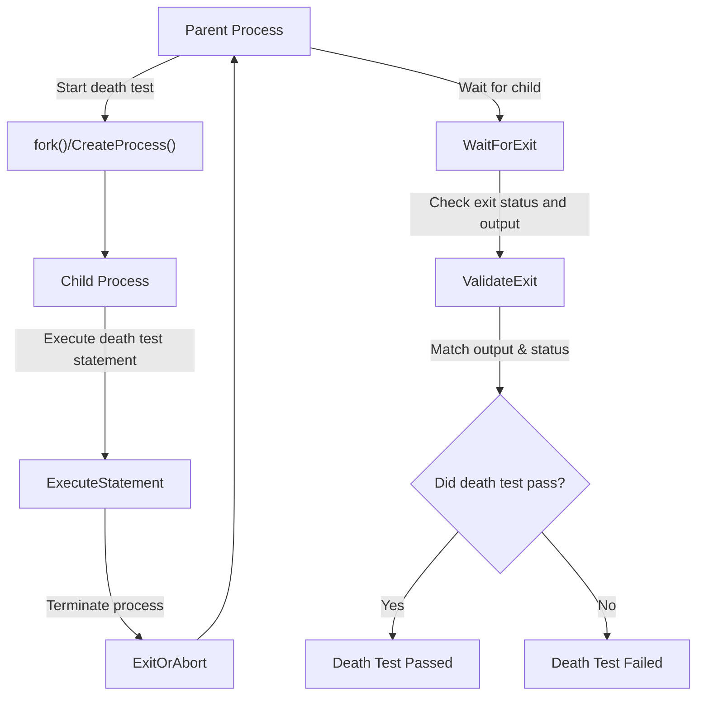

# Death Tests: Verifying Fatal Failures

GoogleTest provides a powerful mechanism called *death tests* to validate that your code paths properly handle fatal failures—those that cause the program to terminate unexpectedly. Death tests enable you to check that your program exits or aborts as expected under erroneous conditions, ensuring robust error handling and preventing silent failures.

This guide explores the key concepts, usage patterns, requirements, and practical advice for writing effective death tests using GoogleTest.

---

## What Are Death Tests?

*Death tests* are tests designed to verify that a particular piece of code causes the process to terminate in a controlled and expected manner. For example, if your program has assertions or checks that abort execution when an invalid input is encountered, death tests help ensure these safeguards are triggered correctly.

### Use Cases for Death Tests

- Verifying that invalid parameters cause program termination.
- Confirming that assertion failures abort tests as designed.
- Ensuring error handling code properly terminates the process on fatal conditions.

Unlike normal unit tests which check for returned values or state changes, death tests confirm that the *process exits* or *crashes* with the expected error messages.

---

## Core Principles of Death Tests

Death tests work by spawning a separate child process to safely execute code that is expected to terminate. This isolates the death-inducing statement from the main test harness and allows GoogleTest to verify both process termination and output.

### What Happens When a Death Test Runs?

1. **Process Isolation:** The test framework spawns a child process (via `fork()` on POSIX or `CreateProcess()` on Windows) to run the death test code.
2. **Execution:** The child executes the supplied statement, which is expected to terminate (e.g., via `_Exit`, `abort()`, or an uncaught signal).
3. **Parent Waits:** The parent waits for the child process to finish.
4. **Validation:** The parent verifies the child's exit status and checks whether stderr output matches the expected pattern.

### Death Test Styles

GoogleTest supports two death test styles controlled by `--gtest_death_test_style`:

- **`threadsafe` (recommended)**: The child process re-executes the test binary with flags limiting it to the specific death test. This style is safer for multithreaded code but slower.
- **`fast`**: The child executes the death test code immediately after forking without re-executing the binary. Faster but less thread-safe.

On Windows and Fuchsia, death tests operate in a threadsafe manner by default.

---

## Writing Death Tests

GoogleTest provides several macros for death tests:

| Macro                     | Description                                                   |
| ------------------------- | ------------------------------------------------------------- |
| `ASSERT_DEATH(statement, matcher)`          | Asserts `statement` terminates with output matching `matcher`.
| `EXPECT_DEATH(statement, matcher)`          | Same as above but non-fatal assertion.
| `ASSERT_EXIT(statement, predicate, matcher)` | Asserts `statement` terminates with status matching `predicate` and output matching `matcher`.
| `EXPECT_EXIT(statement, predicate, matcher)` | Same as above but non-fatal.
| `EXPECT_DEATH_IF_SUPPORTED` / `ASSERT_DEATH_IF_SUPPORTED` | Death tests that only run if supported on the platform.
| `EXPECT_DEBUG_DEATH` / `ASSERT_DEBUG_DEATH` | Death tests that apply only in debug builds.

### Basic Usage Example

```cpp
TEST(MyDeathTest, DiesOnInvalidInput) {
  ASSERT_DEATH(Foo(-1), "Invalid input");
}
```

This test verifies that calling `Foo(-1)` terminates the program and produces an error message matching "Invalid input" on stderr.

### Compound Statement Example

Death test statements can be compound blocks:

```cpp
ASSERT_DEATH({
  int n = 5;
  Validate(n);
}, "validation failed");
```

### Using Predicates with EXPECT_EXIT / ASSERT_EXIT

Sometimes you want to verify *how* the process exits, not just that it terminates. For this, GoogleTest provides exit-status predicates:

- `ExitedWithCode(exit_code)` — checks for normal exit with the specified code.
- `KilledBySignal(signal_number)` — checks that the process was terminated by a specific signal (POSIX only).

Example:

```cpp
EXPECT_EXIT(NormalExit(), testing::ExitedWithCode(0), "success");
EXPECT_EXIT(KillProcess(), testing::KilledBySignal(SIGKILL), "kill message");
```

For cross-platform compatibility, use `ExitedWithCode` where possible.

---

## Requirements and Restrictions

### Thread Safety and Multiple Threads

Death tests are only guaranteed to be safe when run in a single-threaded process. For multithreaded code, use the "threadsafe" death test style.

GoogleTest emits warnings if multiple threads are detected at death test start, as forking with threads can cause deadlocks or undefined behavior.

### Statement Restrictions

- The `statement` in `EXPECT_DEATH` and `ASSERT_DEATH`:
  - Must not return or throw exceptions; doing so counts as test failure.
  - Must be a single statement or compound statement.
  - May include streamed failure messages appended with `<<`.

Example of failure due to return:

```cpp
ASSERT_DEATH({ return; }, ""); // Illegal: return in death test
```

### Side Effects Are Invisible to Parent

Because death tests run in separate processes, any side effects in-memory (variable changes, heap frees) are not visible to the calling test.

Avoid:
- Relying on side effects from death tests.
- Freeing memory that must be visible in parent process.

---

## Writing Robust Death Tests

### Matchers and Regex

The error output matcher can be:

- A raw string interpreted as a regular expression (regex).
- A GoogleTest matcher for `const std::string&`.

GoogleTest supports POSIX extended regex on POSIX systems and a simpler regex subset on Windows. Avoid unsupported regex constructs like grouping `()`, unions `|`, or repetitions `{n}` in death test patterns to ensure cross-platform compatibility.

### Scoping and Naming

- Name test suites containing death tests with a `DeathTest` suffix for ordering and clarity.

Example:

```cpp
TEST(FooDeathTest, HandlesBadInput) {
  ASSERT_DEATH(DoDangerousThing(), "Error");
}
```

- Avoid placing multiple death test assertions on the same line to prevent macro expansion failures.

### Handling Mocks in Death Tests

If your death test involves mocked objects and expects a specific exit code, make sure to allow leaks with `Mock::AllowLeak` since the child process exit might prevent proper cleanup, causing false leaks.

### Streaming Custom Error Messages

You can append additional messages to death test macros using streams:

```cpp
EXPECT_DEATH(Foo(-1), "Error") << " with value -1";
```

---

## Recommended Workflows

<Steps>
<Step title="Choose the death test style">
Decide between "threadsafe" (safer, slower) and "fast" style by setting the `death_test_style` flag:

```cpp
GTEST_FLAG_SET(death_test_style, "threadsafe");
```

</Step>
<Step title="Write the death test macro">
Use `ASSERT_DEATH` or `EXPECT_DEATH` to verify your code path causes expected termination:

```cpp
ASSERT_DEATH(MyFunction(bad_input), "Expected error message");
```

</Step>
<Step title="Verify output and exit status">
Use custom predicates with `EXPECT_EXIT` if you want to check the exit code or signals:

```cpp
EXPECT_EXIT(TerminateNow(), testing::ExitedWithCode(1), "crash");
```

</Step>
<Step title="Run tests in isolation">
Use filtering to run only death tests or debug failures faster:

```bash
./my_test --gtest_filter=*DeathTest.*
```

</Step>
</Steps>

---

## Troubleshooting Common Issues

<AccordionGroup title="Common Death Test Pitfalls">
<Accordion title="Test Fails by Returning Instead of Dying">
If your death test passes but the code returns (via `return`) instead of aborting, the death test reports failure.

- **Solution:** Make sure your death test statement does not return or throw.
</Accordion>
<Accordion title="Mismatch Between Expected and Actual Error Message">
Death test failure if stderr output does not match the expected pattern.

- Check your regex for supported syntax.
- Adjust your pattern to match actual output, including multi-line messages.
</Accordion>
<Accordion title="Multiple Threads Detected Warning">
Death tests warn when multiple threads exist at fork time, risking deadlock.

- Use the "threadsafe" death test style.
- Avoid creating threads before running death tests.
</Accordion>
</AccordionGroup>

<Callout title="Important">
Death tests only check for process termination and stderr output matching. Assertions inside the death test body that fail do NOT cause the death test to fail unless the process does not die.
</Callout>

---

## Advanced Topics and Integration

### How Death Tests Are Implemented Internally

On POSIX, the framework uses `fork()` or `clone()` to spawn child processes.

- **Fast style:** Executes test code right after fork.
- **Threadsafe style:** Uses `fork() + exec()` to rerun the test binary only for the specific death test.

On Windows, `CreateProcess()` and re-executing the test binary is used, always employing a threadsafe style.

### Integration with Test Fixtures

You can write death tests inside fixture tests using `TEST_F` and death test macros normally.

---

## Example Death Test

```cpp
#include <gtest/gtest.h>

void DangerousFunction(int x) {
  if (x < 0) {
    fprintf(stderr, "Negative input not allowed\n");
    _Exit(1);  // Terminate immediately
  }
}

TEST(DangerTest, DiesOnNegativeInput) {
  ASSERT_DEATH(DangerousFunction(-1), "Negative input");
}

TEST(DangerTest, SurvivesPositiveInput) {
  EXPECT_NO_FATAL_FAILURE(DangerousFunction(10));
}
```

This example:
- Confirms `DangerousFunction(-1)` causes the process to exit and outputs "Negative input".
- Confirms no failure occurs for input 10.

---

## Summary

Death tests allow you to assert that code terminates in expected ways on fatal errors. Writing effective death tests involves:

- Using the proper death test macros like `ASSERT_DEATH` and `EXPECT_EXIT`.
- Specifying clear matchers or exit predicates for validation.
- Choosing appropriate death test styles (`threadsafe` recommended).
- Ensuring thread safety and avoiding side effects that cannot be observed.

By integrating death tests into your suite, you validate critical failure paths, improving test coverage and software robustness.

---

## Additional Resources

- [GoogleTest Primer](https://github.com/google/googletest/blob/main/docs/primer.md) – Introductory concepts on writing tests and fixtures.
- [Assertions Reference](https://github.com/google/googletest/blob/main/docs/reference/assertions.md) – Details of all assertion macros including death test macros.
- [Advanced GoogleTest Topics](https://github.com/google/googletest/blob/main/docs/advanced.md#death-tests) – Further reading on death tests and related best practices.
- [GoogleTest Death Test Header](include/gtest/gtest-death-test.h) – Official public API documentation.
- [Death Tests in Source](src/gtest-death-test.cc) – Implementation details for advanced users.

---

## Diagram: Death Test Execution Flow



---

## Practical Tips

- **Always specify regex patterns** in your death test macros for reliable matching.
- **Use `ASSERT_DEATH` where failure should abort the enclosing test function**, and `EXPECT_DEATH` where the test can continue.
- When testing code with multiple threads, **use "threadsafe" death test style**.
- Avoid returning or throwing exceptions from inside death test statements.
- Carefully construct multi-line regexes or use matchers to handle complex output.

---

## Troubleshooting

- If your death test fails unexpectedly, verify the stderr pattern matches exactly.
- Confirm your death test binary has a valid path (needed for threadsafe tests).
- Use `GTEST_FLAG_SET(death_test_style, "threadsafe")` to opt for thread safety.
- Avoid placing multiple death test macros on the same line.
- Be cautious when memory leaks are reported; mock objects may require allowances in death tests.

---

For complete details and source, visit the [GoogleTest repository](https://github.com/google/googletest).
