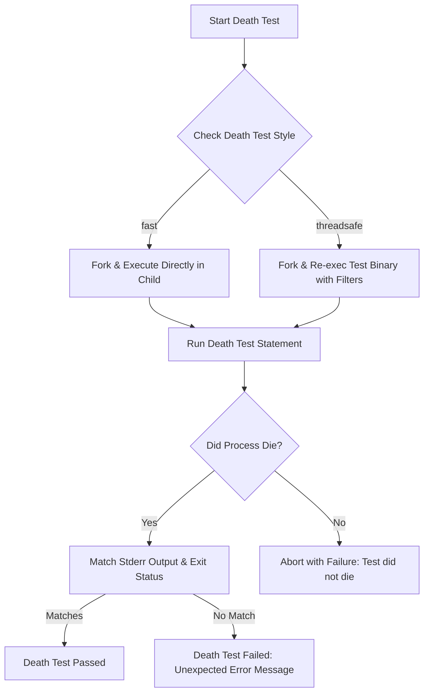

# Death Tests & Error Testing

Death tests are a specialized class of tests used in C++ development to verify program behavior when the code under test terminates unexpectedly, usually due to assertions, fatal errors, or crashes. GoogleTest offers robust support for death tests to ensure that error-handling paths and termination logic work as intended, thereby helping maintain software reliability and correctness.

---

## What Are Death Tests?

Death tests validate that a specific piece of code causes the process to terminate in a predictable way. Unlike regular tests that verify returned values or state, death tests confirm that the program exits (via `exit()`, `_Exit()`, a fatal signal, or other means) and optionally that it emits an expected error message.

Common scenarios for death tests include:
- Checking that precondition assertions trigger correctly when invalid input is passed.
- Verifying that error-handling code calls `abort()` or terminates as expected.
- Ensuring that certain failure modes cause the process to die safely and with proper diagnostics.

Note that exceptions are *not* considered death for this context, as they may be caught and handled. To test exception throwing, use exception assertions instead.

---

## Why Use Death Tests?

In complex C++ applications, some bugs can be subtle and only appear when the program is in an erroneous state. By confirming that the program explicitly dies under those conditions, you prevent silent corruption, memory issues, or security vulnerabilities.

Death tests give you:
- **Confidence:** Verify that your program does not continue in a harmful state.
- **Robustness:** Alert you if internal consistency checks fail.
- **Traceability:** Capture and verify specific error messages emitted at failure.

---

## How Death Tests Work in GoogleTest

Death tests run the code under test in a separate process to isolate the termination from the test runner process. GoogleTest supports two main styles for running death tests:

### Death Test Styles

- **Fast Style (`fast`)**: The child process is created via `fork()` and executes the death test statement immediately after forking. This method is faster but less thread-safe because forking in a multithreaded program can cause issues.

- **Threadsafe Style (`threadsafe`)**: The child process is created via fork (or clone on some systems) and then re-executes the entire test binary from the start, but only runs the specific death test. This approach is safer when multiple threads exist but has a higher runtime cost.

You can select the style by setting the flag programmatically or via the command line:

```cpp
GTEST_FLAG_SET(death_test_style, "threadsafe");
```

### Execution Flow

1. **Spawned Process:** GoogleTest forks or spawns a subprocess to run the death test.
2. **Execution:** The child runs the test statement that should cause process termination.
3. **Monitoring:** The parent waits for the child to exit.
4. **Verification:** The parent checks:
   - Did the child die (non-zero exit or signal)? 
   - Did the stderr output match the expected regular expression?
   - For `EXPECT_EXIT`/`ASSERT_EXIT`, does the process exit satisfy the provided predicate?
5. **Pass/Fail:** Based on these checks, the assertion passes or fails.

If the death test code runs to completion without dying, the assertion fails.

---

## Writing Death Tests

Use the provided macros designed for different scenarios:

| Macro                  | Purpose                                                | Behavior                                           |
|------------------------|--------------------------------------------------------|--------------------------------------------------|
| `ASSERT_DEATH()`        | Verify the statement causes termination with stderr matching a regex. | Fatal failure aborts test function on failure.  |
| `EXPECT_DEATH()`        | Same as `ASSERT_DEATH()`, but nonfatal failure.         | Test function continues after failure.           |
| `ASSERT_EXIT()`         | Verify the statement terminates with exit status matching a predicate and stderr match. | Fatal failure aborts test function on failure.  |
| `EXPECT_EXIT()`         | Same as `ASSERT_EXIT()`, but nonfatal failure.          | Test function continues after failure.           |
| `EXPECT_DEATH_IF_SUPPORTED()`  | Use when death tests may not be available.         | No test executed if unsupported.                   |
| `ASSERT_DEATH_IF_SUPPORTED()`  | Same as above with fatal behavior.                   | No test executed if unsupported.                   |
| `EXPECT_DEBUG_DEATH()`  | Like `EXPECT_DEATH()` but only active in debug mode.    | In release mode, statement executes normally.     |
| `ASSERT_DEBUG_DEATH()`  | Like `ASSERT_DEATH()` but only active in debug mode.    | In release mode, statement executes normally.     |

### Example

```cpp
TEST(FooDeathTest, DiesOnInvalidInput) {
  ASSERT_DEATH({ Foo(-1); }, "Invalid argument");
}

TEST(ExitExample, ExitsWithCodeZero) {
  EXPECT_EXIT(NormalExit(), ::testing::ExitedWithCode(0), "Success");
}

TEST(KillTest, KilledBySignal) {
  EXPECT_EXIT(KillSelf(), ::testing::KilledBySignal(SIGKILL), "unblockable signal");
}
```

Note:
- The regex or matcher parameter matches the `stderr` output from the death test child process.
- Regular expressions used are POSIX extended on most systems, or a simplified regex on Windows and Mac.

---

## Interpreting Death Test Results

GoogleTest assesses death test results by three criteria:

1. **Process termination:** The child process should have died (non-zero exit status or killed by signal).
2. **Exit status predicate:** For `ASSERT_EXIT` and `EXPECT_EXIT`, the exit status is checked by the user-provided predicate.
3. **Output matching:** The stderr output from the dying process must match the specified regex or matcher.

If the statement does not terminate, throws an exception, or executes a `return` prematurely, the death test fails.

Failure messages clearly state which condition failed and include indented stderr output to help debugging.

---

## Best Practices for Writing Death Tests

- Name your test suites ending with `DeathTest` to indicate the special nature.
- Avoid placing multiple death test assertions on the same line; compilation errors will occur.
- Do not depend on side effects of death test code: since the test runs in a separate process, changes in memory or resource state in a death test child are not visible to the parent.
- If releasing memory or shared resources, do so outside death tests or in the parent process to avoid leaks.
- Avoid death tests that spawn multiple threads at fork, as it is unsafe. If your program creates threads early, prefer the `threadsafe` death test style.
- If using mocks inside death tests, allow leaks (`Mock::AllowLeak`) because mock leak detectors may confuse death due to process exit.
- Use `SCOPED_TRACE` to add diagnostic information in case of failure inside complex death tests.

---

## Common Pitfalls & Troubleshooting

| Issue                                      | Description & Solution                            |
|--------------------------------------------|-------------------------------------------------|
| Death tests hang or time out                | Often caused by forking in the presence of multiple threads. Run tests in `threadsafe` mode or reduce threading complexity before death tests. |
| Unexpected success                         | The statement may not actually terminate, check your death condition and regex. |
| Regex mismatch failure                     | Revise your regex matcher or consider special characters in output. Use matchers for more precise control. |
| Assertions in death tests causing failures | Assertions inside death tests are subject to crash behavior; use non-fatal assertions carefully or move them outside death tests. |
| `return` or exceptions inside death test  | Death tests fail if `return` or exceptions occur instead of process termination. Ensure the death test statement actually aborts or exits. |
| Multiple death tests on the same line      | Causes compilation errors. Write separate assertions on separate lines. |

Use the diagnostic messages and GoogleTest's documented failure outputs for clues.

---

## Example User Flow: Writing a Death Test

1. Identify code path where termination is expected, e.g., an assertion failure.
2. Write a test function named with `DeathTest` suffix for clarity.
3. Use `ASSERT_DEATH` or `EXPECT_DEATH` macros with the statement and expected error message regex.
4. Run the tests. If failures occur, read messages to understand mismatch or unexpected living.
5. Adjust regex or code as needed.
6. Consider configuring death test style if encountering multithreading issues.

---

## Additional Utilities for Death Tests

- `ExitedWithCode(int exit_code)`: Predicate to check the child exited with specific code.
- `KilledBySignal(int signal_number)`: Predicate to check the child was terminated by a signal (POSIX).
- `InDeathTestChild()`: Internal utility indicating if running inside the death test subprocess.

---

## How GoogleTest Implements Death Tests (Conceptual Overview)

GoogleTest abstracts death tests behind the `DeathTest` interface. Depending on platform and configuration, different platform-specific implementations (e.g., `WindowsDeathTest`, `ForkingDeathTest`, `ExecDeathTest`) execute the child processes either by forking, spawning, or cloning:



---

## Summary

Death tests are a crucial feature in GoogleTest for verifying that code paths causing termination behave as expected. They isolate termination in child processes, check exit conditions, and validate output, providing confidence that critical failure paths trigger correctly.

Through macros like `ASSERT_DEATH()` and `EXPECT_EXIT()`, and configuration flags controlling execution styles, GoogleTest enables robust, thread-aware death testing. Careful adherence to best practices ensures reliable, maintainable death tests.

---

## External References

- [Assertions Reference](../reference/assertions.md#death)
- [Advanced GoogleTest Topics: Death Tests](../guides/advanced_testing_patterns/death_testing.md)
- [GoogleTest Primer: Basic Testing Concepts](../docs/primer.md)
- [GoogleTest Architecture Overview](../concepts/architecture-overview/system-architecture.mdx)

---

## Tips

- Always verify that your death test statement actually terminates and does not return or throw exceptions.
- Use clear, explicit regular expressions to match error output.
- Prefer naming test suites with `DeathTest` suffix to aid test ordering and clarity.
- If you experience flaky death tests, try switching the death test style or isolating threading issues.

---

## Troubleshooting Steps

If a death test fails unexpectedly:

1. Check the test output for whether the process exited or remained alive.
2. Confirm the regex pattern matches the actual stderr output.
3. Run the death test in isolation to debug.
4. Switch death test style via flag if multithreading could affect test reliability:

```cpp
GTEST_FLAG_SET(death_test_style, "threadsafe");
```

5. Avoid multiple death tests on one line; split them.
6. Consider using `SCOPED_TRACE` to add more diagnostic context.

---

## Sample Code

```cpp
TEST(MyDeathTest, OutOfRangeDies) {
  ASSERT_DEATH({
    std::vector<int> v(1);
    int x = v.at(10);
  }, "std::out_of_range");
}

TEST(MyDeathTest, ExitWithZero) {
  EXPECT_EXIT(
      { std::exit(0); },
      ::testing::ExitedWithCode(0),
      "");
}

TEST(MyDeathTest, KilledBySignal) {
  EXPECT_EXIT(
      { raise(SIGABRT); },
      ::testing::KilledBySignal(SIGABRT),
      "aborted");
}
```

---