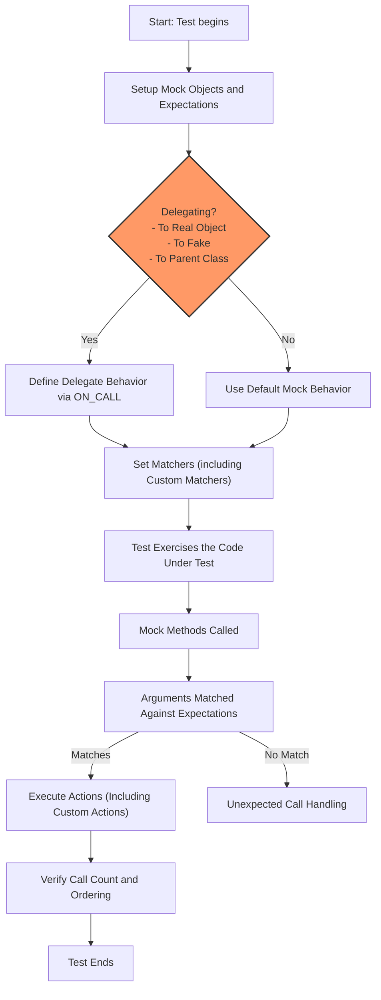

# Extensibility and Customization

This guide explores the points of extensibility within GoogleTest's mocking framework, focusing on how users can tailor GoogleTest and GoogleMock to meet unique testing needs. You will learn about defining user assertions, creating custom matchers, and substituting event listeners to extend the framework's capabilities seamlessly.

---

## Understanding Points of Extensibility

GoogleMock provides a flexible foundation not only for mocking standard interfaces but also for tailoring behaviors through several extensibility mechanisms. These include:

- **User-defined assertions:** Creating custom matchers and assertions that suit your domain-specific validation.
- **Custom matchers:** Implementing reusable predicates for argument matching beyond the built-in capabilities.
- **Alternate event listeners:** Substituting or extending GoogleTest's test event listeners to customize test execution reporting.

These extensibility points empower you to craft precise, maintainable test suites that improve test expressiveness and clarity.

---

## User-Defined Assertions and Custom Matchers

GoogleMock encourages the creation of custom matchers to precisely validate mock method arguments. By defining your own matchers, you can express complex expectations simply and clearly in your tests.

### Why Define Custom Matchers?

- To encapsulate repeated argument validations into a readable, maintainable component.
- To provide detailed diagnostic messages tailored to failed conditions, improving troubleshooting.
- To extend the matching capabilities beyond built-in matchers (e.g., testing domain invariants).

### Ways to Define Custom Matchers

GoogleMock provides macros and interfaces to create matchers with ease:

- **MATCHER macros:** Quick and concise ways to define matchers inline.

  ```cpp
  MATCHER(IsEven, "is an even number") { return (arg % 2) == 0; }
  EXPECT_CALL(mock_obj, Function(IsEven()));
  ```

- **Parameterized matchers:** Define matchers with parameters to adapt to different contexts.

  ```cpp
  MATCHER_P(IsDivisibleBy, divisor, "is divisible by") {
    return (arg % divisor) == 0;
  }
  EXPECT_CALL(mock_obj, Function(IsDivisibleBy(5)));
  ```

- **Advanced matcher classes:** For cases requiring full control over matching, explainability, and type flexibility, define a class implementing the matcher interface.

### Best Practices

- Keep matchers *pure* with no side effects; they may be executed multiple times.
- Provide detailed descriptions to help in failure analysis.
- Combine matchers logically using `AllOf()`, `AnyOf()`, and `Not()` to build complex conditions.

---

## Writing New Actions

Beyond matching, GoogleMock lets you define how mocked methods respond through *actions*. Extending actions allows you to simulate behaviors, inject side effects, or delegate to real or fake implementations.

### Creating Custom Actions

You can create new actions:

- Using **lambdas or functors** compatible with the mock method signature:

  ```cpp
  EXPECT_CALL(mock, Foo(_)).WillOnce([](int x) { return x * 10; });
  ```

- Using **ACTION macros** for concise, reusable action implementations:

  ```cpp
  ACTION(IncrementArg0) { return ++(*arg0); }
  EXPECT_CALL(mock, Process(_)).WillOnce(IncrementArg0());
  ```

- Using **polymorphic actions** for generic behavior across different mock signatures.

### Delegating to Fakes or Real Objects

To bridge mocked and real implementations, delegate calls selectively:

- **Delegate to a fake:** Invoke an existing fake's method to reduce duplication.
- **Delegate to a real object:** Forward calls to a real object for behavioral accuracy while retaining verification.

Example pattern:

```cpp
class MockFoo : public Foo {
 public:
   MOCK_METHOD(int, Compute, (int), (override));

   void DelegateToReal() {
     ON_CALL(*this, Compute).WillByDefault(
       [this](int x) { return real_.Compute(x); });
   }

 private:
   Foo real_;
};
```

### Combining Multiple Actions

Use `DoAll()` to chain multiple actions in sequence, enabling complex behavior such as setting output parameters and returning values.

---

## Controlling Mock Strictness and Behavior Modes

GoogleMock offers wrappers to adjust how uninteresting mock method calls are treated:

- **NiceMock:** suppresses warnings on uninteresting calls.
- **NaggyMock:** warns on uninteresting calls (default behavior).
- **StrictMock:** treats uninteresting calls as errors.

These wrappers are template subclasses of your mock class:

```cpp
NiceMock<MockFoo> nice_mock;
StrictMock<MockFoo> strict_mock;
```

**Use case guidance:**

- Use `NiceMock` to reduce noise when uninteresting calls are expected and unimportant.
- Use `StrictMock` when it's critical to catch any unexpected mock calls.
- Default mocks behave as `NaggyMock` currently, but future versions may default to `NiceMock`.

---

## Delegating Calls to User-Defined or Alternate Implementations

In addition to fakes and real object delegation, you may sometimes want to mock interfaces partly:

- **Delegating calls to a parent class:** If a virtual method has an implementation, delegate calls to it in an action.
- Use `ON_CALL()` or `EXPECT_CALL()` with lambdas that explicitly invoke the base class method.

Example:

```cpp
ON_CALL(mock, ConcreteMethod).WillByDefault(
  [&](Args... args) { return mock.Foo::ConcreteMethod(args...); });
```

This avoids infinite recursion and allows partial mocking.

---

## Best Practices and Troubleshooting Tips

- Favor `ON_CALL` for setting default behavior and `EXPECT_CALL` for verifying calls.
- Use `Times()`, `WillOnce()`, and `WillRepeatedly()` to precisely control invocation counts.
- Use `RetiresOnSaturation()` to make expectations retire after their requirement is met to avoid sticky expectations failing when overcalled.
- Employ sequences (`InSequence`) or partial orders (`After`) to enforce call ordering evidently.
- Leverage `Mock::VerifyAndClearExpectations()` to force early verification when mock destruction timing is uncertain.
- Use strictness wrappers thoughtfully to balance test noise and strictness.
- Enable verbose logging (`--gmock_verbose=info`) to gain insight on expectation matching and uninteresting calls during debugging.

---

## Useful References and Further Learning

- **[gMock Cookbook](https://google.github.io/googletest/gmock_cook_book.html):** Extensive recipes for custom matchers, actions, and mocks.
- **[Mocking Reference](docs/reference/mocking.md):** Detailed API reference for setting expectations, matchers, and actions.
- **[Strictness and Mock Behavior Modes](docs/gmock_cook_book.md#NiceStrictNaggy):** Explanations and examples of NiceMock, NaggyMock, and StrictMock.
- **[GoogleTest README](googlemock/README.md):** Overview of project's goals and features.

---

## Summary

By leveraging GoogleMock's extensibility, you gain powerful tools to customize test behavior precisely. Whether defining your own matchers to better express domain constraints, implementing custom actions to simulate complex behaviors, or controlling uninteresting calls with strictness wrappers, these techniques elevate your test suite's clarity and reliability.

Master these extensibility points to craft expressive, maintainable, and powerful tests that fit your unique project's requirements.

---

## Diagram: Mock Expectation Workflow with Extensibility Points



---

<Tip>
Leverage custom matchers and actions to enrich your tests with clear, maintainable validations and behaviors that directly express your intentions. This not only improves the readability but also enhances failure diagnostics.
</Tip>

<Note>
Use strictness wrappers to control the treatment of uninteresting calls and avoid noisy test outputs or unintended test failures.
</Note>

<Warning>
Avoid over-specifying expectations; use ON_CALL for default behaviors unless you explicitly need to verify call counts or sequences with EXPECT_CALL.
</Warning>

<Check>
Always verify and clear expectations when a mock object’s lifetime is uncertain to avoid undetected test failures.
</Check>

---