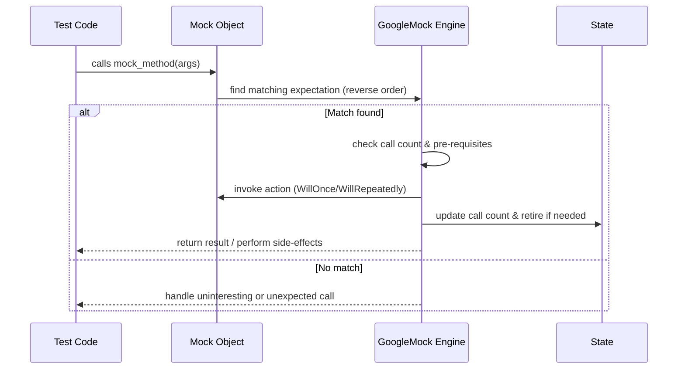

# Mocking Models and Expectations

Understand GoogleMock's approach to mocking: how mock classes are structured, how expectations (`ON_CALL` / `EXPECT_CALL`) are declared and evaluated, and the flow of invocations, actions, and verification. Gain insight into cardinalities, actions, and the enforcement of strict or lenient call handling.

---

## Overview of Mocking Models

GoogleMock allows you to create *mock classes* that mimic the interfaces of real classes for the purpose of testing. Each mock class contains *mock methods* declared using the `MOCK_METHOD` macro. These methods do not contain real implementations, but instead allow you to specify *expectations* and *behaviors* that control how they respond during tests.

The core constructs that govern mocking behavior are:

- **Mock Classes and Methods:** User-defined classes that inherit interfaces and replace methods with instrumented mock implementations.
- **Expectations (`EXPECT_CALL`):** Define how many times and with what arguments mock methods are expected to be called.
- **Default Actions (`ON_CALL`):** Specify the behavior of methods when no explicit expectation is set.
- **Actions:** Responses or side effects that mock methods perform when called, such as returning values or invoking callbacks.
- **Cardinalities:** Specify constraints on the number of times a method should be called.
- **Strictness Modes:** Control how uninteresting (unexpected) calls are handled — ignoring them, warning about them, or treating them as errors.


## Defining Mock Classes and Methods

To create a mock class, you inherit from the interface or base class you want to mock and add `MOCK_METHOD` declarations for its virtual methods. The macro takes the return type, method name, argument types, and optionally method qualifiers such as `const` or `override`.

```cpp
class MockFoo : public Foo {
 public:
  MOCK_METHOD(int, GetSize, (), (const, override));
  MOCK_METHOD(void, SetName, (const std::string&), (override));
  MOCK_METHOD(bool, Process, (int, double), (override));
};
```

**Important:**
- Always declare mock methods in `public:` section of your mock class, regardless of the original method's access.
- For methods whose signatures contain template types or commas, wrap types in extra parentheses or use typedefs to ensure parsing.
- Qualifiers such as `const`, `override`, `noexcept`, and calling conventions (`Calltype`) can be specified.


## Setting Expectations with EXPECT_CALL

`EXPECT_CALL` binds expectations to a mock object’s method, describing how the method is expected to be called during the test.

### Syntax

```cpp
EXPECT_CALL(mock_object, Method(matchers...))
    .With(multi_argument_matcher)?
    .Times(cardinality)?
    .InSequence(sequences...)*
    .After(expectations...)*
    .WillOnce(action)*
    .WillRepeatedly(action)?
    .RetiresOnSaturation()?;
```

### Key Elements

- **Matchers:** Specify argument constraints for a call. Use `_` as a wildcard for any argument.
- **With:** A single multi-argument matcher that can impose constraints on the complete argument tuple.
- **Times:** Cardinality specifying how many times the call should occur (e.g., `Exactly(1)`, `AtLeast(2)`, `AnyNumber()`).
- **InSequence:** Assigns expectations to one or more sequences to enforce ordering.
- **After:** Specifies that this expectation should be matched only after one or more other expectations have been satisfied.
- **WillOnce:** Supplies an action to perform the first time the expectation is matched.
- **WillRepeatedly:** Action to perform on subsequent invocations after all `WillOnce` actions are exhausted.
- **RetiresOnSaturation:** Causes the expectation to become inactive once its expected call count is met.

### Behavior

- The *last* matching expectation that is active and matches the call arguments is selected to handle the invocation.
- If `Times()` is omitted, GoogleMock infers it based on the number of `WillOnce()` and `WillRepeatedly()` clauses.
- Calls not matching any expectations are classified as *unexpected* and cause test failures.

### Example

```cpp
EXPECT_CALL(mock_foo, Process(Ge(5), _))
    .Times(2)
    .WillOnce(Return(true))
    .WillOnce(Return(false));
```

This expects `Process` to be called exactly twice, with the first argument greater or equal to 5 and the second argument unconstrained. It returns `true` the first time, and `false` the second time.


## Setting Default Behavior with ON_CALL

The `ON_CALL` macro defines default actions for mock methods. These are used when no explicit expectation is matched (
*uninteresting calls*).

### Syntax

```cpp
ON_CALL(mock_object, Method(matchers...))
    .With(multi_argument_matcher)?
    .WillByDefault(action);
```

### Key Points

- `WillByDefault` must be specified exactly once.
- Plays a crucial role in defining base mock behavior without requiring expectations.
- Actions specified here are superseded if matching `EXPECT_CALL` exists.


## Matching Calls and Invocation Flow

When a mock method is invoked:

1. GoogleMock searches expectations in reverse order of creation.
2. For each expectation, it checks if it is active, matches arguments via matchers and extra `.With()` matcher, and satisfies pre-requisite ordering.
3. The first matching expectation is selected.
4. If the expectation is saturated, the call is either unexpected (error) or excessive and triggers warnings/errors.
5. The matched action (`WillOnce` or `WillRepeatedly`) runs, performing behavior such as returning a value or executing a function.
6. Call counts are updated; expectations may retire if `RetiresOnSaturation` is set.
7. If no expectation matches, GoogleMock resorts to `ON_CALL` default actions or built-in defaults.
8. If the call is *uninteresting* (no matching `EXPECT_CALL`), warnings or errors are generated depending on the mock’s strictness mode.


## Cardinalities: Specifying Call Counts

Cardinalities specify *how many times* you expect a mock method call to happen.

| Cardinality       | Meaning                                  |
|-------------------|------------------------------------------|
| `AnyNumber()`     | Call may occur any number of times       |
| `AtLeast(n)`      | Call expected at least *n* times         |
| `AtMost(n)`       | Call expected at most *n* times          |
| `Between(m, n)`   | Call expected between *m* and *n* times inclusive |
| `Exactly(n)` or `n`| Call expected exactly *n* times           |

**Note:** If `Times` is omitted, GoogleMock will infer it based on actions specified.


## Actions: Defining Mock Method Behavior

Actions specify what a mock method does when invoked.

- **Return a value:** `Return(value)` or `ReturnRef(variable)`
- **Perform side effects:** `SetArgPointee<N>(value)`, `Invoke(callback)`, `DoAll(...)`
- **Invoke argument callbacks:** `InvokeArgument<N>(args...)`

Actions can be combined and chained via `WillOnce` and `WillRepeatedly`:

```cpp
EXPECT_CALL(mock, Foo(_))
    .WillOnce(Return(1))
    .WillOnce(Return(2))
    .WillRepeatedly(Return(3));
```


## Handling Uninteresting Calls: NiceMock, NaggyMock, and StrictMock

- **NaggyMock (default):** Prints warnings for uninteresting calls (calls on methods without expectations).
- **NiceMock:** Suppresses warnings for uninteresting calls.
- **StrictMock:** Treats uninteresting calls as failures.

These wrappers are subclasses of your mock class, allowing you to adjust warning and error behavior without changing mock definitions.

Example:

```cpp
NiceMock<MockFoo> nice_mock;
EXPECT_CALL(nice_mock, DoThis());
// Other uninteresting calls cause no warnings.
```


## Ordering Expectations

For controlling call order, GoogleMock provides:

- **Sequences:** Use `Sequence` objects and assign expectations with `.InSequence(s)`.
- **InSequence:** A handy RAII helper object that places expectations declared within its scope into a sequence.
- **After:** Specify that an expectation occurs after other expectations.

Example:

```cpp
Sequence s1, s2;
EXPECT_CALL(mock, Init()).InSequence(s1, s2);
EXPECT_CALL(mock, Step1()).InSequence(s1);
EXPECT_CALL(mock, Step2()).InSequence(s2);
```


## Verification and Lifetime

- Expectations are automatically verified when the mock object is destructed.
- You can manually verify expectations using `Mock::VerifyAndClearExpectations(&mock);`.
- Avoid setting new expectations after verification.


## Troubleshooting Common Issues

- **Uninteresting call warnings:** Add `EXPECT_CALL(...).Times(AnyNumber())` or use `NiceMock` to suppress.
- **Unexpected calls:** Check argument matchers and ordering; unexpected calls violate expectations and cause failures.
- **Saturation errors:** Use `RetiresOnSaturation()` to have expectations retire after their calls are fulfilled.


## Summary Flow Diagram




## Practical Tips and Best Practices

- Use `ON_CALL` to set default behaviors that apply broadly and rarely change.
- Use `EXPECT_CALL` sparingly to verify critical interactions, not to overconstrain.
- Remember expectations are *sticky*; consider `RetiresOnSaturation` and sequences to avoid brittle tests.
- Use `NiceMock` or `StrictMock` to tune warnings for uninteresting calls in your test suite.
- Use matchers wisely—use `_` for unimportant args and specific matchers for important ones.
- Order `EXPECT_CALL`s with more specific matchers after catch-all expectations to avoid shadowing.


## Additional Resources

- [Creating Mock Classes and Methods](https://github.com/google/googletest/blob/main/docs/gmock_cook_book.md#creating-mock-classes)
- [Setting Expectations and Actions](https://github.com/google/googletest/blob/main/api-reference/mocking-framework/setting-expectations.mdx)
- [Strictness Modes: Nice, Naggy, Strict](https://github.com/google/googletest/blob/main/api-reference/mocking-framework/strictness-modes.mdx)
- [Matchers Reference](https://github.com/google/googletest/blob/main/api-reference/assertions-matchers/expressive-matchers.mdx)
- [Mock Actions Reference](https://github.com/google/googletest/blob/main/api-reference/mocking-framework/mock-actions.mdx)

For foundational understanding, visit [What is GoogleTest and GoogleMock?](https://github.com/google/googletest/blob/main/overview/introduction-core/what-is-googletest.mdx)

---

# Tips and Common Pitfalls

<AccordionGroup title="Common Pitfalls and FAQs">
<Accordion title="Uninteresting Mock Function Calls">
GoogleMock prints warnings if a mock method without any `EXPECT_CALL` is invoked. Use `NiceMock` to suppress, or explicitly allow calls with `EXPECT_CALL(...).Times(AnyNumber())` for fine control.
</Accordion>
<Accordion title="Order of EXPECT_CALLs Matters">
Since expectations are matched in reverse declaration order, place specific expectations *after* general ones to avoid shadowing.
</Accordion>
<Accordion title="Action Exhaustion Warning">
If you specify multiple `WillOnce()` clauses without a `WillRepeatedly()`, GoogleMock warns once those actions run out but calls still occur.
</Accordion>
<Accordion title="Managing Call Order with Sequences">
Use `Sequence` and `.InSequence()` to impose invocation order or `.After()` for partial order dependencies.
</Accordion>
<Accordion title="Mock Method Signature Issues">
Ensure correct parentheses around types with commas, qualifiers like `const` and `override` on mock methods must match the base class exactly.
</Accordion>
</AccordionGroup>
