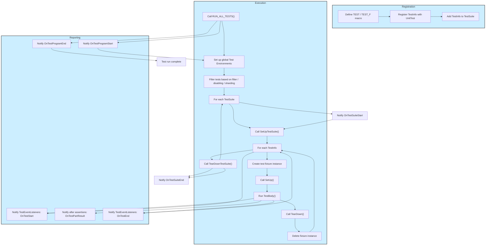

# Test Lifecycle and Registration

Explore the journey from test discovery to execution in GoogleTest. This guide explains how tests are found, registered, and organized into suites and fixtures. It also details how parameterized tests and test runners seamlessly integrate to run and report test results in a portable, flexible manner.

---

## Overview of the Test Lifecycle

GoogleTest automates test registration and execution, liberating developers from manual bookkeeping. When a user defines a test using the macros like `TEST()` or `TEST_F()`, GoogleTest internally registers these tests with the framework. At runtime, invoking `RUN_ALL_TESTS()` initiates the process of executing all registered tests, managing fixtures, and producing rich result reports.

This lifecycle consists of several stages:

1. **Test Registration:** Whenever a test is defined, an internal `TestInfo` object captures details about the test, including its name, suite, location, and fixture type.
2. **Organization into Test Suites:** Related tests are grouped into `TestSuite` objects which manage the collective lifecycle and shared fixtures.
3. **Execution by Test Runner:** The test runner (`RUN_ALL_TESTS()`) iterates through suites and tests, handling setup, execution, teardown, and results collection.
4. **Result Reporting and Event Notifications:** Test listeners receive callbacks throughout the lifecycle to report progress and results in various formats including console output, XML, or JSON.

<Check>
This design ensures that users can focus purely on writing test code, trusting the framework to handle registration, execution order, and result management.
</Check>

---

## Test Registration and Discovery

### Defining and Registering Tests

When you write a test using the `TEST()` macro, such as:

```cpp
TEST(FactorialTest, HandlesZeroInput) {
  EXPECT_EQ(Factorial(0), 1);
}
```

GoogleTest implicitly creates and registers a corresponding test internally. This process encapsulates:

- The test suite name (`"FactorialTest"`)
- The test name (`"HandlesZeroInput"`)
- The fixture type (default `::testing::Test` when using `TEST`)
- Source file and line number

Every test corresponds to a `TestInfo` object which holds this metadata and a function pointer to create the test instance.

### Test Suites as Organizational Units

Multiple tests with the same test suite name are grouped into a `TestSuite`. The test suite manages:

- The collection of `TestInfo` instances
- Suite-wide setup and teardown hooks (`SetUpTestSuite()` and `TearDownTestSuite()`)
- Aggregation of test results

GoogleTest ensures all tests within the same suite share the same fixture type. Mixing `TEST()` and `TEST_F()` (which specify fixtures) within one suite is invalid and results in a compilation failure or runtime error.

---

## The Role of Test Fixtures

Test fixtures allow sharing common data and setup/teardown code among multiple tests. When you define a fixture class by inheriting from `testing::Test` and use `TEST_F()`, GoogleTest:

- Creates a fresh instance of the fixture class for *each* test
- Invokes the fixture’s `SetUp()` before the test body
- Runs the test’s `TestBody()` method
- Invokes the fixture’s `TearDown()` after the test

This isolation ensures test independence and repeatability.

Additionally, static methods like `SetUpTestSuite()` and `TearDownTestSuite()` enable managing expensive shared resources once per test suite instead of per test.

---

## Parameterized Tests Integration

GoogleTest supports parameterized tests allowing a test to be executed multiple times with different input values or types without duplicating code.

- **Value-Parameterized Tests:** Use fixtures inheriting from `TestWithParam<T>`. Tests access parameters via `GetParam()`. You instantiate these with macros like `INSTANTIATE_TEST_SUITE_P`.

- **Typed Tests & Type-Parameterized Tests:** Allow the same test logic to be run across a list of types.

During registration, parameterized tests are expanded by the framework into multiple regular `TestInfo` entries, each associated with a specific parameter or type.

The test runner handles these generated tests transparently.

<Note>
If you define parameterized tests but omit instantiating them, GoogleTest emits a synthetic failing test to alert you.
</Note>

---

## How RUN_ALL_TESTS() Executes Tests

Invoking `RUN_ALL_TESTS()` launches the following user-centric workflow:

<Steps>
  <Step title="Initialization and Environment Setup">
    The framework initializes test environments registered via `AddGlobalTestEnvironment()`. Setup routines run before any test execution.
  </Step>
  <Step title="Test Filtering and Selection">
    Tests are filtered based on user-defined command line flags or environment variables such as `--gtest_filter`. Disabled tests and sharded tests may be excluded unless configured otherwise.
  </Step>
  <Step title="Test Suite and Test Execution">
    For each test suite:
    
    - Runs `SetUpTestSuite()`
    - For each test in the suite:
      - Creates and initializes the test fixture
      - Calls `SetUp()`
      - Runs the actual test body (`TestBody()`)
      - Calls `TearDown()`
      - Cleans up fixture
    - Runs `TearDownTestSuite()`
  </Step>
  <Step title="Result Reporting">
    Throughout the run, test event listeners receive callbacks to report progress and failures. After all tests, results summaries are printed.
  </Step>
  <Step title="Environment Tear-Down">
    Global test environments have their `TearDown()` methods called.
  </Step>
</Steps>

Failures can be fatal or nonfatal. If the `--gtest_fail_fast` flag is set, test execution halts at the first failure.

<Warning>
Do not ignore the return value of `RUN_ALL_TESTS()`; it indicates the success or failure of the test run and should be your program’s exit code.
</Warning>

---

## Event Listener API and Notifications

GoogleTest exposes test events via the `TestEventListener` interface for customization and integration:

- **Start and end of test program, iterations, suites, and individual tests**
- **Notification of test failures (both assertion failures and fatal errors)**

Users can insert custom listeners to change output formatting, send test data to external tools, or implement custom logging.

The listeners receive events in the order added for start events and in reverse order for end events, allowing layered handling.

---

## Common Pitfalls and Best Practices

- Ensure all tests in the same suite use the same fixture type; mixing `TEST()` and `TEST_F()` is disallowed.
- Use fixtures to share setup/teardown logic but remember GoogleTest creates a new fixture instance for each test.
- Properly instantiate parameterized tests with `INSTANTIATE_TEST_SUITE_P`. Omitting this leads to silent test omission or synthetic failures.
- Use filtering and disabling flags deliberately to debug or temporarily exclude tests.
- Always call `testing::InitGoogleTest()` before `RUN_ALL_TESTS()`.

---

## Summary

GoogleTest streamlines test lifecycle management by automatically discovering, registering, grouping, and running tests while providing detailed reporting and flexible extensions via event listeners. Understanding this lifecycle empowers you to write better organized, maintainable, and scalable tests.

For hands-on examples and further reading, consult the [GoogleTest Primer](primer.md), and explore advanced topics such as [Parameterized Tests](advanced.md#value-parameterized-tests), [Typed Tests](advanced.md#typed-tests), and the [Event Listener API](advanced.md#extending-googletest-by-handling-test-events).

---

## Mermaid Diagram: Test Lifecycle Overview


---

## Practical Tips

- Use `TEST()` for simple tests without shared fixture state.
- Use `TEST_F()` when needing test data and helper functions shared between tests.
- Always register parameterized tests with `INSTANTIATE_TEST_SUITE_P` to ensure execution.
- Use `GTEST_SKIP()` to skip tests conditionally at runtime.
- Use event listeners to customize test output or hook into test lifecycle events.

---

## Troubleshooting Common Issues

<AccordionGroup title="Common Issues in Test Lifecycle and Registration">
<Accordion title="Mixed usage of TEST and TEST_F in the same suite">
Ensure all tests in a suite use the same fixture type. Mixing `TEST()` and `TEST_F()` causes errors. Refactor to make tests consistent.
</Accordion>
<Accordion title="Parameterized tests not running">
Confirm that you have instantiated all value-parameterized tests with `INSTANTIATE_TEST_SUITE_P()`. Without instantiation, no tests are executed.
</Accordion>
<Accordion title="Ignoring return value of RUN_ALL_TESTS()">
Always return the result of `RUN_ALL_TESTS()` from your `main()` function to signal test success or failure correctly to test infrastructure.
</Accordion>
<Accordion title="Tests are filtered out unexpectedly">
Check your `--gtest_filter` settings and environment variables, especially if some tests are disabled or assigned to different shards.
</Accordion>
</AccordionGroup>

---

For further understanding, see the [GoogleTest Primer](primer.md) for basic concepts, and [Advanced Topics](advanced.md) for deep dives.


---

*This page describes the framework-level flow from test definition to execution and reporting, focusing on how GoogleTest registers and runs tests transparently to benefit the user.*


