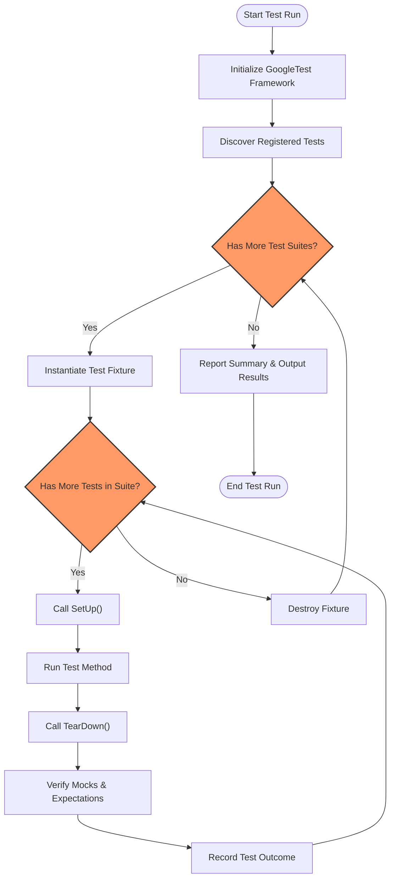

# Test Discovery & Execution Flow

Understanding how GoogleTest finds and executes your tests is crucial to writing effective and reliable test suites. This guide covers how tests are registered, orchestrated within test suites, and the overall lifecycle of a test run—from initialization to result reporting.

---

## How GoogleTest Discovers Tests

GoogleTest automatically detects tests at runtime without requiring you to explicitly enumerate them. This automatic discovery leverages static registration during test macro expansions.

### Test Registration

When you use the `TEST()` or `TEST_F()` macros in your source files, GoogleTest internally registers each test case and test suite in a global registry. This registration happens before `main()` is invoked, ensuring that when `RUN_ALL_TESTS()` executes, all tests are already known to the framework.

- Each test is uniquely identified by its test suite name and test name.
- The framework builds an internal list of all such tests.

### Test Suites and Test Cases

GoogleTest uses the term *test suite* (formerly *test case*) as a logical grouping of related tests. Tests within a suite share the same fixture class when applicable, enabling common setup and teardown.

- Tests execute independently and in isolation.
- Test fixtures (used with `TEST_F()`) encapsulate shared context.

---

## Execution Flow of a Test Run

Once `RUN_ALL_TESTS()` is called, GoogleTest orchestrates the test execution in the following sequence:

1. **Initialization**
   - Parses command line flags and configures the framework.
   - Sets up listeners and event reporters.

2. **Test Suite Iteration**
   - For each registered test suite:
     - Initializes the test fixture object (if any).

3. **Test Execution**
   - Iterates over each test in the suite.
   - Calls the test method inside a controlled environment.
   - Tracks success, non-fatal failures, and fatal failures.

4. **Result Collection**
   - Aggregates test results.
   - Tracks timing for each test.

5. **Reporting**
   - Prints human-readable summaries.
   - Generates XML or JSON outputs if configured.
   - Returns overall pass/fail status.

---

## Test Lifecycle and Callbacks

### Fixture Lifecycle

For tests using fixtures (`TEST_F`), GoogleTest:

- Creates a fresh fixture object before each test.
- Calls `SetUp()` to initialize the test context.
- Runs the test body.
- Calls `TearDown()` to clean up resources.
- Deletes the fixture object.

This ensures tests are independent with no leftover state.

### Assertion Handling

Assertions within tests can be:

- **Non-fatal** (`EXPECT_*`): Test records failure but continues.
- **Fatal** (`ASSERT_*`): Abort the current test immediately.

Failures cause the test to fail, but the framework continues running other tests.

### Mock Object Verification

At the end of each test, destruction of mock objects triggers automatic verification that all expectations were met. Failures here generate test failures with detailed messages.

---

## Controlling Test Execution

GoogleTest provides command-line flags and API functions to control which tests run and how:

- `--gtest_filter` specifies patterns to select tests.
- `--gtest_repeat` runs tests multiple times.
- `--gtest_shuffle` randomizes test execution order.
- Custom listeners can be attached to extend reporting or behavior.

---

## Common Execution Scenarios

### Running All Tests

Simply call:

```cpp
int main(int argc, char** argv) {
  testing::InitGoogleTest(&argc, argv);
  return RUN_ALL_TESTS();
}
```

This runs all registered tests.

### Running a Subset of Tests

Use the filter to run only tests matching a pattern:

```
./your_test_binary --gtest_filter=MySuite.*
```

### Handling Failures

If tests fail, GoogleTest will output detailed failure messages including:

- Test name
- File and line number
- Expected versus actual values
- Stack trace snippets

You can debug based on these diagnostics.

---

## Visualizing Test Discovery and Execution



---

## Best Practices and Tips

- **Register Tests Early:** Define test cases at global scope or inside the test file to ensure they're registered before main.
- **Use Test Suites Thoughtfully:** Organize related tests logically to share fixtures and reduce duplication.
- **Isolate Tests:** Avoid dependencies between tests to improve maintainability and parallel execution.
- **Use Assertion Types Appropriately:** Use `EXPECT_*` for non-fatal checks and `ASSERT_*` for conditions that must hold.
- **Run Tests Frequently:** Use `RUN_ALL_TESTS()` in CI and local builds to catch regressions early.

---

## Troubleshooting Common Issues

<AccordionGroup title="Troubleshooting Test Discovery & Execution Issues">
<Accordion title="Test Not Discovered or Run">
- Check that test macros (`TEST` or `TEST_F`) are in source files compiled and linked into your executable.
- Ensure no conditional compilation excludes the test.
- Make sure to call `InitGoogleTest(&argc, argv)` before `RUN_ALL_TESTS()`.
</Accordion>
<Accordion title="Test Runs But Always Passes Unexpectedly">
- Confirm assertions are actually performed inside the test body.
- Verify that mock expectations are set up before code under test is exercised.
- Check for exceptions or fatal errors bypassing assertion logic.
</Accordion>
<Accordion title="Missing Output or Summary">
- Ensure your test runner output is not being suppressed or redirected.
- Use `--gtest_verbose=info` for detailed logs.
- Confirm your test binary is built with debug symbols.
</Accordion>
</AccordionGroup>

---

## Summary

Understanding the test discovery and execution lifecycle in GoogleTest empowers you to write better-organized, maintainable, and debuggable test suites. Tests are automatically registered and executed with isolation, fixture support, and comprehensive reporting to streamline C++ testing workflows.

---

## Additional Resources

- [GoogleTest Primer](https://github.com/google/googletest/blob/main/docs/primer.md) - for test writing basics
- [Mocking for Dummies](https://github.com/google/googletest/blob/main/docs/gmock_for_dummies.md) - for working with mocks in tests
- [Test Fixtures Guide](https://github.com/google/googletest/blob/main/guides/core-testing-workflows/test-fixtures-organization.md)
- [Framework Initialization](https://github.com/google/googletest/blob/main/api-reference/platform-configuration/framework-initialization.mdx) - for details on bootstrap
- [Feature Landscape](https://github.com/google/googletest/blob/main/overview/understanding-architecture-concepts/feature-landscape.mdx) - to see capabilities overview

---

<Check>
Ensure all tests are registered and run by including the test source files in your build and calling `RUN_ALL_TESTS()` after `InitGoogleTest()`.
</Check>

<Info>
Use `--gtest_filter` and `--gtest_repeat` flags to control which tests run and how often for focused testing and debugging.
</Info>
