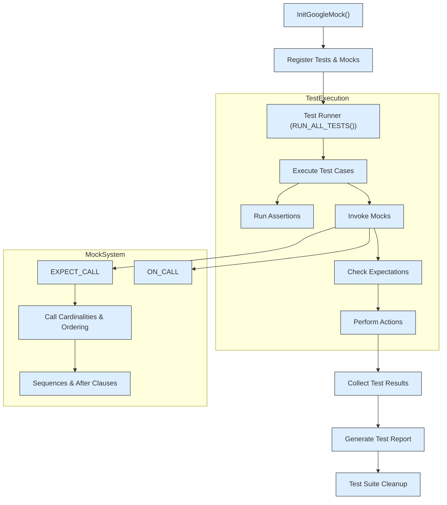

# Framework Architecture Overview

Explore the high-level structure of GoogleTest and GoogleMock, understanding how their components interconnect to provide a unified and powerful platform for testing and mocking in C++. This guide explains the relationships between test cases, assertions, matchers, and mocks, and describes GoogleTest's mechanisms for test discovery, execution, and reporting in C++ projects.

---

## 1. Unified Testing and Mocking Platform

GoogleTest and GoogleMock together form a comprehensive framework that supports writing, executing, and verifying unit tests and mock objects in C++. GoogleMock extends GoogleTest by enabling precise control and validation of interactions in code dependencies through mock objects.

- **GoogleTest** focuses on defining, running, and reporting tests and assertions.
- **GoogleMock** introduces capabilities for creating mock classes, setting expectations on mock methods, and controlling mock behaviors.

This integration ensures seamless workflow from test specification to verification and detailed reporting.

## 2. Core Components and Their Roles

### 2.1 Test Cases and Test Suites

- **Test Cases**: Individual units of tests defined using macros such as `TEST()` or `TEST_F()`. Each test encapsulates a scenario or behavior to verify.
- **Test Suites**: Collections of related test cases grouped logically to allow collective execution and reporting.

GoogleTest detects and organizes tests automatically based on these constructs.

### 2.2 Assertions

Assertions are the core validation statements that verify conditions during test execution:

- **Fatal Assertions:** Using macros like `ASSERT_EQ` halt the current test immediately if failed.
- **Non-fatal Assertions:** Using macros like `EXPECT_EQ` record the failure but continue execution.

Assertions drive test success or failure determination and provide detailed error reports.

### 2.3 Matchers

Match constructors for validating function arguments while setting expectations or verifying complex data:

- Allow expressive, readable conditions on arguments.
- Support composition and custom matcher creation for specialized validations.

Matchers are integral to both assertions and mock method expectation definitions.

### 2.4 Mock Objects and Methods

Mocks simulate dependencies by providing programmable behavior and interaction validation:

- **MOCK_METHOD Macro:** Generates mock methods that override virtual methods, enabling interception of calls.
- **Expectations:** Set with `EXPECT_CALL()` to specify expected call behavior, argument matching, call counts, and invocation order.
- **Default Actions:** Defined by `ON_CALL()` to specify behavior when calls are not explicitly expected.

GoogleMock automatically verifies expectations upon mock destruction, ensuring interaction contracts are honored.

## 3. Test Discovery, Execution, and Reporting

### 3.1 Test Discovery

GoogleTest automates discovery of tests at runtime:

- Tests defined via macros are registered with a framework-managed registry.
- Test runners iterate over registered tests to plan execution.

This enables flexible test integration without manual registration overhead.

### 3.2 Execution Lifecycle

The execution follows a structured lifecycle:

1. **Initialization:** `InitGoogleMock()` initializes GoogleTest and GoogleMock components.
2. **Test Execution:** `RUN_ALL_TESTS()` starts executing all registered tests sequentially.
3. **Mock Handling:** Mocks track calls, perform actions, and verify expectations during test execution.
4. **Result Aggregation:** Test failures and successes are collected for aggregate reporting.

### 3.3 Reporting

- Test failures and assertion failures are reported with source file, line number, and descriptive messages.
- Mock failures report detailed messages including expected vs actual calls, call order violations, and argument mismatches.
- Verbosity levels controlled by `--gmock_verbose` dictate logging detail including stack traces and mock call traces.

Reports are designed for easy debugging and quick identification of issues.

## 4. Interaction Ordering and Cardinalities

GoogleMock supports sophisticated control over the order and count of expected method calls:

- **Cardinalities:** Control expected call counts (`Times`, `AtLeast`, `AnyNumber`, etc).
- **Sequences:** Enforce calls occur in strict or partial order using `Sequence`, `InSequence` and `After`.
- **Sticky Expectations:** Expectations remain active beyond saturation unless explicitly retired.

These features enable highly precise modeling of interaction contracts.

## 5. Behavior Specification via Actions

Mock method calls can perform custom actions, such as:

- Returning explicit values with `Return` or `ReturnRef`.
- Invoking callbacks or lambdas.
- Modifying output parameters with actions like `SetArgPointee`.
- Delegating to fakes, real objects, or parent class implementations.

Multiple actions can be combined with `DoAll` for complex behaviors.

Actions are specified with `WillOnce`, `WillRepeatedly`, and defaulted with `ON_CALL`.

## 6. Default Actions and Uninteresting Calls

- Mock methods have built-in default actions returning zero-equivalent or default-constructed values.
- Calls to methods without expectations are "uninteresting" and cause warnings by default.
- Mock strictness can be controlled with `NiceMock` (suppress warnings) or `StrictMock` (fail on uninteresting calls).

This flexibility helps tailor mock behavior to the test's intent.

## 7. Lifecycle and Verification of Mocks

GoogleMock ensures the validity of test expectations:

- Automatically verifies expectations on mock destruction.
- Allows explicit verification and clearing with `Mock::VerifyAndClearExpectations()` or `Mock::VerifyAndClear()`.
- Supports mocking destruction timing via user-inserted mock `Die()` methods.
- Safely handles mock deletion inside actions without deadlocks.

These features maintain robust and deterministic test outcomes.

## Mermaid Diagram: High-Level Component Interactions

## 8. Practical Tips & Best Practices

- Always set expectations (`EXPECT_CALL`) **before** exercising mocks to ensure proper verification.
- Use `ON_CALL` to specify default behavior without imposing call constraints.
- Prefer `NiceMock<T>` to suppress warnings on uninteresting calls during rapid test development.
- Use sequences and `After` clauses to strictly enforce order only when necessary to avoid brittle tests.
- Use `RetiresOnSaturation()` to automatically retire sticky expectations when fulfilled.
- Define mock classes with `MOCK_METHOD` in `public` sections to allow external specification of expectations and behaviors.
- Use custom matchers and actions sparingly to keep tests readable and maintainable.
- Explicitly verify mocks where deletion lifespan is uncertain using `Mock::VerifyAndClearExpectations()`.

## 9. Troubleshooting Common Scenarios

- **Excessive Calls:** Failures occur if a mock method is called more times than specified. Use `Times` appropriately or `Times(AnyNumber())` for flexibility.
- **Unexpected Calls:** Calls that don’t match any expectation cause test failures. Add catch-all expectations or make mocks permissive.
- **Uninteresting Calls:** Warnings appear if mock methods with no expectations are called. Use `NiceMock` or explicit expectations.
- **Order Violations:** When using sequences, violating the expected call order triggers failures.
- **Action Exhaustion:** If `WillOnce()` actions are exhausted and no `WillRepeatedly()` is specified, a default action is taken.

Use verbosity flags like `--gmock_verbose=info` for detailed logging during debug.

---

## See Also

- [GoogleTest Primer](primer.md) – Getting started with test writing
- [Mocking Basics Guide](guides/mocking-guide/mocking-basics) – Fundamentals of mock creation and use
- [Mocking Reference](reference/mocking.md) – Detailed API explanation for mock-related macros and classes
- [Actions and Advanced Mocking](api-reference/mocking-apis/actions-and-advanced-mocking.mdx) – Defining mock method behaviors
- [Matchers Reference](api-reference/core-testing-apis/matchers.mdx) – Building expressive arguments validation
- [Core Features at a Glance](overview/architecture-core-features/core-features-glance) – Summary of GoogleTest capabilities

---

For source code and test examples related to GoogleMock’s internal mechanics, see the [googlemock/test/gmock-spec-builders_test.cc](https://github.com/google/googletest/blob/main/googlemock/test/gmock-spec-builders_test.cc) file.

