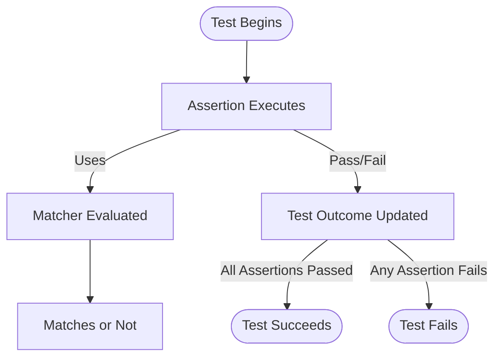

# Assertions & Matchers

Understand how core assertions and matchers work in GoogleTest and GoogleMock. Learn about built-in assertion types, how matchers compose expressive expectations, and how they connect to test results. This page describes practical usage and the extensibility of assertion and matcher concepts for adaptable testing.

---

## Introduction to Assertions and Matchers

GoogleTest and GoogleMock provide a powerful framework for validating behavior and interactions in C++ code. At the heart of these frameworks lie **assertions**, which verify test conditions, and **matchers**, which express fluent expectations about input values or mock method arguments.

In practice, you use assertions to confirm conditions within your tests and matchers to define what function arguments or return values should satisfy. This synergy empowers you to write expressive tests that are both precise and adaptable.

---

## Core Assertion Types in GoogleTest

GoogleTest offers a rich set of assertion macros to verify program correctness:

- **Boolean Assertions**: e.g., `EXPECT_TRUE`, `ASSERT_FALSE` — Check that a condition evaluates to true or false.

- **Equality and Comparison Assertions**: e.g., `EXPECT_EQ`, `ASSERT_LT` — Compare values with relational operators.

- **String Assertions**: e.g., `EXPECT_STREQ`, `ASSERT_STRNE` — Compare C strings by content.

- **Floating-Point Assertions**: e.g., `EXPECT_FLOAT_EQ`, `ASSERT_NEAR` — Compare floating-point numbers with tolerance handling.

- **Exception Assertions**: e.g., `EXPECT_THROW`, `ASSERT_NO_THROW` — Verify that code throws or doesn’t throw specified exceptions.

- **Generalized Assertions with Matchers**: `EXPECT_THAT` and `ASSERT_THAT` enable using matchers to perform rich validations (explained in the next section).

Each assertion type supports streaming custom failure messages to aid debugging. Use `EXPECT_` macros for nonfatal errors to continue test execution, or `ASSERT_` macros for fatal errors that abort the test function immediately.

---

## What Are Matchers & How to Use Them

Matchers are predicates that test a single value and generate helpful error messages on failure. They are used primarily:

- Directly inside assertions: `EXPECT_THAT(actual_value, matcher)`
- Within mock method expectations: `EXPECT_CALL(mock, Method(matcher_args...))`

### Built-in Matcher Categories

Matchers come in several useful flavors:

- **Wildcard and Generic Matchers**:
  - `_` matches any value (wildcard).
  - `Eq(value)` for equality comparison.
  - `Ne(value)`, `Lt(value)`, `Ge(value)`, etc. for relational comparisons.

- **Logical Compositions**:
  - `AllOf(m1, m2, ...)` matches if all sub-matchers match.
  - `AnyOf(m1, m2, ...)` matches if any sub-matcher matches.
  - `Not(m)` matches if sub-matcher does not match.

- **String Matchers**:
  - `StartsWith()`, `EndsWith()`, `HasSubstr()`, `MatchesRegex()`, and case-insensitive variants.

- **Container Matchers**:
  - `ElementsAre(...)` to match container elements by position.
  - `UnorderedElementsAre(...)` to match without order.
  - `Contains()`, `SizeIs()`, and others for container properties.

- **Pointer and Object Property Matchers**:
  - `IsNull()`, `NotNull()`, `Pointee(m)` for pointer contents.
  - `Field(&Class::member, m)`, `Property(&Class::getter, m)` to match object members.

- **Exception Matchers** (for callable objects):
  - `Throws<E>()`, `ThrowsMessage<E>(m)` to verify thrown exceptions.

### Using Matchers in Assertions

The `EXPECT_THAT(value, matcher)` macro lets you write expressive assertions that read naturally:

```cpp
using ::testing::StartsWith;
EXPECT_THAT(username, StartsWith("user_"));
```

On failure, GoogleTest prints descriptive messages explaining the expectation and actual value, helping debugging.

### Using Matchers in Mock Expectations

Within GoogleMock, matchers specify expected argument values in `EXPECT_CALL`:

```cpp
using ::testing::_;  // Wildcard matcher
using ::testing::Ge;

EXPECT_CALL(mock, UpdateValue(Ge(10)));  // Expects argument >= 10
EXPECT_CALL(mock, Process(_, "hello"));  // First arg: anything, second: "hello"
```

Matchers help precisely capture the conditions under which mock methods should be called, enabling strict and meaningful interaction validation.

---

## Composing Complex Matchers

Matchers can be composed to express advanced expectations:

- Combine matchers with `AllOf()`, `AnyOf()`, or negate with `Not()`.
- Match multiple arguments as a tuple using `.With()` with a tuple matcher.
- Use `Args<N1, N2>(m)` to apply a matcher `m` to a subset of tuple arguments.

Example:

```cpp
EXPECT_CALL(mock, DoThing(_, _))
    .With(Args<0, 1>(Lt()));  // First arg < second arg
```

This enforces that the first argument is less than the second.

---

## Extending Assertions & Matchers

GoogleTest and GoogleMock provide extensibility mechanisms:

- **Custom Assertions**: Create predicates returning `AssertionResult` for expressive success/failure and messages.

- **Custom Matchers**: Using `MATCHER` macros or implementing matcher interfaces, you can write domain-specific matchers.

- **Custom Actions**: Define behaviors for mock calls beyond built-in actions using callables, lambdas, or action macros.

This extensibility allows tests to precisely mimic your domain logic and expand beyond built-in verification.

---

## Typical User Workflow

1. **Writing Assertions**: Use core GoogleTest macros (`EXPECT_EQ`, `ASSERT_TRUE`, `EXPECT_THAT`) to verify test conditions with clarity.

2. **Using Matchers in Mocks**: When mocking dependencies, use GoogleMock's `EXPECT_CALL` with matchers to define expected interactions and argument constraints.

3. **Combining Actions with Expectations**: Define what mock methods return or enact using `WillOnce()`, `WillRepeatedly()`, or custom actions.

4. **Leveraging Matcher Compositions**: Build complex matching logic for nuanced test scenarios.

5. **Debugging with Detailed Messages**: Use matchers and assertion streaming to generate informative failure diagnostics.

---

## Best Practices and Common Pitfalls

- **Write focused assertions** that verify one property per test to simplify failures.

- **Use `_` wildcards judiciously**, only ignoring arguments irrelevant to the test intent.

- **Use `ON_CALL` for default mock behaviors**, and `EXPECT_CALL` where you specifically want to verify calls.

- **Avoid over-specifying expectations** to reduce brittle tests.

- **Use `RetiresOnSaturation()` or `InSequence`** to control call ordering and expectation lifetimes.

- **Ensure matchers have no side effects**, as they may be called multiple times by the framework.

- **When working with overloaded functions, disambiguate with `Const()` or explicit casting of matchers.**

- **Suppress noisy uninteresting call warnings using `NiceMock`**, or tighten expectations with `StrictMock`.

- **Beware that `EXPECT_CALL` statements must precede code execution that triggers matching mock calls.**

---

## Troubleshooting Assertions and Matchers

- **Failures with unexpected argument values:** Check that the matchers in your expected calls match the actual argument values.

- **Unexpected uninteresting call warnings:** Use `NiceMock` or add `EXPECT_CALL(...).Times(AnyNumber())` to cover them intentionally.

- **Match failures due to type mismatches:** Use `SafeMatcherCast<T>(m)` when matching types differ but are compatible.

- **Ambiguous overloads:** Disambiguate with `Const()`, typed matchers, or explicit casts.

- **Tests failing due to call order:** Use `InSequence` or `.After()` to impose expected call ordering.

- **Issues returning move-only types from mocks:** Use lambdas or callable objects instead of direct `Return()`.

For detailed help, consult GoogleTest's Assertions Reference, Matchers Reference, and the gMock Cookbook.

---

## Related Resources and Next Steps

Explore these key guides and references to deepen your assertion and matcher skills:

- [GoogleTest Assertions Reference](reference/assertions.md)
- [GoogleTest Matchers Reference](reference/matchers.md)
- [GoogleMock Mocking Reference](reference/mocking.md)
- [gMock Cookbook](docs/gmock_cook_book.md) for practical examples on mocking and matching
- [gMock for Dummies](docs/gmock_for_dummies.md) to get started with mocks
- [Using Assertions Guide](guides/gtest-core-guides/using-assertions.mdx) for advanced assertion techniques
- [Matchers API Guide](guides/advanced-testing-features/matchers-and-matchers-api.mdx) for deep matcher constructions

For comprehensive understanding, you should also review related pages covering test writing, mock object usage, and test lifecycle management.

---

## Diagram: How Assertions and Matchers Connect to Test Execution



This flow highlights the pivotal role of assertions invoking matchers to determine test outcomes.

---

<Check>
Ensuring correct usage of assertions and matchers is critical for meaningful and maintainable test suites. Pay special attention to specifying expectations upfront and to the purity of your matchers.
</Check>