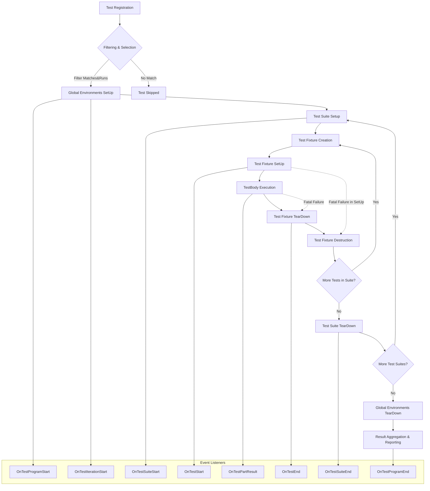

# Test Lifecycle & Execution Model

Understanding the test lifecycle in GoogleTest is essential to mastering its use. This guide walks you through how tests are registered, set up, executed, and torn down, detailing the sequence from the test definition to result reporting. By the end, you will grasp how GoogleTest orchestrates test execution, manages fixtures, and handles failures.

---

## 1. Test Registration

Every test in GoogleTest is registered before execution begins. Registration can happen either through macros like `TEST()`, `TEST_F()`, `TEST_P()`, or dynamically via `RegisterTest()`.

- Tests belong to test suites (previously termed test cases).
- Each test has a factory callable creating the test fixture.
- GoogleTest ensures tests in a suite share the same fixture class.

Registration details include:

- Test suite name
- Test name
- Type and value parameters (for parameterized tests)
- Source code location (file and line)

The framework maintains a global listing of all test suites and tests.

## 2. Test Filtering & Selection

Before running tests, GoogleTest evaluates which tests are to be executed based on:

- User-supplied filters via `--gtest_filter`
- Disabled tests prefixed with `DISABLED_` (can be optionally run)
- Test sharding environment variables (`GTEST_SHARD_INDEX` and `GTEST_TOTAL_SHARDS`)

Filtering proceeds by matching test suite and test names to glob patterns, excluding disabled tests unless told otherwise.

Sharding enables distributing test execution across multiple machines or processes, with GoogleTest running only the subset of tests allocated to the current shard.

## 3. Test Execution Lifecycle

### Overview

Once chosen, tests are run according to the following lifecycle:

1. **Global Test Environment Setup:** All registered `Environment` objects have their `SetUp()` methods called, in registration order.
2. **Test Suite Setup:** For each test suite with at least one test to run, `SetUpTestSuite()` static method is called once before any tests in that suite.
3. **Individual Test Execution:** For each test:
   - A fresh test fixture object is created.
   - The test fixture’s `SetUp()` is called.
   - The test’s `TestBody()` is executed.
   - The test fixture’s `TearDown()` is called.
   - The fixture object is destroyed.
4. **Test Suite Teardown:** After all tests in the suite run, `TearDownTestSuite()` is called.
5. **Global Test Environment Teardown:** All registered environment objects run their `TearDown()` in reverse order.

### Details

- Each test runs completely independently, with a fresh fixture instance.
- Fatal failures in setup or test bodies stop execution of that test but not the entire suite or test run, unless the `--gtest_fail_fast` flag is set.
- Non-fatal failures let the test continue after a failure.
- Tests may be skipped at runtime via `GTEST_SKIP()`, affecting the test status accordingly.
- Fixtures can share expensive resources via `SetUpTestSuite()` and `TearDownTestSuite()`.

## 4. Sequence of Events with Event Listeners

GoogleTest supports event listeners that receive callbacks at each significant point in the lifecycle:

- Test program start and end
- Test iteration start and end
- Environment setup start/end
- Test suite start/end
- Test start/end
- Test part result (assertions successes/failures)
- Environment teardown start/end

These callbacks enable custom output, logging, or integrations.

### Typical Event Flow for a Test Suite

- `OnTestProgramStart`
- `OnTestIterationStart`
- `OnEnvironmentsSetUpStart`
- `Environment::SetUp` (for each environment)
- `OnEnvironmentsSetUpEnd`
- For each TestSuite:
  - `OnTestSuiteStart`
  - `SetUpTestSuite()`
  - For each TestInfo:
    - `OnTestStart`
    - Fixture `SetUp()`
    - `TestBody()`
    - `OnTestPartResult` (if assertions fail or SUCCEED called)
    - Fixture `TearDown()`
    - `OnTestEnd`
  - `TearDownTestSuite()`
  - `OnTestSuiteEnd`
- `OnEnvironmentsTearDownStart`
- `Environment::TearDown` (reverse order)
- `OnEnvironmentsTearDownEnd`
- `OnTestIterationEnd`
- `OnTestProgramEnd`

## 5. Handling Test Fixtures

### Creating Fixtures

- Derive fixture classes from `testing::Test`.
- Declare shared setup/teardown via static `SetUpTestSuite()` and `TearDownTestSuite()`.
- Declare test-specific setup/teardown by overriding `SetUp()` and `TearDown()`.

### Execution

- GoogleTest invokes `SetUpTestSuite()` once per suite run and `TearDownTestSuite()` after all tests in the suite.
- Each test instance is created freshly; `SetUp()` and `TearDown()` are called for each test.

### Restrictions & Best Practices

- Mixing `TEST_F` and `TEST` tests in the same suite is disallowed and generates errors.
- `SetUpTestSuite()` might be called multiple times in inheritance scenarios; guard static resource allocation as needed.

## 6. Failure Types & Handling

GoogleTest distinguishes failure severity:

- **Fatal Failures:** Triggered by `ASSERT_*` macros, they abort the current function immediately, skipping subsequent steps.
- **Non-Fatal Failures:** Triggered by `EXPECT_*` macros, the test continues but records the failure.

### Fatal vs Non-Fatal

- Fatal failures in setup/fixture cause skipping of the test body.
- Fatal failures propagate such that a test marked failed if any fatal failure occurs.

### Debugger Interaction

- With the `--gtest_break_on_failure` flag, GoogleTest will trigger breakpoints on assertion failures.
- The `--gtest_throw_on_failure` causes assertions to throw exceptions instead of just failing.

### Skipped Tests

- Tests or suites can be skipped dynamically via `GTEST_SKIP()`. Such tests are neither passing nor failing.

## 7. Test Result Reporting

- GoogleTest collects detailed information about each test's result, including: 
  - Whether it passed, failed, or was skipped.
  - The duration of execution.
  - Individual assertion results.
  - Additional properties recorded via `RecordProperty()`.

- Results propagate up from individual tests to test suites, and accumulate in the `UnitTest` singleton.
- Results can be output in text, XML, or JSON formats.

## 8. Visualization of the Test Lifecycle

## 9. Practical Tips & Best Practices

- **Always call `InitGoogleTest()` before `RUN_ALL_TESTS()`** to ensure flags and registration are initialized.
- **Use test fixtures wisely** to share expensive resources across tests.
- **Avoid mixing `TEST` and `TEST_F` in the same test suite** to prevent fixture conflicts.
- Use **filters and shards** to run subsets efficiently.
- **Leverage event listeners** if custom reporting is needed.
- If using assertions in subroutines, consider **checking `HasFatalFailure()` to propagate failures properly**.
- Use `GTEST_SKIP()` to **skip tests dynamically** during setup or tests.

## 10. Troubleshooting Common Scenarios

### Tests Not Running

- Verify registration occurs before running tests.
- Check your filters and sharding settings.
- Disabled tests are excluded unless `also_run_disabled_tests` is set.

### Mix of Fixtures Causes Errors

- Confirm fixtures used in a suite are consistent.
- Avoid mixing `TEST` and `TEST_F` macros in the same suite.

### Premature Termination

- Use the premature exit file protocol environment variable to detect abnormal exits.

### Unexpected Failures

- Use `break_on_failure` and exception catching to better debug failures.

## Summary

This guide detailed the GoogleTest test lifecycle, from test registration through execution, including setup and teardown of fixtures and environments, filtering and sharding selections, failure management, and result reporting. Understanding the flow and mechanisms empowers you to write effective tests, customize execution, and integrate GoogleTest smoothly into your workflows.

---

## Additional References

- [GoogleTest Primer](primer.md) — Introduction to core concepts
- [Testing Reference](reference/testing.md) — Detailed API reference for test registration and lifecycle
- [Running Tests Guide](guides/gtest-core-guides/running-tests.md) — Understanding test execution and output
- [Advanced Topics — Test Fixtures](advanced.md#sharing-resources-between-tests-in-the-same-test-suite)
- [Event Listeners API and Sample](docs/samples.md#sample9_unittest.cc)
- [Assertions Guide](guides/gtest-core-guides/using-assertions.md) and [Assertions Reference](reference/assertions.md) for failure handling

For source-level understanding, see GoogleTest implementation files, especially [`gtest.cc`](googletest/src/gtest.cc).