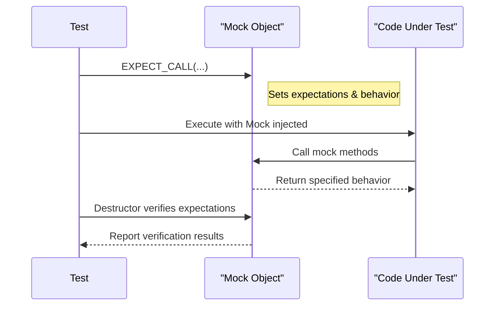

# Mocking: Principles and Patterns

Mock objects are fundamental tools for isolating units of code and achieving precise and reliable tests. This guide explores the core principles that underpin mocking with GoogleMock, illustrating how expectation setting, behavior specification, and verification combine to simulate complex object collaborations effectively.

---

## Why Use Mocks?

Unit testing aims to validate a component in isolation, but real code often depends on other components or external systems. Mocks allow you to:

- **Decouple your tests from real dependencies** that may be slow, unreliable, or hard to trigger.
- **Simulate edge cases and failure modes** that are difficult to reproduce with real objects.
- **Assert interactions**, such as the order, frequency, and parameters of method calls, beyond just final state validation.

Consider a payment system where your component calls a payment gateway. Using a real gateway in tests is impractical due to network dependency, cost, and variability. Instead, a mock gateway can be used to simulate various responses and verify your component behaves correctly.

---

## Core Mocking Concepts

### 1. Interfaces and Mock Classes

Mocks implement the same interfaces as their real counterparts, enabling transparent substitution. GoogleMock leverages C++ virtual functions and the `MOCK_METHOD` macro to easily define mock classes derived from interfaces.

Example interface and mock definition:

```cpp
class Database {
 public:
  virtual ~Database() {}
  virtual bool Connect(const std::string& url) = 0;
  virtual int Query(const std::string& sql) = 0;
};

class MockDatabase : public Database {
 public:
  MOCK_METHOD(bool, Connect, (const std::string& url), (override));
  MOCK_METHOD(int, Query, (const std::string& sql), (override));
};
```

---

### 2. Expectations: What Will Happen

Expectations express what methods you expect the code under test to call on the mock, with what arguments, how many times, and in what order.

- Use `EXPECT_CALL(mock, Method(args))` to declare your expectations.
- Specify call cardinalities with `.Times()`, for example `.Times(AtLeast(1))`.
- Control call order using `.InSequence()` or `.After()`.

Example:

```cpp
using ::testing::AtLeast;
using ::testing::Return;

MockDatabase db;
EXPECT_CALL(db, Connect("test.db"))
    .Times(1)
    .WillOnce(Return(true));
EXPECT_CALL(db, Query(_))
    .Times(AtLeast(1))
    .WillRepeatedly(Return(42));

// Exercise code using db...
```

---

### 3. Behavior: How Mocks Respond

Mock methods do not have real implementations; you must specify their behavior:

- Use `.WillOnce(action)` for single-call behaviors.
- Use `.WillRepeatedly(action)` for repeated calls.

Common actions include:

- `Return(value)` to return a value.
- `Invoke(callable)` to call a function/lambda.
- `SetArgPointee<index>(value)` to modify output arguments.

Example specifying return values:

```cpp
EXPECT_CALL(db, Query("SELECT COUNT(*) FROM users"))
    .WillOnce(Return(100));
```

---

### 4. Verification: Checking Consistency

GoogleMock automatically verifies whether all expectations are met:

- When a mock object is destroyed, violation of expectations triggers test failures.
- Violations include missing calls, unexpected calls, too many calls, wrong arguments, or incorrect order.

If a method is called too often or with unexpected arguments, GoogleMock immediately reports an error, typically including the location and call details to aid debugging.

---

## Interaction Patterns with Mocks

### Specifying Order of Calls

By default, calls may occur in any order. To strictly enforce order:

- Use `InSequence` object to group ordered expectations.

```cpp
{
  InSequence s;
  EXPECT_CALL(mock, Open());
  EXPECT_CALL(mock, Write("data"));
  EXPECT_CALL(mock, Close());
}
```

- Alternatively, use `After()` to specify partial ordering:

```cpp
Expectation open = EXPECT_CALL(mock, Open());
EXPECT_CALL(mock, Close()).After(open);
```

### Handling Multiple Expectations on One Method

GoogleMock matches expectations in reverse order of declaration, applying the newest matching expectation first. This enables:

- Defining a catch-all general expectation, then adding more specific ones.

```cpp
EXPECT_CALL(mock, Process(_)).Times(AnyNumber());        // General catch-all.
EXPECT_CALL(mock, Process(42)).Times(1).WillOnce(...);  // Specific case.
```

---

## Best Practices

- **Set expectations before exercising the code under test.** gMock requires expectations be declared before method calls.
- **Use the simplest matchers that satisfy your needs.** Overly strict specs lead to brittle tests.
- **Isolate one logical behavior per test.** This aids in pinpointing failures.
- **Use sequences and ordering only when necessary.** Less ordering means more flexible, maintainable tests.
- **Use `NiceMock` and `StrictMock` to manage warnings for uninteresting calls** based on your test's rigor requirements.

---

## Troubleshooting Common Issues

- **Unexpected call errors:** Ensure all expected calls are declared and `EXPECT_CALL` precedes method calls.
- **Uninteresting call warnings:** Use `NiceMock` to suppress if the call is irrelevant. Otherwise, consider adding expectations or `ON_CALL`s.
- **Order failures:** Use sequences or `.After()` clauses to control call order explicitly.

---

## Summary

Mocking in GoogleMock empowers precise, interaction-focused testing by letting you declare who should be called, how often, with what, and in which sequence. Proper use of `EXPECT_CALL`, actions, and verification results in fast, isolated, and maintainable tests.

---

## Further Reading

- [gMock for Dummies](https://google.github.io/googletest/gmock_for_dummies.html) — Friendly introduction and examples
- [gMock Cookbook](https://google.github.io/googletest/gmock_cook_book.html) — Detailed recipes and idioms
- [Mocking Reference](https://google.github.io/googletest/reference/mocking.html) — API reference
- [Mock Strictness and Behavior Guide](/concepts/control-behavior-security-performance/strictness-and-mock-behavior-control)

---

## Diagram: Mock Interaction Flow


