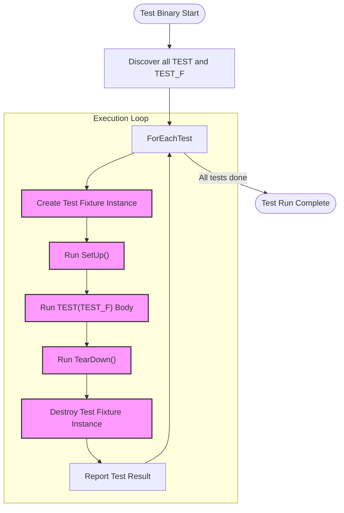

# The xUnit Test Framework Model

Explore how GoogleTest implements the xUnit testing architecture, enabling developers to organize tests into suites and cases for maintainable, scalable, and repeatable assessments. Learn how discovery and execution of tests are handled, drawing on familiar paradigms that make onboarding easy for users coming from other xUnit-based tools.

---

## Introduction

GoogleTest builds on the well-established xUnit architecture, applying its core principles to support effective automated testing in C++. This familiar structure offers developers a clear, consistent way to organize tests, making it easy to create maintainable and scalable test suites. If you've used frameworks like JUnit or PyUnit before, GoogleTest’s model will feel intuitive and approachable.

This page focuses on how GoogleTest implements the xUnit test framework model, highlighting the concepts of test suites and test cases, test discovery, execution, and result management.

## Key Concepts of the xUnit Model in GoogleTest

### Test Suites and Test Cases

- **Test Suite**: A container grouping related tests. It usually maps to a logical unit in your code, such as a class or module. Test suites can share resources and setup/teardown routines.
- **Test Case**: An individual test method within a test suite, representing an atomic check of specific functionality or behavior.

In GoogleTest, test suites are declared using the `TEST()` or `TEST_F()` macros. The first parameter denotes the test suite name, grouping tests logically. The second parameter is the test case name.

**Example:**

```cpp
TEST(MathUtils, AddsNumbersCorrectly) {
  EXPECT_EQ(Add(1, 2), 3);
}

class CalculatorTest : public testing::Test {
 protected:
  void SetUp() override {
    calculator.Reset();
  }
  Calculator calculator;
};

TEST_F(CalculatorTest, SubtractsNumbersCorrectly) {
  EXPECT_EQ(calculator.Subtract(4, 2), 2);
}
```

This structuring ensures tests are logically grouped and can share setup and teardown, promoting code reuse and clearer organization.

### Test Discovery

GoogleTest automatically discovers tests at runtime. When the test binary runs:

1. All `TEST()` and `TEST_F()` definitions are registered with GoogleTest’s internal registry.
2. The test runner enumerates these registered tests and prepares to execute them.

This eliminates the need for manual test registration and allows tests to be added rapidly and scalably.

### Test Execution Flow

GoogleTest executes each test case individually, following these phases:

1. **Test Suite Fixture Construction**: For each test case, GoogleTest creates a new instance of the test fixture class (if any).
2. **SetUp()**: Runs setup code common to the test suite before the test.
3. **Test Method Execution**: Runs the specific `TEST()` or `TEST_F()` function code.
4. **TearDown()**: Runs teardown code to clean up after the test.
5. **Test Fixture Destruction**: Cleans up the test fixture instance.

After each test, GoogleTest reports the result including failures, successes, and any warnings.

### Parallel and Independent Tests

Every test case runs in its own fresh environment, preventing state leakage between tests. This design also makes it straightforward to run tests in parallel or isolation with CI systems.

## Organizing Tests for Maintainability and Scalability

### Using Test Fixtures for Common Setup

When multiple tests require shared setup and cleanup, use `TEST_F()` with test fixtures. This enables:

- Reuse of setup logic
- Cleaner test code
- Clearer expression of test intent

### Parameterized Tests

GoogleTest supports parameterized tests, enabling you to apply the same test logic to different data inputs. This promotes reducing duplication and increasing test coverage.

Example introduction:

```cpp
class FactorialTest : public ::testing::TestWithParam<int> {};

TEST_P(FactorialTest, HandlesNonNegativeIntegers) {
  int n = GetParam();
  EXPECT_GE(Factorial(n), 1);
}

INSTANTIATE_TEST_SUITE_P(PositiveIntegers, FactorialTest,
                         testing::Values(0, 1, 2, 3, 8));
```

## Integration with GoogleMock

GoogleTest’s xUnit model provides the structure for registering and running tests. GoogleMock complements this by enabling mocking and interaction-based testing inside these frameworks.

- Tests define mock objects with expectations.
- The `EXPECT_CALL()` and `ON_CALL()` macros specify behavior and verifications.
- The test structures (`TEST_F` fixtures, for example) embed mocks and test logic.

This synergy ensures that users leveraging xUnit patterns can extend easily into mocking and interaction verifications.

## Test Result Reporting and Failure Feedback

GoogleTest provides detailed reporting for each test case:

- Shows which test failed or passed
- Reports source file and line number for failures
- Aggregates test results by suite
- Provides optional output formats suitable for CI (JUnit XML)

This immediate feedback helps catch regressions early and improves debugging speed.

## Practical Tips and Best Practices

<AccordionGroup title="Best Practices for Effective Use of xUnit in GoogleTest">
<Accordion title="Leverage Test Fixtures for Shared Initialization">
Use `TEST_F()` and test fixture classes whenever multiple tests share common setup or teardown logic. This reduces duplication and keeps tests concise.
</Accordion>
<Accordion title="Choose Clear and Consistent Naming">
Name test suites after the functionality or class under test, and test cases after the specific scenario, to make your test results easier to understand.
</Accordion>
<Accordion title="Organize Tests into Logical Suites">
Group related tests under the same test suite to promote modular and understandable codebases.
</Accordion>
<Accordion title="Isolate Tests to Avoid Dependencies">
Ensure each test does not depend on another’s side effects. GoogleTest creates new fixture instances for each test to help with this.
</Accordion>
<Accordion title="Use Parameterized Tests for Repetitive Scenarios">
Employ parameterized tests where the same logic needs to be confirmed across different inputs.
</Accordion>
</AccordionGroup>

## Troubleshooting Common Issues

### Tests Not Being Discovered
- Verify your test binaries are linked with GoogleTest and all tests are defined with `TEST()` or `TEST_F()` macros.

### Tests Interfering Due to Shared State
- Use test fixtures properly and avoid static/global variables within tests.

### Tests Failing Due to Order Dependency
- Remember that tests run independently; set up the state fully in each test.

### Slow Tests Due to Expensive Setup
- Minimize work in fixtures’ `SetUp()` and consider sharing expensive initialization in static member fixtures.

## Summary Diagram



---

## See Also

- [GoogleTest Primer](../../docs/primer.md) — foundational concepts and usage for GoogleTest.
- [Mocking Reference](../../api-reference/core-apis/mocking.md) — detailed reference for mocking APIs in GoogleMock.
- [gMock Cookbook](../../docs/gmock_cook_book.md) — practical recipes and tips for mocking in tests.
- [Writing and Running Tests: Basic Unit Tests Guide](../../guides/writing-and-running-tests/basic-unit-tests.mdx) — step-by-step guidance to author and run tests.
- [Core Concepts & Terminology](../overview/concepts-architecture/core-concepts-terminology.mdx) — key definitions to understand GoogleTest.

---

This guide serves as your foundational step to master GoogleTest’s xUnit model, enabling you to write clean, effective, and maintainable tests even as your codebase grows.
