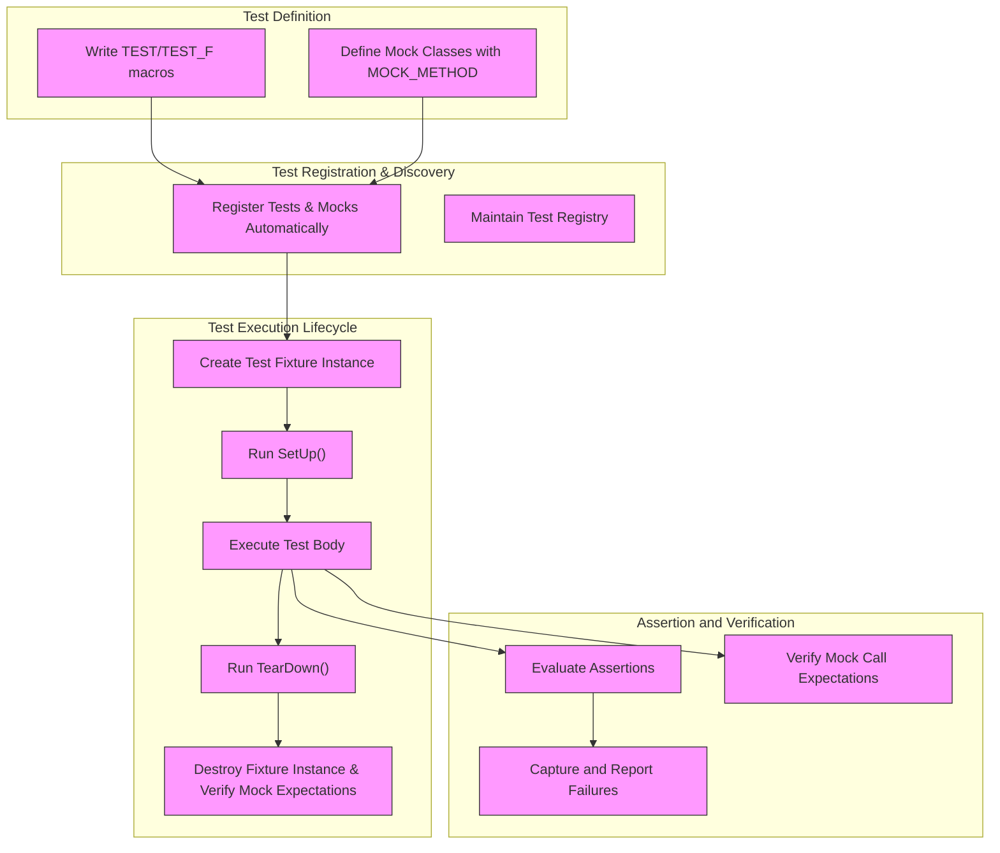

# Architecture Overview

## Introduction

This page provides a comprehensive introduction to the overall structure of GoogleTest and GoogleMock. It illustrates how test discovery, execution, assertion mechanisms, and mock object support interconnect to form a powerful and flexible C++ testing solution. By understanding the interplay among these facets, you gain clarity on how GoogleTest delivers reliable, maintainable, and extensible testing capabilities.

---

## Key Components and Their Interplay

GoogleTest is composed of several highly integrated modules, each serving a vital role in the testing lifecycle:

- **Test Discovery & Registration:** Automatically identifies and catalogs tests at runtime, enabling effortless execution without manual enumeration.

- **Test Execution Engine:** Manages the lifecycle of each test and test fixture, ensuring proper setup, invocation, teardown, and result reporting.

- **Assertion Framework:** Provides a broad spectrum of assertion macros that validate test outcomes with clear diagnostics on failure.

- **Mock Object Framework (GoogleMock):** Enables defining mock classes and expectations to perform interaction-based testing, integrating tightly with test execution and assertions.

The ecosystem enables you to structure tests both by validating outcomes and by verifying interactions with mocked dependencies, supporting a wide variety of testing strategies in C++ projects.

### Test Lifecycle

1. **Definition:** You define tests using macros like `TEST` or `TEST_F`, and mock classes using macros like `MOCK_METHOD` in GoogleMock.
2. **Discovery:** Upon test executable startup, the framework automatically registers all test cases and suites.
3. **Execution:** When `RUN_ALL_TESTS()` is called, the framework instantiates test fixtures, setups the environment, runs test bodies, and cleans up.
4. **Assertions & Mocks:** During test execution, assertions check expectations and GoogleMock verifies expected interactions and call orders.
5. **Reporting:** Failures and successes are clearly reported, including detailed information on assertion failures or mock expectation violations.

---

## Test Discovery & Registration

GoogleTest uses a static registration mechanism where each `TEST` or `TEST_F` macro expands into code that registers the test with the framework on program startup. This removes any need for manual test enumeration.

The registration maintains a registry holding all tests organized by test suite. This enables you to discover, filter, and execute a subset of tests conveniently.

**Outcome:** You write tests naturally with no overhead for managing test lists.

---

## Execution Engine & Test Fixture Lifecycle

Tests are executed by the framework in controlled lifecycle phases:

- **Instantiation:** Each test creates a fresh instance of the test fixture class, isolating tests to prevent side effects.

- **SetUp:** Before the test body runs, the fixture’s `SetUp()` method is called for common initialization.

- **Test Body Execution:** The actual test code runs where assertions are made.

- **TearDown:** After the test completes, `TearDown()` runs for cleanup.

This ensures safety, repeatability, and isolation in complex test scenarios.

---

## Assertions: Validating Behavior

Assertions are the heart of verifying correct program behavior. GoogleTest provides powerful macros that:

- Express rich conditions (equality, inequality, exception expectations, string comparisons, floating-point comparisons, etc.).
- Distinguish between fatal (`ASSERT_`) and non-fatal (`EXPECT_`) failures.
- Support expressive predicates with detailed diagnostics to accelerate debugging.

Users focus on correctness criteria while GoogleTest handles reporting and control flow.

---

## GoogleMock: Interaction-Based Testing

GoogleMock extends GoogleTest with facilities for mocking and interaction verification:

- **Declarative Mock Definitions:** Using macros like `MOCK_METHOD`, you define mock classes that simulate interfaces.

- **Expectations and Default Behaviors:** Via `EXPECT_CALL` and `ON_CALL`, you specify the expected invocation patterns and default responses.

- **Advanced Argument Matching:** Rich matchers allow specifying exact, range, or custom argument validations.

- **Call Order and Cardinality Control:** You can enforce strict or partial ordering and specify how many times calls must occur.

- **Composing Custom Actions and Matchers:** Extend the framework to fit complex behaviors.

- **Error Reporting:** Immediate and detailed feedback when expectations fail.

This enables testing in isolation, verifying interactions with dependencies precisely.

---

## Intermodule Collaboration

The key value of GoogleTest and GoogleMock lies in the seamless integration between:

- **Test Discovery & Execution:** All mock expectations and assertions are evaluated within the well-structured test lifecycle.

- **Assertion Reporting:** GoogleMock leverages GoogleTest’s assertion framework to report mock expectation successes and failures.

- **Test Fixture Support:** Mocks can be members of fixtures, enabling shared setup and reuse across tests.

- **Flexible Test Flow:** Order of expectations and sequences allows complex interaction patterns to be specified cleanly.

By working together, these components afford a robust, expressive, and maintainable testing experience.

---

## User Journey: Writing and Running a Mock Test

1. **Define a Mock Class:** Create a class inheriting from your interface and declare mock methods using `MOCK_METHOD`.

2. **Set Expectations and Behavior:** In your test, instantiate the mock and define expected calls with `EXPECT_CALL`, specifying argument matchers and actions.

3. **Exercise the Code Under Test:** Pass the mock into production code and run functions that trigger mock interactions.

4. **Observe Verification Results:** GoogleMock automatically verifies expectations during test execution and destruction of the mock.

5. **Iterate Confidently:** Adjust tests along with production code, leveraging clear diagnostics and flexible mock configurations.

---

## Practical Tips

- **Expectations Before Execution:** Always set `EXPECT_CALL`s before the code under test calls the mocked methods to ensure deterministic behavior.

- **Use `ON_CALL` for Default Behavior:** Set default behaviors with `ON_CALL` without imposing call count constraints.

- **Leverage Matchers for Flexibility:** Use built-in matchers like `_` (wildcard), `Eq()`, and compound matchers to focus tests cleanly on relevant arguments.

- **Control Call Ordering:** Use `InSequence` or `After` to enforce call orders where necessary without over-constraining tests.

- **Manage Uninteresting Calls:** Use `NiceMock` to suppress warnings on mock calls you don’t care about, or `StrictMock` to fail them.

- **Avoid Over-Specification:** Overly rigid tests can become brittle; verify only what is necessary for the contract.

- **Use Custom Actions and Matchers:** Define bespoke matchers and actions for complex arguments and behaviors.

---

## Troubleshooting

- If a mock method is invoked but no matching `EXPECT_CALL` is found, an error or warning will be produced.

- Pay attention to the order of `EXPECT_CALL`s: the last matching expectation takes precedence.

- Understand the difference between *uninteresting* calls (no expectations) and *unexpected* calls (no matching expectation among some).

- Running tests with `--gmock_verbose=info` outputs detailed call and expectation traces.

- Verify all expectations are met by mock destruction or manually via `Mock::VerifyAndClearExpectations()`.

---

## Visualizing the Architecture

---

## Next Steps

After mastering this overview, you should explore:

- [Core Concepts and Terminology](/overview/product-intro-core-concepts/core-concepts-terminology) to build foundational vocabulary.
- [Mocking APIs and Macros](/api-reference/core-testing-apis/mocking-apis) for concrete syntax on creating and using mocks.
- [Using Assertions and Matchers Effectively](/guides/core-workflows/using-assertions-and-matchers) to learn best practices in writing expressive tests.

Together, these resources will help you deepen your expertise and write effective tests with GoogleTest and GoogleMock.
