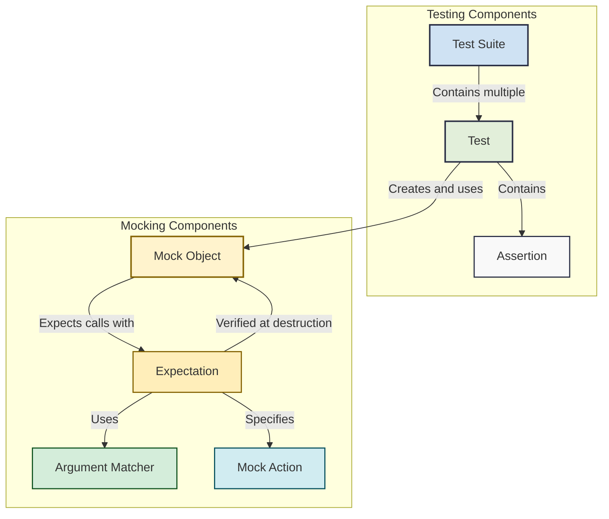

# Primary Components and Their Roles

## Introduction

Understanding the fundamental building blocks of GoogleTest and GoogleMock is the key to writing effective and maintainable tests. This guide breaks down the major components—**test cases**, **test suites**, **mock objects**, **expectations**, and **assertions**—and explains how they come together in your test code. By grasping the roles and interactions of these components, test authors can confidently assemble, execute, and validate tests with clear boundaries and responsibilities between GoogleTest and GoogleMock.

This guide focuses exclusively on the conceptual aspects of these primary components, helping you to understand what users want to achieve when writing tests with GoogleTest and GoogleMock.

---

## 1. Test Cases and Test Suites

GoogleTest organizes tests using **test cases** (now preferably called **test suites**) and individual **tests** within them:

- **Test**: Represents an individual, executable test, a distinct verification of a particular behavior or feature in your code.
- **Test Suite**: A collection grouping logically related tests that share a common context, often corresponding to a particular class, module, or function under test.

### User Motivation

As a test author, your goal is to logically group related tests for easier maintenance, clear reporting, and reusability of setup objects.

### How Test Suites and Tests Work

- Use the `TEST()` macro to define a test inside a test suite:

```cpp
TEST(SuiteName, TestName) {
   ... test code and assertions ...
}
```

- Tests within the same suite share a meaningful grouping but run independently.

- When multiple tests require shared data or setup, use **test fixtures** with `TEST_F()`, which use a class derived from `testing::Test` to hold shared objects and operations.

```cpp
class MyTestFixture : public testing::Test {
 protected:
  void SetUp() override {
    // Prepare shared data
  }

  void TearDown() override {
    // Cleanup
  }

  // Members will be accessible in tests
  MyClass obj_;
};

TEST_F(MyTestFixture, TestFeature1) {
   EXPECT_TRUE(obj_.DoSomething());
}
```

### Tips for Test Suites

- Choose descriptive suite names to reflect the code under test.
- Keep tests independent to ensure reliability and easier debugging.
- Use test fixtures to reduce duplication of setup/teardown code.

---

## 2. Assertions: Verifying Expected Outcomes

At the heart of every test lie **assertions**—commands that check if the code behaves as expected.

- **Assertions** evaluate conditions and produce results: **success**, **nonfatal failure** (allows continued execution), or **fatal failure** (aborts the test function).
- Use `ASSERT_*` macros when a failure should stop the test immediately (e.g., dereferencing pointers).
- Use `EXPECT_*` macros when you want the test to continue checking other assertions after a failure.

### Common Assertions Examples

```cpp
EXPECT_EQ(value, expected_value) << "Values differ at index " << i;
ASSERT_NE(pointer, nullptr);
EXPECT_TRUE(IsValid(result));
```

### Practical Tips

- Provide meaningful messages with `<<` operators for clearer failures.
- Avoid overly complex assertions; keep them simple and focused.
- Use existing GoogleTest macros for common checks: equality, nullity, floating point comparison, strings, and more.

---

## 3. Mock Objects: Simulating Collaborators

GoogleMock extends GoogleTest by allowing you to create **mock objects**, which simulate interactions with dependent components.

### What is a Mock Object?

- A mock object implements an interface with mocked methods.
- It lets you specify what methods are expected to be called, with which arguments, how many times, and their return values or side effects.
- Verification of expectations happens automatically when the mock object is destroyed.

### Defining Mock Classes

- Derive a mock class from the interface or class to be mocked.
- Use `MOCK_METHOD` macros to declare mocked methods:

```cpp
class MockFoo : public Foo {
 public:
  MOCK_METHOD(int, Calculate, (int a, int b), (override));
  MOCK_METHOD(void, Reset, (), (override));
};
```

- Declare mocks in the `public:` section regardless of base method accessibility.

### Using Mock Objects in Tests

- Create mock object instances.
- Set **expectations** on mocked methods using `EXPECT_CALL`.

```cpp
MockFoo mock;
EXPECT_CALL(mock, Calculate(5, _))
    .Times(2)
    .WillOnce(Return(10))
    .WillOnce(Return(15));
```

- Exercise the code under test that interacts with the mock.
- GoogleMock will verify expectations automatically.

### Expectations vs Default Behaviors

- Use `ON_CALL` to specify default behaviors without requiring calls.
- Use `EXPECT_CALL` to specify expectations and behaviors where the call is mandatory.

---

## 4. Expectations: Defining Mock Interactions

Expectations specify how mock objects are expected to be used in tests.

### Key Elements of Expectations

- **Matchers** describe the expected method arguments (e.g., `5`, `_` for anything).
- **Cardinalities** (`Times()`) specify how many times a method is expected to be called.
- **Actions** (`WillOnce()`, `WillRepeatedly()`) specify what the mocked method should do when called.
- **Ordering** clauses (`InSequence`, `After`) control call order.

### Example

```cpp
EXPECT_CALL(mock, DoSomething(Ge(1)))
    .Times(AtLeast(1))
    .WillOnce(Return(true))
    .WillRepeatedly(Return(false));
```

This says:
- `DoSomething` must be called at least once with an argument greater or equal to 1.
- The first call returns `true`, subsequent calls return `false`.

### Best Practices

- Start with `ON_CALL` to set reasonable default behavior.
- Add `EXPECT_CALL` sparingly for interactions critical to the test.
- Specify call count and argument expectations to avoid brittle tests.
- Use `_` matcher to ignore unnecessary details.
- Use `NiceMock` to suppress warnings for uninteresting calls and `StrictMock` to treat them as errors if needed.

---

## 5. Integration of Components: How They Work Together

In a typical test:

1. **Test suite and tests** define the logical structure.
2. **Assertions** verify the correctness of the behavior.
3. **Mock objects** replace real collaborators.
4. **Expectations and actions** describe how mocks should behave and verify interactions.

Together, these components make tests both precise and maintainable, enabling developers to focus on verifying correct behavior rather than dealing with complex dependencies.

---

## Troubleshooting Tips

- If an expectation isn't met, check if the call arguments match the specified matchers.
- Use `--gmock_verbose=info` to trace mock calls and expectation matching.
- Watch out for unexpected uninteresting calls—consider using `NiceMock` or refining expectations.
- Remember expectations must be set before the mock is used.
- Use `RetiresOnSaturation()` when multiple expected calls should not remain active after matching.

---

## Summary

Understanding these primary components and their interplay equips you to write tests that are clear, maintainable, and robust. From organizing tests into suites, verifying via assertions, simulating dependencies through mock objects, to defining precise expectations—you can confidently harness the full power of GoogleTest and GoogleMock.

For deeper learning, explore related documentation on mocking APIs, matchers, actions, and advanced workflows.

---

## References and Additional Resources

- [GoogleTest Primer](overview/product-intro-core-concepts/core-concepts-terminology)
- [gMock for Dummies](guides/getting-started/mocking-your-first-method)
- [Mocking Reference](api-reference/core-testing-apis/mocking-apis)
- [Matchers Reference](api-reference/core-testing-apis/matchers-reference)
- [Actions Reference](api-reference/core-testing-apis/actions-reference)
- [gMock Cookbook](docs/gmock_cook_book.md)
- [Understanding Uninteresting vs Unexpected Calls](guides/core-workflows/advanced-mocking-patterns#NiceStrictNaggy)

---

## Diagram: Overview of Key GoogleTest and GoogleMock Components



---
