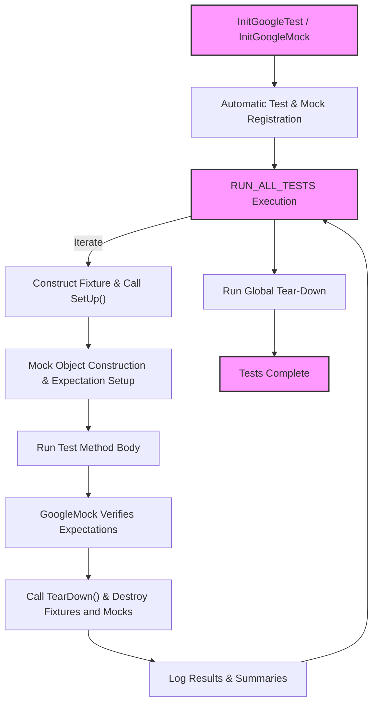

# System Overview

GoogleTest and GoogleMock together form a powerful C++ testing framework grounded in xUnit architecture principles, seamlessly merged with idiomatic C++ practices. This page presents a conceptual introduction to how these tools interoperate to discover, execute, and report tests, enabling robust and extensible unit and integration testing.

---

## Layers of the Testing Framework

GoogleTest defines the core testing infrastructure, responsible for handling test lifecycle, assertions, test discovery, execution, and result reporting. GoogleMock builds on this foundation, adding specialized capabilities for creating mock objects, setting expectations, and handling flexible behaviors.

This layered architecture cleanly separates concerns:

- **Core Test Logic** (GoogleTest): Defines tests and test suites, runs assertions, manages test fixtures, and coordinates reporting.
- **Mocking Mechanics** (GoogleMock): Provides a declarative syntax for defining mocks, specifying expected calls, and verifying interactions.
- **Extensibility Points**: Both frameworks expose APIs and macros to extend functionality, from adding custom assertions to defining bespoke matchers and actions.

Together they form a cohesive framework that offers automated test registration, flexible execution, and seamless integration of mocks.

---

## Test Discovery and Execution Flow

Understanding the typical lifecycle of running tests with GoogleTest and GoogleMock demystifies their collaboration:

1. **Initialization**: `testing::InitGoogleTest()` or `testing::InitGoogleMock()` initializes global state, processes command-line flags, and prepares the framework.

2. **Test Registration**: Tests are registered automatically via macros like `TEST()`, `TEST_F()` (fixture-based), and mock expectations via `MOCK_METHOD()`. This removes manual enumeration of tests and mocks.

3. **Test Runner Invocation**: Calling `RUN_ALL_TESTS()` starts the test execution sequence, iterating over all registered test suites and tests.

4. **Fixture Setup**: For each test, an instance of the test fixture class (if used) is constructed and `SetUp()` is called to prepare the environment.

5. **Mock Setup**: Mock objects used within tests are constructed; their default behaviors and expectations set with `ON_CALL` and `EXPECT_CALL` are activated.

6. **Test Execution**: The test method runs, executing assertions and invoking mock methods, with GoogleMock tracking call counts and matching arguments.

7. **Verification and Teardown**: After the test body runs, GoogleMock verifies that all expectations are met, then `TearDown()` is called on fixtures and mock objects are destructed.

8. **Result Reporting**: Framework records and reports successes, failures, and non-fatal issues, with detailed diagnostics.

9. **Repeat**: Steps 4–8 repeat for each test.

10. **Global Tear-down**: After all tests, any registered global environments and clean-ups run before test process termination.

---

## Main Entry Points

GoogleTest and GoogleMock provide default main functions that users can link against instead of writing their own, accelerating the getting-started experience:

- **`gtest_main`** provides a `main()` that initializes GoogleTest and runs all tests.
- **`gmock_main`** extends this by initializing GoogleMock on top of GoogleTest's functionality.

If customization is needed, users can write their own `main()` invoking `InitGoogleTest` or `InitGoogleMock` directly, allowing for any custom pre-test setup or command-line processing.

---

## Mental Model and Conceptual Architecture

Visualize GoogleTest and GoogleMock working together as a layered test ecosystem:

Through this workflow, GoogleTest ensures each test is isolated, repeatable, and well managed. GoogleMock blends in by seamlessly mocking dependencies and verifying behaviors as part of test execution.

---

## Value of the Layered Architecture

This separation between core testing and mocking features provides several benefits:

- **Modularity**: Users can choose to use GoogleTest without GoogleMock, or combine them for full coverage.
- **Extensibility**: Each layer exposes rich APIs that allow users to extend with custom assertions, matchers, or mock behaviors.
- **Maintainability**: Clear division of responsibilities means future updates can improve lengthened functionality without cross-cutting side effects.
- **User-Focused Simplicity**: High-level macros abstract away complexity, empowering users to focus on test logic rather than framework internals.

---

## Practical Tips

- **Leverage `gmock_main` if using mocks**: Linking with `gmock_main` saves you from writing your own `main()` function.

- **Call `InitGoogleMock()` at program start**: This initializes both GoogleMock and GoogleTest together, ensuring all flags and options are correctly processed.

- **Define tests with `TEST()` and `TEST_F()` macros**: These auto-register tests and connect with fixtures.

- **Keep tests independent**: The framework instantiates fresh fixtures and mocks per test to prevent shared state leakage.

- **Use `EXPECT_CALL` to set mock expectations**: GoogleMock automatically verifies call counts and argument matching after tests.

- **Check `RUN_ALL_TESTS()` return value**: It returns non-zero on failures and must be used as exit status in your `main()`.

---

## Troubleshooting Common Issues

- **Tests not discovered or run**: Ensure you link the test binary with `gtest_main` or provide a custom `main()` that calls `InitGoogleTest()` / `InitGoogleMock()` and `RUN_ALL_TESTS()`.

- **Mocks not behaving as expected**: Confirm that `EXPECT_CALL` macros are set correctly before the code path exercising the mocks is executed.

- **Linker errors on `main()`**: This usually means you linked both `gtest_main` and `gmock_main` or omitted them entirely; pick the correct main or write your own.

- **Failure to initialize flags**: Always call `InitGoogleTest` or `InitGoogleMock` with the program's `argc` and `argv` parameters.

---

## Further Exploration

For a deeper understanding and next steps, explore:

- [System Architecture](/overview/architecture-concepts/system-architecture) — for detailed design and component roles.
- [Core Concepts & Terminology](/overview/architecture-concepts/core-concepts) — for foundational definitions.
- [Getting Started Guides](/guides/getting-started-guides/installing-building) — for installation and setup.
- [Working with Mocks](/guides/core-testing-workflows/working-with-mocks) — for mock usage patterns.

---

> This conceptual overview arms you with a mental model to approach your tests confidently, letting you harness the full power of GoogleTest and GoogleMock in your C++ projects.

---

## References

- `gtest_main.cc` and `gmock_main.cc` provide example implementations of test program entry points.
- [GoogleTest Primer](primer.md) offers beginner-friendly insights on test creation and assertions.
- Official [GoogleMock README](googlemock/README.md) and guides.

## Source Code Links

For direct inspection of the core entry points:
- [googletest/src/gtest_main.cc](https://github.com/google/googletest/blob/main/googletest/src/gtest_main.cc)
- [googlemock/src/gmock_main.cc](https://github.com/google/googletest/blob/main/googlemock/src/gmock_main.cc)

---

*End of System Overview*