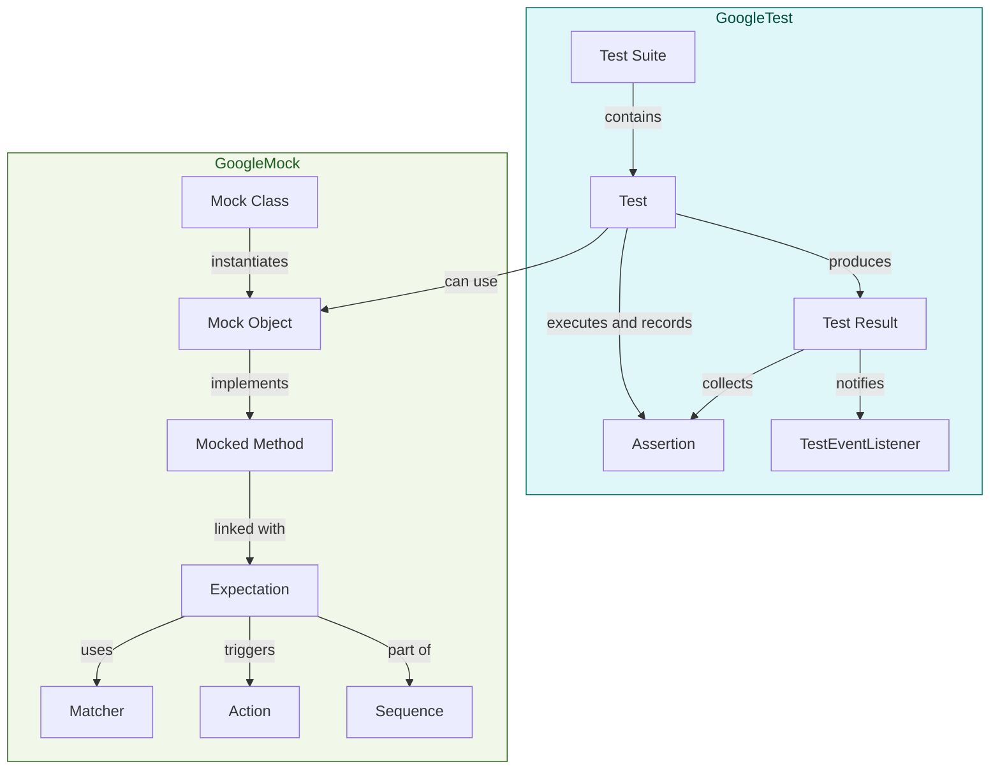

# Test and Mock Data Models

Understand the fundamental objects underpinning tests and mocks. Review how GoogleTest models tests, assertions, test results, and how GoogleMock represents expectations, actions, and matchers.

---

## Introduction

GoogleTest and GoogleMock build upon core concepts that represent the essential data structures and objects involved in testing and mocking. This page guides you through these fundamental data models — the building blocks for defining tests, capturing assertion results, and setting up mock behaviors with expectations, actions, and matchers.

By visualizing and understanding these models, you can develop a clear picture of how tests and mocks are represented internally, which empowers you to write more effective unit tests and leverage mocking features with confidence.

---

## Core Test Data Models in GoogleTest

GoogleTest models unit tests and their outcomes using a set of interrelated objects:

### 1. Test

- **Purpose:** Represents an individual test case.
- **Characteristics:**
  - Has a name and belongs to a test suite.
  - Encapsulates the test function and any test fixture (setup/teardown).
  - Is responsible for executing its body.

### 2. TestSuite

- **Purpose:** Groups related tests together.
- **Characteristics:**
  - Maintains the test fixture shared among its tests.
  - Handles registration and discovery of tests within it.

### 3. Assertion

- **Purpose:** Validates conditions during test execution.
- **Types:** Fatal (terminates test immediately on failure) and Non-fatal (records failure but continues).
- **Role:** Provides PASS/FAIL outcomes and detailed failure messages.

### 4. TestResult

- **Purpose:** Aggregates results of a single Test execution.
- **Includes:**
  - Assertion outcomes,
  - Information about test duration,
  - Overall success or failure.

### 5. TestEventListener

- **Purpose:** Notifies observers about various stages and events during test execution (e.g., test started, assertion result, test finished).
- **Usage:** Enables extension and customization of test reporting and behavior.

> This modular modeling enables GoogleTest to execute tests flexibly, collect detailed results, and provide developers with clear feedback on test outcomes.

---

## GoogleMock Core Data Models

GoogleMock enriches the testing model with complex interactions between real and mock objects, specifying how mocked methods are expected to behave and be called. It relies on several key conceptual objects:

### 1. Mock Object

- Represents an instance of a mocked class.
- Contains mocked methods that replace real behaviors during test execution.

### 2. Expectation

- Defines the expected calls to mocked methods.
- Includes information like:
  - Which method is expected,
  - The argument matchers defining acceptable parameters,
  - How many times calls should occur (cardinality),
  - The order dependencies relative to other expectations.

### 3. Action

- Specifies what a mock method should do when called.
- Includes returning values, invoking callbacks, or triggering custom behaviors.
- Can be combined and chained to compose complex behaviors.

### 4. Matcher

- Provides flexible predicates to verify method arguments.
- Supports built-in matchers (e.g., equality, range), combined matchers, and custom user-defined matchers.
- Evaluates arguments at call time to confirm they satisfy expectations.

### 5. Sequence and Ordering

- Manages call order constraints among expectations.
- Supports strict ordering (`InSequence`), partial order (`After`), and sequence sets for structured verification.

---

## User Workflow and Interaction with Data Models

Understanding these data models helps you appreciate how to write tests and mocks effectively:

1. **Defining Tests and Suites**
   - Use `TEST` or `TEST_F` macros to define Test objects grouped under TestSuites.

2. **Writing Assertions**
   - Insert assertions in tests that yield Assertion results, recorded within the TestResult.

3. **Creating Mock Classes**
   - Define mock classes with `MOCK_METHOD` macros in public sections.
   - Understand that mocks are types of objects with methods whose behavior and call expectations are configured.

4. **Setting Expectations**
   - Use `EXPECT_CALL` to create Expectation objects defining how mock methods should be called and with what arguments.

5. **Specifying Actions**
   - Attach Actions to expectations to control return values or side effects.

6. **Using Matchers**
   - Employ Matchers to specify flexible and expressive argument verification.

7. **Ordering Calls**
   - Manage sequences to enforce the order of expected calls for precise interaction testing.

---

## Best Practices and Tips

- **Define clear and focused expectations:** Limit expectations to what your test must verify to avoid brittle tests.
- **Use Matchers effectively:** Leverage built-in and custom matchers to specify argument constraints succinctly.
- **Manage call order:** Use `InSequence` or `After` clauses wisely to verify interaction order without over-constraining tests.
- **Leverage default actions with `ON_CALL`:** Set up default mock method behaviors to keep tests maintainable.
- **Beware of uninteresting calls:** Use `NiceMock`, `StrictMock`, or explicit expectations to control warnings or errors.
- **Delegate when needed:** Combine mocks with fakes or real objects for complex behavior reuse.

---

## Diagram: Test and Mock Data Model Relationships

---

## Troubleshooting Common Issues

- **Expectations not met:** Use `--gmock_verbose=info` to see detailed call traces and understand which expectations are violated.
- **Uninteresting mock call warnings:** Use `NiceMock` to suppress warnings if calls are allowed but no explicit expectations given.
- **Over-constraining tests:** Avoid excessive ordering constraints; use sequences moderately.
- **Incorrect matcher usage:** Ensure matcher types align with method argument types; use `SafeMatcherCast` or explicit casting if needed.
- **Mock methods not invoked:** Verify that tested code calls the mock object in the test setup phase with appropriate `EXPECT_CALL` defined beforehand.

---

## Related Resources

- [gMock Cookbook (Mocking Reference)](https://google.github.io/googletest/gmock_cook_book.html)
- [GoogleTest Assertions Reference](../api-reference/googletest-core-apis/assertions-reference.md)
- [GoogleMock Matchers Reference](../api-reference/googlemock-apis/googlemock-matchers.md)
- [Writing and Running Your First Unit Test](/guides/core-workflows/writing-unit-tests)
- [Getting Started with Mocking](/guides/core-workflows/introduction-to-mocking)
- [Test Suite Structure & Execution Flow](/concepts/architecture-core-models/test-suite-and-execution-flow)

---

## Next Steps

Deepen your understanding of the mock behaviors, matchers, and how to organize large test suites by exploring the guides on:

- Defining Custom Matchers and Actions
- Strict, Nice, and Naggy Mocks
- Organizing and Scaling Large Test Suites

This foundation will empower you to effectively design, write, and maintain robust, maintainable unit tests with mocking that reflects your software’s real-world interactions.
