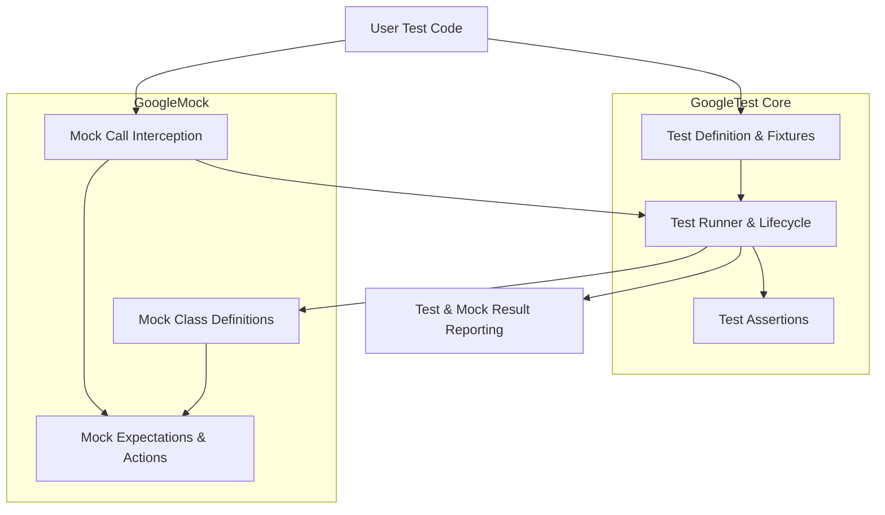

# System Architecture Overview

Understanding how GoogleTest and GoogleMock work together is essential to unlocking the full potential of modern C++ testing. This guide presents a comprehensive view of their unified architecture, major modules, and the ways they integrate seamlessly to support both unit testing and mock-based testing paradigms.

---

## Introduction

GoogleTest is a robust C++ testing framework focused on writing and running unit tests, while GoogleMock extends it with powerful mocking capabilities that enable interaction testing and dependency simulation. Together, they form a unified ecosystem where you can write deterministic, reliable tests with flexible mock behaviors.

This page provides the high-level system overview of how these components fit, what roles they play, and how they interoperate to offer a smooth developer experience.

<Info>
This overview targets developers and engineers aiming for an architectural understanding to facilitate effective test design and troubleshooting.
</Info>

---

## Core Components of the GoogleTest Ecosystem

### 1. GoogleTest Core

The heart of the framework, GoogleTest Core allows you to write, organize, and run unit tests with rich assertion facilities.

- **Test Suites and Test Cases:** Logical grouping of tests for organization and reuse of setup.
- **Assertions:** Macros such as `EXPECT_*` and `ASSERT_*` validate expected conditions during test execution.
- **Test Runner:** Manages discovery, execution, and reporting of tests.

### 2. GoogleMock Integration

GoogleMock enriches GoogleTest by enabling the creation and use of mock objects to simulate external dependencies or complex collaborators.

- **Mock Classes:** Declared with `MOCK_METHOD` to fake class interfaces.
- **Expectations:** Defined by `EXPECT_CALL` to specify interactions, calls, call order, and return behaviors.
- **Behavior Control:** Using constructs like sequences and cardinalities to control the ordering and frequency of mock interactions.

### 3. Test Execution & Lifecycle

GoogleTest and GoogleMock tests run within a shared test program flow:

- **Initialization:** Via `testing::InitGoogleTest()` or `testing::InitGoogleMock()`, which parse command-line flags and configure frameworks.
- **Test Registration:** Tests are automatically registered through macros, eliminating manual enumeration.
- **Execution:** `RUN_ALL_TESTS()` sequentially runs each test fixture instance.
- **Verification:** GoogleMock checks that all mock expectations are met during teardown.

---

## Data & Control Flow

1. **Test Definition:** Developers write test code using macros such as `TEST()`, `TEST_F()`, and define mocks using `MOCK_METHOD`.
2. **Compilation:** Both GoogleTest and GoogleMock come as source libraries, compiled and linked into your test binaries, sharing runtime structures.
3. **Execution:** When a test executable runs, the GoogleTest runner triggers setup, invokes tests, and manages teardown.
4. **Mock Interaction:** When code under test invokes mock methods, GoogleMock checks argument matchers, enforces expectations, and triggers defined actions.
5. **Result Reporting:** Outcomes, including assertion results and mock violations, are collected and presented in summary.

---

## Integration Highlights

- **Unified Setup:** GoogleMock is built on top of GoogleTest. Calling `InitGoogleMock()` also initializes GoogleTest, simplifying setup.
- **Shared Test Lifecycle:** Both frameworks operate on the same per-test lifecycle, creating fresh fixtures and mocks for each test execution ensuring isolation.
- **Interleaved Assertions & Mocking:** Assertions and mock expectations complement each other, providing both state validation and interaction verification.

---

## Real-World Scenario: Testing with GoogleTest and GoogleMock

Imagine you're testing a class `Painter` that draws shapes using a `Turtle` interface. Your goal is to verify that the `Painter` correctly calls `Turtle` methods — not by rendering actual graphics but by confirming interactions.

### User Flow:

1. Define a mock class `MockTurtle` with mocked methods like `PenDown()`, `Forward()`, etc.
2. Write a test case using `EXPECT_CALL` to specify how `Painter` should call these methods.
3. Run the test; GoogleMock intercepts calls to `MockTurtle`, checking all expectations.
4. The test passes only if all expected method calls with proper arguments and order occur.

This illustrates how the system architecture tightly integrates mocking with the core unit test infrastructure.

---

## Visualizing the Architecture

This flow shows the layered collaboration — user test code defines tests and mocks, the runner manages execution, and mock classes enable interaction verification.

---

## Best Practices & Tips

- **Always initialize with `InitGoogleMock()`** if using mocks; this auto-initializes both frameworks.
- **Define mocks with `MOCK_METHOD` macros in the `public` section.** Wrap method parameter types with parentheses if they include commas.
- **Set expectations *before* exercising mock objects.** `EXPECT_CALL` should precede the code under test for reliable verification.
- **Use strictness wrappers** (e.g., `StrictMock`, `NiceMock`) to control how unexpected calls are handled.
- **Isolate tests**: Each test runs with fresh test fixtures and mocks to avoid cross-test interference.

---

## Common Challenges & Troubleshooting

- **Unmet mock expectations:** Ensure all `EXPECT_CALL` are declared before mock methods are invoked.
- **Ambiguous overloaded methods:** Disambiguate with explicit argument types or use parentheses in `MOCK_METHOD`.
- **Linker errors:** Verify build system includes GoogleTest and GoogleMock correctly with C++17 support.
- **Order enforcement issues:** Use sequences or `InSequence` blocks to clearly specify call order.

See the Troubleshooting Common Issues and Mocking Reference pages for detailed solutions.

---

## Next Steps

- Explore [Test Suite Structure & Execution Flow](/concepts/architecture-core-models/test-suite-and-execution-flow) to deepen understanding of test orchestration.
- Read the [Mocking Reference](../docs/reference/mocking.md) for comprehensive details on mock creation and expectation management.
- Try writing your first combined unit and mock tests using the [Writing and Running Your First Test](/getting-started/first-test-setup/writing-running-first-test) guide.

---

## References

- [GoogleMock Documentation](https://google.github.io/googletest/gmock_for_dummies.html)
- [GoogleTest Primer](../docs/primer.md)
- [Feature Overview: Test, Assert, Mock](/overview/architecture-features-integration/features-at-a-glance)
- [Integration & Ecosystem](/overview/architecture-features-integration/integration-overview)

---

With this architectural grasp, you can confidently design, implement, and expand your C++ tests using GoogleTest and GoogleMock to achieve high code quality and robust validation workflows.
