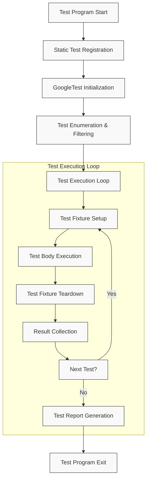

# Test Discovery & Execution Lifecycle

GoogleTest automates the process of discovering, executing, and reporting results for C++ tests. Understanding the lifecycle of test discovery and execution equips you with a clear mental model to write, organize, and debug your automated tests efficiently.

---

## Overview

This page explains how GoogleTest discovers and runs tests, from the initial registration phase through to execution and result collection. It focuses on the test runner’s lifecycle and your test code’s interaction with it, giving you insight into how your tests fit into the overall automated testing flow.

Whether you are writing a quick smoke test or an extensive test suite, mastering these concepts helps you predict test behavior and troubleshoot common issues.

---

## Test Discovery

### Registration Phase

Before your tests run, GoogleTest collects all test cases and test functions by registering them into the framework’s internal registry. This happens automatically at program startup, leveraging static initialization:

- Each `TEST` or `TEST_F` macro instance registers its test case and test name with the global test registry.
- The registration ensures that all tests are known before the execution begins, even if the tests are defined in different translation units.

**User's Benefit:**

You don’t need to manually list or invoke tests. Add a `TEST` macro wherever you want, and GoogleTest will find it.

---

## Test Runner Lifecycle

GoogleTest provides a framework that controls test execution with the following key phases:

### 1. Initialization

- The test runner initializes GoogleTest internals and parses command-line flags.
- Flags control which tests to run, output formats, filters, and other runtime behavior.

### 2. Test Enumeration

- After registration, GoogleTest enumerates all registered tests.
- You can query tests programmatically during this phase or use filters to select subsets.

### 3. Execution Phase

- Tests run sequentially, one after another.
- Each test undergoes:
  - **Setup:** Constructors and `SetUp()` methods are called for test fixtures.
  - **Execution:** The test body executes.
  - **Teardown:** `TearDown()` and destructors run.

### 4. Result Collection and Reporting

- Test results — successes, failures, and skips — are recorded during execution.
- At the end, results are reported to the console or other configured output formats (XML, JSON).

**User's Benefit:**

Any test failure is reported immediately with relevant stack traces and messages, streamlining debugging.

---

## Integration of Your Test Code

Your test code plugs into this lifecycle in these ways:

- **Defining tests:** Use `TEST`, `TEST_F`, or parameterized test macros to define test functions.
- **Fixture lifecycle:** Manage setup and teardown of test environments with fixture classes derived from `::testing::Test`.
- **Assertions:** Inside tests, use GoogleTest assertions to validate expected behavior.
- **Custom main (optional):** Override the default test runner for specialized workflows, but this is uncommon.

When GoogleTest runs, your tests appear as nodes in the registry that the framework iterates over and executes.

---

## Real-World Example: Writing and Running a Simple Test

```cpp
#include <gtest/gtest.h>

// A simple test case named FactorialTest
TEST(FactorialTest, HandlesZeroInput) {
  EXPECT_EQ(1, factorial(0));
}

// main() usually provided by gtest_main library
int main(int argc, char **argv) {
  ::testing::InitGoogleTest(&argc, argv);
  return RUN_ALL_TESTS();
}
```

1. The `TEST` macro registers the test named `HandlesZeroInput` under `FactorialTest`.
2. At runtime, GoogleTest’s test runner discovers this test automatically.
3. The test executes, and the result is collected and reported.

You don’t invoke the test manually; just build and run, and GoogleTest orchestrates everything.

---

## Practical Tips and Best Practices

- **Always ensure tests are registered:** Tests must be linked into your test binary to be discovered.
- **Avoid side effects in global/static initialization:** Since test registration uses static initializers, complex side effects can cause unpredictable behavior.
- **Use fixture classes for shared setup:** This keeps tests clean and limits duplication.
- **Leverage test filtering flags:** Run subsets of tests using command-line filters during execution to speed up development cycles.
- **Consider custom main() only when needed:** The default main provided by `gtest_main` suffices for most cases.

---

## Troubleshooting Common Scenarios

### Tests Not Found

- Confirm test files are compiled and linked correctly.
- Ensure test macros are used properly.
- Verify no configuration issues or name conflicts prevent registration.

### Tests Not Run in Expected Order

- By default, tests run in the order of registration.
- Use **sequences** or control test order inside fixtures if strict ordering is required.

### Unexpected Test Failures

- Understand lifecycle events: Setup and teardown phases can impact test state.
- Check logging output and stack traces for assertion failures.

### Test Runner Exits Prematurely

- Ensure no exceptions escape the test framework.
- Use GoogleTest flags for verbose output and debugging.

---

## How This Fits With Mocking and Assertions

GoogleTest test lifecycles are tightly linked to GoogleMock when mocks are involved. Tests using mocks rely on this lifecycle to expose violations early by:

- Registering mocks alongside tests.
- Setting expectations before tests execute.
- Verifying mocks at test teardown time automatically.

Assertions inside tests follow this same lifecycle, ensuring consistent validation flow.

---

## Diagram: Test Discovery & Execution Lifecycle



---

## Additional Resources

- [Writing Your First Test](/getting_started/first_test_and_validation/create_first_test)
- [Understanding Mock Objects and Methods](/concepts/architecture-core-models/mocking-architecture)
- [GoogleTest Primer](https://google.github.io/googletest/primer.html)

---

## Summary

By fully internalizing the test discovery and execution lifecycle, you will write better structured, more maintainable tests that integrate seamlessly with the GoogleTest framework. Leverage the simple macro-based registration combined with powerful execution control to maximize testing productivity and confidence.
