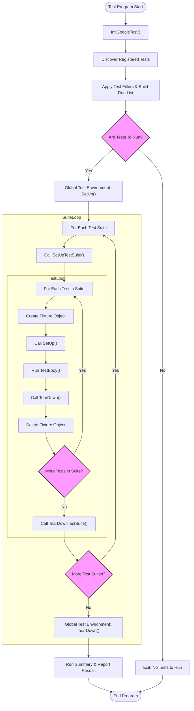

# Test Suite Structure & Execution Flow

Understanding how GoogleTest organizes and runs your tests is crucial to writing effective and maintainable test code. This guide unpacks the fundamental concepts behind test suites, test cases, the registration and discovery of tests, how test fixtures govern setup and teardown, and how assertion results flow into comprehensive reports.

---

## 1. Key Components: Tests, Test Suites, and Assertions

### Test
A *test* in GoogleTest represents a single, standalone unit of verification. It is a function or method that exercises a specific path or behavior in your code, and uses *assertions* to validate expected outcomes.

### Test Suite
A *test suite* groups related tests that share common setup or that logically belong together. This grouping helps organize tests and improves test management and reporting.

### Assertion
An *assertion* checks a particular condition within a test. Assertions can be *fatal* (aborting the current test on failure) or *non-fatal* (logging a failure but allowing the test to continue). The aggregate outcome of assertions determines the pass or fail status of a test.

---

## 2. Test Registration and Discovery

### Automatic Test Registration
When you define tests with `TEST()`, `TEST_F()`, `TEST_P()`, or similar macros, GoogleTest automatically registers them during static initialization. This mechanism frees you from manually listing tests.

### Discovery at Runtime
Upon program start and after calling `testing::InitGoogleTest()`, GoogleTest discovers all registered tests. It applies any test filters specified via command-line flags or environment variables and determines which tests will be run.

---

## 3. Test Lifecycle: Setup, Execution, and Teardown

GoogleTest enforces a disciplined lifecycle for each test to ensure isolation and repeatability.

### 3.1 Construction
For each individual test, GoogleTest creates a fresh test fixture object. This isolates tests from one another, preventing shared state leakage.

### 3.2 Per-Test Suite Setup and Teardown
Sometimes, expensive resources common to many tests in a suite justify setup once before all tests run and teardown after all finish. GoogleTest supports this with:
- `SetUpTestSuite()`: Called once before the first test in a test suite.
- `TearDownTestSuite()`: Called once after the last test in a test suite.

These are static members of the test fixture.

### 3.3 Per-Test Setup and Teardown
For each test:
- `SetUp()`: Prepares the fixture and state before test execution.
- `TestBody()`: Contains the actual test logic.
- `TearDown()`: Cleans up the fixture after test execution.

Each of these member functions can be overridden in your test fixture.

### 3.4 Test Execution Flow
```cpp
// Simplified lifecycle flow
class MyFixture : public testing::Test {
 protected:
  static void SetUpTestSuite();       // Called once before all tests
  static void TearDownTestSuite();    // Called once after all tests

  void SetUp() override;              // Called before each test
  void TearDown() override;           // Called after each test
};

// Each test in the suite
TEST_F(MyFixture, Test1) { ... }       // Uses TestBody internally
TEST_F(MyFixture, Test2) { ... }
```

GoogleTest internally manages this lifecycle, creating fresh fixtures and invoking setup and teardown accordingly.

---

## 4. Test Execution Flow Diagram

This Mermaid flowchart illustrates the high-level steps involved in running all tests in a GoogleTest program.



---

## 5. Test Result Flow: From Assertions to Reporting

Every assertion recorded during a test execution contributes to the overall test outcome:

- If **no assertion fails**, the test passes.
- If **any assertion fails fatally**, the test aborts at that point and the test reports failure.
- If **non-fatal assertion failures** occur, they are recorded, but execution continues.

GoogleTest aggregates these outcomes per test:

- **TestInfo** objects track each test's name, status, and execution metadata.
- **TestResult** objects hold detailed results for assertions within a test.
- **TestSuite** accumulates aggregate counts and summary information.
- **UnitTest** summarizes the entire test program's execution.

You can query these structures programmatically via API for custom reporting or integrations.

---

## 6. Handling Parameterized and Typed Tests Execution

GoogleTest supports sophisticated test patterns such as *parameterized* and *typed* tests.

- **Value-Parameterized Tests** exercise the same test logic over a range of input values, dynamically instantiated at runtime.
- **Typed Tests** reuse the same test patterns over different C++ types.
- **Type-Parameterized Tests** provide an advanced pattern where test patterns can be registered and instantiated multiple times anywhere in your code.

Each instantiation creates separate test instances within suites, managed and executed following the lifecycle described above.

Refer to [Parameterized and Typed Tests documentation](../api-reference/googletest-core-apis/parameterized-and-typed-tests) for details on macros and workflow.

---

## 7. Global Test Environments: Setup and Tear-down Beyond Test Suites

Sometimes you need to prepare and clean up resources beyond individual suites or tests, like initializing databases or setting environment variables.

GoogleTest provides the `testing::Environment` class:

- You subclass `Environment`, overriding `SetUp()` and `TearDown()`.
- Register the instance via `AddGlobalTestEnvironment()` before running tests.
- `SetUp()` executes before any test runs, `TearDown()` executes after all tests complete.

This facility complements the per-suite and per-test fixture methods and is especially valuable in complex test programs.

---

## 8. Practical Tips & Common Pitfalls

- **Test Isolation**: GoogleTest creates a new test fixture per test to avoid state pollution. Don't rely on shared mutable state between tests unless using shared resources via `SetUpTestSuite`.

- **SetUpTestSuite Might Be Called Multiple Times**: For derived fixture classes, be careful managing static shared resources to avoid leaks or double initialization.

- **Skips & Failures**: If a fatal failure occurs (`FAIL()` or `ASSERT_*`) in `SetUp` or a test, subsequent steps won't run.

- **Test Order Is Undefined**: Do not depend on the order tests or suites run.

- **Use `RUN_ALL_TESTS()` Only Once**: Invoking it multiple times breaks internal assumptions.

- **Filtering and Disabled Tests**: Use `--gtest_filter` to run subsets; prefix test or suite names with `DISABLED_` to exclude them temporarily.

---

## 9. Summary

Understanding GoogleTest's suite and test structures, discovery, execution lifecycle, and results reporting equips you to write better tests that are isolated, readable, and maintainable. The framework’s support for parameterized and typed tests further enables scalable testing across multiple inputs and types.

Use global test environments to manage wide-scope setup and teardown procedures.

---

## 10. References & Next Steps

- [GoogleTest Primer](../docs/primer.md) — foundational concepts of tests and suites
- [Parameterized and Typed Tests](../api-reference/googletest-core-apis/parameterized-and-typed-tests) — in-depth on advanced reusable test patterns
- [Global Set-Up and Tear-Down](../docs/advanced.md#global-set-up-and-tear-down) — managing environment lifecycle
- [Test Fixtures](../docs/primer.md#same-data-multiple-tests) — how to create reusable test setups
- [Assertions Reference](../api-reference/googletest-core-apis/assertions-reference) — understanding assertion behaviors

---